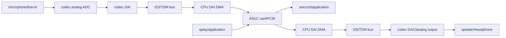
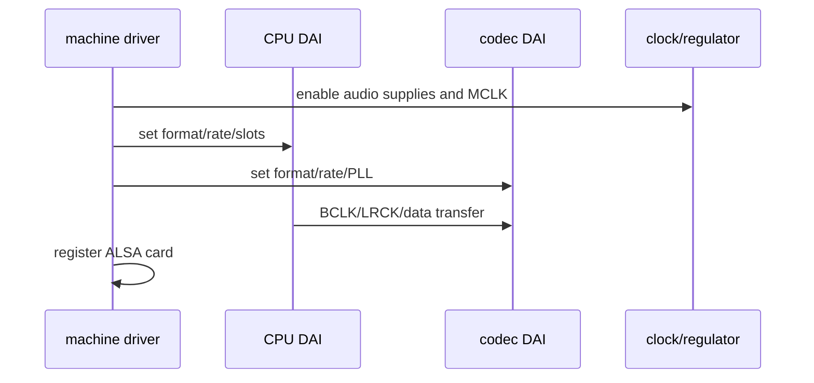
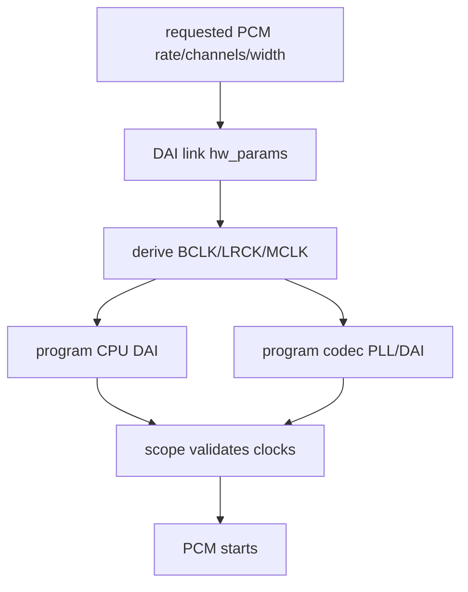
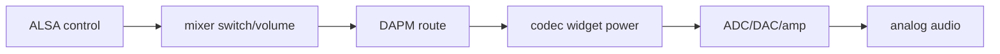
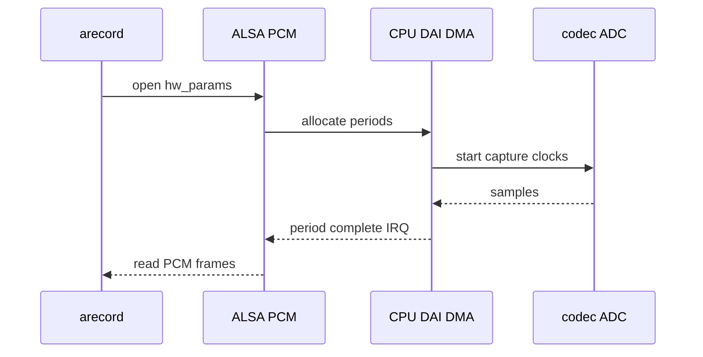
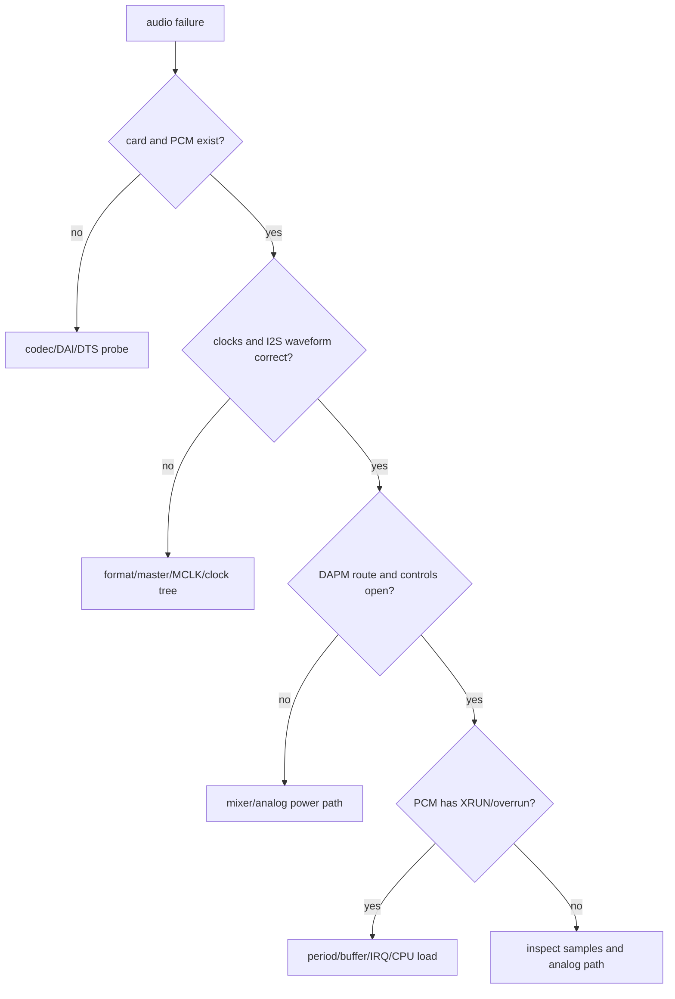
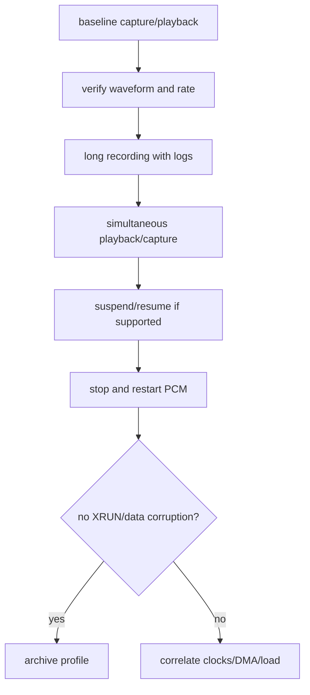

嵌入式音频首先由 codec 完成模拟与数字转换，SoC 侧通过 CPU DAI 收发采样；双方由 DAI link 描述连接参数，machine driver 把板级时钟、路由和器件粘合成一张声卡；DAPM 根据活动路径管理供电，最终由 ALSA PCM 向应用提供录放音接口。

声卡出现在 `aplay -l` 中，只说明这些组件已经完成注册，不能证明 MCLK/BCLK/LRCK、I2S 数据、麦克风偏置、模拟增益和 DMA buffer 都正确。无声、杂音、音调变化、特定采样率失败和持续运行后的 XRUN 分别指向不同层。

本章以“一次有限长度录音、回放和波形验证”为主线，建立 ASoC BSP bring-up 的证据链。采样、编码、回声消除、流媒体和应用管线的完整知识继续阅读[音视频专题系列](../../video-audio/)。

## 一、先把模拟链路与数字链路分开

I2S/TDM 总线只能传输数字采样，不能证明麦克风偏置、codec 模拟输入、功放或耳机电路正确。

同样，能听到声音也不代表采样率、通道顺序和长期 buffer 稳定性正确。



| 层 | 首先确认什么 | 常见错误表现 |
| --- | --- | --- |
| 模拟前端 | bias、供电、输入/输出路径 | 静音、底噪、削波 |
| codec | I2C/SPI 识别、regulator、reset | codec probe fail |
| I2S/TDM | BCLK/LRCK/MCLK、格式、主从 | 无声、杂音、音调错误 |
| CPU DAI/DMA | period、buffer、IRQ | XRUN、间断 |
| machine driver | DAI link、route、widgets | card 不出现或 route 关闭 |
| ALSA 用户态 | device、format、rate、channel | 文件无声/音调异常 |

开始前列出 card 和 PCM device，不要假定 hw:0,0 永远是板载 codec。

```sh
cat /proc/asound/cards
aplay -l
arecord -l
amixer -c ACTUAL_CARD scontrols
```

## 二、在 DTS 中对齐 codec、CPU DAI 与音频时钟

ASoC sound card 节点通常把 CPU DAI、codec DAI、DAI format、bitclock/frame master、mclk 与 route 联系起来。

以下是结构示意。I2S controller 名称、codec compatible、MCLK 频率、master 关系和 route 必须依据原理图、codec datasheet 与当前 SDK binding。

```dts
sound {
    compatible = "simple-audio-card";
    simple-audio-card,name = "longway-audio";
    simple-audio-card,format = "i2s";
    simple-audio-card,bitclock-master = <&cpu_dai>;
    simple-audio-card,frame-master = <&cpu_dai>;

    simple-audio-card,cpu {
        sound-dai = <&i2sX>;
    };

    simple-audio-card,codec {
        sound-dai = <&audio_codec>;
        clocks = <&cru AUDIO_MCLK>;
    };
};
```

simple-audio-card 只是一个常见 machine driver。复杂板卡可能使用 vendor machine driver、audio graph card 或多个 codec/DAI link。

无论绑定形式如何，最重要的是数字格式和 clock ratio 要统一。



### I2S 格式和主从关系必须由波形验证

常见参数包括 I2S、left-justified、DSP_A/DSP_B(TDM)、sample width、slot width、slot number、BCLK polarity 和 LRCK polarity。

CPU 和 codec 必须对每一项达成一致。

谁提供 BCLK/LRCK/MCLK 也必须与硬件连接一致，双方都输出时钟会冲突，双方都等待时钟则没有数据。



例如 48 kHz、2 channels、32-bit slot 的 BCLK 与 16-bit packed sample 的关系不能靠直觉决定。

应按 DAI format 和实际 TDM slot 计算，再用逻辑分析仪/示波器确认 LRCK 频率、每帧 slot 数和 BCLK。

## 三、用 ALSA card、control 与 DAPM route 建立可见状态

codec driver 注册 controls，machine driver 描述 widgets/routes，DAPM 根据活动 stream 和 mixer 状态打开所需电源路径。

因此录音静音时，I2S 有波形也可能只是 ADC input/mic bias/mixer route 没打开。



先保存当前 control，再逐项查看而不是运行来源不明的 amixer set 脚本。

```sh
amixer -c ACTUAL_CARD scontrols
amixer -c ACTUAL_CARD contents
alsamixer -c ACTUAL_CARD
cat /proc/asound/cardACTUAL/pcm*/sub*/hw_params 2>/dev/null
```

命名随 codec driver 不同，可能包含 Capture Switch、Mic Boost、Input Mux、DAC Playback Volume、Headphone Switch 等。

修改前记录原始值，避免因为错误增益造成大音量输出、削波或损坏测试扬声器。

### 先进行有限时长的标准 PCM 测试

明确采样率、通道、格式和持续时间，输出写到测试目录。

```sh
arecord -D hw:ACTUAL_CARD,ACTUAL_DEVICE +  -f S16_LE -r 48000 -c 2 -d 10 /tmp/capture.wav

aplay -D hw:ACTUAL_CARD,ACTUAL_DEVICE /tmp/capture.wav

sox /tmp/capture.wav -n stat 2>&1 | tail -n 20
```

命令中的参数必须落在 aplay/arecord --dump-hw-params 报告的支持集合内。

录下来的 wav 应用波形工具或播放回听验证，同时检查文件时长、采样率与文件大小是否合理。



## 四、用格式、时钟和 buffer 证据定位无声、杂音与 XRUN

无声、噪声、音调异常和 XRUN 的根因不同。

不要同时改 DAI format、codec mixer 和应用 rate，否则无法知道哪个变化起作用。



| 现象 | 优先检查 |
| --- | --- |
| sound card 不出现 | codec I2C、regulator/reset、CPU DAI、DTS link |
| card 出现但 open 失败 | PCM capabilities、DAI hw_params、format/rate |
| 完全无声 | DAPM route、mute、输入/输出选择、I2S clock |
| 强噪声/音调异常 | BCLK/LRCK、slot width、主从、sample format |
| 单边声道/通道交换 | TDM slot、codec route、应用 channels |
| capture clipping | mic bias、analog gain、input level |
| XRUN | period/buffer、DMA IRQ、CPU/DDR load、power state |

XRUN 是音频流在 deadline 前没有填满或取走 period 的症状，不是简单“buffer 太小”。

先记录出现时的 CPU load、IRQ、频率、电源状态、DMA error 和用户态调度延迟，再调整 period/buffer。

## 五、通过回环、长录音和恢复测试验证声卡生命周期

有限录音成功后，继续测试多种支持的 rate、连续 capture/playback、暂停恢复和重启。

若硬件有模拟或数字 loopback，可将它作为拆分麦克风/扬声器与数字数据路径的工具，但不能长期保持在产品路径中。



| 验收项目 | 需要保存的证据 |
| --- | --- |
| card/PCM 枚举 | /proc/asound/cards、aplay/arecord -l |
| DAI 时钟 | BCLK/LRCK/MCLK 波形或可靠测量 |
| 控制与 route | 关键 amixer control 快照 |
| 录音质量 | WAV metadata、波形、峰值和听感 |
| 长时稳定 | XRUN 日志、CPU/温度、文件完整性 |
| 恢复能力 | stop/start、重启、可选 suspend/resume |

### 官方资料

- [ALSA SoC Layer Overview](https://docs.kernel.org/sound/soc/overview.html)
- [ASoC Machine Driver](https://docs.kernel.org/sound/soc/machine.html)
- [Dynamic Audio Power Management](https://docs.kernel.org/sound/soc/dapm.html)
- [ASoC Platform Driver and audio DMA](https://docs.kernel.org/sound/soc/platform.html)

### 本章练习

从原理图整理 codec 的 I2C、供电、reset、MCLK、I2S/TDM 数据线和功放/麦克风连接。

通过 DTS、dmesg 和 ALSA 枚举确认 codec、CPU DAI 和 sound card 已绑定。

用示波器确认一组已支持 PCM 参数下的 BCLK、LRCK 和 MCLK，再完成 10 秒录音和回放。

在固定采样率下连续录制 30 分钟并同时播放，记录 XRUN、CPU load、温度和文件样本数。

## 六、小结与验收

ASoC 的价值在于把可复用的 codec 和 SoC 组件与板级 machine 描述分开。调试时也应沿同样边界推进：先证明模拟供电和器件可用，再证明时钟与采样格式，随后检查 DAPM 路由、DMA period 和应用参数，最后才讨论主观音质。

### 验收问题

完成本章后，应能独立回答：

- codec、CPU DAI、machine driver 和 ALSA PCM 的分工；
- 为什么声卡出现不等于模拟音频和 I2S 数据正确；
- DAI format、slot、master 与时钟如何共同决定声音质量；
- DAPM route 和 mixer control 为什么会造成无声；
- 如何用 arecord/aplay、波形和 metadata 证明采样率和通道正确；
- XRUN 表示什么，以及为什么不能只靠增大 buffer 处理；
- 如何区分数字数据路径故障和模拟前端故障；
- 如何用长录音、并发播放和恢复测试验证声卡稳定性。

当模拟路径、DAI 时钟、PCM 队列和用户态样本都可独立观测时，音频问题才会从“听感异常”变成可定位的系统链路问题。

> 🏷️ Linux BSP · ALSA · ASoC · I2S · TDM · codec · DAPM · PCM · XRUN
