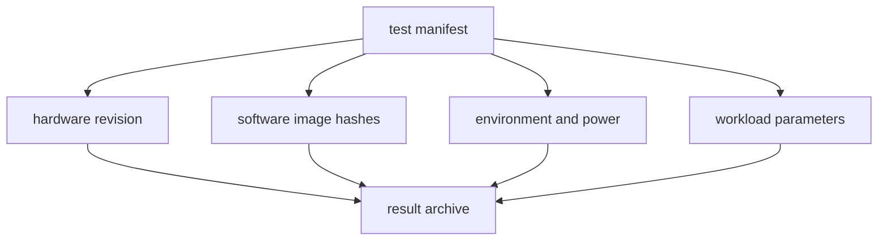
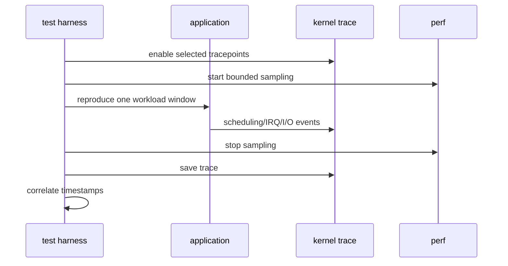
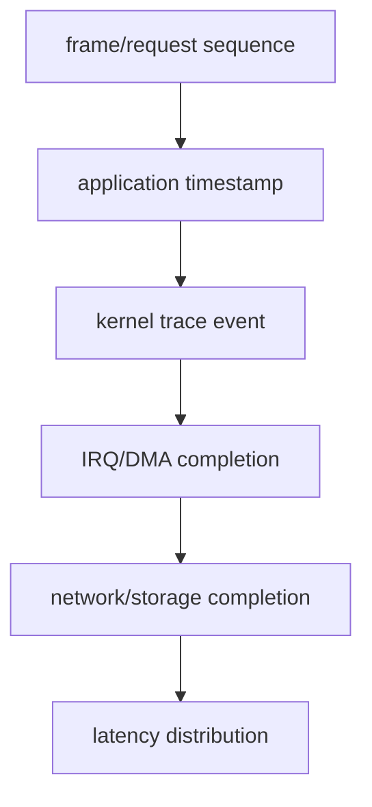
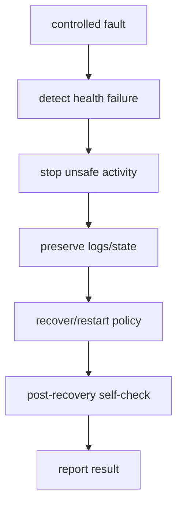
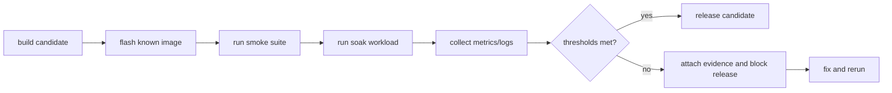

“连续跑了一夜没有死机”不是可靠性结论。

它没有说明负载、环境、版本、错误计数、掉帧、内存增长、温度、网络重连和存储一致性，也不能在下次修改内核、DTS 或 rootfs 后重复。

Linux BSP 的长稳测试需要把启动、外设、数据通路、温度、电源和异常恢复转成可度量的工程指标，并在每次发布前执行相同的回归。

本章以一台持续采集、处理、网络传输并记录数据的板端设备为例，建立从性能基线到 ftrace/perf 取证、再到故障注入和发布门禁的完整方法。

## 1. 先定义“可靠”和“性能”的可观测指标

没有指标，任何优化都只能凭感觉。

指标应来自产品关键路径，而不是只收集 CPU usage。


| 类别 | 示例指标 | 采集方式 |
| --- | --- | --- |
| 启动 | 上电到业务 ready 时间、失败率 | 串口时间戳、system log |
| 图像/音频 | FPS、drop、sequence gap、XRUN | 应用计数、V4L2/ALSA 日志 |
| 网络 | reconnect 时间、丢包、吞吐、error counter | ethtool、应用 telemetry |
| 存储 | fsync 延迟、I/O error、写入 CRC | 应用记录、dmesg |
| 内存 | RSS、slab、DMA buffer、OOM | /proc、kmemleak 可用时 |
| 调度 | p99 latency、softirq、context switch | ftrace、perf、应用 timestamp |
| 热/功耗 | 温度、频率、cooling state、输入电流 | sysfs、功耗仪 |
| 恢复 | reset、service restart、watchdog 原因 | pstore、journald/串口、health state |

每个指标应有采样频率、单位、正常范围和失败阈值。

例如“FPS 不低”不可验收；“30 分钟内 sequence 不丢、p99 frame interval 小于目标值、CSI error 不增长”才是可判断的规则。

### 将测试环境版本化

测试报告必须记录板卡 revision、kernel commit、DTS、rootfs version、firmware hash、温度、供电、对端设备和运行命令。

否则一次 regression 出现时无法区分代码变化、硬件批次、治具、网络或环境差异。



## 2. 第一步：建立最小负载基线，再逐层增加压力

不要一开始同时启用最高分辨率摄像头、编码、NPU、网络和存储，然后面对一个模糊的卡死。

先验证 idle 基线，再添加一个子系统，最后组合成产品峰值负载。


每一阶段至少保存：

1. 应用吞吐和延迟；
2. dmesg 中的新 warning/error；
3. 网络、存储、CSI/ISP 和音频统计；
4. 内存、温度、频率和功耗；
5. 测试开始和结束的版本清单。

```sh
date -Is
uname -a
cat /proc/cmdline
cat /proc/meminfo
cat /proc/interrupts > /tmp/interrupts-start.txt
dmesg -T > /tmp/dmesg-start.txt
```

命令只用于基线收集。真实自动化脚本应将输出写入带测试编号的目录，并避免覆盖上一轮证据。

### 先回答“慢在哪里”，再选择工具

| 症状 | 首先判断 | 可能工具 |
| --- | --- | --- |
| 端到端 FPS 下降 | 输入帧少还是下游处理慢 | 应用 sequence、V4L2 stats、trace |
| p99 延迟尖峰 | 调度、IRQ、I/O 或锁竞争 | ftrace、perf sched、tracepoint |
| CPU 高 | 用户态计算、softirq 或 spin | perf top/record、top、mpstat |
| 内存逐步涨 | 应用泄漏、slab、DMA buffer 未释放 | smaps、slabinfo、kmemleak |
| 卡死/重启 | watchdog、OOM、lockup、供电 | pstore、串口、reset reason |
| 间歇 I/O 错 | host、介质、DMA、温度 | dmesg、block/mmc stats、trace |

性能工具不能代替问题定义。

若不知道要解释的是 frame interval、IRQ latency 还是 fsync p99，采集一大段 perf.data 通常只会增加噪声。

## 3. 第二步：用 ftrace、tracepoint 和 perf 获取因果证据

ftrace 适合观察内核事件顺序、函数耗时和调度；tracepoint 提供稳定的子系统事件；perf 适合统计 CPU 热点和采样调用栈。

先在可控短窗口开启，再在问题附近扩大范围，避免长时间全量 trace 对系统本身造成干扰。



```sh
mount -t debugfs none /sys/kernel/debug
cd /sys/kernel/debug/tracing
echo 0 > tracing_on
echo > trace
echo 1 > events/sched/sched_switch/enable
echo 1 > events/irq/irq_handler_entry/enable
echo 1 > tracing_on

# 在短时间问题窗口后：
echo 0 > tracing_on
cat trace > /tmp/trace.txt
```

路径和 trace event 集合依赖内核配置。先列出 available_events，再启用真正与问题有关的少量 event。

perf record 也应绑定一个明确的 workload 时间段，确保 report 中的热点与实际业务阶段对应。

```sh
perf stat -a --timeout 30000
perf record -g -- ACTUAL_WORKLOAD_COMMAND
perf report
```

### 关联时钟源和 sequence

应用日志、内核 trace、网络包和外部功耗仪若使用不同时间基准，事后难以对齐。

最小做法是在测试开始、关键状态切换和结束时统一记录 wall clock 与 monotonic timestamp，并让每帧/每个请求有 sequence id。



这使你能证明某一帧慢是因为 sensor 未到帧、CSI 完成晚、NPU job 排队，还是网络发送阻塞，而不是只看到平均 CPU 高。

## 4. 第三步：做安全且可恢复的故障注入

可靠性不是等待偶发故障。

应在安全环境中注入可控异常，验证服务是否进入明确状态、保存证据、保护数据并恢复。



| 故障类型 | 安全注入方式 | 预期验证 |
| --- | --- | --- |
| 网络断开 | 拔测试网线/禁用测试端口 | 连接状态、重连时间、数据队列上限 |
| 存储写失败 | 使用可控测试 mount 或 fault injection | 数据事务、错误上报、无无限重试 |
| sensor 无帧 | 停止测试源或受控停止 pipeline | 超时、资源释放、重新初始化 |
| 远端服务丢失 | 测试 firmware 返回错误/停止 service | rpmsg 超时与服务降级 |
| 内存压力 | 专用测试工具和上限 | OOM 行为、关键服务保护 |
| 高温 | 环境箱或受控负载 | throttling、critical safety 和日志 |

不在承载 rootfs、量产校准或关键供电的设备上随意执行写错误、断电和 reset 注入。

故障注入前应明确恢复路径、数据备份、串口获取方式和停止条件。

### watchdog 是最后一道恢复，不是隐瞒错误

硬件/软件 watchdog 可在系统失去服务能力时复位，但必须保留 reset reason、最后日志和启动次数。

若 watchdog 每天“成功恢复”一次，真正的问题仍未解决。

应通过 pstore、串口日志、持久化错误摘要或外部监控保存复位前后的上下文。

## 5. 第四步：把长稳运行变成可重复的发布门禁

长稳测试要以固定版本、固定 workload、固定采样和自动判定运行，而不是依赖人工偶尔观察终端。



发布门禁应覆盖产品最关键的场景，例如：

| 项目 | 示例判定 |
| --- | --- |
| 启动 | N 次启动均进入 ready，时间不超过目标 |
| 摄像头 | 无 CSI error 增长，sequence 连续，掉帧在预算内 |
| 网络 | 持续收发无 error，断链在目标时间内恢复 |
| 存储 | 测试记录 CRC 完整，无 I/O error 或只读 remount |
| 热 | 在目标环境稳态不触发 critical，性能在允许范围 |
| 内存 | RSS/slab/DMA buffer 无无界增长，无 OOM |
| 恢复 | 受控故障后服务恢复且记录原因 |

完整测试的时间长度应依据产品风险决定。摄像头网关、工业控制器和消费类显示设备的运行环境与故障成本不同，不能用同一个“跑几小时”代替风险分析。

### 本章练习

为一个板端产品定义至少八个带单位和阈值的可靠性/性能指标。

编写 test manifest，记录硬件 revision、软件 hash、环境、对端和命令，并用 idle 到 full workload 的分阶段方式建立基线。

对一个可稳定复现的延迟或掉帧问题，使用最少 tracepoint 和一个 application sequence id 建立因果时间线。

在测试板上完成一次网络断开或 sensor timeout 注入，验证停止、采证、恢复和发布判定。

### 本章验收

完成本章后，应能独立回答：

- 为什么“运行一夜没死机”不是可审计的可靠性结论；
- 如何为启动、图像、网络、存储、内存和温度定义发布指标；
- 为什么应从最小负载逐层增加压力；
- ftrace、tracepoint 与 perf 分别适合回答什么问题；
- 为什么 sequence id 和统一时间基准是性能定位的关键；
- 为什么故障注入必须先设计安全恢复路径；
- watchdog 能解决什么、不能掩盖什么；
- 如何把 long soak 变成可重复的发布门禁而不是人工观察。

可靠性来自明确的失败边界、持续的可观测性和可重复的回归，而不是一次幸运的长时间运行。

### 建议保留的回归结果包

每轮候选版本测试结束后，归档 test manifest、启动日志、内核日志、关键统计快照、应用结果、trace/perf 产物、温度功耗曲线和失败时的复现步骤。结果包应能在脱离测试机的情况下解释“跑了什么、在哪块板上跑、为何通过或失败”。

失败判定需要区分功能失败、性能退化、环境异常和测试基础设施错误。测试机断网、功耗仪掉线或日志磁盘写满不能被记为产品通过，也不应和内核 crash 混成同一类结果。

对每个已知失败设置稳定的 signature，例如特定 dmesg 模式、frame sequence 缺口、I/O error、p99 阈值或 reset reason。修复后必须运行同一 workload 验证 signature 消失，并检查没有把失败转移到另一个子系统。

长稳通过不是最终停止点。它应成为新 kernel、DTS、firmware、rootfs 或硬件 revision 进入候选发布前持续执行的基线。

在低层 driver 修改后，应先运行最小的 probe、绑定/解绑和单功能循环，再运行全系统长稳。这样错误会在较短的范围内被发现，不会在 24 小时后的大组合测试中只留下难以解释的最终状态。

统计指标应使用同一批次的分位数和样本量。例如 p99 延迟必须同时写明统计窗口和样本数；只写一个 p99 数字无法比较一分钟采样和一天采样的风险。

当发布门禁失败时，保留失败版本的完整结果包并对比上一个通过版本。修复提交应链接到同一条失败 signature 和复测结果，形成从发现、定位到验证的闭环，而不是只在提交说明中写“修复稳定性”。

测试自动化应有 watchdog/timeout 和明确的清理步骤。一个卡住的测试进程不能无限占用板卡、网络或存储资源，并把后续样本污染为“产品失败”。

长期测试的日志量也需要预算。日志轮转、远程采集和磁盘余量应在测试开始前确认，否则磁盘满引发的服务错误会伪装成内存或驱动回归。

对偶发问题，保存原始 trace 的同时生成一份简短摘要：首次异常时间、相关 sequence、关键 dmesg、温度/频率和复现概率。摘要帮助团队快速分流，原始证据则保留给深度分析。

发布前还应验证测试脚本自身的版本和依赖。脚本、外部工具或对端服务变更会影响指标采集和判定，必须像 kernel/rootfs 一样纳入 manifest。

- 版本和硬件 manifest；
- workload 参数与对端版本；
- 原始日志、trace 与统计；
- 阈值判定和失败 signature；
- 复测结果与结果包地址。

> 🏷️ Linux BSP · reliability · performance · ftrace · perf · soak test · watchdog · fault injection
