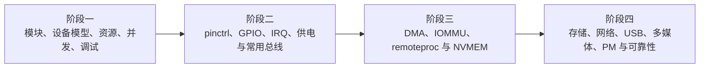

# Linux 驱动开发实战系列框架

## 系列目标与边界

本系列回答“Linux 内核如何描述、匹配、访问和管理硬件”。读者从一个可加载模块和最小用户 ABI 开始，建立 Driver Core、Device Tree、内存/MMIO、执行上下文和并发模型，再进入常用外设和高级子系统。

rootfs、启动服务、OTA、量产和整机分区属于 BSP 系列。本系列只在设备 firmware、NVMEM、PM、remove/reset 等与内核设备生命周期直接相关的位置讨论系统集成。

USB、V4L2、ASoC 文章负责 Linux 驱动入口与板级集成；USB/PCIe 和音视频独立系列继续深入协议、用户 API 与端到端数据链路。

文件名中的数字是拆分时保留的历史 URL，不代表当前阅读顺序。网站导航、标题 `#NN` 和 frontmatter `order` 才是正式顺序。

## 阶段一：驱动基本模型与执行环境

完成 1～8 后，读者应能编译/加载模块，设计字符设备 ABI，从 sysfs 追踪 device/driver，完成 DT/platform probe，正确访问 MMIO，选择执行上下文与同步原语，并用证据验证一个驱动故障。

| 顺序 | 主题 | 历史文件名 |
| ---: | --- | --- |
| 1 | 内核模块、Kbuild 与字符设备入门 | `linux-driver-02-first-kernel-module-and-char-device.md` |
| 2 | Linux 设备模型与资源生命周期 | `linux-driver-14-linux-device-model-lifecycle.md` |
| 3 | Device Tree、platform 设备与 probe | `linux-driver-01-platform-device-model-and-probe.md` |
| 4 | 内核内存、用户数据与 I/O 映射 | `linux-driver-15-driver-memory-io-mapping.md` |
| 5 | cdev、misc、sysfs、procfs 与 debugfs | `linux-driver-03-misc-sysfs-procfs-debugfs.md` |
| 6 | 执行上下文、timer 与 workqueue | `linux-driver-06-timers-workqueues-delayed-work.md` |
| 7 | 内核同步原语与并发设计 | `linux-driver-07-kernel-synchronization-primitives.md` |
| 8 | 驱动调试方法论：从现象到证据 | `linux-driver-13-driver-debugging-methodology.md` |

## 阶段二：硬件资源与常用外设

完成 9～16 后，读者应能从 pinctrl/GPIO/IRQ 框架落到 LED/Input 实践，组织可回滚的上电时序，并实现/调试 I2C、SPI、UART、PWM、IIO ADC 与 watchdog 驱动。

| 顺序 | 主题 | 历史文件名 |
| ---: | --- | --- |
| 9 | pinctrl、GPIO 与 IRQ 子系统 | `linux-driver-16-pinctrl-gpio-irq-subsystem.md` |
| 10 | GPIO 与 LED 驱动实践 | `linux-driver-04-gpio-led-subsystem.md` |
| 11 | 按键、中断与 Input 子系统 | `linux-driver-05-keys-interrupt-input-subsystem.md` |
| 12 | clock、reset、regulator 与上电时序 | `linux-driver-17-clock-reset-regulator-power-sequence.md` |
| 13 | I2C、regmap 与传感器驱动 | `linux-driver-08-i2c-regmap-sensor-driver.md` |
| 14 | SPI 控制器、设备与传输 | `linux-driver-09-spi-driver-transfers.md` |
| 15 | UART、TTY 与 console | `linux-driver-10-uart-tty-console-driver.md` |
| 16 | PWM、IIO ADC 与 watchdog | `linux-driver-11-pwm-adc-watchdog.md` |

## 阶段三：异步数据和跨处理器资源

完成 17～20 后，读者应能区分 DMA mapping 与 DMAengine，设计 coherent/streaming/SG ownership，理解 IOMMU/IOVA/DMA-BUF/fence，并管理 remoteproc/rpmsg 和持久化板级数据。

| 顺序 | 主题 | 历史文件名 |
| ---: | --- | --- |
| 17 | DMA API、DMAengine 与缓存一致性 | `linux-driver-12-dma-cache-coherency.md` |
| 18 | IOMMU、IOVA 与 DMA 地址转换 | `linux-driver-18-iommu-dma-address-translation.md` |
| 19 | firmware、remoteproc 与 rpmsg | `linux-driver-19-firmware-remoteproc-rpmsg.md` |
| 20 | RTC、NVMEM、EEPROM 与 eFuse | `linux-driver-20-rtc-nvmem-eeprom-efuse.md` |

## 阶段四：高级子系统与发布质量

完成 21～28 后，读者应能读懂存储、网络、USB、V4L2、ASoC 和 thermal/PM 的框架入口，沿真实数据路径定位问题，并为长稳、性能、故障恢复建立可重复发布门禁。

| 顺序 | 主题 | 历史文件名 |
| ---: | --- | --- |
| 21 | Block、eMMC 与 SD | `linux-driver-21-block-storage-emmc-sd.md` |
| 22 | MTD、UBI、NOR 与 NAND | `linux-driver-22-mtd-ubi-nor-nand.md` |
| 23 | Ethernet、PHY、phylink 与 netdev | `linux-driver-23-ethernet-mac-phy-netdev.md` |
| 24 | USB Controller、PHY、Host 与 Gadget | `linux-driver-24-usb-host-device-otg.md` |
| 25 | V4L2、Media Graph 与 MIPI CSI | `linux-driver-25-v4l2-imx415-mipi-csi.md` |
| 26 | ALSA ASoC、DAI、DAPM 与 I2S/TDM | `linux-driver-26-alsa-asoc-i2s-audio.md` |
| 27 | thermal、CPUFreq、Devfreq 与 PM | `linux-driver-27-thermal-cpufreq-devfreq-pm.md` |
| 28 | 长稳、性能、故障注入与发布门禁 | `linux-driver-28-reliability-performance-debug.md` |

## 参考课程与技术来源

野火 RK356x Linux 驱动指南用于参考环境搭建、模块实验、设备模型/平台/设备树递进、pinctrl/IRQ/总线框架拆分和板端验证：

- [野火嵌入式 Linux 驱动开发实战指南](https://doc.embedfire.com/linux/rk356x/driver/zh/latest/index.html)

内核对象、API、并发、DMA/IOMMU 和子系统语义以 Linux 官方文档、Device Tree binding 和目标版本源码为准。第三方教程中的平台相关步骤和简化表述不作为通用内核契约。
