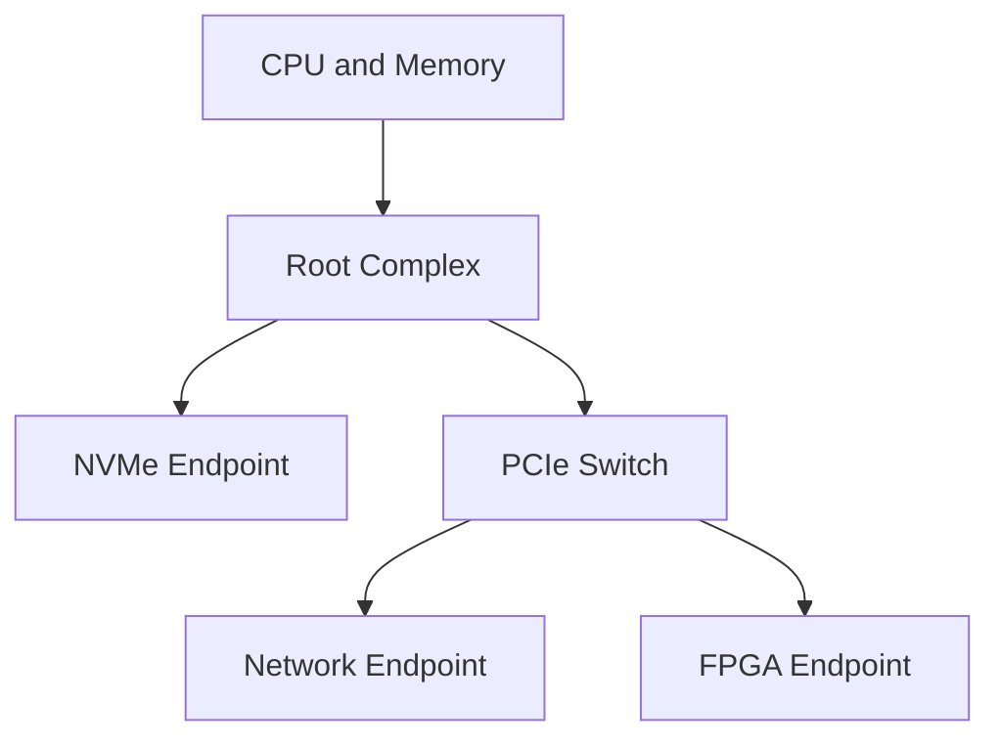

PCIe 驱动中的配置空间、BAR、中断和 DMA 都建立在链路已经进入可传输状态之上。理解 PCIe 不能从 `pci_register_driver()` 开始：先要知道 Root Complex、Switch 和 Endpoint 如何形成拓扑，LTSSM 如何建立 Link，Transaction Layer 又如何用 TLP 表达一次内存访问。

本篇建立后续文章共同使用的硬件与协议模型，并把这些概念映射到 Linux 能看到的链路能力和设备对象。

## Root Complex、Switch 与 Endpoint 组成点对点拓扑

Root Complex（RC）连接 CPU/内存系统与 PCIe fabric，是枚举和资源分配的起点。Endpoint（EP）是网卡、NVMe、FPGA 或加速器。Switch 有一个上游 port 和多个下游 port，每个 port 都是一条独立 Link。

PCIe 不是所有设备共享电气总线。每条 Link 由若干 lane 组成，每个 lane 都有独立 TX/RX 差分对并全双工工作。x1/x4/x8/x16 表示协商后的 lane 数；实际宽度和速率取两端及链路质量共同支持的值，不由插槽外观单独决定。



Bridge/port 将总线号范围隔开。Linux 枚举得到的 domain:bus:device.function（BDF）是拓扑位置，不是设备永久身份；热插拔或固件资源变化可能改变 BDF。

## 三层协议各自解决不同可靠性问题

Transaction Layer 把 CPU/设备请求编码为 TLP（Transaction Layer Packet），包括 Memory Read/Write、Configuration Read/Write、Completion 和 Message。请求头包含 address、length、Requester ID、tag、attribute 等，读请求依赖 Completion 返回数据，posted Memory Write 通常没有 Completion。

Data Link Layer 给相邻链路上的 TLP 增加 sequence number 与 LCRC，使用 ACK/NAK 和 replay buffer 保证一跳可靠传输；DLLP 还传递 flow-control credit。它不理解某个 BAR 寄存器的业务含义。

Physical Layer 负责 lane、编码、串并转换、均衡、训练和电气状态。链路降速/降宽发生在这里，但最终会影响 Transaction Layer 可用带宽。

这三层不能互相替代。AER 报告的 malformed TLP 属于协议/事务问题，Replay Timer Timeout 属于链路可靠性，Receiver Error 更接近物理层。排错时应根据错误类型选择证据。

## TLP 把 MMIO、配置空间和 Completion 统一成事务

CPU 对 BAR 映射地址执行 `writel()`，Root Complex 生成 Memory Write TLP；设备 DMA 读 Host 内存时发出 Memory Read Request，RC/内存系统返回一个或多个 Completion with Data；配置枚举则使用 Configuration TLP。

Memory Read 是 non-posted 请求，需要 tag 匹配 Completion。设备可同时发出多个 outstanding request，吞吐受 tag、credit、Max Read Request Size 和 Completion 延迟影响。Memory Write 是 posted，请求离开发送方并不等于目标寄存器副作用已经完成；驱动需要时通过 readback 或规范定义的同步点确认。

TLP payload 还受到 Max Payload Size（MPS）限制，大请求可能拆包。链路速率只是 raw capability，编码开销、TLP/DLLP header、credit、包大小和流控共同决定有效吞吐。

## LTSSM 决定链路何时能传 TLP

Link Training and Status State Machine（LTSSM）从 Detect 开始，经过 Polling、Configuration 协商 lane/速率，进入 L0 后才能正常传输。Recovery 用于重新训练或速率变化；Disabled、Hot Reset、Loopback 等状态处理特殊控制。

```text
Detect -> Polling -> Configuration -> L0
                     ^               |
                     +--- Recovery <-+
```

PERST# 释放、REFCLK 稳定、lane 极性/映射、receiver detect、equalization 任一异常都可能让 LTSSM 卡在前置状态。此时 `lspci` 看不到 Endpoint，Linux device driver 没有执行机会。

设备已枚举但 `LnkSta` 显示低于目标速率/宽度，说明 LTSSM 成功进入 L0 但协商降级。使用 `lspci -s BDF -vv` 对照 `LnkCap` 与 `LnkSta`，再结合控制器/Endpoint LTSSM debug register、AER 和信号测试定位。

## Credit 流控和顺序规则影响驱动可见行为

接收端为 posted、non-posted、completion 的 header/data buffer 宣告 credit，发送端 credit 不足时必须停发。队列设计若产生大量小读请求，可能受 non-posted tag/credit 限制，而不是 PCIe lane 带宽。

PCIe 允许一定程度的事务重排，Relaxed Ordering、No Snoop 和 ID-based ordering 等 attribute 会改变约束。驱动在 descriptor ready、doorbell 和 completion 之间仍要使用 DMA API 与 memory barrier，不能把“PCIe 可靠传输”误解为 CPU 内存操作天然有序。

## Linux 看到的是已经训练好的设备树

固件/Host bridge 驱动先让 RC 工作并提供 ECAM/config access。PCI core 从 root bus 扫描，创建 `pci_bus`、`pci_dev` 和 bridge 层次。普通 Endpoint driver 接到 `probe()` 时，Link 已建立、配置空间可读、BAR 资源通常已分配。

```bash
lspci -tv
lspci -s 0000:01:00.0 -vv
```

树形输出对应 RC/bridge/Endpoint 拓扑，详细输出中的 `LnkCap/LnkSta`、DevCap/DevCtl、AER/MSI capability 是协议状态在 Linux 的入口。没有设备时先查 Host bridge、PERST#/REFCLK/LTSSM，不要先检查 `pci_device_id`。

## 小结

PCIe 是由 RC、Switch、Endpoint 和点对点 Link 组成的分层互连。LTSSM 让链路进入 L0，Physical/Data Link/Transaction 三层分别处理电气训练、相邻链路可靠性和端到端 TLP 事务。MMIO、配置访问与 DMA 都是不同 TLP 路径。下一篇将从 Linux 扫描 root bus 开始，解释 BDF、配置空间、bridge recursion 和 Capability。
