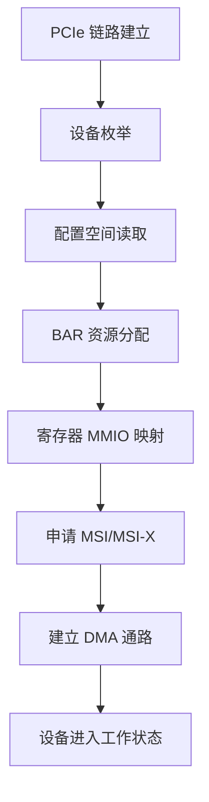

USB 讲完后，我们转到另一条在芯片软件、高速外设和加速器里非常重要的总线：**PCIe**。

如果说 USB 更偏外设接入和即插即用，那么 PCIe 更偏高速互联、板级扩展、DMA、加速器和复杂外设接入。它是很多高性能设备真正的“主干通道”：显卡、网卡、SSD、FPGA、AI 加速卡，很多都靠 PCIe 和主机建立高速通信。

这篇先把 PCIe 的整体架构和基础概念讲清楚。只要把这层地图搭好，后面再看配置空间、BAR、MSI/MSI-X、DMA、IOMMU 和 Linux PCI 驱动框架，就会轻松很多。

## 一、PCIe 是什么

PCI Express，简称 PCIe，是一种高速串行点对点互连总线。

它的设计目标不是“简单连接一个低速外设”，而是“让主机和高带宽设备建立稳定、标准化、可扩展的高速链路”。

常见 PCIe 设备包括：

- 独立显卡
- 网卡
- SSD
- AI 加速卡
- FPGA
- 各类高速采集和控制设备

PCIe 的强项不只是“快”，还在于它提供了完整的设备发现、资源映射、中断和 DMA 机制，非常适合复杂外设。

## 二、PCIe 的核心角色

PCIe 拓扑里最常见的角色有三个：

### 1. Root Complex

Root Complex 是主机侧根控制器，通常集成在 CPU/SoC 平台中。

它负责：

- 发起链路训练
- 组织枚举
- 分配资源
- 向下连接 Endpoint 或 Switch

### 2. Endpoint

Endpoint 是链路上的设备端，比如 NVMe SSD、网卡、AI 卡。

它会向主机暴露：

- 配置空间
- BAR 资源
- 中断能力
- DMA 能力

### 3. Switch

Switch 用于扩展 PCIe 拓扑，把一条上游链路扩展出多条下游链路。

它在复杂平台里很常见，比如多设备扩展、背板系统和高密度服务器场景。

## 三、PCIe 的链路特性

PCIe 是点对点链路，不像老式并行总线那样大家挂在同一根线上。

它的几个关键参数是：

- **lane 数量**：x1、x4、x8、x16
- **速率等级**：不同代际对应不同 GT/s
- **方向**：全双工
- **链路宽度**：多 lane 聚合提升吞吐

你经常会看到：

- x1：单 lane
- x4：四 lane
- x8：八 lane
- x16：十六 lane

lane 越多，理论带宽越高，但布线、成本和兼容性要求也更高。

## 四、PCIe 和 USB 的第一眼区别

这两条总线很容易被混在一起，但它们在工程定位上差别很大。

| 维度 | USB | PCIe |
|---|---|---|
| 通信风格 | 主机主导，枚举后接管 | 高速点对点互联 |
| 识别方式 | 描述符 | 配置空间 |
| 资源映射 | 端点 + 传输类型 | BAR + MMIO |
| 数据传输 | URB / 传输类型 | DMA / MMIO / 中断 |
| 常见场景 | 外设接入 | 高速外设、加速器、存储 |

一句话概括：

- USB 更像“外设接入体系”
- PCIe 更像“高速设备互联体系”

## 五、PCIe 设备能做什么

PCIe 设备通常通过以下方式和主机交互：

### 1. MMIO 暴露寄存器

设备会把控制寄存器映射到 BAR 对应的地址空间里，驱动可以像访问内存一样访问这些寄存器。

### 2. DMA 交换数据

对于大块数据，设备不会让 CPU 一字节一字节搬运，而是直接通过 DMA 和主机内存交换数据。

### 3. MSI / MSI-X 通知主机

设备完成任务后，可以通过消息中断通知主机，而不是依赖传统引脚中断。

这三样东西，构成了 PCIe 驱动最核心的工程闭环。

## 六、一个 PCIe 设备驱动的大致路径

一个 PCIe 设备从上电到工作，通常经历如下流程：

1. 上电
2. 链路训练
3. 枚举
4. 读取配置空间
5. 分配 BAR
6. 申请中断
7. 建立 DMA
8. 进入正常工作

每一步都可能出问题，所以 PCIe 驱动并不只是“读写寄存器”，它实际上是一个完整的系统软件工程。

## 七、为什么 PCIe 很重要

PCIe 之所以在芯片软件和驱动开发中占核心位置，是因为它常常承载高带宽数据流：

- 图像数据
- 网络包
- 存储读写
- AI 推理输入输出
- FPGA 与主机通信

如果你以后要做：

- GPU/NPU 驱动
- 高速采集卡驱动
- NVMe 或 SSD 相关软件
- FPGA 板卡驱动
- 加速器 runtime

PCIe 基础是绕不开的。

## 八、PCIe 的分层理解

初学时，不要一上来就啃完整协议栈，先抓住下面几件事：

- 物理链路怎么起来
- 设备怎么被发现
- 配置空间怎么读
- BAR 怎么映射
- 中断怎么来
- DMA 怎么传数据

这六件事，基本就把 PCIe 驱动学习的主干搭起来了。

## 九、一个 PCIe 设备的典型能力框架

可以把 PCIe 设备想象成这样的结构：



这张图就是 PCIe 驱动后续所有内容的骨架。

## 十、PCIe 设备驱动和业务场景的关系

不同设备虽然功能不同，但底层逻辑很像。

### 1. SSD

重点在：

- 块设备交互
- 高速 DMA
- 队列和并发
- 延迟和吞吐平衡

### 2. 网卡

重点在：

- 包收发
- DMA ring
- 中断聚合
- 吞吐和时延

### 3. AI 加速器

重点在：

- 大块模型和特征数据传输
- 命令队列
- DMA 同步
- 任务调度和隔离

### 4. FPGA

重点在：

- 自定义寄存器
- DMA 通信
- 用户态和内核态协作
- 高速数据搬运

虽然外设不同，但你会发现：**配置空间、BAR、MMIO、中断、DMA** 这条主线几乎都一样。

## 十一、学习 PCIe 时要先建立的概念顺序

建议按照这个顺序理解：

1. PCIe 是什么
2. Root Complex / Endpoint / Switch 的关系
3. 链路和 lane 的概念
4. 配置空间
5. BAR 和 MMIO
6. 中断机制
7. DMA 传输
8. Linux PCI 驱动框架
9. 性能和稳定性优化

这个顺序比直接背协议字段更容易上手。

## 十二、调试 PCIe 时为什么不能只看代码

PCIe 设备的问题，很多不在驱动代码本身，而在链路、供电、时钟、设备树、BIOS/固件、IOMMU、资源分配等环节。

所以你在现场调试时，往往要综合看：

- 链路是否训练成功
- `lspci` 是否能看到设备
- BAR 是否分配成功
- 驱动有没有正常 probe
- 中断是否触发
- DMA 是否可达

PCIe 是一个典型的“软硬件协同”总线。

## 十三、小结

这一讲先把 PCIe 的整体地图搭起来。

你现在应该知道：

- PCIe 是高速点对点互连总线
- Root Complex、Endpoint、Switch 是核心角色
- PCIe 常用于高速外设、存储、网络和加速器
- PCIe 驱动的主线是配置空间、BAR、MMIO、中断和 DMA
- 学 PCIe 不能只看代码，要结合链路和板级环境一起理解

下一讲我们会深入 **PCIe 枚举与配置空间**，看看设备是怎么被系统识别出来的。

> 🏷️ PCIe / 架构 / 配置空间 / BAR / MMIO / DMA / 中断 / Linux驱动

---

## 初学者扩展讲解


## PCIe 基础学习不要跳过拓扑

PCIe 不是一根简单总线，而是点到点高速互连。Root Complex 连接 CPU/内存系统，Endpoint 是具体设备，Switch 可以扩展多个下游端口。Linux 枚举 PCIe 时，会形成 bus/device/function 的层级结构。

理解拓扑以后，再看 `lspci -t` 就不再只是命令输出，而是在看设备挂在哪个层级、经过哪个桥、最终由哪个 Root Port 管理。很多链路问题、带宽问题和热插拔问题，都和拓扑有关。


## PCIe 学习中的关键主线

PCIe 的核心主线可以概括为：链路训练、配置空间、资源分配、BAR 映射、中断通知、DMA 搬运。初学者不要一开始就陷入 TLP、DLLP 等协议细节，先把 Linux 驱动真正会接触到的对象搞清楚。

设备上电后，Root Complex 会尝试和 Endpoint 建立链路，这个过程叫链路训练。链路训练成功以后，系统才能扫描配置空间。配置空间里有 Vendor ID、Device ID、Class Code、BAR、Capability 等信息。系统根据这些信息识别设备、分配 MMIO 地址空间、配置中断能力，然后内核 PCI 子系统根据匹配表调用具体驱动的 `probe()`。

如果 `lspci` 看不到设备，通常说明问题还在驱动 probe 之前。此时要优先检查供电、PERST#、REFCLK、lane 连接、Root Complex 配置和设备树。很多初学者会在驱动代码里找半天，但设备根本没有枚举，驱动没有任何机会执行。

## BAR 和 MMIO 要这样理解

PCIe 设备内部有寄存器，但 CPU 不能直接凭空访问这些寄存器。BAR 可以理解为设备向系统声明的一扇窗口：设备说“我需要一段地址空间”，系统分配一个 CPU 可访问的物理地址范围，驱动再把这段范围映射成内核虚拟地址。之后驱动通过 `readl()`、`writel()` 读写这段地址，就相当于访问设备寄存器。

典型流程是：

```c
pci_enable_device(pdev);
pci_request_regions(pdev, "demo");
bar = pci_iomap(pdev, 0, 0);
value = readl(bar + REG_STATUS);
writel(0x1, bar + REG_CTRL);
```

这里每一步都有意义。`pci_enable_device()` 使能设备；`pci_request_regions()` 申请 BAR 资源，避免多个驱动冲突；`pci_iomap()` 建立映射；`readl/writel` 才是真正访问寄存器。不要用普通指针直接访问 MMIO，也不要用 `memcpy` 随便操作寄存器区域。

## DMA、IOMMU 和 cache 一致性

PCIe 高速设备通常不会依赖 CPU 一字节一字节搬数据，而是使用 DMA。DMA 的意思是设备直接读写内存，CPU 只负责准备 buffer、告诉设备地址和长度、等待完成通知。

这里有三个地址概念必须区分：CPU 虚拟地址、CPU 物理地址、设备看到的 DMA 地址。驱动不能把普通虚拟地址直接写给设备，而要通过 DMA API 获取设备可访问地址：

```c
void *cpu_addr;
dma_addr_t dma_addr;

cpu_addr = dma_alloc_coherent(&pdev->dev, size, &dma_addr, GFP_KERNEL);
```

`cpu_addr` 给 CPU 访问，`dma_addr` 给设备访问。如果平台启用了 IOMMU，`dma_addr` 可能是 IOVA，不等于真实物理地址。使用 DMA API 的好处是内核会帮你处理映射、权限和 cache 一致性问题。工程中很多“DMA 写了但 CPU 看不到”“偶发数据错误”“IOMMU fault”，本质都是地址、cache 或生命周期管理出错。

## PCIe 排错的顺序

PCIe 排错建议按下面顺序：

```bash
lspci
lspci -vv
lspci -xxx
cat /proc/interrupts
dmesg -w
```

`lspci` 看设备是否枚举；`lspci -vv` 看 BAR、链路速率、链路宽度、MSI/MSI-X 和驱动绑定；`lspci -xxx` 看配置空间原始内容；`/proc/interrupts` 看中断是否触发；`dmesg` 看驱动日志、AER 错误、IOMMU fault 和 DMA 报错。性能问题还要进一步看 `perf`、ftrace、队列深度、buffer 大小和 CPU 亲和性。

## PCIe 驱动代码阅读建议

阅读 PCIe 驱动时，先看 `pci_device_id` 匹配表，再看 `pci_driver` 结构体。进入 `probe()` 后，重点看是否调用 `pci_enable_device()`、`pci_request_regions()`、`pci_set_master()`、`dma_set_mask_and_coherent()`、`pci_iomap()` 和中断申请函数。随后再看驱动如何创建 DMA 描述符队列、如何启动硬件、如何在中断处理里回收完成项。

一个成熟的 PCIe 驱动不只是能收发数据，还要处理热插拔、错误恢复、DMA 超时、中断丢失、设备复位、IOMMU fault 和长时间压力测试。初学时可以先跑通最小路径，但最终必须理解这些异常路径。


## 面向初学者的阅读方法

刚开始学习这类驱动文章时，最容易犯的错误，是把每一个名词都当成孤立知识点去背。实际工程里，驱动不是由名词堆起来的，而是一条从硬件连接、总线枚举、内核匹配、资源申请、数据传输到用户态验证的完整链路。读这一篇时，建议先抓住三件事：第一，这个机制解决什么问题；第二，Linux 内核用什么对象表达它；第三，出现故障时应该从哪一层开始查。

例如看到“枚举”，不要只记住它叫 enumeration，而要理解为：系统需要先发现设备、识别设备能力、给设备分配地址或资源，然后才可能让具体驱动接管。看到“驱动匹配”，也不要只背 `probe()`，而要继续追问：是谁触发 `probe()`？匹配表里放了什么？设备还没有出现时驱动会不会执行？驱动执行以后第一步应该申请什么资源？这些问题连起来，才是真正能在板子上排错的知识。

## 从硬件到软件的完整路径

一条外设链路通常可以分成五层。第一层是硬件层，包括供电、时钟、复位、信号线、连接器和外设本身。第二层是总线层，也就是 USB、PCIe、I2C、SPI 这类协议如何发现设备、传输数据。第三层是内核框架层，Linux 会把设备抽象成 `struct device`、总线对象、驱动对象和资源对象。第四层是具体驱动层，驱动负责把通用框架和具体芯片寄存器、端点、队列、描述符连接起来。第五层是用户态验证层，包括命令行工具、测试程序、日志和性能统计。

初学者排错时不要一上来就怀疑驱动代码。设备没有被系统看到时，驱动代码通常还没有执行；驱动没有绑定时，可能是匹配表或描述符问题；驱动绑定了但不能传输时，才更可能进入 buffer、DMA、中断、同步和协议细节。按照这个顺序排查，可以避免在错误层面浪费时间。

## 建议准备的实验环境

学习 USB/PCIe 驱动，最好准备一台 Linux 主机、一块支持外设扩展的开发板，以及至少一个真实设备。USB 方向可以从 U 盘、USB 串口、USB 摄像头、USB 网卡开始；PCIe 方向可以从 NVMe、PCIe 网卡、PCIe 转串口卡、FPGA PCIe Endpoint 或开发板自带 PCIe 插槽开始。没有 PCIe 硬件时，也可以先通过 `lspci` 观察 PC 上已有设备，理解配置空间、BAR 和驱动绑定。

每次实验都建议记录四类信息：硬件连接照片或说明、内核版本和设备树/配置、关键命令输出、问题现象和解决过程。驱动学习的进步往往不是来自“看懂一段代码”，而是来自反复把现象、日志、源码和硬件状态对应起来。

## 常用观察命令

无论是 USB 还是 PCIe，都建议养成先看系统状态的习惯：

```bash
uname -a
dmesg -w
lsmod
cat /proc/interrupts
cat /proc/iomem
```

`uname -a` 用来确认内核版本；`dmesg -w` 用来实时观察设备插拔、枚举和驱动 probe 日志；`lsmod` 用来看模块是否加载；`/proc/interrupts` 用来看中断是否触发；`/proc/iomem` 可以帮助理解 MMIO 资源分配。不要小看这些基础命令，很多现场问题并不是复杂 bug，而是设备没枚举、驱动没加载、资源没分配或中断没到。

## 初学者最容易混淆的点

第一，不要把“用户态能看到设备节点”等同于“驱动完全正常”。设备节点只说明某个驱动创建了接口，真正的数据通路还要看读写、ioctl、mmap、poll、DMA 和中断是否正常。

第二，不要把“驱动 probe 成功”等同于“硬件已经工作”。probe 成功通常只代表资源申请和初始化基本完成，后续传输仍可能因为时钟、复位、buffer、协议状态或固件问题失败。

第三，不要把“命令没有报错”等同于“性能达标”。高速设备还要统计吞吐、延迟、CPU 占用、内存拷贝次数、DMA 是否真正生效，以及异常恢复是否可靠。

## 推荐的验证闭环

一篇驱动文章学完以后，不建议只停留在阅读层面。至少做一个小闭环：先用命令确认设备存在，再找到它绑定的驱动，然后观察内核日志，再做一次最小读写或传输测试，最后故意制造一个小错误，例如拔掉设备、改错匹配 ID、禁用模块或调整 buffer 数量，观察系统如何报错。只有经历过“正常路径”和“异常路径”，才能真正理解驱动框架为什么这样设计。
