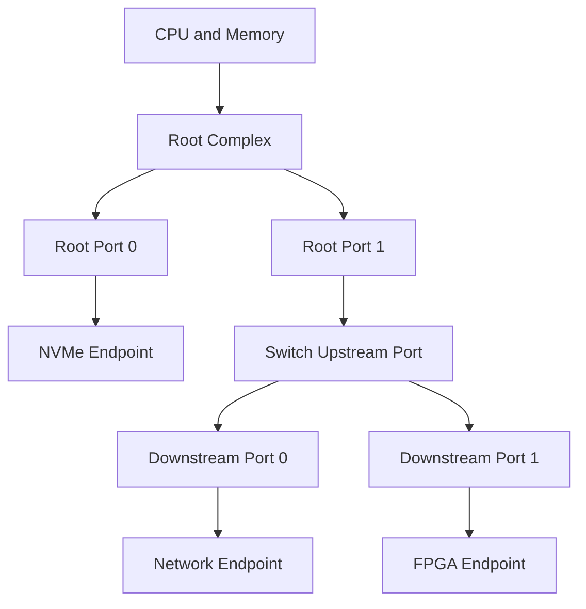
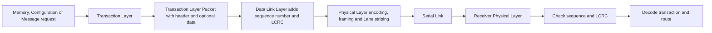
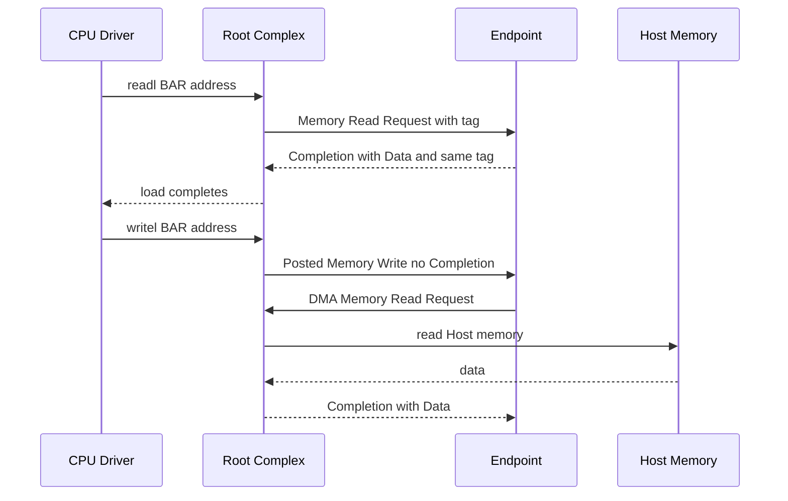
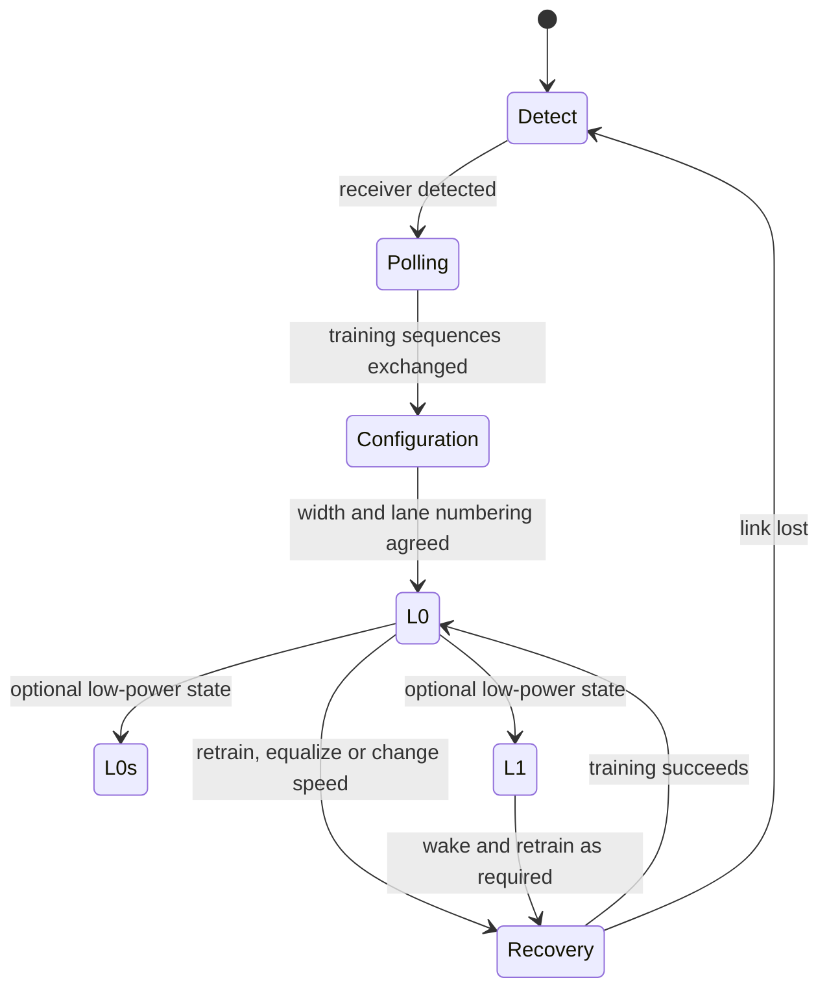

PCI Express，简称 PCIe，是 CPU/内存系统连接高速外设的一套通用 I/O 互连协议。NVMe SSD、网卡、GPU、FPGA、采集卡和 AI 加速器都可以借助它访问寄存器、交换数据并向 CPU 发出通知。

它不是“更快的 USB”，也不是一组 Linux API。PCIe 首先是一套硬件与协议共同定义的互连：设备如何形成点对点拓扑，串行链路如何训练，读写请求如何封装和返回，发送端如何受流控约束，错误如何被检测并恢复。Linux 的枚举、BAR、中断和 DMA 都建立在这些机制之上。

本文从零回答三件事：PCIe 为什么出现；一条链路中实际传输什么；CPU 读设备寄存器和设备访问内存时，事务如何往返。

## 一、为什么高速设备需要 PCIe

CPU 不能为每类高速外设设计一套专用引脚、地址和驱动模型。一个通用互连至少要解决：设备发现、地址分配、可靠传输、并发、带宽扩展、中断、电源管理和错误报告。

传统 PCI 使用共享并行总线。多块设备共享地址/数据线与仲裁，时钟频率、走线偏差和负载限制了扩展。PCIe 保留了 PCI 软件可见的配置空间和资源模型，但把电气传输改造成高速串行、全双工、点对点 Link。每条 Link 只连接两个 Port，Switch 再把多条 Link 组成 fabric。

“点对点”不等于只能连接一个设备。它表示每段电气链路有明确的两个端点，多个设备通过 Root Port 和 Switch Port 形成树。这样每条 Link 可以独立协商速度/宽度并并行传输，不再由所有设备争用一组并行线。

PCIe 对软件提供 load/store 风格。CPU 访问某个映射地址时，Root Complex 把请求转换成 PCIe 事务；设备访问 Host memory 时也发出事务。软件看到地址和读写，链路上则是 packet。

## 二、Root Complex、Endpoint、Switch 与 Port 组成拓扑

Root Complex（RC）连接 CPU/内存系统与 PCIe fabric。它提供一个或多个 Root Port，负责配置访问、地址路由、事务进入内存系统以及平台级错误/中断集成。

Endpoint（EP）是叶子设备，例如 NVMe、NIC、GPU 或 FPGA。Endpoint 暴露配置空间和一个或多个功能；每个 Function 可以拥有独立 ID、BAR、Capability 和驱动。

Switch 有一个 Upstream Port 面向 RC，多个 Downstream Port 面向 Endpoint 或下级 Switch。每个 Port 在配置软件看来具有 PCI-to-PCI Bridge 特征，用 bus number 和窗口路由下游事务。



Port 是 Link 一端的协议实体，Link 是两个 Port 之间的连接。Linux 后续用 domain:bus:device.function 地址表示拓扑位置，但该地址由枚举生成，不是设备永久身份。热插拔、固件和桥资源变化都可能改变位置。

事务经过 Switch 时按地址或 ID 路由。Switch 通常不理解某个寄存器的业务意义，它只根据 packet header、路由规则和虚通道转发。

## 三、Link、Lane、速率与有效带宽

一条 Link 由一个或多个 Lane 组成。Lane 包含一对发送差分线和一对接收差分线，因此天然全双工。x1、x4、x8、x16 表示协商宽度；插槽机械长度不保证实际宽度，布线、bifurcation、两端能力和链路质量都会影响结果。

速率以 GT/s（每秒十亿次传输）表示，不等于 Gbit/s payload。Gen1/Gen2 使用 8b/10b 编码，每 10 bit 只有 8 bit 数据；Gen3 及以后使用 128b/130b，编码效率更高。常见代际：

| Generation | 每 Lane 速率 | 编码 | 单方向编码后近似上限 |
| --- | --- | --- | --- |
| Gen1 | 2.5 GT/s | 8b/10b | 2.0 Gbit/s |
| Gen2 | 5.0 GT/s | 8b/10b | 4.0 Gbit/s |
| Gen3 | 8.0 GT/s | 128b/130b | 7.877 Gbit/s |
| Gen4 | 16.0 GT/s | 128b/130b | 15.754 Gbit/s |
| Gen5 | 32.0 GT/s | 128b/130b | 31.508 Gbit/s |

这仍不是应用吞吐。Packet header、LCRC、Data Link packet、ACK、flow-control update、SKP、空闲、包大小和重放都会占用链路。大量 32-byte request 的效率远低于 256/512-byte payload。

多 Lane 的 striping 由 Physical Layer 完成，上层不需要知道某个 packet 的字节走了哪条 Lane。训练时链路可以从 x4 降到 x2/x1，或从高代际降速继续工作。因此“设备能被发现”不能替代 speed/width 验证。

## 四、三层协议把请求变成可靠串行传输

PCIe 按功能分为 Physical Layer、Data Link Layer 和 Transaction Layer。发送时上层逐步加信息，接收时反向处理：



Transaction Layer 生成 TLP（Transaction Layer Packet）。类型包括 Memory Read/Write、Configuration Read/Write、Completion、Message。Header 包含地址或 routing ID、length、Requester ID、tag、byte enable 和 attribute；写请求或 Completion with Data 还携带 payload。

Data Link Layer 为相邻 Link 上的 TLP 添加 sequence number 和 LCRC。接收端校验后用 DLLP（Data Link Layer Packet）发送 ACK/NAK 和 flow-control update。发送端在 Replay Buffer 保存未确认 TLP，NAK 或 Replay Timer 超时会触发重传。

这套 replay 只保证一跳可靠到达。ACK 证明下一跳 Port 收到并校验 TLP，不证明目标设备已经执行命令，也不证明 DMA 数据已被软件消费。

Physical Layer 负责电气检测、串并转换、编码、Lane 对齐、均衡和链路训练。Receiver Error 更接近物理层；Replay Timer Timeout 指向链路可靠性；Malformed TLP 则是 Transaction Layer 格式问题。AER（Advanced Error Reporting）把这些错误类别暴露给软件。

## 五、读、写、Completion、credit 与 ordering

CPU 对设备 BAR 地址执行 `writel()` 时，RC 产生 Memory Write Request。Memory Write 是 posted request，正常路径没有 Completion；发送方不能等待一个不存在的“写完成包”。需要确认设备 side effect 时，驱动使用规范允许的 readback 或设备定义的同步寄存器。

CPU 对设备执行 `readl()` 时，RC 发出 Memory Read Request。它是 non-posted request，Endpoint 返回一个或多个 Completion with Data。Request 中的 tag 让多个 outstanding read 可以并行，Completion 用相同 tag 回到发起者。



设备 DMA Write Host memory 同样是 posted Memory Write；设备 DMA Read Host memory 则需要 Completion。Read 吞吐受 round-trip latency、tag 数、Max Read Request Size、Completion split 和 credit 共同影响。

Flow Control 使用 credit 防止发送方溢出接收 buffer。Posted、Non-Posted、Completion 分别有 Header/Data credit，例如 PH/PD、NPH/NPD、CplH/CplD。某类 credit 耗尽时，该类 TLP 停发，其他类型可能继续。Link 空闲不代表发送方有可用 tag/credit。

Ordering 规定事务可见顺序，Relaxed Ordering、ID-Based Ordering、No Snoop 等 attribute 会改变约束。但 PCIe ordering 不等于 CPU memory model，也不替代 DMA barrier。CPU 写 descriptor 后敲 doorbell 需要 `dma_wmb()` 和正确 MMIO accessor；设备写 completion 后发 MSI 也需要硬件保证顺序，Host 消费时按 DMA API 使用 `dma_rmb()`。

## 六、LTSSM 把两端从电气检测带到可传输状态

Link Training and Status State Machine（LTSSM）是 Physical Layer 的链路状态机。两端上电、REFCLK/PERST# 条件满足后，从 Detect 开始，经 Polling 和 Configuration 建立 Lane/宽度，进入 L0 才能正常传 TLP。



Detect 失败先查电源、PERST#、REFCLK、lane 和 receiver detect；Polling/Recovery 循环常指向训练序列、极性、Lane mapping、signal integrity 或 equalization；进入 L0 但宽度/速率低于目标，说明链路选择了可工作的降级组合。

ASPM（Active State Power Management）使用 L0s/L1/L1 Substates 降低功耗，但增加唤醒延迟并依赖 CLKREQ#/REFCLK/平台固件。低负载 timeout 可能与电源状态切换相关，但关闭 ASPM 只能作为对比实验，不是默认修复。

普通 Endpoint Driver 的 `probe()` 被调用时，LTSSM 已进入可配置状态、配置空间可读、设备对象已创建。若系统完全看不到 Endpoint，修改 `pci_device_id` 没有作用，应该回到 RC、PERST#/REFCLK 和 LTSSM。

## 七、Linux 如何显示这套硬件模型

固件或 Host Bridge Driver 创建 root bus，PCI Core 扫描配置空间并建立 `pci_bus`、bridge/port 和 `pci_dev` 树。`lspci -t` 显示拓扑，`lspci -vv` 显示 Link 与 Capability：

```bash
lspci -tv
lspci -s 0000:01:00.0 -vv
```

重点区分能力与当前状态：`LnkCap` 是 Port 最大能力，`LnkSta` 是本次协商 speed/width；`DevCap/DevCtl` 显示 MPS/MRRS 等事务能力和配置；AER Capability/日志显示协议错误；ASPM 字段显示电源能力与状态。

一次基础验收至少记录：拓扑、目标与实际 speed/width、Device/Link status、AER error count。性能问题若不先确认这些数据，后续 ring/中断调优没有可靠基线。

**参考资料**

- [PCI-SIG Specifications](https://pcisig.com/specifications)
- [Linux PCI Express Port Bus Driver Guide](https://docs.kernel.org/PCI/pciebus-howto.html)
- [How To Write Linux PCI Drivers](https://docs.kernel.org/PCI/pci.html)

## 八、小结

PCIe 是连接 CPU/内存与高速设备的串行点对点 fabric。RC、Switch 和 Endpoint 通过 Port/Link 形成树；Lane 和代际决定原始能力；Transaction/Data Link/Physical 三层分别处理请求、相邻链路可靠性和电气传输；Memory Read/Write、Completion、credit、ordering 和 LTSSM 共同决定软件可见行为。

下一篇会在这个模型上回答枚举问题：设备尚未拥有 BAR 地址时，系统如何通过配置空间发现它、分配 bus number 和资源。
