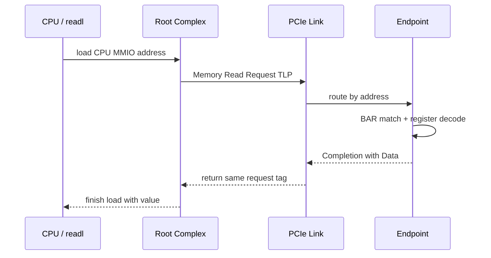
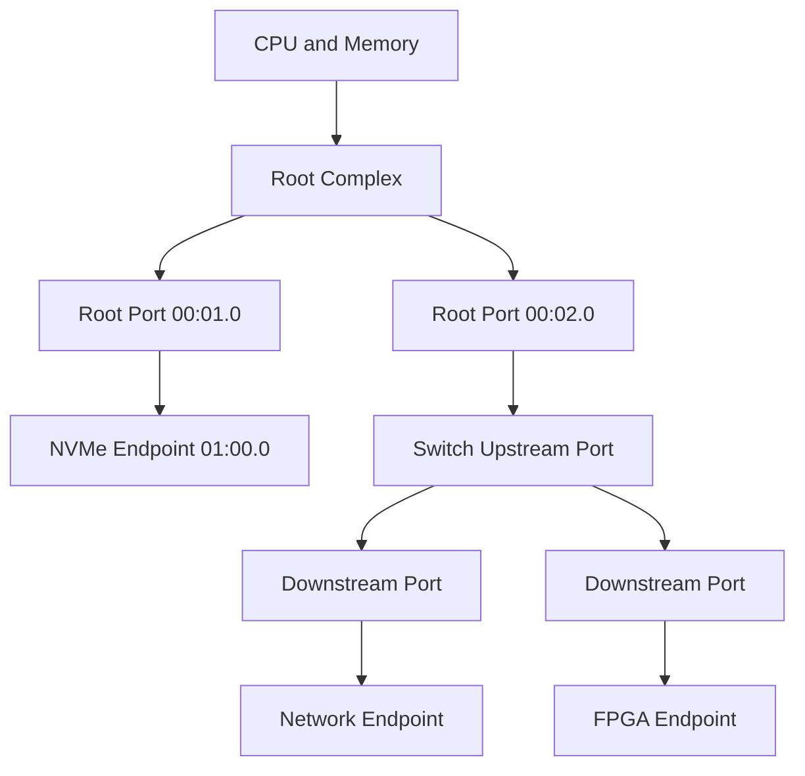
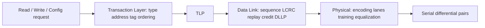
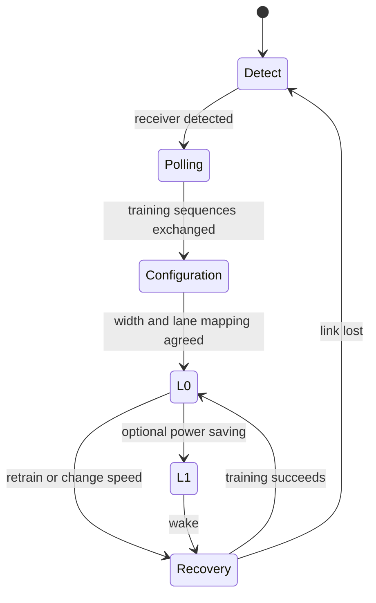

学习 PCIe 时最容易遇到的问题不是概念太少，而是概念同时出现：Root Complex、Lane、TLP、LTSSM、Credit、BAR、DMA 看起来彼此独立，读者只能逐个记忆，却不知道它们为什么会在同一次访问中同时发挥作用。

本文只从一个具体问题开始：**CPU 执行一次 `readl()`，为什么最后能够读到插在 PCIe 插槽中的设备寄存器？**我们会跟随这次读取经过软件地址、Root Complex、链路和 Endpoint，再从这条路径中自然引出拓扑、事务和三层协议。

Linux 相关对象和命令以 Linux 6.12 为基线。协议行为以 PCI-SIG 公开资料为依据；文中设备名称只帮助观察拓扑，不把某一款网卡、SSD 或 FPGA 的私有寄存器当成 PCIe 规范。

## 一、先看问题：一次寄存器读取经历了什么

假设驱动已经把设备 BAR0 映射为 `bar0`，并执行下面的读取：

```c
u32 status = readl(bar0 + 0x100);
```

这行代码表面上只是 CPU Load，实际至少经历五次语义转换：内核虚拟地址转换成 CPU 物理 MMIO 地址；Root Complex 判断地址属于 PCIe 窗口；地址被封装成 Memory Read Request；Endpoint 根据 BAR 和 offset 找到寄存器；读取结果再通过 Completion 返回 CPU。



因为 Memory Read 需要返回数据，所以它属于 Non-Posted Request，必须得到 Completion。与之相对，CPU 使用 `writel()` 写设备寄存器时通常产生 Posted Memory Write，正常路径没有逐笔成功 Completion。因此驱动若需要确认停止命令已经到达设备，必须使用设备协议允许的安全 readback，而不是等待一个不存在的“写完成包”。

这条最小路径已经给出了后续学习顺序：先知道请求经过哪些节点，再理解请求在链路上以什么格式传输，最后讨论链路如何保证请求可靠到达。BAR 地址如何得到会在第 03 篇展开，本篇暂时把它视为已经建立的入口。

## 二、Root Complex、Port、Switch 与 Endpoint 组成路径

PCIe 不是所有设备共享一组电气导线的并行总线，而是由多段点对点 Link 组成的树形互连。每段 Link 只连接两个 Port；需要接入更多设备时，由 Root Port 和 Switch Port 把多段 Link 连接起来。

Root Complex（RC）位于 CPU/内存系统与 PCIe fabric 的边界。它把 CPU MMIO 访问变成 PCIe 事务，也把设备发起的 DMA 事务送入内存系统。Root Complex 可以提供多个 Root Port，每个 Root Port 都是下游拓扑的一条入口。

Endpoint（EP）是树的叶子，例如 NVMe SSD、网卡、GPU 或 FPGA。一个物理 Endpoint 可以包含多个 Function，每个 Function 都有自己的配置空间、设备 ID、BAR 和驱动绑定关系。因此 Linux 中的一个 `pci_dev` 对应 Function，而不一定对应整块板卡。

Switch 的 Upstream Port 面向 Root Complex，Downstream Port 面向 Endpoint 或下级 Switch。Switch 主要根据地址或 Routing ID 转发 TLP，它通常不知道某个 offset 是队列 Doorbell 还是状态寄存器。



“点对点”因此不等于“只能连接一个设备”。它表示每段电气链路的两端明确，速度、宽度和错误恢复也按 Link 独立管理。Linux 的 Bus Number 和 BDF 则把这棵树编码成软件可枚举的地址，下一篇会解释这些编号如何产生。

## 三、链路上传输的是 TLP，不是 C 语言读写

Transaction Layer Packet（TLP）是事务层在链路上传递请求和结果的基本单元。TLP Header 描述事务类型、地址或 Routing ID、长度、Requester ID、Tag、Byte Enable 和属性；带数据的写请求或 Completion 还包含 Payload。

常用事务可以先按“是否期待 Completion”分类：

| 事务 | 类型 | 是否返回 Completion | 常见用途 |
| --- | --- | --- | --- |
| Memory Write | Posted | 否 | 写寄存器、设备 DMA 写 Host 内存 |
| Memory Read | Non-Posted | 是 | 读寄存器、设备 DMA 读 Host 内存 |
| Configuration Read/Write | Non-Posted | 是 | 枚举和配置 Function |
| Completion with Data | Completion | 本身就是响应 | 返回读取结果 |
| Message | Message | 取决于消息语义 | 中断、错误和电源事件 |

Memory Read Request 中的 Tag 用来标识未完成请求。Requester 可以同时发出多个 Read，只要 Tag、Credit 和接收能力允许；Completion 带回相同 Tag，Requester 因此能把乱序返回的结果放回正确请求。大读取还可能被拆成多个 Completion，这意味着“一个 API 调用”不一定对应“一个返回包”。

因为 Memory Write 是 Posted，发送方释放本地请求资源并不等于目标寄存器已经产生副作用。因此 PCIe 设备协议通常用 Completion Queue、状态寄存器或序号定义端到端完成语义。链路层 ACK 也不能替代这种业务完成，因为 ACK 只证明相邻 Port 收到并校验了 TLP。

## 四、三层协议分别解决不同问题

PCIe 把职责分成 Transaction Layer、Data Link Layer 和 Physical Layer。理解这三层的关键不是背名字，而是问：如果去掉这一层，哪类问题将无法解决？



Transaction Layer 解决端到端事务表达和路由问题。没有它，接收方不知道这是读、写还是配置访问，也不知道地址、长度和请求者。因此 BAR、Requester ID、Tag、MPS 和 Ordering Attribute 都属于事务语义。

Data Link Layer 解决一段相邻 Link 的可靠传输。它为 TLP 增加 Sequence Number 和 LCRC，接收端用 ACK/NAK DLLP 反馈，发送端在 Replay Buffer 中保留未确认 TLP。因为可靠性是逐 Link 的，所以经过 Switch 的事务会在每段 Link 上分别确认和重放。

Physical Layer 解决比特怎样稳定穿过差分线的问题。它负责 Receiver Detect、串并转换、编码、Lane 对齐、极性处理、均衡和训练。信号完整性不足时，软件可能只看到 Receiver Error、Replay 增加或链路降速，而不会直接得到“某根走线阻抗不连续”的结论。

三层并不是三个独立教程：一次 Memory Read 先由事务层形成 TLP，数据链路层加可靠传输信息，物理层把它分布到 Lane；返回的 Completion 再按相反顺序还原。这样读者才能把 `readl()` 与示波器、协议分析仪、AER 日志和 Linux 对象联系起来。

## 五、Lane、Link Width 和代际决定原始能力

一个 Lane 包含一对发送差分线和一对接收差分线，因此 PCIe 天然全双工。x1、x4、x8、x16 描述协商后的 Lane 数量；插槽机械长度只表示可能容纳的宽度，不保证主板实际布线和双方最终协商结果。

| Generation | 每 Lane 速率 | 编码 | 单方向编码后近似上限 |
| --- | ---: | --- | ---: |
| Gen1 | 2.5 GT/s | 8b/10b | 2.0 Gbit/s |
| Gen2 | 5.0 GT/s | 8b/10b | 4.0 Gbit/s |
| Gen3 | 8.0 GT/s | 128b/130b | 7.877 Gbit/s |
| Gen4 | 16.0 GT/s | 128b/130b | 15.754 Gbit/s |
| Gen5 | 32.0 GT/s | 128b/130b | 31.508 Gbit/s |

GT/s 是每秒传输次数，不是应用 Payload 带宽。因为 TLP Header、LCRC、DLLP、SKP、重放和小包比例都会消耗链路，所以“Gen3 x4”只能给出物理上限，不能直接推出 NVMe 或网卡吞吐。第 13 篇会把 MPS、MRRS、Tag 和 Credit 放进完整性能计算。

多 Lane 的 striping 和对齐由 Physical Layer 完成，上层不需要选择某个 TLP 走哪条 Lane。若某条 Lane 质量不足，链路可能从 x4 降到 x2/x1；若高代际均衡失败，也可能降到更低速率后进入 L0。因此“设备能够枚举”不能证明 Link Width 和 Speed 达到设计目标。

## 六、LTSSM、Credit 与 Replay 让链路能够持续工作

Link Training and Status State Machine（LTSSM）管理链路从没有连接到正常传输的状态变化。电源、REFCLK 和 PERST# 满足条件后，链路从 Detect 开始，经过 Polling 和 Configuration 协商 Lane、宽度和训练参数，进入 L0 才能承载正常 TLP。



LTSSM 解决“链路是否可用”，Flow Control Credit 则解决“接收端是否还有缓冲”。接收端分别通告 Posted、Non-Posted 和 Completion 的 Header/Data Credit；发送端只有在对应 Credit 足够时才能发送。这样可以在不丢包的前提下形成背压。

Credit 是逐 Link 的接收缓冲合同，不是驱动队列深度。即使软件还有大量 Descriptor，某段 Switch Port 的 Completion Credit 耗尽也会暂时阻塞 Read 返回。所以性能分析需要同时观察队列、Tag、Completion 延迟和 Link Credit，而不是只看 CPU 利用率。

Replay 处理的是传输错误，不是业务重试。持续出现 Bad DLLP、Replay Timer Timeout 或 Receiver Error 时，链路也许仍停留在 L0，但有效吞吐和尾延迟已经恶化。因此 AER Correctable 计数不是“可以永远忽略的错误”，它是物理链路质量的重要趋势证据。

## 七、PCIe 顺序与 CPU/DMA 顺序不是一回事

TLP 可以携带 Relaxed Ordering、No Snoop、ID-Based Ordering 等属性，PCIe 规范定义不同事务之间允许怎样重排。但 CPU 编译器、CPU Cache、互连和 DMA 设备还各自拥有可见性规则，因此 PCIe Ordering 不能替代 Linux DMA Barrier。

例如 CPU 先写普通内存中的 Descriptor，再写 Doorbell。如果缺少 `dma_wmb()`，设备可能先观察到 Doorbell，却还看不到完整 Descriptor；mutex 只能约束软件线程，也不能自动把 Cache 中的数据发布给设备。因此正确顺序通常是“填写 Descriptor -> `dma_wmb()` -> `writel()` Doorbell”。

反方向也一样：设备写回 Completion 和 Payload 后再发 MSI，硬件协议要保证中断不会越过数据；CPU Handler 看到完成后仍要按 DMA API 使用 `dma_rmb()` 或同步接口。第 08～09 篇会用所有权状态机完整解释这一过程，本篇只建立边界。

## 八、Linux 6.12 中怎样观察拓扑和链路

Linux PCI Core 把每个 Function 表示为 `struct pci_dev`，把桥后的层级表示为 `struct pci_bus`。此时 `lspci` 读取的是配置空间和内核枚举结果，而不是在链路上实时抓取 TLP。

```bash
lspci -tv
lspci -s 0000:01:00.0 -vv
cat /sys/bus/pci/devices/0000:01:00.0/current_link_speed
cat /sys/bus/pci/devices/0000:01:00.0/current_link_width
```

`LnkCap` 表示 Port 支持的最大能力，`LnkSta` 表示本次实际协商结果。如果两端都支持 Gen3 x4，而 `LnkSta` 只有 5 GT/s x1，这意味着链路以降级组合进入 L0；下一步应检查两端 Port、固件限制、Lane 配置、REFCLK 和信号质量，而不是先修改设备驱动 ID。

`lspci -vv` 可以解码 Device/Link Capability、MPS/MRRS、ASPM 和 AER，但它看不到每一笔 TLP。协议分析仪能观察 TLP/DLLP/Training，却不知道 Linux 中哪个请求对象拥有该 Tag。因此实际调试需要用 BDF、时间戳和业务请求把两类证据关联起来。

Linux 6.12 的 PCIe Port Bus 文档说明 Root Port 服务驱动的组织方式，PCI 驱动 API 文档说明 `pci_dev` 和功能驱动接口。后续文章会从这些软件对象继续向下推导，而不是重新定义一套术语。

## 九、本篇检查点与常见误解

读完本篇后，应当能够不依赖术语清单，按顺序描述一次 CPU Memory Read：CPU 地址命中 RC 窗口，RC 生成带地址和 Tag 的 Request TLP，逐 Link 经数据链路和物理层传输，Endpoint 通过 BAR/offset 解码，Completion 使用相同 Tag 返回。

还应能解释以下区别：Port 是 Link 一端的协议实体，Link 是两个 Port 之间的连接；Function 是配置和驱动对象，Endpoint 是物理/逻辑设备角色；ACK 证明一跳可靠接收，Completion 才是 Non-Posted 事务响应，而业务完成还可能需要设备自己的队列协议。

常见误解包括：把插槽长度当成实际 Link Width；把 GT/s 当成 Payload Gbit/s；认为进入 L0 就一定达到最高速度；把 `lspci` 当成协议抓包；把 Data Link Replay 当成驱动重试；用 CPU 锁代替 DMA Barrier。它们的问题都在于混淆了不同层解决的事情。

## 十、小结：下一篇从事务走向设备发现

PCIe 用 Root Complex、Port、Switch 和 Endpoint 组成点对点树，用 TLP 表达读写、配置和消息事务，用 Data Link Layer 在每段 Link 上提供 LCRC、ACK/NAK、Replay 和 Credit，再由 Physical Layer 完成训练、编码和 Lane 传输。

本文解决了“已经知道设备地址时，一次访问怎样往返”。但系统刚上电时还不知道设备型号，也没有为 BAR 分配普通地址。下一篇将回答发现问题：Host 如何仅凭拓扑位置和 Configuration Space 找到每个 Function，并把它表示成 BDF。

**一手资料**

- [PCI-SIG Specifications](https://pcisig.com/specifications)
- [Linux 6.12 PCI driver API](https://www.kernel.org/doc/html/v6.12/driver-api/pci/pci.html)
- [Linux PCI Express Port Bus Driver Guide](https://docs.kernel.org/PCI/pciebus-howto.html)
