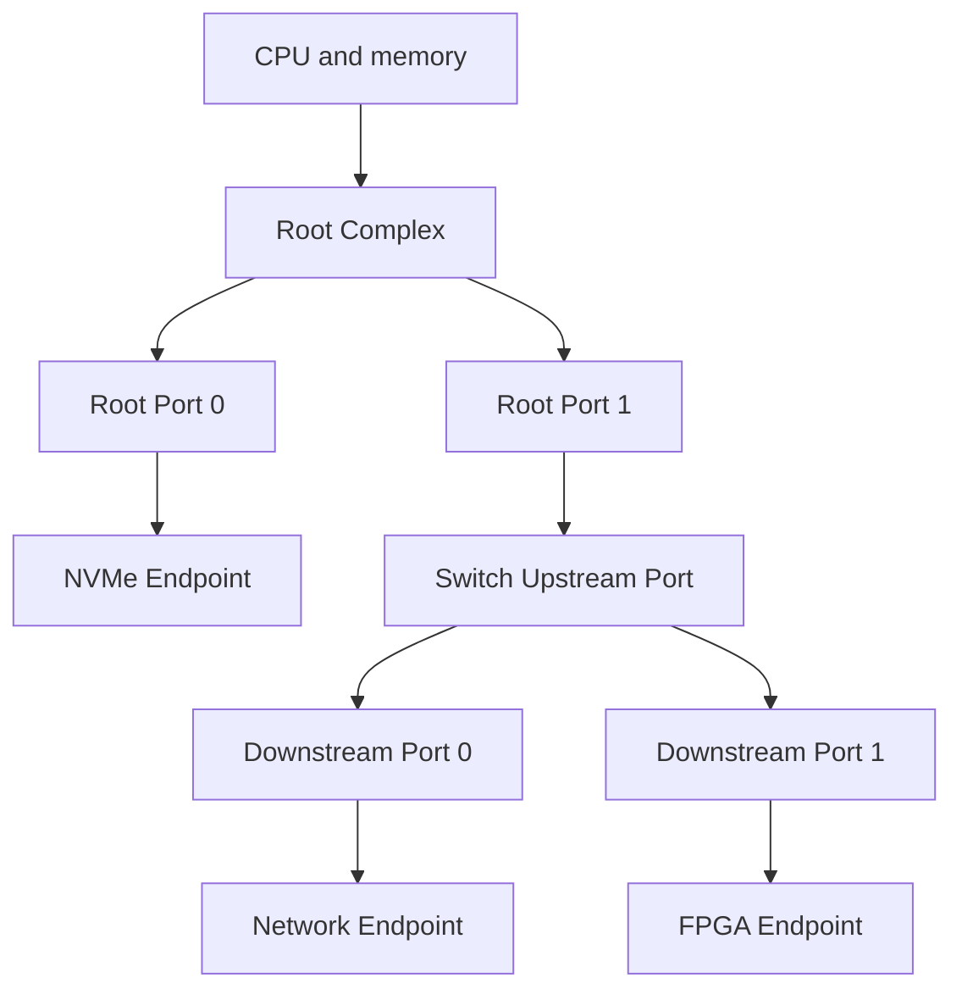
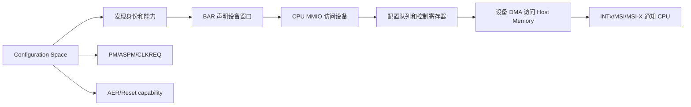
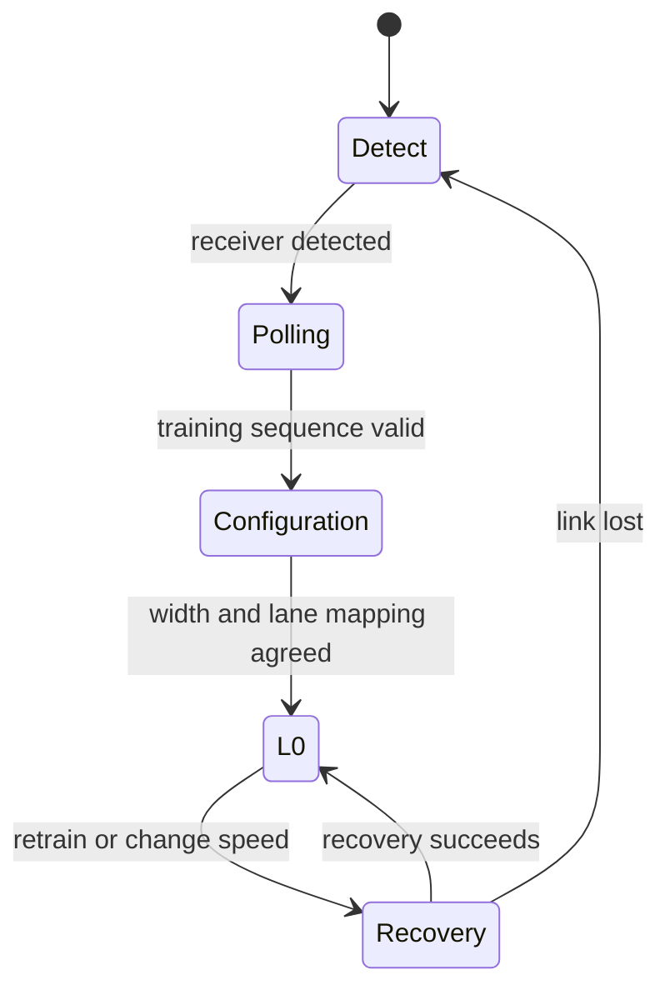
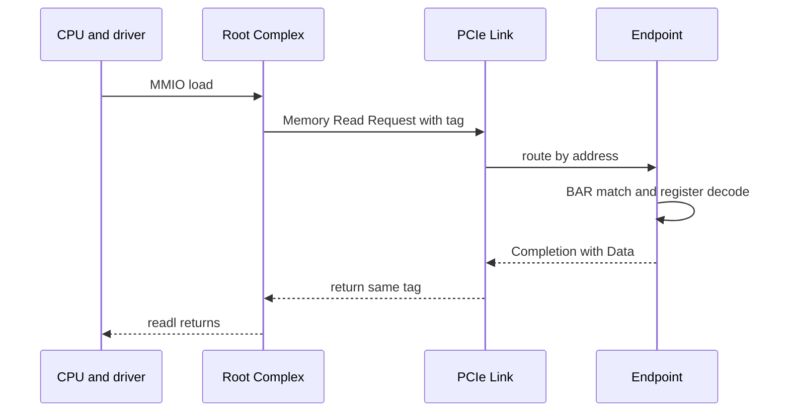

PCI Express（PCIe）是一种面向计算机与嵌入式系统的高速串行扩展总线标准，用来连接 CPU/内存系统与 NVMe SSD、网卡、GPU、FPGA、采集卡和 AI 加速器等高性能设备。它既规定了差分链路怎样传输数据，也规定了设备怎样被发现、怎样获得地址、怎样发起内存访问、怎样通知 CPU，以及怎样报告错误和进入低功耗。

从软件角度看，PCIe 延续了传统 PCI 的配置空间、设备标识和资源模型，因此操作系统仍然能够用统一方式枚举和管理设备；从硬件角度看，PCIe 把共享并行总线改造成高速、全双工、点对点的分组交换互连。理解这两个层面，是继续学习 BAR、DMA、MSI 和 Linux PCI Driver 的前提。

本文以 Linux 6.12 为软件基线，先给出 PCIe 的完整概念地图，不假设读者已经知道 BAR 或 `readl()`。后续文章会分别展开配置空间、资源、PCI Core、驱动、DMA 和中断。

## 一、为什么计算机需要 PCIe

CPU 不可能为每种高速外设设计一套专用引脚、寻址方式和软件接口。一个通用扩展互连至少要解决设备发现、地址分配、可靠传输、并发访问、中断、电源管理和错误报告，还要允许不同厂商设备连接到同一平台。

传统 PCI 使用共享并行地址/数据线，多块设备竞争同一总线。随着频率提高，走线偏差、引脚数量、负载和时钟同步越来越难控制。PCIe 保留 PCI 软件模型，却把电气层改成高速串行差分对，并让每段 Link 只连接两个 Port。

点对点并不表示系统只能连接一个设备。Root Port 与 Switch 可以把多条独立 Link 组成树形 Fabric，每条 Link 独立协商速度和宽度，多组设备可以并行传输。

## 二、PCI、PCIe、USB 与片上总线的边界

| 互连 | 典型位置 | 发现/管理方式 | 数据特点 |
| --- | --- | --- | --- |
| 传统 PCI | 主板扩展设备 | 配置空间、共享并行总线 | 多设备共享电气总线 |
| PCIe | 主板/SoC 高速扩展 | 配置空间、点对点分组交换 | 低延迟、内存读写语义、设备可 Bus Master |
| USB | 外部可插拔外设 | Host 主导枚举、Descriptor | Host 调度传输，设备不能任意访问系统内存 |
| AXI/APB 等片上总线 | SoC 内部 IP | 固件/设备树描述 | 芯片内部地址映射，不具备通用 PCI 配置模型 |

PCIe 与 USB 都能连接外设，但角色和数据模型不同。USB Host 为 Endpoint 调度传输，PCIe Endpoint 则可以成为 Bus Master，通过 DMA 主动读写 Host Memory。PCIe 因此性能高、延迟低，同时也需要更严格的地址隔离和驱动所有权。

PCIe 与 AXI 等片上总线也不能混为一谈。嵌入式 Root Complex 会在 CPU/AXI 地址与 PCIe 地址之间建立窗口，Endpoint Controller 也可能把 BAR 访问转换到片上 AXI/APB；两边通过地址转换连接，但协议对象并不相同。

## 三、Root Complex、Port、Switch 与 Endpoint

Root Complex（RC）连接 CPU/内存系统与 PCIe Fabric。它提供一个或多个 Root Port，发起配置访问，把 CPU 地址访问转换成 PCIe 事务，并把设备 DMA 请求送往内存系统。

Endpoint（EP）是树上的功能设备，例如 SSD、网卡或 FPGA。一个 Endpoint 可以包含一个或多个 Function，每个 Function 都有独立的配置空间、设备 ID、BAR、Capability 和驱动绑定关系。

Switch 的 Upstream Port 面向 Root Complex，Downstream Port 面向 Endpoint 或下一级 Switch。它根据地址或 Routing ID 转发 Packet，而不理解某个寄存器或 DMA Descriptor 的业务含义。



Port 是一段 Link 的协议端点，Link 是两个 Port 之间的物理和协议连接。Linux 后续使用 `domain:bus:device.function` 表示 Function 的拓扑位置，但 BDF 是枚举结果，不是设备永久身份。

## 四、Link 与 Lane 是什么

一条 PCIe Link 由一个或多个 Lane 组成。每个 Lane 有一对发送差分线和一对接收差分线，因此发送与接收可以同时进行，这就是全双工。

x1、x2、x4、x8、x16 表示 Link 使用的 Lane 数量。插槽机械长度不等于最终协商宽度，主板布线、Bifurcation、两端能力和信号质量都会影响实际结果。

| Generation | 每 Lane 速率 | 编码 | 单方向编码后近似上限 |
| --- | ---: | --- | ---: |
| Gen1 | 2.5 GT/s | 8b/10b | 2.0 Gbit/s |
| Gen2 | 5.0 GT/s | 8b/10b | 4.0 Gbit/s |
| Gen3 | 8.0 GT/s | 128b/130b | 7.877 Gbit/s |
| Gen4 | 16.0 GT/s | 128b/130b | 15.754 Gbit/s |
| Gen5 | 32.0 GT/s | 128b/130b | 31.508 Gbit/s |

GT/s 表示每秒传输次数，不等于业务 Payload 带宽。编码、Packet Header、LCRC、Flow Control、ACK、重放和空闲序列都会消耗链路资源，应用吞吐还受设备和软件数据路径限制。

## 五、PCIe 有哪三类地址空间

理解 PCIe 地址前，先区分三类软件可见空间：

1. **Configuration Space**：用于发现和配置 Function，包含 Vendor ID、Device ID、Class、BAR 和 Capability。即使普通 BAR 地址尚未分配，Host 仍可以访问它。
2. **Memory Space**：现代 PCIe 设备最常用的空间，CPU 通过 MMIO 访问 BAR，设备 DMA 也通过 Memory Request 访问 Host Memory。
3. **I/O Space**：为传统 PCI I/O Port 兼容保留，现代嵌入式和 64 位系统较少使用。

这三类空间回答不同问题。配置空间解决“设备是谁、需要什么资源”，Memory/I/O Space解决“驱动怎样访问设备”。第 02 篇会展开配置空间，第 03 篇会展开 BAR 与地址转换。

## 六、配置空间、BAR、DMA 与中断分别做什么

PCIe 系统可以用一张机制地图理解：



BAR（Base Address Register）让设备声明需要的窗口大小和属性，系统再分配地址。DMA（Direct Memory Access）让设备绕过 CPU 逐字节搬运，直接对 Host Memory 发起读写。INTx、MSI 和 MSI-X 用于把完成或错误通知 CPU。

ASPM、CLKREQ# 和 D-State 管理空闲功耗；AER 和 Reset 机制管理链路或设备异常。它们都属于 PCIe 全景的一部分，但不会在第 01 篇展开 API。

## 七、链路上传输的是 TLP

CPU 和驱动看到的是地址与读写，PCIe 链路上传输的则是 Packet。Transaction Layer Packet（TLP）用于表达 Memory Read/Write、Configuration Read/Write、Completion 和 Message 等事务。

| TLP 类别 | 是否需要 Completion | 典型用途 |
| --- | --- | --- |
| Memory Write | 通常不需要，属于 Posted | 写 BAR、设备 DMA 写 Host Memory |
| Memory Read | 需要 | 读 BAR、设备 DMA 读 Host Memory |
| Configuration Read/Write | 需要 | 枚举和配置 Function |
| Completion | 本身是响应 | 返回 Read/Config 结果 |
| Message | 由消息类型决定 | 中断、错误、电源事件 |

Memory Read 使用 Tag 关联返回的 Completion，可以存在多个在途请求。Memory Write 通常没有逐笔成功响应，因此驱动若要确认写入到达，需要设备协议定义的 Readback 或 Completion Queue，而不是等待一个不存在的“写完成包”。

## 八、三层协议各自解决什么问题


Transaction Layer 负责事务类型、地址、路由、Tag 和 Ordering。Data Link Layer 在相邻 Port 之间加入 Sequence、LCRC、ACK/NAK、Replay 和 Flow Control Credit。Physical Layer 负责电气检测、编码、Lane 对齐、均衡和训练。

Data Link ACK 只证明相邻 Port 收到并校验 Packet，不证明目标设备已经完成业务。业务完成仍要依赖 Completion、Descriptor 或设备状态。

## 九、LTSSM 怎样把链路带到 L0

Link Training and Status State Machine（LTSSM）管理链路训练。两端满足供电、REFCLK 和 PERST# 条件后，从 Detect 开始，经 Polling 和 Configuration 协商 Lane、宽度和速率，进入 L0 才能正常传输 TLP。



设备完全无法枚举时，应先检查电源、REFCLK、PERST#、PHY 和 LTSSM，而不是修改功能驱动。进入 L0 但 Speed/Width 低于设计值，则要检查能力、Lane、均衡和信号质量。

## 十、从 CPU 读取设备寄存器串起整条路径

只有建立上述概念后，才能解释一次寄存器访问。假设系统已经完成枚举和 BAR 映射，驱动读取状态寄存器：

```c
/* BAR 映射过程将在第 03 篇展开；这里仅观察一次访问怎样进入 PCIe。 */
u32 status = readl(bar0 + DEMO_STATUS);
```

CPU Virtual Address 先转换到 Host PCI Memory Window，Root Complex 生成 Memory Read Request TLP，Switch 按地址转发，Endpoint 的 BAR 匹配该地址并解码寄存器 Offset，随后 Completion with Data 原路返回 CPU。



这个例子不是学习起点，而是对 PCIe 全景的第一次串联：拓扑决定路径，Link/Lane 提供传输，TLP 表达事务，BAR 提供地址入口，Completion 返回读取结果。

## 十一、Linux 6.12 中怎样观察 PCIe

```bash
# 查看整棵 PCIe 拓扑，确认 Root Port、Switch 和 Endpoint 的父子关系。
lspci -tv

# 将 BDF 替换为目标 Function，比较最大能力 LnkCap 与实际状态 LnkSta。
lspci -s 0000:01:00.0 -vv
```

`lspci` 读取并解码配置空间，不是协议抓包。协议分析仪能观察 TLP/DLLP/Training，但不知道 Linux 中哪个请求对象对应某个 Tag；调试时需要用 BDF、时间和 Request ID 关联不同证据。

## 十二、小结

PCI Express 是连接 CPU/内存与高速外设的串行点对点扩展互连。它从传统 PCI 继承配置和资源模型，用 RC、Port、Switch 和 Endpoint 组成拓扑，用 Link/Lane 承载全双工传输，用 TLP 表达读写和配置事务。

配置空间负责发现，BAR 负责建立设备窗口，DMA 负责搬运数据，MSI/MSI-X 负责通知，ASPM 负责省电，AER 负责错误报告。后续文章将在这张地图上逐项展开，而不是重新假设读者已经理解这些术语。

**一手资料**

- [PCI-SIG Specifications](https://pcisig.com/specifications)
- [Linux 6.12 PCI driver API](https://www.kernel.org/doc/html/v6.12/driver-api/pci/pci.html)
- [Linux PCI Express Port Bus Guide](https://docs.kernel.org/PCI/pciebus-howto.html)

**主要教学参考**

- [野火 Linux PCI 子系统章节](https://doc.embedfire.com/linux/rk356x/driver/zh/latest/linux_driver/subsystem_pci_subsystem.html)
