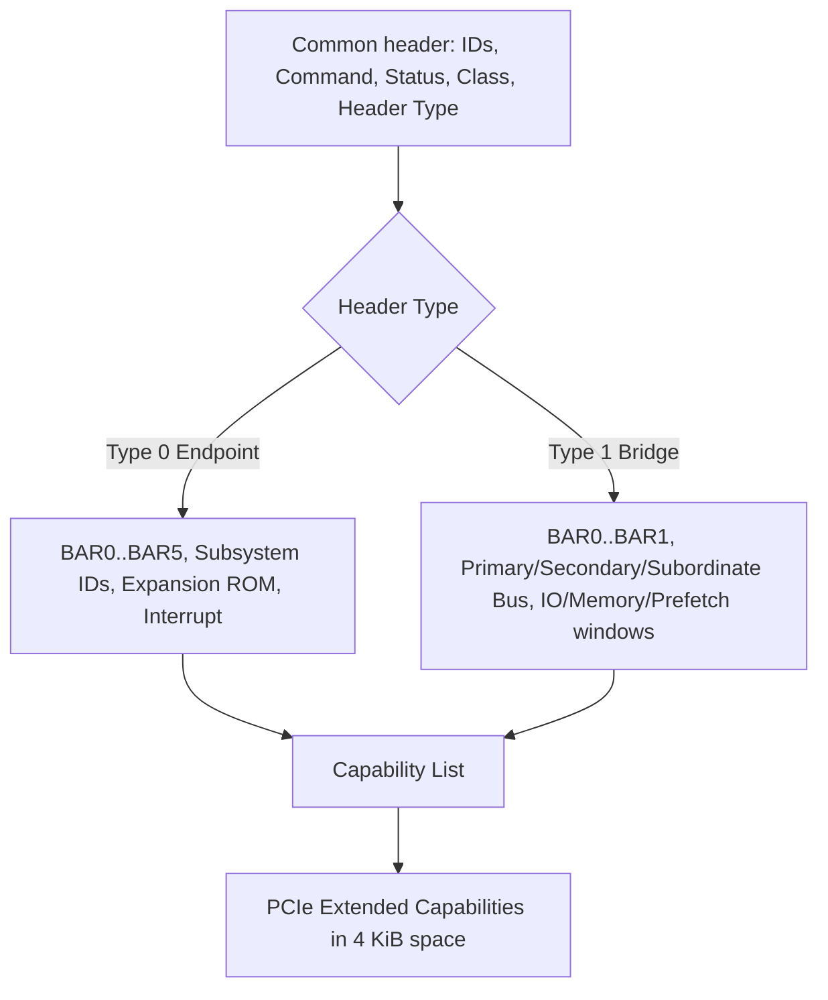
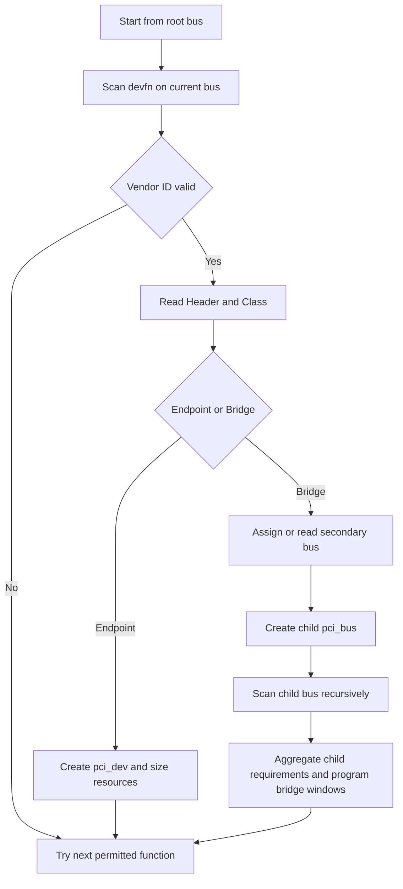
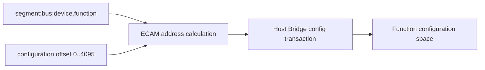
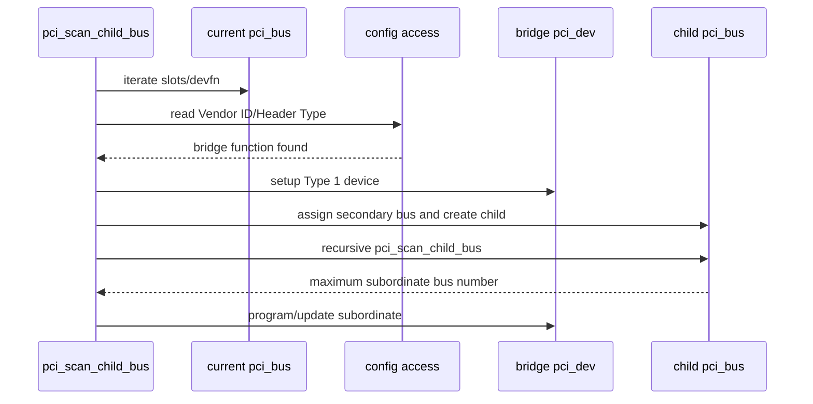
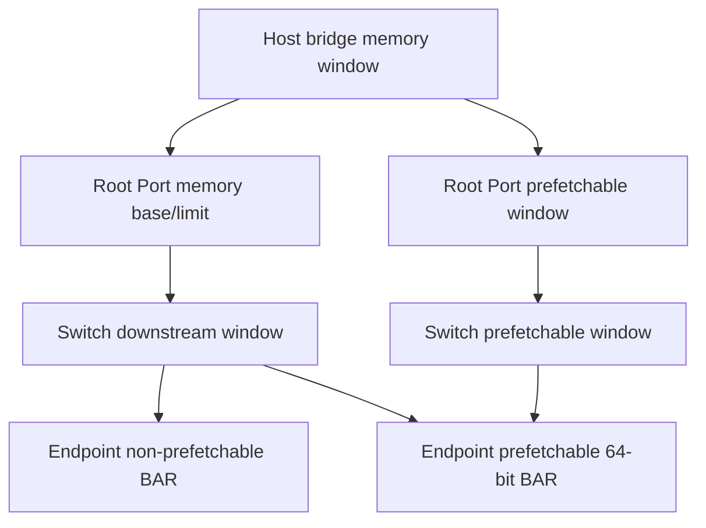

PCIe Endpoint 刚进入 L0 时，操作系统还不知道它的型号，也没有为 BAR 分配 CPU 可访问地址。若发现设备必须先访问 BAR，就会形成循环。PCI/PCIe 因此定义独立的 Configuration Space：即使普通 MMIO 尚未建立，Host 仍能按拓扑位置读取固定格式的配置寄存器。

本文的扫描函数、配置访问和对象创建固定以 Linux 6.12 为基线。

枚举就是从 root bus 出发，探测每个可能 Function，识别 Endpoint/Bridge，分配 bus number 与资源，解析 Capability 并创建 `pci_dev`。普通 Device Driver 的 `probe()` 发生在这条流程之后。

## 一、BDF 和 Configuration Space 是发现入口

每个 PCI Function 由 Bus:Device.Function 标识，简称 BDF。传统编码中 Bus 8 bit、Device 5 bit、Function 3 bit，一个 Device 可包含最多 8 个传统 Function；ARI 等扩展可改变 Function 组织，但 Linux 仍提供统一地址表示。

常见完整形式是 `domain:bus:device.function`，例如 `0000:01:00.0`。Domain/segment 区分多个独立 PCI Host hierarchy。BDF 是本次拓扑枚举结果，不是永久设备 ID。

Configuration Space 前 256 字节由传统 PCI 定义，PCIe 扩展到 4096 字节。Host 可以通过平台配置访问机制发 Configuration Read/Write。现代系统常用 ECAM：固件提供每个 segment 的配置空间 MMIO window，软件按 bus/device/function/register 计算地址；有些 SoC RC 则通过控制器 ATU 和寄存器间接发配置 TLP。

Linux 用 `pci_bus_read_config_*()`、`pci_bus_write_config_*()` 等接口屏蔽 ECAM/间接访问差异。示例读取 Vendor/Device ID：

```c
u16 vendor, device;

pci_bus_read_config_word(bus, devfn, PCI_VENDOR_ID, &vendor);
if (vendor == 0xffff)
    return -ENODEV;
pci_bus_read_config_word(bus, devfn, PCI_DEVICE_ID, &device);
```

不存在的 Function 常返回全 1。配置访问超时/Unsupported Request 在不同 Host 上可能被转换为全 1 或控制器错误，因此“0xffff”还要结合 RC 错误状态判断。

## 二、Type 0 与 Type 1 Header 描述不同拓扑对象

配置空间前 64 字节是标准 Header。所有 Function 都包含 Vendor ID、Device ID、Command、Status、Revision/Class Code、Header Type 等字段。Header Type 的低位区分布局：Type 0 用于 Endpoint，Type 1 用于 PCI-to-PCI Bridge/Port。



Type 0 的 6 个 BAR 描述 Function 需要的地址窗口；Subsystem Vendor/ID 可区分使用同一芯片的产品；Class Code 帮助通用驱动分类。

Type 1 的 Primary/Secondary/Subordinate Bus Number 定义桥两侧范围。Primary 是桥所在上游 bus，Secondary 是直接下游 bus，Subordinate 是桥后可达的最大 bus。Bridge 还拥有 I/O、Memory 和 Prefetchable Memory window，用于转发下游地址。

Header Type bit7 表示 multi-function。Function 0 存在且声明 multi-function 后，软件继续探测 Function 1..7。不能因为某个 Device number 的 Function 0 缺失就无条件探测其他传统 Function；ARI/SR-IOV 则由相应 Capability 管理。

## 三、Linux 如何递归扫描 Bridge

固件可能已经分配部分 bus/resource，Linux 也可能重新分配。稳定的递归思想是：扫描当前 bus 的 devfn；遇到 Endpoint 创建对象；遇到 Bridge 分配/读取 Secondary bus number，再扫描 child bus，最后确定 Subordinate 和资源窗口。



Linux PCI Core 的函数会随版本拆分，但源码阅读可从 `pci_scan_child_bus()`、`pci_scan_slot()`、`pci_scan_single_device()` 一带进入。配置读取通过 `pci_bus_read_config*` 调到 Host Bridge 提供的 `pci_ops`。

枚举先创建 `pci_dev` 并填 IDs/Class/Header，再读取 BAR/ROM 等 resource，扫描 Capability。Bridge child bus 与 device tree/ACPI Host Bridge resource 共同限制可分配地址范围。

Bus number 也是资源。多级 Switch 需要足够 bus range；固件给出的 `bus-range` 太小会导致深层 Endpoint 不出现。热插拔 Bridge 还应预留 bus number 和 address window，否则插入后即使 Link Up，也可能因资源不足无法配置。

## 四、BAR sizing 和 Bridge Window 在 probe 前完成

Endpoint BAR 复位后描述类型/大小需求，但 base address 由系统分配。软件暂时禁止相应 decode，保存原值，向 BAR 写全 1，再读回实现的 address mask，取反加一得到大小。64-bit BAR 占两个连续 dword。

例如 Memory BAR 读回 mask `0xfffff000`（忽略属性低位），表示 4 KiB 对齐/大小。对真实设备操作 `setpci` 写全 1 风险很高，应由 PCI Core 在枚举阶段完成；驱动直接改已启用 BAR 会破坏正在使用的地址路由。

Linux 把结果保存到 `pci_dev->resource[]`，并从 Host Bridge 提供的 I/O、non-prefetchable memory、prefetchable memory 范围分配地址。Bridge 下游需求先汇总，再设置 Type 1 window；父级每一层 window 都必须覆盖 Endpoint BAR。

资源问题常见于嵌入式 RC：Device Tree `ranges`/`dma-ranges`、控制器 outbound ATU window、CPU 地址空间和 PCI bus address 必须匹配。`lspci` 能看到 Endpoint 但 BAR 显示 unassigned，说明配置访问已通，资源分配/窗口仍失败。

`pci=realloc` 或固件选项可以帮助诊断资源布局，但不替代正确 Host Bridge window。SR-IOV VF BAR、Resizable BAR 和 64-bit prefetchable BAR 会显著增大需求，平台必须预留。

## 五、Capability 与 Command 把发现变成可用状态

传统 Capability List 由 Status 中的 Capabilities List bit 和 pointer 串联，常见 PM、MSI、MSI-X、PCI Express Capability。每条 Capability 由 ID/Next pointer 组成，驱动应使用 `pci_find_capability()` 等 helper，不手工假定 offset。

PCIe Extended Capability 从 0x100 开始，使用 16-bit ID、version 和 next offset。常见 AER、Device Serial Number、ACS、ATS、SR-IOV、Resizable BAR、PASID、L1 PM Substates。使用 `pci_find_ext_capability()` 遍历。

Command Register 控制 I/O Space Enable、Memory Space Enable 和 Bus Master Enable。枚举发现设备不等于它已经能响应 BAR 或发 DMA：

- `pci_enable_device()` 根据资源设置 decode。
- `pci_set_master()` 设置 Bus Master，允许设备发起 Memory Request。
- MSI/MSI-X 通过对应 Capability 配置 message 和 enable。

普通驱动不应直接覆盖整个 Command dword，否则可能清掉 PCI Core 管理的状态。Capability 寄存器也应通过 PCI API 和框架操作，避免与 PM/AER/MSI Core 竞争。

## 六、用 lspci/sysfs 证明枚举停在哪一步

```bash
lspci -tv
lspci -nn -s 0000:01:00.0
lspci -vv -s 0000:01:00.0
lspci -xxxx -s 0000:01:00.0
ls -l /sys/bus/pci/devices/0000:01:00.0
cat /sys/bus/pci/devices/0000:01:00.0/resource
```

完全没有 BDF：先查 RC/Link/LTSSM/config access/bus range。能看到 Bridge 看不到下游：检查 Secondary/Subordinate、child Link 和 window。能看到 Endpoint 但 BAR 未分配：检查 Host resource/ranges。BAR 正常但无 driver：检查 modalias、ID table 和 probe 错误。

sysfs `config` 是配置空间，`resource` 显示 CPU 资源区间和 flags，`enable`/`driver` 显示设备状态与绑定。直接读写 config/resource 可能改变硬件，生产调试应先使用只读工具。

Hotplug 增加并发：PCIe Port Service/Hotplug Driver 检测 presence/link，PCI Core 动态扫描、分配资源、绑定；拔出则先 remove driver，再删除 `pci_dev`。驱动必须把 surprise removal、AER reset 和普通 remove 纳入生命周期，不能假设 BDF 永久存在。

**参考资料**

- [PCI-SIG Specifications](https://pcisig.com/specifications)
- [How To Write Linux PCI Drivers](https://docs.kernel.org/PCI/pci.html)
- [Linux PCI Express Port Bus Driver Guide](https://docs.kernel.org/PCI/pciebus-howto.html)

## 七、ECAM 把 BDF 与 Offset 变成地址

Enhanced Configuration Access Mechanism 为每个 Segment/Bus/Device/Function 预留规则化窗口。

常见地址关系概念为：

```text
ECAM_BASE
  + (bus << 20)
  + (device << 15)
  + (function << 12)
  + register_offset
```

每个 Function 获得 4 KiB Configuration Space。

具体平台还要考虑 Segment、Bus Start 与 Firmware MCFG/Device Tree 范围。



并非所有平台都用标准 ECAM。

SoC Root Complex 可以通过 `pci_ops` 使用 ATU 或专用配置寄存器，PCI Core 上层接口保持一致。

## 八、Type 0 Header 与 Type 1 Header 的关键差异

Type 0 用于 Endpoint Function，包含最多六个 BAR、Subsystem ID、Expansion ROM、Interrupt Pin/Line。

Type 1 用于 PCI-to-PCI Bridge，包含两个 BAR、Primary/Secondary/Subordinate Bus Number 与三类 Bridge Window。

Header Type bit 7 表示 Multi-function。

扫描 Function 0 后，只有 Multi-function bit 置位才需要常规扫描 Function 1..7（仍需考虑 ARI 等扩展机制）。

Bridge 的 Bus Number 在早期固件未配置时可能为 0。

Linux 扫描会临时/正式分配 Secondary Number，再递归扫描，并更新 Subordinate 为下游最大 Bus Number。

## 九、pci_scan_child_bus 的递归边界

扫描当前 Bus 的每个 Slot/Function。

发现 Bridge 后：

1. 创建 Bridge `pci_dev`。
2. 分配/读取 Secondary Bus Number。
3. 创建 Child `pci_bus`。
4. 扫描 Child Bus。
5. 得到最大下游 Bus Number。
6. 更新 Bridge Subordinate。



Bus Number 是有限资源。

深层 Switch、Hotplug 预留和 SR-IOV 会增加需求。

Subordinate 范围太小会让后续 Hotplug Device 无法获得 Bus Number。

## 十、BAR sizing 必须在设备未被驱动使用时完成

标准 sizing 写全 1、读取 mask、恢复原值，再由最低有效位计算大小。

64-bit BAR 要组合两个连续 dword。

这会暂时改 Configuration Register，不能对正在运行的 Device 随意执行。

PCI Core 在枚举/资源分配阶段统一完成。

Firmware 预分配地址可能被保留，也可能因冲突/窗口不足被 Linux 重新分配。

Command Register 的 Memory Space Enable 未打开时，BAR 地址即使有值也不会接受普通 Memory Request。

## 十一、Bridge Window 必须包含所有下游 BAR

Root Port/Switch Port 的 I/O、Memory 与 Prefetchable Window 控制事务下传。



Non-prefetchable 与 Prefetchable Window 属性必须匹配。

64-bit Prefetchable BAR 可能位于 4 GiB 以上，而 32-bit Bridge Window/Host Window 无法覆盖。

资源分配失败日志需要结合每一级 Window 阅读。

## 十二、Capability 链是可扩展配置结构

标准 Capability Pointer 位于配置头，并形成 8-bit offset 链。

PM、MSI、MSI-X、PCIe Capability 位于前 256 字节。

Extended Capability 从 0x100 开始，使用 12-bit Next Pointer，包含 AER、ACS、ARI、SR-IOV、ATS、PRI、PASID 等。

遍历时要防止：

- Offset 未对齐。
- Offset 越界。
- Next 指向自身或形成环。
- Capability 长度不足。

Linux 6.12 的 `pci_find_capability()`、`pci_find_ext_capability()` 已实现通用遍历。

## 十三、从枚举到 Driver Probe 的发布链

`pci_dev` 身份、资源与 Capability 准备后，PCI Core 注册设备。

uevent 产生 modalias，模块系统加载匹配 `pci_driver`。

```text
configuration function discovered
  -> pci_setup_device
  -> resources/capabilities initialized
  -> device_add
  -> pci_bus_type match
  -> pci_driver probe wrapper
  -> driver probe
```

`lspci` 能看见 Device，但 Driver 未绑定，说明枚举已跨过配置访问与对象创建，下一步查 modalias、ID Table 和 probe error。

## 十四、Hotplug Rescan 与 Remove

Hotplug Controller 或用户 rescan 会再次扫描 Bus 的空 Slot/Function。

新增 Bridge 可能需要预留 Bus Number/Window。

Remove 先解绑 Driver、停止 DMA/IRQ，再从对象树删除 Function 和 Child Bus。

Surprise Removal 时 Configuration Space 可能已读全 1，清理路径不能依赖 Device 响应。

`echo 1 > rescan` 只能触发软件扫描，不会修复 PERST#、REFCLK、LTSSM 或 ATU。

## 十五、Linux 6.12 源码和一手资料

- `drivers/pci/probe.c`：`pci_scan_child_bus` 与设备创建。
- `drivers/pci/access.c`：`pci_bus_read_config*`。
- `drivers/pci/setup-bus.c`：资源窗口。

一手资料：

- [Linux 6.12 PCI driver API](https://www.kernel.org/doc/html/v6.12/driver-api/pci/pci.html)
- [Linux PCI resource allocation](https://docs.kernel.org/PCI/index.html)
- [Linux stable PCI probe source](https://git.kernel.org/pub/scm/linux/kernel/git/stable/linux.git/tree/drivers/pci/probe.c?h=linux-6.12.y)
- [PCI-SIG specifications](https://pcisig.com/specifications)

## 十六、小结

PCIe 用独立 Configuration Space 解决“尚未分配普通地址时如何发现设备”。BDF 定位 Function，Type 0/Type 1 Header 区分 Endpoint 与 Bridge，Linux 递归扫描 bus、计算 BAR、分配资源并设置 bridge window，再解析 Capability 和创建 `pci_dev`。

下一篇将把 BAR 从配置字段展开成完整地址路径：CPU 虚拟地址如何经过 Host window 和 ATU 到达 Endpoint 内部寄存器，以及驱动如何安全 request/iomap/access/release。
