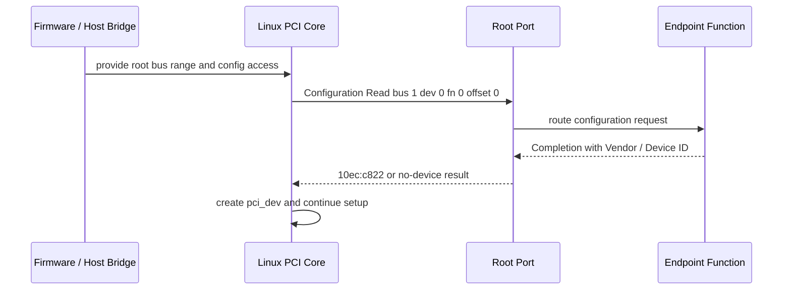
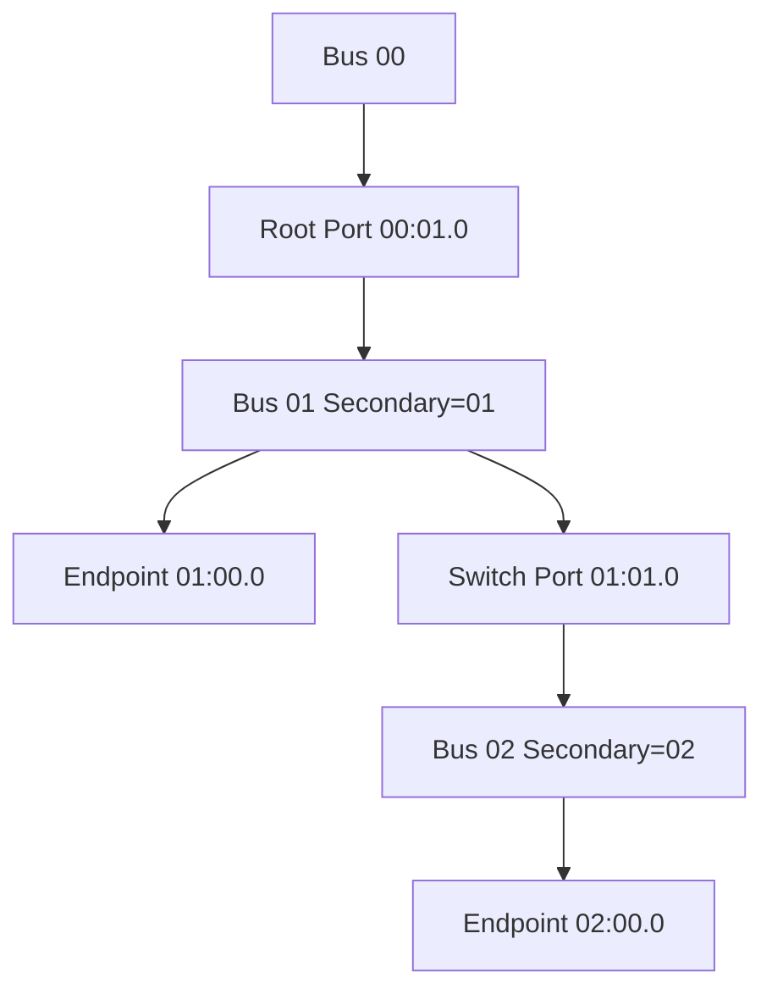
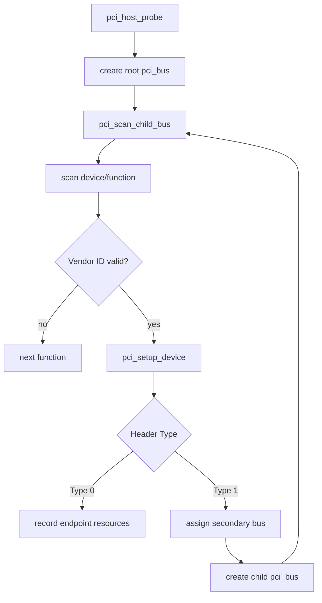

上一篇已经解释了一个 TLP 如何穿过 Root Port、Switch 和 Endpoint，但那里隐含了一个前提：Requester 已经知道目标地址。系统刚上电时既不知道插槽中是什么设备，也没有给设备 BAR 分配地址，那么第一笔访问从哪里开始？

PCIe 用独立的 Configuration Space 打破这个循环。Host 不需要先知道设备的业务寄存器，只要能按拓扑位置发 Configuration Read，就能读取统一格式的 Vendor ID、Device ID、Header Type 和 Capability，再逐步建立软件对象与地址资源。

本文以 `0000:01:00.0` 为代表性位置，沿 Linux 6.12 的扫描路径回答三个问题：BDF 如何定位 Function；Type 0/Type 1 Header 如何区分 Endpoint 与 Bridge；Linux 如何从 Root Bus 递归发现整个拓扑。

## 一、Configuration Space 解决未分配地址时的发现问题

配置访问与普通 Memory Request 使用不同的寻址入口。Memory Request 依赖已经分配的地址，而 Configuration Request 可以按 Bus、Device、Function 和 Register Offset 定位目标，因此枚举阶段即使 BAR 仍为零，也能读取固定格式的配置头。



不存在的 Function 通常返回全 1，因此 Vendor ID `0xffff` 常被解释为“这里没有设备”。但全 1 也可能来自链路掉线、配置窗口错误或控制器把访问异常转换成该值，所以调试时不能只凭一次读数断言插槽为空。

因为 Configuration Space 的前部格式由规范统一，PCI Core 可以在厂商驱动加载之前完成发现。厂商驱动只需要处理匹配后的 Function，不必重新扫描整条 PCIe 树，这就是总线核心与功能驱动之间的第一条职责边界。

## 二、BDF 是拓扑位置，不是设备永久身份

Linux 常用 `domain:bus:device.function` 表示一个 PCI Function，例如 `0000:01:00.0`：Domain `0000` 表示 PCI Segment，Bus `01` 表示它位于编号 1 的逻辑总线，Device `00` 和 Function `0` 表示该 Bus 上的目标位置。

传统 BDF 编码为 Bus 8 bit、Device 5 bit、Function 3 bit，因此一个传统 Device 最多包含 8 个 Function。ARI 可以扩展 Function 组织，但 Linux 仍向驱动提供统一的 `pci_dev` 和 BDF 表示，普通功能驱动通常不需要自己编码路由字段。

BDF 来自本次枚举结果，不等于序列号。改变 Root Port、增加 Switch、修改固件 Bus Number 预留或重新分配资源后，同一块卡可能得到不同 BDF。因此持久化配置若只记录 `01:00.0`，更换拓扑后就可能作用到另一设备；生产系统通常还要结合 VID/DID、Subsystem ID、序列号或物理槽位。

代表性观察格式如下，其中 `10ec:c822` 只用来展示标准字段，不声称来自当前工作区实机：

```text
01:00.0 Network controller [0280]: Realtek Semiconductor Co., Ltd. Device [10ec:c822]
        Subsystem: Device [1a3b:3040]
        Capabilities: [40] Power Management version 3
        Capabilities: [50] MSI: Enable+
        Capabilities: [70] Express Endpoint, MSI 00
```

这段输出能证明配置空间可读、Function 已被枚举，并展示 Capability Offset；它不能证明 Wi-Fi 固件已经加载，也不能证明 DMA、IRQ 或业务协议工作正常。

## 三、Type 0 Header 先给出 Endpoint 的最小身份

每个 Function 的 Configuration Space 最多 4096 字节。前 64 字节是标准 Header，Header Type 决定其布局；传统配置空间到 256 字节，PCIe Extended Capability 从 `0x100` 开始继续扩展。

Type 0 Header 用于普通 Endpoint Function。理解它时不必一次背完所有 offset，可以按枚举问题分组：

| 问题 | 关键字段 | PCI Core 得到的答案 |
| --- | --- | --- |
| 这里有设备吗 | Vendor ID、Device ID | Function 是否存在、由谁生产 |
| 它是什么类型 | Class Code、Revision | 网络、存储、显示或其他功能 |
| 它需要什么地址 | BAR0～BAR5、ROM BAR | 地址窗口类型与大小 |
| 是否允许普通事务 | Command、Status | Memory/IO Decode、Bus Master、状态 |
| 有哪些扩展能力 | Status Capability bit、Capability Pointer | PM、MSI、MSI-X、PCIe 等链表入口 |
| 板卡是谁实现的 | Subsystem Vendor/Device ID | OEM/板卡级匹配信息 |

Vendor/Device ID 说明 Function 身份，Class Code 描述功能类别，两者用途不同。驱动可以按精确 VID/DID 匹配，也可以在规范允许时按 Class 匹配；但 Class-only 驱动若范围太宽，可能抢占本应由专用驱动管理的设备。

Command Register 中的 Memory Space Enable 和 Bus Master Enable 不应被误解为“发现开关”。配置空间可以在它们关闭时读取，因为枚举必须先发现设备，再决定是否允许 BAR Decode 和 DMA。功能驱动的 `pci_enable_device()` 与 `pci_set_master()` 正是在更晚阶段改变这些状态。

## 四、Type 1 Header 让 Bridge 能创建下游 Bus

Root Port、Switch Port 和 PCI-to-PCI Bridge 使用 Type 1 Header。它自身是上游 Bus 上的一个 Function，因此也有 BDF 和 `pci_dev`；与此同时，它又为下游创建一个新的逻辑 Bus。

Type 1 Header 的 Primary、Secondary、Subordinate Bus Number 定义桥的路由范围。Primary 是桥所在上游 Bus，Secondary 是直接下游 Bus，Subordinate 是该桥后能够到达的最大 Bus Number。请求的目标 Bus 落在 `[Secondary, Subordinate]` 内时，桥才向下游转发。



因为扫描桥后拓扑之前还不知道最深 Bus Number，软件通常先给桥设置临时 Subordinate 上限，扫描下游后再回填真实最大值。如果 Subordinate 太小，后续 Bus 的配置请求会被桥拒绝；所以“Root Port 能看到、Switch 后设备看不到”时，Bus Number 窗口是必须检查的证据。

Bridge 还有 I/O、Memory 和 Prefetchable Memory Window。Bus Number 决定配置请求能否路由，Bridge Window 决定普通地址事务能否穿过；二者是不同问题。第 03 篇会继续解释为什么 Endpoint BAR 已分配但桥窗口错误时，配置空间仍可读而 MMIO 会失败。

## 五、ECAM 把 BDF 与配置寄存器变成地址

ECAM（Enhanced Configuration Access Mechanism）为每个 Segment 提供一段配置空间 MMIO Window。标准布局为每个 Function 保留 4 KiB，因此地址可按下面的关系计算：

```text
ECAM address = base
             + (bus << 20)
             + (device << 15)
             + (function << 12)
             + register_offset
```

例如只用于演算的 ECAM Base 为 `0xE000_0000`，访问 Bus 1、Device 0、Function 0、Offset `0x70`，地址为 `0xE010_0070`。这个数字是代表性示例，不是 RK356x 或某台 PC 的实测值；真实 Base 和 Bus Range 来自 ACPI MCFG、Device Tree 或控制器驱动。

并非所有 SoC 都让 CPU 直接按 ECAM 公式访问完整窗口。某些 Root Complex 使用 DesignWare iATU 或控制器寄存器，把当前 BDF/Type 0/Type 1 请求映射到有限 Configuration Window。因此 Linux 用 `struct pci_ops` 和 `pci_bus_read_config_*()` 屏蔽平台差异，通用扫描代码不应硬编码 ECAM Base。

这意味着配置访问失败可以分成两层：目标设备确实不存在，或者 Host 的配置访问机制没有正确生成/路由请求。调试嵌入式 RC 时，应先证明 Link 进入 L0、Bus Range 正确、Config ATU 覆盖目标 BDF，再讨论功能驱动。

## 六、Linux 6.12 怎样递归扫描整棵树

固件或 Host Controller Driver 先创建 `pci_host_bridge`，提供 Root Bus Number 范围、资源窗口和配置访问操作。PCI Core 创建 Root `pci_bus` 后，从可能的 Device/Function 位置读取 Vendor ID，存在的 Function 再进入 Header 解析和对象建立流程。



`pci_scan_child_bus()` 表示递归扫描入口，实际过程还会经过 Slot/Function 扫描、`pci_setup_device()`、Bridge 扫描和资源分配等辅助函数。重要的是理解状态顺序：先确认 Function 存在，再解析 Header；遇到 Bridge 才创建 Child Bus；下游扫描结束后才能确定 Subordinate 范围。

多功能设备通常先扫描 Function 0，并根据 Header Type 的 Multifunction bit 决定是否继续探测 Function 1～7。ARI、SR-IOV 和 Hotplug 会增加 Function/Bus Number 管理复杂度，但它们仍建立在“配置访问 -> 识别 -> 创建对象”这条主路径上。

扫描结束不等于驱动已经工作。此时 Linux 才拥有 `pci_dev`、资源描述和 Capability 信息，随后 `device_add()` 把对象发布到 Driver Model，`pci_bus_type` 才有机会匹配 `pci_driver` 并调用 `probe()`。

## 七、BAR sizing 与资源分配位于枚举中段

Endpoint 通过 BAR 低位声明窗口类型，通过“写全 1再读回 Mask”的标准方法暴露大小需求。枚举代码保存原值、临时写入全 1、读取设备实现的地址位、计算大小，再恢复或写入分配结果。

因为 sizing 会暂时改变 BAR 寄存器，所以它应该在设备尚未被功能驱动并发访问时完成。对已经运行的网卡使用 `setpci` 随意执行 sizing，可能让 BAR Decode 在短时间内指向错误地址，这不是安全的观察方法。

本篇只需要记住枚举输出：每个 `pci_dev->resource[]` 最终包含 BAR 的 CPU 资源范围和属性，并且每级 Bridge Window 必须覆盖下游 BAR。BAR 值、CPU 地址、PCI Bus Address 和 ATU 怎样联系，留到下一篇用具体数字推导。

## 八、Capability 链让配置空间可以继续扩展

标准 Capability 位于前 256 字节。Status Register 表示是否存在 Capability List，Capability Pointer 指向第一个节点；每个节点以 ID 和 Next Pointer 开头，因此软件可以在不知道所有设备私有布局的情况下发现 PM、MSI、MSI-X 和 PCIe Capability。

Extended Capability 从 `0x100` 开始，Header 中包含 16-bit ID、Version 和 12-bit Next Pointer，常见能力包括 AER、ACS、ARI、SR-IOV、ATS、PRI 和 PASID。因为链表内容由设备能力决定，所以驱动应使用 `pci_find_capability()` 和 `pci_find_ext_capability()`，而不是假设某项能力固定出现在某个 offset。

遍历时必须防止 Pointer 未对齐、越界、自环或坏链。Linux PCI Core 的 Helper 已经处理通用规则，功能驱动只应在找到能力后解析自己需要的字段。`lspci -vv` 也是读取并解码这些标准结构，不是读取厂商私有 BAR。

## 九、从命令输出判断枚举停在哪一层

以下命令分别回答不同问题：

```bash
# 先看拓扑，再把 BDF 替换为目标 Function，逐层读取身份、能力与绑定关系。
# 这些命令只读标准配置和 sysfs，不会访问设备私有 BAR。
lspci -tv
lspci -nn -s 0000:01:00.0
lspci -vv -s 0000:01:00.0
cat /sys/bus/pci/devices/0000:01:00.0/vendor
cat /sys/bus/pci/devices/0000:01:00.0/modalias
readlink /sys/bus/pci/devices/0000:01:00.0/driver
```

若 `lspci` 完全没有目标 Function，应回到电源、PERST#、REFCLK、LTSSM、Config Window 和 Bus Number。若 `lspci` 能看到设备但没有 Driver Link，说明枚举和对象创建已经完成，下一步检查 modalias、模块、ID Table 和 `probe()` 返回值。

若配置空间可读、BAR 也有值，但驱动 MMIO 读取全 1，说明问题很可能已经越过配置枚举，进入 Command Memory Enable、Bridge Window、Host `ranges`、ATU 或 Endpoint 内部地址解码。这样的分层判断比反复 rescan 更有信息量，因为 rescan 只重新执行软件扫描，不会修复电气或地址窗口。

## 十、枚举阶段的常见误解

现在应当能够解释 `0000:01:00.0` 的每一段来源，并说明它为什么不是永久设备身份。还应能从 Type 0/Type 1 Header 判断对象是 Endpoint 还是 Bridge，并描述 Primary、Secondary、Subordinate Bus Number 如何支持递归路由。

面对“设备看不到”的故障，应先区分 Link、Host Config Access、BDF Routing 和 Function Response；面对“设备可见但驱动不工作”，则把调查入口移动到 Driver Match 和 `probe()`。因为证据层次不同，所以不能用增加 `pci_device_id` 来修复一个尚未枚举出的设备。

## 十一、小结

PCIe 用 Configuration Space 解决了普通地址尚未分配时的设备发现问题。BDF 提供本次拓扑位置，Type 0 Header 描述 Endpoint，Type 1 Header 和 Bus Number 描述 Bridge 路由，ECAM 或控制器配置窗口把 BDF 转换成 Configuration Request。

Linux 6.12 从 Root Bus 递归执行 `pci_scan_child_bus()`，识别 Function、创建 Child Bus、读取 BAR 需求、解析 Capability，并最终发布 `pci_dev`。下一篇将接住这个结果，解释 BAR 地址如何经过 Linux Resource、Bridge Window 和 ATU，最终落到 Endpoint 内部寄存器。

**一手资料**

- [Linux 6.12 PCI driver API](https://www.kernel.org/doc/html/v6.12/driver-api/pci/pci.html)
- [Linux 6.12 PCI probe source](https://git.kernel.org/pub/scm/linux/kernel/git/stable/linux.git/tree/drivers/pci/probe.c?h=linux-6.12.y)
- [PCI-SIG Specifications](https://pcisig.com/specifications)
