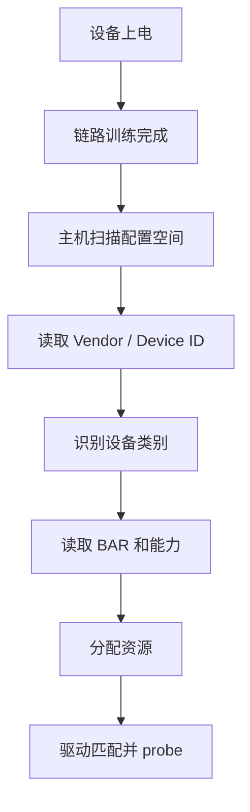

上一讲我们把 PCIe 的整体架构搭起来了。这一讲进入 PCIe 驱动学习里非常关键的一步：**枚举与配置空间**。

如果说 USB 的“身份证”是描述符，那么 PCIe 的“身份证”和“资源说明书”主要就藏在**配置空间**里。系统通过配置空间来识别设备、读取能力、分配资源、启用功能，最终决定这个设备能不能正常工作。

## 一、什么是 PCIe 枚举

PCIe 枚举是主机发现并识别 PCIe 设备的过程。设备上电后，Root Complex 会在链路训练完成后扫描设备，读取它的配置空间，判断它是什么设备、支持哪些能力、需要哪些资源，然后完成后续初始化。

这个过程和 USB 枚举很像，但信息来源不同：

- USB 主要依靠描述符
- PCIe 主要依靠配置空间

## 二、为什么 PCIe 要有配置空间

PCIe 设备不像普通串口设备那样只有固定几个寄存器。它需要向系统报告很多重要信息：

- 设备厂商和型号
- 设备类型
- 状态和命令控制位
- BAR 资源需求
- 中断能力
- 电源管理能力
- 高级能力链表

这些信息统一放在配置空间中，驱动和系统可以标准化读取。

## 三、配置空间的基本结构

PCIe 配置空间通常分为两部分：

- **标准配置头**：固定字段
- **能力区**：可扩展能力链表

### 标准配置头包含什么

常见字段有：

- Vendor ID
- Device ID
- Command
- Status
- Class Code
- Revision ID
- BAR0~BAR5
- Subsystem Vendor ID / Device ID
- Interrupt Line / Pin

这些字段决定了设备身份和基础资源。

## 四、Vendor ID / Device ID 的意义

这是 PCIe 设备最基础的身份标识，类似 USB 的 VID/PID。

Linux PCI 驱动通常就是通过这些 ID 来决定是否匹配某个设备。

## 五、Class Code 为什么也很重要

除了厂商和产品 ID，PCIe 还会声明类代码，例如：

- 存储控制器
- 网络控制器
- 显卡
- 通信控制器
- 加速器

这使得系统可以基于类别做更通用的处理。

## 六、BAR 是什么

BAR（Base Address Register）是 PCIe 设备向系统申请的地址窗口。通过 BAR，系统可以把设备内部寄存器或缓冲区映射到 CPU 可访问的地址空间。

这是 PCIe 驱动里非常核心的一步，因为后面访问寄存器、读写控制位，基本都要靠 BAR 映射出来的 MMIO 地址。

## 七、配置空间的读取流程

PCIe 设备上电后，主机会：

1. 发现链路
2. 读取 Vendor ID / Device ID
3. 判断设备是否有效
4. 读取 BAR 需求
5. 判断设备能力
6. 分配资源
7. 让设备进入可用状态

## 八、配置空间和驱动匹配

Linux PCI 驱动通常会使用 `struct pci_device_id` 来匹配设备：

```c
static const struct pci_device_id xxx_tbl[] = {
    { PCI_DEVICE(0x1234, 0x5678) },
    { }
};
MODULE_DEVICE_TABLE(pci, xxx_tbl);
```

这和 USB 的 `id_table` 非常像，都是“设备识别表”。

## 九、一个 PCIe 枚举的理解流程



这条主线是后续 PCIe 所有驱动内容的起点。

## 十、配置空间里最值得关注的字段

### 1. Vendor ID / Device ID

设备身份标识。

### 2. Command 寄存器

控制设备是否启用内存访问、I/O 访问、中断响应等能力。

### 3. BAR

映射设备资源地址的核心字段。

### 4. Capabilities Pointer

指向能力链表的入口。

### 5. MSI / MSI-X 能力

决定设备是否支持消息中断。

### 6. Power Management

决定设备能否低功耗运行。

## 十一、为什么很多 PCIe 问题先看 lspci

因为 `lspci` 能快速告诉你：

- 设备有没有被系统发现
- Vendor / Device ID 是什么
- BAR 是否分配成功
- 设备属于什么类别
- 是否支持 MSI/MSI-X

常用命令：

```bash
lspci
lspci -vv
lspci -nn
```

其中 `-vv` 可以看到更多资源和能力信息。

## 十二、配置空间读不出来通常意味着什么

如果设备在 `lspci` 里都看不到，通常问题在更早阶段：

- 供电没起
- 复位没释放
- 时钟没起来
- 链路训练失败
- 板级走线或信号有问题

所以 PCIe 驱动问题往往不是单纯“代码问题”，而是软硬件协同问题。

## 十三、小结

这一讲你应该掌握了：

- PCIe 枚举是如何进行的
- 配置空间为什么重要
- Vendor / Device ID 如何用于驱动匹配
- BAR、Command、Capabilities 各自的作用
- 为什么 `lspci` 是 PCIe 调试的第一工具

下一讲我们会继续深入 BAR 和 MMIO，看看设备寄存器是怎么映射到 CPU 地址空间里的。

> 🏷️ PCIe / 枚举 / 配置空间 / BAR / Linux驱动 / lspci

---

## 初学者扩展讲解


## PCIe 学习中的关键主线

PCIe 的核心主线可以概括为：链路训练、配置空间、资源分配、BAR 映射、中断通知、DMA 搬运。初学者不要一开始就陷入 TLP、DLLP 等协议细节，先把 Linux 驱动真正会接触到的对象搞清楚。

设备上电后，Root Complex 会尝试和 Endpoint 建立链路，这个过程叫链路训练。链路训练成功以后，系统才能扫描配置空间。配置空间里有 Vendor ID、Device ID、Class Code、BAR、Capability 等信息。系统根据这些信息识别设备、分配 MMIO 地址空间、配置中断能力，然后内核 PCI 子系统根据匹配表调用具体驱动的 `probe()`。

如果 `lspci` 看不到设备，通常说明问题还在驱动 probe 之前。此时要优先检查供电、PERST#、REFCLK、lane 连接、Root Complex 配置和设备树。很多初学者会在驱动代码里找半天，但设备根本没有枚举，驱动没有任何机会执行。

## BAR 和 MMIO 要这样理解

PCIe 设备内部有寄存器，但 CPU 不能直接凭空访问这些寄存器。BAR 可以理解为设备向系统声明的一扇窗口：设备说“我需要一段地址空间”，系统分配一个 CPU 可访问的物理地址范围，驱动再把这段范围映射成内核虚拟地址。之后驱动通过 `readl()`、`writel()` 读写这段地址，就相当于访问设备寄存器。

典型流程是：

```c
pci_enable_device(pdev);
pci_request_regions(pdev, "demo");
bar = pci_iomap(pdev, 0, 0);
value = readl(bar + REG_STATUS);
writel(0x1, bar + REG_CTRL);
```

这里每一步都有意义。`pci_enable_device()` 使能设备；`pci_request_regions()` 申请 BAR 资源，避免多个驱动冲突；`pci_iomap()` 建立映射；`readl/writel` 才是真正访问寄存器。不要用普通指针直接访问 MMIO，也不要用 `memcpy` 随便操作寄存器区域。

## DMA、IOMMU 和 cache 一致性

PCIe 高速设备通常不会依赖 CPU 一字节一字节搬数据，而是使用 DMA。DMA 的意思是设备直接读写内存，CPU 只负责准备 buffer、告诉设备地址和长度、等待完成通知。

这里有三个地址概念必须区分：CPU 虚拟地址、CPU 物理地址、设备看到的 DMA 地址。驱动不能把普通虚拟地址直接写给设备，而要通过 DMA API 获取设备可访问地址：

```c
void *cpu_addr;
dma_addr_t dma_addr;

cpu_addr = dma_alloc_coherent(&pdev->dev, size, &dma_addr, GFP_KERNEL);
```

`cpu_addr` 给 CPU 访问，`dma_addr` 给设备访问。如果平台启用了 IOMMU，`dma_addr` 可能是 IOVA，不等于真实物理地址。使用 DMA API 的好处是内核会帮你处理映射、权限和 cache 一致性问题。工程中很多“DMA 写了但 CPU 看不到”“偶发数据错误”“IOMMU fault”，本质都是地址、cache 或生命周期管理出错。

## PCIe 排错的顺序

PCIe 排错建议按下面顺序：

```bash
lspci
lspci -vv
lspci -xxx
cat /proc/interrupts
dmesg -w
```

`lspci` 看设备是否枚举；`lspci -vv` 看 BAR、链路速率、链路宽度、MSI/MSI-X 和驱动绑定；`lspci -xxx` 看配置空间原始内容；`/proc/interrupts` 看中断是否触发；`dmesg` 看驱动日志、AER 错误、IOMMU fault 和 DMA 报错。性能问题还要进一步看 `perf`、ftrace、队列深度、buffer 大小和 CPU 亲和性。

## PCIe 驱动代码阅读建议

阅读 PCIe 驱动时，先看 `pci_device_id` 匹配表，再看 `pci_driver` 结构体。进入 `probe()` 后，重点看是否调用 `pci_enable_device()`、`pci_request_regions()`、`pci_set_master()`、`dma_set_mask_and_coherent()`、`pci_iomap()` 和中断申请函数。随后再看驱动如何创建 DMA 描述符队列、如何启动硬件、如何在中断处理里回收完成项。

一个成熟的 PCIe 驱动不只是能收发数据，还要处理热插拔、错误恢复、DMA 超时、中断丢失、设备复位、IOMMU fault 和长时间压力测试。初学时可以先跑通最小路径，但最终必须理解这些异常路径。


## 面向初学者的阅读方法

刚开始学习这类驱动文章时，最容易犯的错误，是把每一个名词都当成孤立知识点去背。实际工程里，驱动不是由名词堆起来的，而是一条从硬件连接、总线枚举、内核匹配、资源申请、数据传输到用户态验证的完整链路。读这一篇时，建议先抓住三件事：第一，这个机制解决什么问题；第二，Linux 内核用什么对象表达它；第三，出现故障时应该从哪一层开始查。

例如看到“枚举”，不要只记住它叫 enumeration，而要理解为：系统需要先发现设备、识别设备能力、给设备分配地址或资源，然后才可能让具体驱动接管。看到“驱动匹配”，也不要只背 `probe()`，而要继续追问：是谁触发 `probe()`？匹配表里放了什么？设备还没有出现时驱动会不会执行？驱动执行以后第一步应该申请什么资源？这些问题连起来，才是真正能在板子上排错的知识。

## 从硬件到软件的完整路径

一条外设链路通常可以分成五层。第一层是硬件层，包括供电、时钟、复位、信号线、连接器和外设本身。第二层是总线层，也就是 USB、PCIe、I2C、SPI 这类协议如何发现设备、传输数据。第三层是内核框架层，Linux 会把设备抽象成 `struct device`、总线对象、驱动对象和资源对象。第四层是具体驱动层，驱动负责把通用框架和具体芯片寄存器、端点、队列、描述符连接起来。第五层是用户态验证层，包括命令行工具、测试程序、日志和性能统计。

初学者排错时不要一上来就怀疑驱动代码。设备没有被系统看到时，驱动代码通常还没有执行；驱动没有绑定时，可能是匹配表或描述符问题；驱动绑定了但不能传输时，才更可能进入 buffer、DMA、中断、同步和协议细节。按照这个顺序排查，可以避免在错误层面浪费时间。

## 建议准备的实验环境

学习 USB/PCIe 驱动，最好准备一台 Linux 主机、一块支持外设扩展的开发板，以及至少一个真实设备。USB 方向可以从 U 盘、USB 串口、USB 摄像头、USB 网卡开始；PCIe 方向可以从 NVMe、PCIe 网卡、PCIe 转串口卡、FPGA PCIe Endpoint 或开发板自带 PCIe 插槽开始。没有 PCIe 硬件时，也可以先通过 `lspci` 观察 PC 上已有设备，理解配置空间、BAR 和驱动绑定。

每次实验都建议记录四类信息：硬件连接照片或说明、内核版本和设备树/配置、关键命令输出、问题现象和解决过程。驱动学习的进步往往不是来自“看懂一段代码”，而是来自反复把现象、日志、源码和硬件状态对应起来。

## 常用观察命令

无论是 USB 还是 PCIe，都建议养成先看系统状态的习惯：

```bash
uname -a
dmesg -w
lsmod
cat /proc/interrupts
cat /proc/iomem
```

`uname -a` 用来确认内核版本；`dmesg -w` 用来实时观察设备插拔、枚举和驱动 probe 日志；`lsmod` 用来看模块是否加载；`/proc/interrupts` 用来看中断是否触发；`/proc/iomem` 可以帮助理解 MMIO 资源分配。不要小看这些基础命令，很多现场问题并不是复杂 bug，而是设备没枚举、驱动没加载、资源没分配或中断没到。

## 初学者最容易混淆的点

第一，不要把“用户态能看到设备节点”等同于“驱动完全正常”。设备节点只说明某个驱动创建了接口，真正的数据通路还要看读写、ioctl、mmap、poll、DMA 和中断是否正常。

第二，不要把“驱动 probe 成功”等同于“硬件已经工作”。probe 成功通常只代表资源申请和初始化基本完成，后续传输仍可能因为时钟、复位、buffer、协议状态或固件问题失败。

第三，不要把“命令没有报错”等同于“性能达标”。高速设备还要统计吞吐、延迟、CPU 占用、内存拷贝次数、DMA 是否真正生效，以及异常恢复是否可靠。

## 推荐的验证闭环

一篇驱动文章学完以后，不建议只停留在阅读层面。至少做一个小闭环：先用命令确认设备存在，再找到它绑定的驱动，然后观察内核日志，再做一次最小读写或传输测试，最后故意制造一个小错误，例如拔掉设备、改错匹配 ID、禁用模块或调整 buffer 数量，观察系统如何报错。只有经历过“正常路径”和“异常路径”，才能真正理解驱动框架为什么这样设计。
