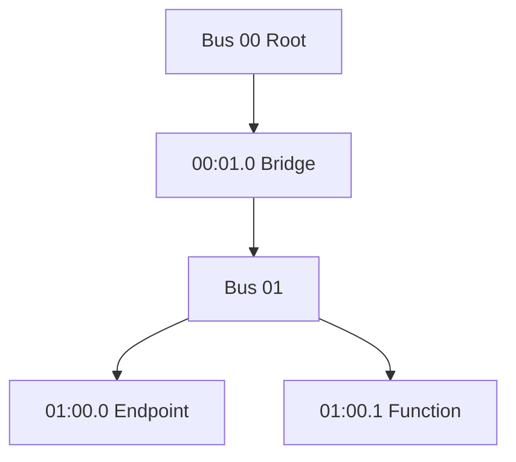

PCIe Link 进入 L0 后，系统仍不知道对端是什么设备、需要多少地址资源、支持何种中断。枚举通过 Configuration Space 回答这些问题，并递归穿过 bridge 为整个拓扑分配 bus number 与 BAR resource。

本篇从 BDF 和配置头开始，沿 Linux PCI core 的扫描路径解释设备发现、bridge recursion、Capability 和资源分配。

## 一、BDF 是一次枚举中的拓扑地址

BDF 由 Bus、Device、Function 组成，常写作 `0000:01:00.0`，前缀 0000 是 domain/segment。一个 device slot 最多有多个 function；multifunction bit 告诉扫描器是否继续 function 1-7。

配置读取首先访问 Vendor ID。返回 `0xffff` 通常表示该 devfn 不存在。发现 function 后读取 Device ID、Command/Status、Revision、Class Code、Header Type 等，创建 `struct pci_dev`。

BDF 由桥后的 bus number 和 devfn 决定，系统重配或热插拔后可能变化。驱动应匹配 VID/DID/class 并绑定 `pci_dev`，用户态若需稳定身份应结合 serial、slot、设备树/ACPI 路径等信息。

## 二、Type 0 与 Type 1 Header 分别描述 Endpoint 和 Bridge

Type 0 header 用于普通 Endpoint，包含 6 个 BAR、Subsystem ID、Expansion ROM、interrupt pin 等。Type 1 header 用于 PCI-to-PCI Bridge，BAR 数更少，并包含 Primary/Secondary/Subordinate bus number 和 I/O/Memory/Prefetchable window。

Bridge 的 Secondary bus 是其下游起点，Subordinate 表示该桥下可达的最大 bus。枚举早期可能临时写 bus number，递归扫描下游后再收紧范围。

配置空间前 256 字节是传统区域，PCIe Extended Configuration Space 扩展到 4 KiB。具体平台通过 ECAM 或 Host controller config window 实现访问，普通设备驱动应使用 `pci_read_config_*()`，不直接假设 ECAM 虚拟地址。

### Host bridge 如何实现配置空间访问

Linux `pci_bus_read_config_*()` 最终通过 bus ops访问 ECAM或控制器 config window。ECAM通常按 segment/bus/device/function/offset编码地址，部分 SoC则需先编程 outbound ATU再读寄存器。

`pci_bus_read_config_word(bus, devfn, PCI_VENDOR_ID, &vendor)` 返回访问错误与读值；vendor `0xffff` 才表示 function不存在。配置访问 abort、超时或 byte-enable错误会让扫描漏设备，不能简单归为 Endpoint未上电。

扫描从 root bridge建立 `pci_host_bridge` 和 root bus，遍历 devfn创建 `pci_dev`，读取 Header Type决定 multifunction/bridge，再由 `pci_scan_child_bus()` 递归。Host controller 的 bus-range不足会限制可分配 bus number。

## 三、Linux 递归扫描 bridge

简化流程是：

```text
scan root bus
  for each devfn
    read Vendor ID
    create pci_dev
    size endpoint or bridge resources
    if bridge
      assign secondary bus
      pci_scan_child_bus(child)
      update subordinate bus
```

Linux 中 `pci_scan_child_bus()` 遍历当前 bus 并递归处理 bridge。固件可能已完成资源分配，内核也可能因配置选项、资源冲突或热插拔重新分配。



Bridge window 必须覆盖下游 BAR。Endpoint BAR 自身有地址但上游 bridge window 未开放时，配置空间仍可读，MMIO 访问却无法路由。

## 四、BAR sizing 与资源分配发生在驱动 probe 之前

系统通过保存 BAR 原值、写全 1、读回 size mask、恢复原值推导需求。64 位 BAR 组合两个 dword，I/O、non-prefetchable memory、prefetchable memory进入不同资源树。

PCI core 为 BAR 分配地址并写回配置空间，同时设置 bridge window。驱动中的 `pci_resource_start/len/flags()` 读取已经分配的结果；正常 driver 不应在 probe 中再次用写全 1 破坏运行设备。

资源不足时，内核日志会显示 BAR assignment failure。常见原因是固件 window 太小、32 位地址空间不足、大 BAR/Resizable BAR、bridge aperture 配置或多个设备竞争。

### Bridge window 是下游资源能否路由的第二道门

Type 1 Header的 I/O、Memory、Prefetchable Base/Limit必须覆盖下游 BAR。Endpoint BAR已分配但上游任一 bridge window遗漏时，配置空间仍可读，Memory TLP却被 UR/abort。

64 位 prefetchable window由高低寄存器组合；固件给出的 aperture太小会让大 BAR/Resizable BAR分配失败。Linux resource allocator可能重分配，但 Host bridge outbound window仍要覆盖最终 CPU resource。

Hotplug bridge还要预留 bus number、MMIO和 vector资源，否则空槽启动时正常，插入设备后才出现 `no space for [mem size]`。这也是 hotplug与静态启动枚举的资源规划差异。

## 五、Capability 链扩展中断、电源和 PCIe 能力

Status 的 Capabilities List bit 表示传统 Capability 链存在，指针从配置头开始，每项包含 Capability ID 和 next pointer。常见项包括 Power Management、MSI、MSI-X、PCI Express、Vendor Specific。

PCIe Extended Capability 从 0x100 开始，头部含 ID、Version 和 next offset。AER、Device Serial Number、SR-IOV、Resizable BAR、ATS/PASID 等位于这里。

Capability 是变长链，offset 可能不同。驱动使用 `pci_find_capability()`、`pci_find_ext_capability()` 和专用 API，而不是把某个设备观察到的固定 offset 写死。`lspci -vv` 已能解码大量 capability，`lspci -xxx/-xxxx` 则提供原始配置字节。

### Capability 解析必须沿链而不是记 offset

传统 Capability从 Status指示和 pointer开始，每项 ID/next；PCI Express Capability内含 Device/Link/Slot/Root Capability与 Control/Status。Extended Capability从 0x100开始，header的 next以 dword offset链接 AER、DSN、SR-IOV、Resizable BAR、ATS/PASID等。

驱动使用 `pci_find_capability()`、`pci_find_ext_capability()` 和专用 helper。链指针环、越界或重复属于设备/固件错误；直接按某次 `lspci` offset读写会在不同硬件 revision失效。

SR-IOV启用后 PF创建多个 VF function，各自有 BDF/配置和资源，但 PF仍管理共享硬件。枚举数量、VF BAR和IOMMU group需要一起规划。

## 六、Command 寄存器决定设备能否响应和发起事务

Command 中的 Memory Space Enable 控制 BAR memory response，I/O Space Enable 控制 I/O BAR，Bus Master Enable 允许设备发 DMA 请求。枚举分配资源不代表这些 bit 都已打开。

Linux 驱动调用 `pci_enable_device()` 使能合适 decode，`pci_set_master()` 打开 bus mastering。未完成 DMA mask/queue 初始化就过早启用设备产生 DMA，会让 Endpoint 使用无效地址；正确顺序由驱动 lifecycle 负责。

## 七、用 lspci 与 sysfs 核对枚举结果

```bash
lspci -Dnn
lspci -tv
lspci -s 0000:01:00.0 -vvxxxx
cat /sys/bus/pci/devices/0000:01:00.0/resource
```

先看 BDF/topology，再看 header、BAR、Capability 和 driver。配置空间能读、BAR 资源也存在但驱动未绑定，检查 modalias/id table；设备完全不存在则回到 LTSSM/Host bridge；bridge 下设备缺失还要检查 secondary/subordinate 和 window。

## 八、小结

PCIe 枚举用 BDF 定位 function，用 Type 0/1 Header区分 Endpoint/Bridge，通过 `pci_scan_child_bus` 递归拓扑并为 BAR/bridge window 分配资源。Capability 链扩展 MSI、PCIe、AER 等能力，Command bit 控制 decode 和 bus master。下一篇将聚焦 BAR，从 sizing mask 走到 Linux resource、`pci_request_region`、`pci_iomap` 和正确 MMIO 访问。
