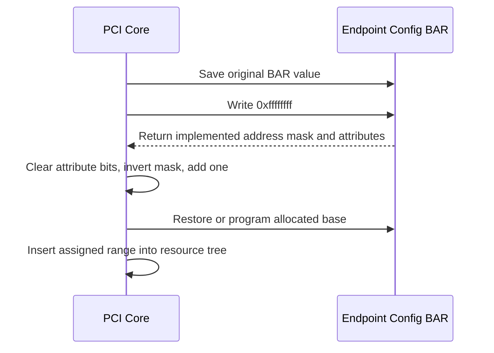
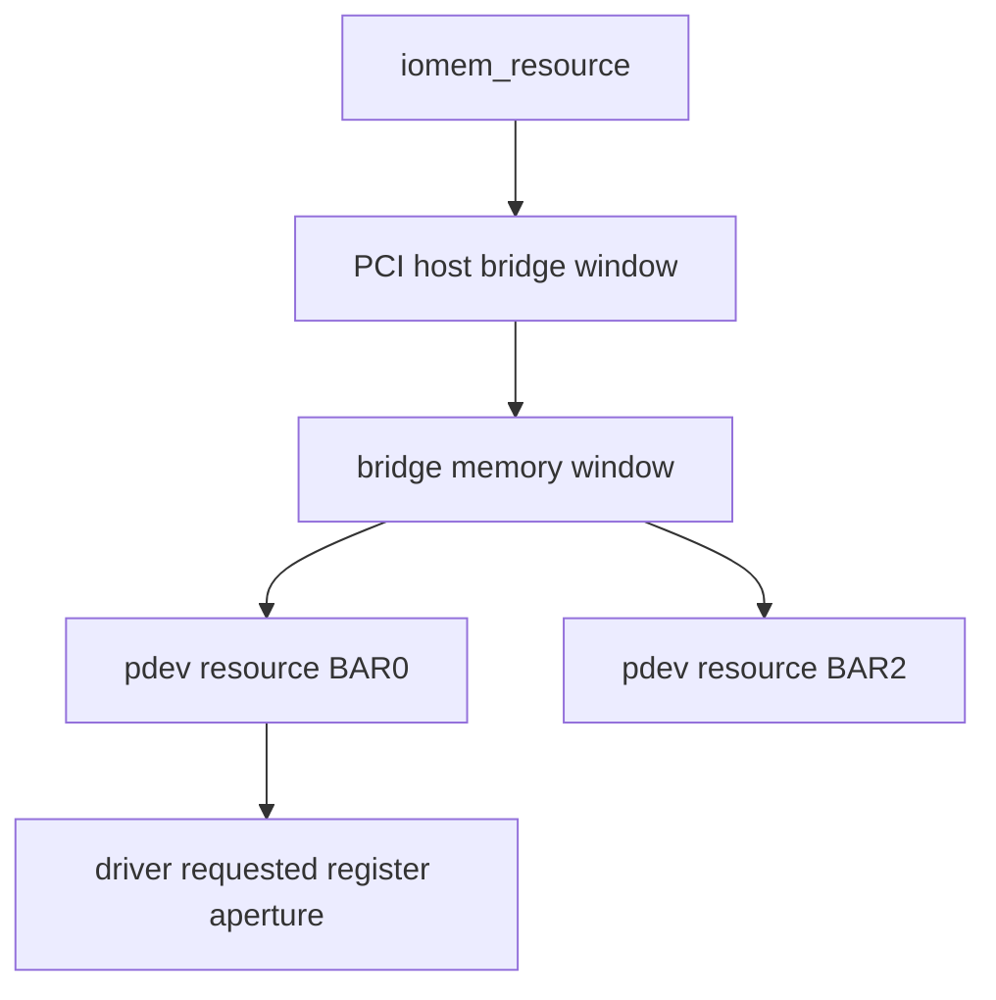
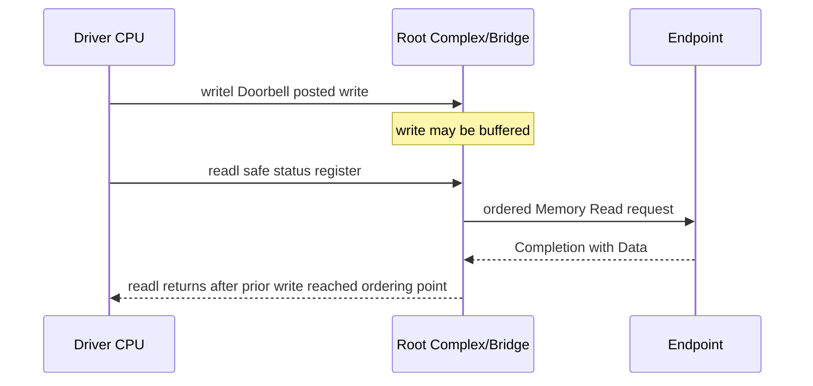
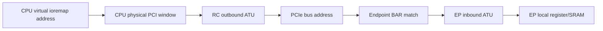

Endpoint 被枚举后，CPU 仍需要一种方式访问它的控制寄存器、doorbell、片上 SRAM 或 frame buffer。BAR（Base Address Register）描述这些窗口的类型、大小和属性，系统为它们分配地址，Host Bridge 把 CPU 访问转换成 PCIe Memory Request。

本文的 PCI Resource 和映射 API 固定以 Linux 6.12 为基线。

BAR 最容易产生三个误解：BAR 中的值不是驱动随意写入的物理地址；`pci_iomap()` 返回的是 CPU 虚拟地址，不一定等于 PCIe bus address；读写 MMIO 不能用普通指针替代 `readl()/writel()`。本文把配置、资源和事务三层连起来。

## 一、BAR 描述窗口类型，而不是业务寄存器

Type 0 Header 最多提供 6 个 BAR。每个 BAR 低位编码属性，高位参与 base address。主要类型：

- I/O BAR：面向传统 I/O Port，现代嵌入式系统较少使用。
- 32-bit Memory BAR：地址位于 32-bit PCI 地址范围。
- 64 位 BAR：占两个连续 BAR dword，低 dword 含属性和低地址，高 dword 含高地址。
- Prefetchable Memory BAR：读操作没有 destructive side effect，允许系统进行预取/合并；常用于 frame buffer/大内存窗口。
- Non-prefetchable Memory BAR：常用于控制/status register，不允许把读取任意重排/预取。

prefetchable 不等于 CPU cacheable，也不等于 write-combining 一定启用。它向资源分配/桥窗口表达 PCIe 事务属性，CPU page attribute 由架构和映射 API 决定。

一个 BAR 内可以包含多类寄存器，offset 由设备协议定义。例如 BAR0 0x0000 是 ID，0x0010 是 Control，0x1000 是 Doorbell。BAR 只负责把整个窗口路由到 Function，设备内部再解码 offset。

设备复位时 BAR base 通常为 0 或固件值。系统枚举后写入分配地址；驱动读取 `pci_resource_start()` 获得分配结果，不直接决定全局地址布局。

## 二、写全 1 sizing 如何得到窗口大小

BAR 大小必须是 2 的幂并按大小对齐。枚举软件保存原值、暂时避免 decode 干扰，向 BAR 写 `0xffffffff`，读回设备实现的 address mask，屏蔽属性位后取反加一。



假设 32-bit Memory BAR 读回 `0xfffff008`。bit0 为 0 表示 Memory，type/属性低位去掉后 mask 是 `0xfffff000`，`~mask + 1 = 0x1000`，因此窗口 4 KiB，base 必须 4 KiB 对齐。

64-bit BAR 要把高/低 dword 合并后计算，并跳过被占用的下一个 BAR index。驱动若把两个 dword 当成两个独立 BAR，会把高地址误判成资源。BAR mask 的属性位也必须从原始值而非地址 mask 中保存。

Resizable BAR Capability 允许在设备支持集合中选择更大/更小 window，但仍由 PCI Core/平台资源策略协调。驱动不能在 BAR 已映射且 DMA/用户 mmap 活动时私自调整大小。

生产系统不应使用 `setpci` 对已启用设备执行 sizing：写全 1 会暂时改变地址 decode，其他 CPU/driver 可能并发访问。应读取 Linux 已保存的 resource 或在受控早期枚举环境调试。

## 三、Linux resource tree 先声明所有权，再建立映射

PCI Core 把 BAR 保存为 `pci_dev->resource[]`。每项包含 CPU 资源起止地址和 `IORESOURCE_IO/MEM/PREFETCH` 等 flags，并挂入系统 resource tree。父 Host Bridge/Bridge window 必须覆盖该区间。

驱动通常按以下顺序处理 BAR：

```c
int ret;

ret = pci_enable_device(pdev);
if (ret)
    return ret;

ret = pci_request_region(pdev, 0, "demo_bar0");
if (ret)
    goto err_disable;

if (!(pci_resource_flags(pdev, 0) & IORESOURCE_MEM)) {
    ret = -ENODEV;
    goto err_release;
}

dev->bar0_len = pci_resource_len(pdev, 0);
if (dev->bar0_len < DEMO_REQUIRED_BAR0_SIZE) {
    ret = -ENOSPC;
    goto err_release;
}

dev->bar0 = pci_iomap(pdev, 0, 0);
if (!dev->bar0) {
    ret = -ENOMEM;
    goto err_release;
}
```

`pci_request_region()` 在 resource tree 声明驱动拥有 BAR，防止两个驱动/子系统同时映射使用；`pci_iomap()` 根据 I/O/Memory 类型建立适合架构的 `__iomem` 映射。顺序不能反：先映射再 request 会在冲突设备上短暂访问不属于自己的资源。

也可使用 `pci_request_regions()` 申请所有 BAR，或 `pcim_*` managed API 自动释放。但 managed release 只减少 error label，不替代停机顺序：remove 时先停止硬件/IRQ/DMA，再让 mapping/resource 被释放。

`pci_resource_start()` 是 CPU resource address，sysfs `resource` 也通常展示该视角。它不保证等于 Endpoint 在 TLP header 中看到的地址；Host Bridge 可在中间做转换。

## 四、MMIO accessor、side effect 和 posted write

`pci_iomap()` 返回 `void __iomem *`。驱动使用 `readb/readw/readl/readq`、`writeb/writew/writel/writeq`，而不是普通 `*ptr`：accessor 处理架构 I/O ordering、endianness 约定和静态检查。

```c
u32 id = readl(dev->bar0 + DEMO_REG_ID);
if (id != DEMO_EXPECTED_ID)
    return -ENODEV;

writel(DEMO_CTRL_RESET, dev->bar0 + DEMO_REG_CONTROL);
```

寄存器语义比宽度更重要：

- Read-clear：读取会清状态，调试脚本不能反复读。
- W1C：写 1 清对应 bit，read-modify-write 可能误清其他事件。
- Doorbell：写入触发设备消费 descriptor，必须先发布内存。
- Split 64-bit：32-bit CPU/设备可能要求固定高低顺序或 latch。
- FIFO/data port：连续读取/写入有 side effect，不能预取。

PCIe Memory Write 是 posted write。`writel()` 返回只表示 CPU/RC 接受写，不保证 Endpoint 已执行。若驱动在关闭 IRQ、reset 或释放资源前必须确认写到达，使用设备规范指定的安全 readback：

```c
writel(DEMO_CTRL_STOP, dev->bar0 + DEMO_REG_CONTROL);
readl(dev->bar0 + DEMO_REG_STATUS); /* Flush posted write. */
```

不要随意读 W1C/read-clear/FIFO 寄存器用于 flush。设备协议应提供无副作用 status/ID 或显式 completion。

MMIO ordering 也不替代 DMA barrier。CPU 写普通内存 descriptor 后敲 doorbell：先填 descriptor，`dma_wmb()`，再 `writel()`；设备写 completion 后，CPU 从 MMIO/内存看到完成，再使用 `dma_rmb()` 读取 payload/descriptor 字段。具体模式以后续 DMA 文章为准。

## 五、CPU 地址、PCIe 地址、BAR 和 ATU 的完整路径

嵌入式 RC 常有多个地址域：驱动的 CPU virtual address、CPU physical MMIO window、PCIe bus address、Endpoint BAR match 和设备内部 offset。Address Translation Unit（ATU）负责在 RC/EP 边界转换窗口。


Device Tree `ranges` 可描述 CPU address 到 PCI bus address 的 Host Bridge window。PCI Core 在该 window 中分配 BAR，并把 CPU 侧 resource 提供给驱动。RC outbound ATU 必须覆盖转换；Endpoint inbound ATU 可能把 BAR hit 映射到片上 AXI/APB 地址。

若 `lspci` 显示 BAR 已分配，但 CPU `readl()` 全 1/abort：

1. 确认驱动映射的 BAR/index/offset。
2. 检查 Host `ranges` 与 resource 地址。
3. 检查 RC outbound ATU base/limit/target。
4. 检查 TLP 是否到达 Endpoint。
5. 检查 BAR enable/Command Memory Space。
6. 检查 EP inbound ATU 和内部 bus target。

对 Device 发起 DMA 的 outbound path，方向相反且通常使用 `dma-ranges`/IOMMU；不能拿 MMIO BAR 地址直接当 DMA 地址。

## 六、资源停止、用户映射和错误验证

remove/错误回滚时，先阻止用户进入和新 MMIO，停止设备产生中断/DMA，flush posted stop，等待 hardware idle/synchronize IRQ，再 `pci_iounmap()`、`pci_release_region()`、`pci_disable_device()`。

若把 BAR 暴露给用户 `mmap()`，需要限制 offset/length、只映射允许区域、设置 `pgprot_noncached` 或架构合适属性，并处理 Device remove。用户持有 VMA 时硬件消失，访问可能触发 machine check；生产设计通常用 ioctl/read/write 隔离控制寄存器，只对明确 data aperture 开放 mmap。

调试命令：

```bash
lspci -s BDF -vv
cat /sys/bus/pci/devices/BDF/resource
cat /proc/iomem
sudo devmem CPU_RESOURCE_ADDR 32   # 仅在确认安全寄存器和无人占用时
```

`lspci` 的 BAR、sysfs resource、`/proc/iomem` 应形成一致所有权链。内核驱动已绑定时不要用 `devmem` 并发访问有 side effect 的寄存器。

常见错误：

- BAR 为 0/unassigned：Host resource/window 不足或 sizing/bridge allocation 失败。
- `pci_request_region()` 返回 busy：已有 owner，检查 driver/firmware reservation。
- `pci_iomap()` 成功但读取全 1：decode/ATU/Link/offset 问题，mapping 成功不证明设备响应。
- 写入后立即检查失败：posted write 未 flush 或设备异步处理。
- 只在 64-bit 地址失败：BAR 高 dword、Host window、DMA mask 或 ATU 地址宽度错误。

**参考资料**

- [How To Write Linux PCI Drivers](https://docs.kernel.org/PCI/pci.html)
- [PCI-SIG Specifications](https://pcisig.com/specifications)
- [Linux I/O Mapping documentation](https://docs.kernel.org/driver-api/device-io.html)

## 七、64-bit 与 Prefetchable 属性影响放置

Memory BAR bit 2:1 表示地址类型，64-bit BAR 占用相邻两个 BAR Register。

读取/写入时要把低 dword 的属性 bit 与上下地址分开。

Prefetchable 表示读取无副作用、允许合并/预取等优化语义，不等于“缓存一定打开”。

Doorbell、Status FIFO 等有 read side effect 的窗口不能错误标成 Prefetchable。

大容量 Frame Buffer/Device Memory 常使用 64-bit Prefetchable BAR，并放在 4 GiB 以上。

每级 Bridge 和 Host Window 都要支持相应地址宽度和属性。

## 八、Resource Tree 表示声明所有权与包含关系

Linux 将 BAR 转换为 `struct resource`，插入 I/O Port 或 iomem 树。



`pci_request_regions()` 声明整个 Function 的可请求 BAR。

`pci_request_region(pdev, bar, name)` 只声明一个。

请求成功不执行映射；`pci_iomap()` 才产生 `__iomem` 地址。

映射成功不自动启用 Device DMA；还需要 DMA Mask、Bus Master 与 Device 私有 Queue。

释放顺序为停止设备访问、iounmap、release region、disable device。

## 九、MMIO accessor 表达宽度、字节序与顺序

使用 `readb/readw/readl/readq` 与 `write*`（按体系结构支持）访问 `__iomem`。

这些接口表达 I/O 地址空间语义。

普通 `*ptr` 解引用会绕过必要的编译器/体系结构 I/O 规则。

设备寄存器字节序由硬件手册定义。

PCI 配置与多数 PCIe Device Register 使用 Little Endian，但自定义 FPGA 协议仍应明确。

`ioread32be()` 等接口适用于确实定义为 Big Endian 的窗口。

## 十、posted write 需要按协议 flush

PCIe Memory Write 是 Posted Request。

CPU `writel()` 返回时，Write 可能仍在 Root Complex/Bridge Buffer 中，Device 尚未观察。

当软件必须确认此前 Write 已到达设备，可读取一个定义为安全的同设备寄存器，利用 Non-Posted Read Completion flush 路径。



不能随便读取 Clear-on-Read 或 Pop FIFO Register 来 flush。

选择哪个寄存器必须由硬件协议定义。

## 十一、ATU 把 CPU/PCI/Local 三种地址连接

嵌入式 Root Complex 常有 Outbound ATU：把 CPU Physical Window 转为 PCIe Address/TLP。

Endpoint Controller 常有 Inbound ATU：把 Host 对 BAR 的访问映射到 EP Local Address。

Endpoint 主动访问 Host Memory 还可能需要 Outbound ATU。



任何一层 Base/Limit/Target/Type 错误都会让访问读全 1、触发 abort 或打到错误窗口。

`lspci` 读取配置空间成功不证明 Memory ATU 正确，因为 Configuration Transaction 可走不同窗口。

## 十二、mmap BAR 的安全边界

用户映射 BAR 前必须验证：

- 只映射允许的 BAR/子范围。
- Page Offset 与 Length 不溢出。
- 目标 Resource 属于当前 Device。
- 缓存属性符合 BAR 语义。
- Device 在线且 Mapping 生命周期有管理。
- 用户不能越过 Control Region 访问敏感寄存器。

remove 时已有 VMA 可能仍存在。

驱动需要通过引用、revocation 或上层框架定义断开后的 fault 行为。

简单 `remap_pfn_range()` 后在 remove 直接释放一切，可能留下用户访问失效 MMIO 的风险。

## 十三、一手资料

- [Linux 6.12 PCI resource API](https://www.kernel.org/doc/html/v6.12/driver-api/pci/pci.html)
- [Linux device I/O access](https://docs.kernel.org/driver-api/device-io.html)
- [Linux stable PCI setup source](https://git.kernel.org/pub/scm/linux/kernel/git/stable/linux.git/tree/drivers/pci/setup-res.c?h=linux-6.12.y)
- [PCI-SIG specifications](https://pcisig.com/specifications)

## 十四、小结

BAR 是 Endpoint 对系统声明的地址窗口需求。PCI Core 通过写全 1 sizing 取得大小，在 Host/Bridge resource window 中分配地址并写回 BAR；驱动先 request resource，再 iomap，并用 MMIO accessor 按寄存器语义访问。

一次 CPU 访问可能经历 virtual address、CPU physical window、RC ATU、PCIe bus address、BAR match 和 EP internal translation。下一篇将在这条资源基础上构建完整 `pci_driver` 生命周期和 probe 错误回滚。
