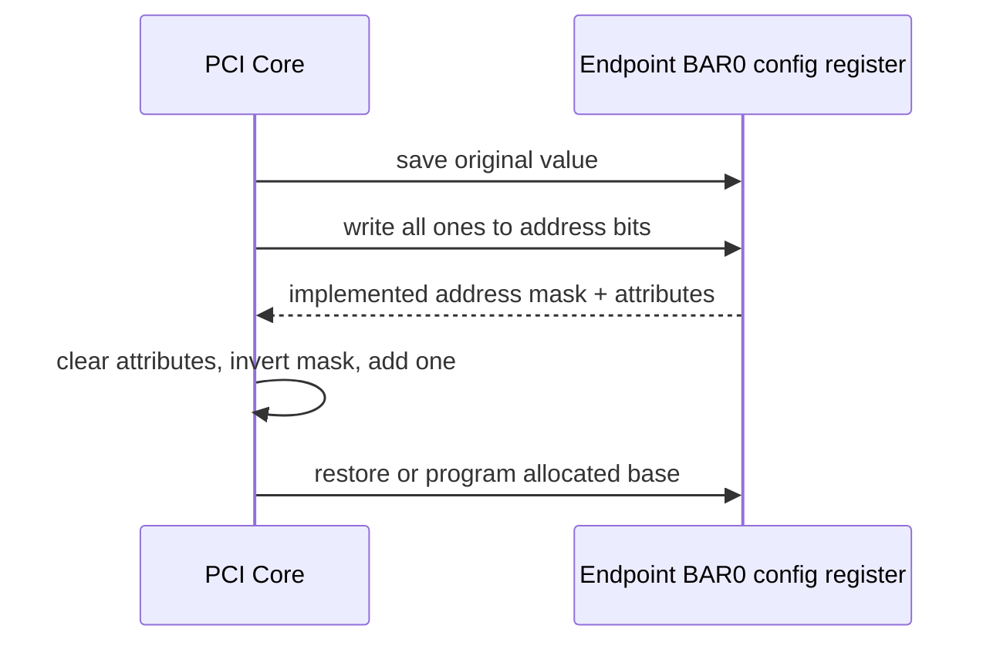
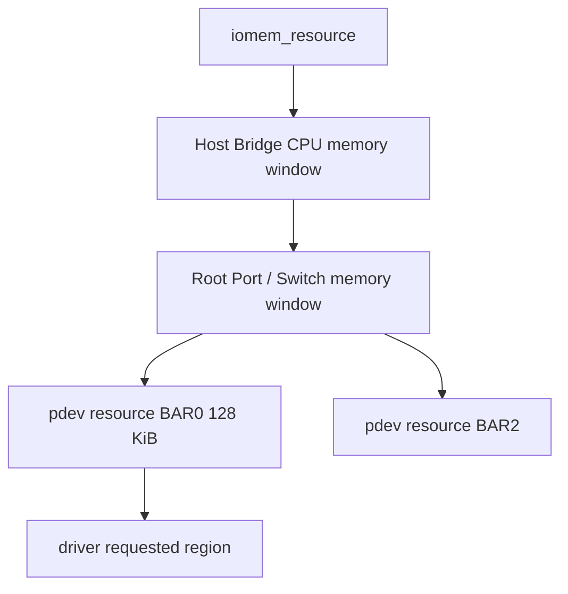
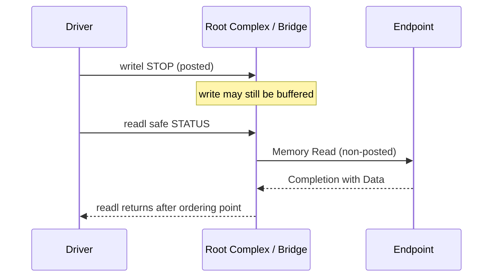

第 02 篇结束时，Linux 已经发现一个 Function，也知道它的 BAR0 需要多大空间。但这并不等于 CPU 已经可以访问设备：BAR 里是哪个地址域，Linux `resource` 为什么又显示另一个地址，`pci_iomap()` 返回的指针与 PCIe TLP 中的地址究竟是什么关系？

本文用一组**代表性示例值**走完地址路径。它们只用于计算和推导，不是某块 RK356x、RTL8822CE 或 FPGA 的实测结果。设备案例在这里不重要，重要的是不同平台都必须完成同样的“声明需求、分配窗口、转换地址、匹配 BAR、解码 offset”。

Linux API 与 Resource 行为固定到 Linux 6.12。读完后，应能够从 `lspci`、sysfs `resource`、Device Tree `ranges` 和控制器 ATU 配置之间建立因果关系，而不是把所有数字统称为“物理地址”。

## 一、先看问题：BAR 里的地址为什么不能直接解引用

假设 Endpoint 的 BAR0 声明 128 KiB 空间，PCI Core 给它分配 PCI Bus Address `0x4000_0000`。嵌入式 Root Complex 又把 CPU Physical `0xF800_0000`～`0xF801_FFFF` 映射到这段 PCI 地址。驱动最终通过 `pci_iomap()` 得到内核虚拟地址，但我们不伪造这个虚拟地址的固定数值。

```text
代表性示例，不是实测值

Endpoint BAR0 size       = 128 KiB
PCI Bus Address          = 0x4000_0000
CPU Physical Window      = 0xF800_0000
RC Outbound translation  = CPU 0xF800_0000 -> PCI 0x4000_0000
Register offset          = 0x0000_0100
TLP target address       = 0x4000_0100
Endpoint local register  = BAR0 local base + 0x100
```

因此驱动读取 `bar0 + 0x100` 时，CPU 侧访问的是某个内核虚拟地址，页表把它转换到 `0xF800_0100`，RC ATU 再转换成 PCIe Memory Read 地址 `0x4000_0100`，Endpoint BAR0 命中后取 offset `0x100`。这些地址数值可能不同，但表示的是同一次访问在不同地址域中的位置。

如果把 BAR Register 中的 `0x4000_0000` 当成 CPU 可直接解引用的物理地址，访问可能打到错误外设、触发外部 Abort 或读回全 1。因为地址转换由 Host Bridge 决定，所以功能驱动必须使用 PCI Core 已经建立的 Resource 和映射 API。

## 二、BAR 首先声明窗口需求与属性

BAR 是 Base Address Register 的缩写，位于 Type 0/Type 1 Configuration Header 中。它不是业务寄存器本身，而是 Function 向系统声明“我需要一段怎样的地址窗口”；窗口内部 offset 的含义才由设备协议定义。

Type 0 Header 最多有 6 个 BAR。常见编码包括 I/O BAR、32-bit Memory BAR 和 64-bit Memory BAR；64-bit BAR 占两个连续 dword，低 dword 保存属性和低地址，高 dword保存高地址，因此不能把相邻两个槽位误判成两个独立资源。

Prefetchable 表示读取没有 destructive side effect，允许上游进行预取、合并等优化。它不等于 CPU Cache 一定打开，也不等于任何映射都可以使用 Write Combining。控制寄存器、Read-Clear 状态、FIFO Data Port 等通常需要 Non-Prefetchable 语义，因为多读一次就可能改变设备状态。

一个 BAR 可以包含多个子区域，例如：

```text
BAR0 + 0x0000 : device identity and capability registers
BAR0 + 0x0100 : control and status registers
BAR0 + 0x1000 : queue doorbell array
BAR0 + 0x8000 : on-device SRAM aperture
```

PCIe 只负责把整个 BAR Window 路由到 Function，设备内部再解释 offset。不同厂商可以让同一 offset 表示完全不同的功能，因此标准 Explorer 可以安全读取 BAR Resource 属性，却不能凭别家数据手册去读写未知设备 BAR。

## 三、BAR sizing 怎样得到 128 KiB

设备不能仅靠一个固定字段直接报告 BAR 大小。标准枚举方法是保存原值、向地址位写全 1、读回设备实现的 Mask、屏蔽属性位，再取反加一。设备未实现的低地址位读回 0，因此 Mask 同时表达大小和对齐要求。



对 128 KiB 的 32-bit Memory BAR，屏蔽属性后的代表性 Mask 是 `0xFFFE_0000`：

```text
size = ~(0xFFFE_0000) + 1
     = 0x0002_0000
     = 128 KiB
```

这意味着 Base Address 必须按 128 KiB 对齐。64-bit BAR 要先组合高低 dword 再计算，Resizable BAR 则允许系统从设备支持的 Size 集合中选择，但仍要满足 Host Window、Bridge Window 和系统资源策略。

因为 sizing 会暂时改写配置寄存器，所以它应在功能驱动尚未并发使用设备时完成。对已经启用 DMA 的设备使用 `setpci` 写全 1，不是“只读探测”，而是可能破坏正在运行的地址 Decode。

## 四、Linux Resource Tree 记录分配结果与所有权

PCI Core 将每个 BAR 表示为 `pci_dev->resource[]` 中的 `struct resource`，保存 CPU 侧起止地址和 `IORESOURCE_MEM`、`IORESOURCE_IO`、`IORESOURCE_PREFETCH` 等属性。它还把资源插入系统 I/O 或 iomem 树，从而表达 Host Window、Bridge Window 和 Endpoint BAR 的包含关系。



Resource Tree 解决的是范围分配和软件所有权，不自动建立 CPU 页表映射，也不自动启用设备 DMA。因此 `pci_resource_start()`、`pci_request_region()` 和 `pci_iomap()` 分别回答三个不同问题：地址被分到哪里、当前驱动是否获得独占使用权、CPU 用哪个 `__iomem` 地址访问。

在代表性示例中，`pci_resource_start(pdev, 0)` 可能返回 CPU Resource `0xF800_0000`，而 `lspci` 侧重显示 PCI 配置和 Bus 视角。不同体系结构的 `/sys/bus/pci/devices/BDF/resource` 以 Linux Resource 为准，因此不能假设它与 TLP Address 数字相同。

Bridge Window 必须覆盖下游 BAR 且属性兼容。若 Endpoint BAR0 已分配 `0x4000_0000`，但上游 Bridge Memory Base/Limit 不包含该范围，配置访问仍然可能成功，因为 Configuration Request 走 BDF 路由；普通 Memory Request 却会在桥处被挡住。

## 五、驱动按 Request、Map、Access 的顺序取得 BAR

功能驱动不应拿到 `pci_dev` 后立即解引用 Resource。正常顺序是先启用设备 Decode，再验证 BAR 类型和大小，申请 Resource 所有权，最后建立映射：

```c
int ret;

ret = pci_enable_device_mem(pdev);
if (ret)
    return ret;

if (!(pci_resource_flags(pdev, 0) & IORESOURCE_MEM)) {
    ret = -ENODEV;
    goto err_disable;
}

if (pci_resource_len(pdev, 0) < SZ_128K) {
    ret = -ENOSPC;
    goto err_disable;
}

ret = pci_request_region(pdev, 0, "demo-bar0");
if (ret)
    goto err_disable;

bar0 = pci_iomap(pdev, 0, 0);
if (!bar0) {
    ret = -ENOMEM;
    goto err_release;
}

return 0;

err_release:
    pci_release_region(pdev, 0);
err_disable:
    pci_disable_device(pdev);
return ret;
```

`pci_request_region()` 成功表示没有其他 Resource Owner 冲突，`pci_iomap()` 成功表示内核建立了适合当前架构的 I/O 映射。映射成功仍不证明设备会响应，因为 Command Memory Space Enable、Bridge Window、ATU、Link 和 Endpoint 内部 Decode 任何一层都可能有问题。

也可以使用 `pci_request_regions()` 申请 Function 的全部可请求 BAR，或使用 `pcim_*` Managed API 简化释放。但 Managed API 只负责对象生命周期，不能替代停机顺序；remove 时仍要先停止用户入口、IRQ 和 DMA，再让映射与 Resource 自动释放。

## 六、MMIO 必须使用 I/O Accessor

`pci_iomap()` 返回 `void __iomem *`，这个类型提醒代码不能像普通 RAM 一样访问。驱动使用 `readb/readw/readl/readq` 与 `writeb/writew/writel/writeq`，让编译器和体系结构应用正确的 I/O 宽度、顺序和地址空间规则。

```c
u32 id = readl(bar0 + DEMO_REG_ID);

writel(DEMO_CTRL_STOP, bar0 + DEMO_REG_CONTROL);
status = readl(bar0 + DEMO_REG_STATUS);
```

普通 `*ptr` 解引用可能被编译器合并、重排或按普通 Cacheable Memory 处理。即使在 x86 上偶然可用，也会把错误带到 ARM、RISC-V 或不同映射属性的平台。因此 `__iomem` 与 Accessor 不是语法装饰，而是在代码中表达设备 I/O 语义。

寄存器字节序和 side effect 由设备协议定义：Read-Clear 会在读取后清零，W1C 要写 1 清位，Doorbell 写入会触发队列消费，FIFO Port 每次读取都可能 Pop 数据。因为这些行为不是 PCIe 通用规则，所以调试程序不能把“读 BAR 前 64 字节”当成对所有设备都安全。

## 七、Posted Write 为什么需要按协议 Flush

PCIe Memory Write 是 Posted Request，`writel()` 返回只说明 CPU/Root Complex 接受了写入，不保证 Endpoint 已经执行。若驱动随后立即关闭时钟、释放队列或执行 Reset，仍在桥和 RC 中排队的写可能晚到，形成难以复现的状态错误。



常见做法是在设备手册允许时读取同一 Function 的无副作用寄存器，利用 Non-Posted Read 的 Completion 把此前写推进到规定顺序点。但不能随意读取 Read-Clear、W1C、FIFO 或会触发状态变化的寄存器，因此“哪个寄存器可用于 Flush”属于设备协议。

MMIO Flush 也不等于 DMA Barrier。CPU 填写 Descriptor 后通知设备，通常需要 `dma_wmb()` 保证普通内存先对设备可见，再 `writel()` Doorbell。因为它们约束不同地址空间，所以一个安全 readback 不能替代 Descriptor 所有权发布。

## 八、RC/EP ATU 把不同地址域连接起来

嵌入式 Root Complex 常用 Address Translation Unit（ATU）把 CPU Physical Window 转换成 PCIe Address。Device Tree `ranges` 描述 Host Bridge 的 CPU/PCI 地址关系，控制器驱动据此建立 Outbound Region，PCI Core 再在可用 PCI Window 中分配 BAR。


Endpoint Controller 还可能使用 Inbound ATU，把 Host 对某个 BAR 的访问映射到片上 AXI/APB/SRAM 地址。Endpoint 主动访问 Host Memory 时则可能需要另一组 Outbound ATU，并可能叠加 Host IOMMU；这条 DMA 地址路径与 CPU 访问 BAR 的 MMIO 路径不能混用。

若 `lspci` 可读、BAR 已分配，而 `readl()` 全 1或触发 Abort，可以按地址路径逐层检查：Resource 是否属于正确 BAR，Command Memory Enable 是否打开，Bridge Window 是否覆盖，Host `ranges` 与 Outbound ATU 是否一致，TLP 是否到达 Endpoint，BAR Hit 是否进入正确 Inbound Region。

因为 Configuration Request 与 Memory Request 可能使用不同 ATU Region，所以“配置空间能读”只能证明 Config Path，不足以证明 Memory Path。这个区别是嵌入式 PCIe Bring-up 中最重要的分层之一。

## 九、用户映射与停止顺序决定安全边界

把 BAR 暴露给用户 `mmap()` 之前，驱动必须限制 BAR 和子范围、检查 Page Offset/Length 溢出、选择正确缓存属性，并定义设备移除后的 Fault 行为。控制寄存器通常不适合直接映射给任意用户，因为用户可以绕过锁、状态机和权限检查。

remove 或 Probe 回滚的顺序从“谁还可能访问这段 MMIO”推导：先阻止新用户请求，停止设备产生新 DMA/IRQ，写 Stop 并按协议 Flush，等待 Hardware Idle，`synchronize_irq()`，释放 DMA，再 `pci_iounmap()`、`pci_release_region()` 和 `pci_disable_device()`。

若先解除映射再停止设备，IRQ Handler 或 Worker 可能继续访问失效 `__iomem`；若先释放 Resource 再撤销用户 VMA，另一个驱动可能获得同一区域而旧进程仍可访问。因此所有权和地址映射必须与异步执行上下文一起设计。

## 十、本篇检查点

现在应当能够把以下五个概念严格区分：BAR Register 表示设备窗口需求和 PCI 地址编码；Linux `resource` 表示 CPU 侧范围与软件所有权；`pci_request_regions()` 声明当前驱动占用；`pci_iomap()` 建立内核 I/O 映射；ATU 在 CPU、PCI 和 Endpoint Local 地址域之间转换。

还应能够解释为什么 `pci_iomap()` 成功不等于访问成功，为什么 Configuration Space 可读不等于 Memory Window 正常，以及为什么 Posted Write Flush 与 DMA Barrier 是两个不同问题。如果这些边界仍然混在一起，后续驱动 Probe、DMA 和 Reset 会变成只能记顺序的 API 清单。

## 十一、小结：下一篇进入 Linux PCI Core 对象

BAR 让 Endpoint 声明窗口大小、类型和属性，PCI Core 在 Host/Bridge Window 中分配地址并建立 `struct resource`。驱动先 Enable、验证、Request，再通过 `pci_iomap()` 获得 `__iomem`，并使用 MMIO Accessor 按寄存器协议访问。

一次读取从内核虚拟地址出发，经过 CPU Physical Window、RC Outbound ATU、PCI Bus Address、Endpoint BAR Match 和可选 EP Inbound ATU。下一篇将回答这些枚举和资源结果在 Linux 中由哪些对象保存，以及 `pci_host_bridge`、`pci_bus`、`pci_dev` 和 `pci_ops` 如何按创建顺序连接起来。

**一手资料**

- [Linux 6.12 PCI driver API](https://www.kernel.org/doc/html/v6.12/driver-api/pci/pci.html)
- [Linux Device I/O access](https://docs.kernel.org/driver-api/device-io.html)
- [Linux 6.12 PCI resource setup source](https://git.kernel.org/pub/scm/linux/kernel/git/stable/linux.git/tree/drivers/pci/setup-res.c?h=linux-6.12.y)
- [PCI-SIG Specifications](https://pcisig.com/specifications)
