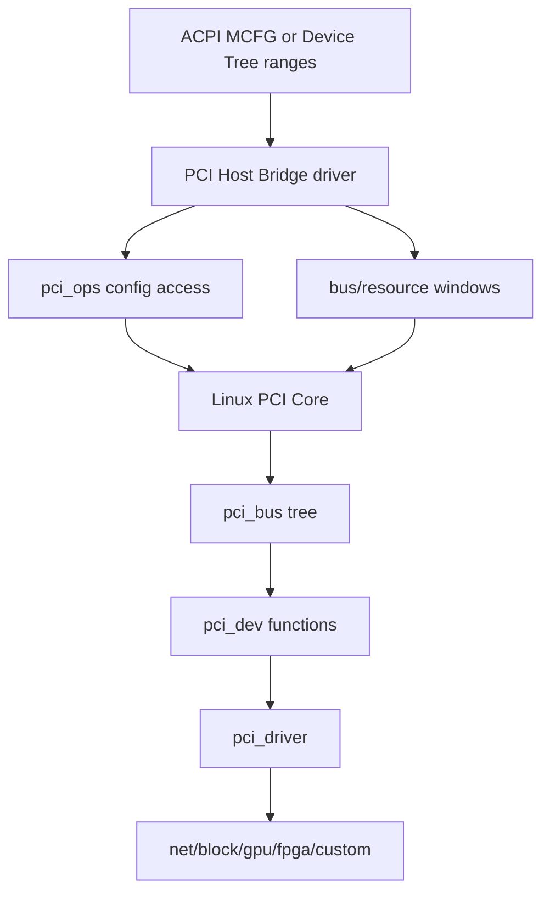
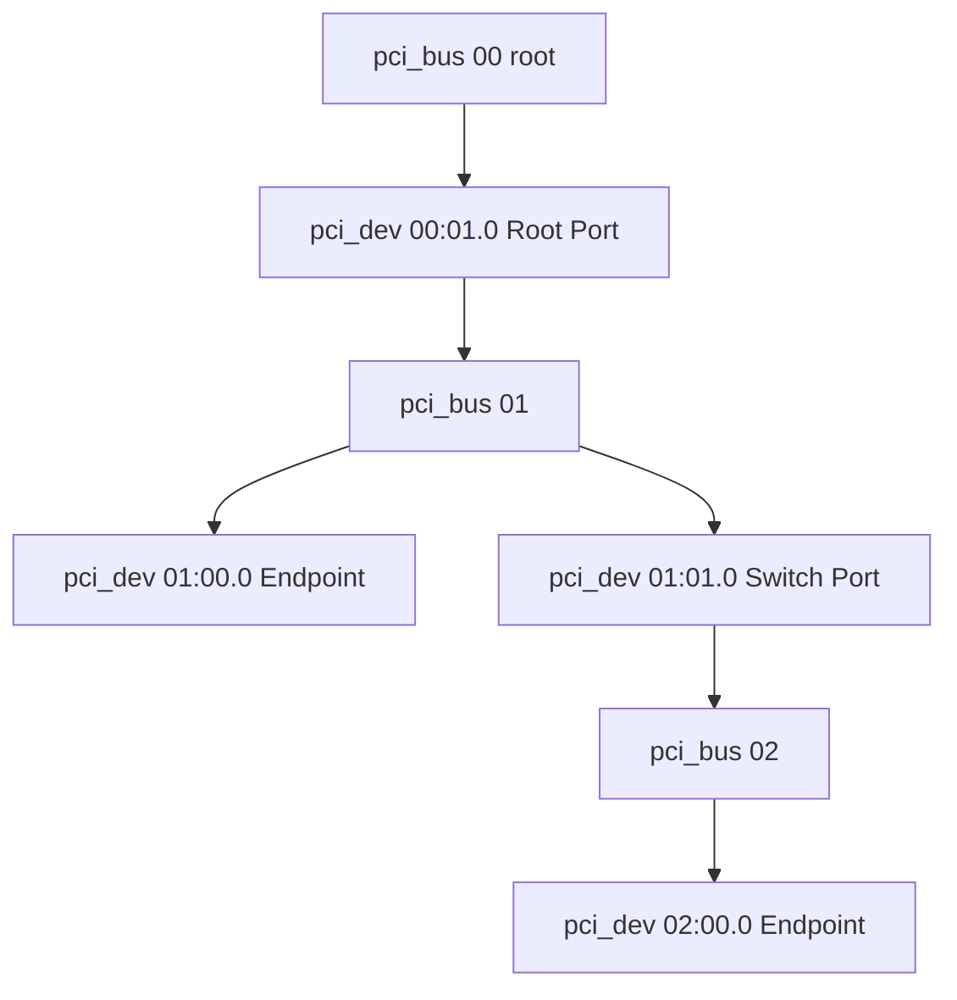
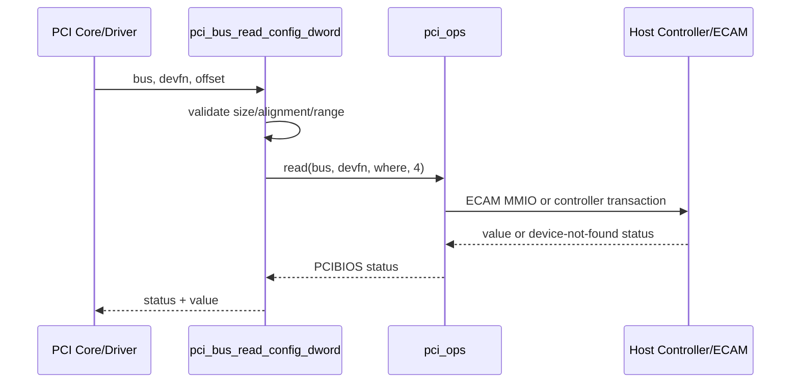
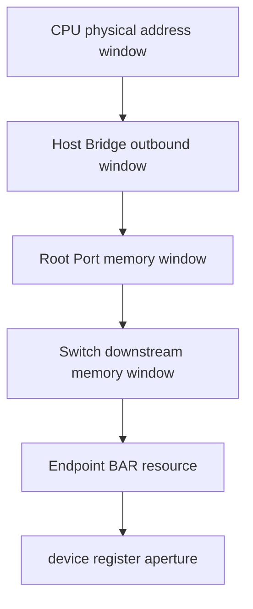
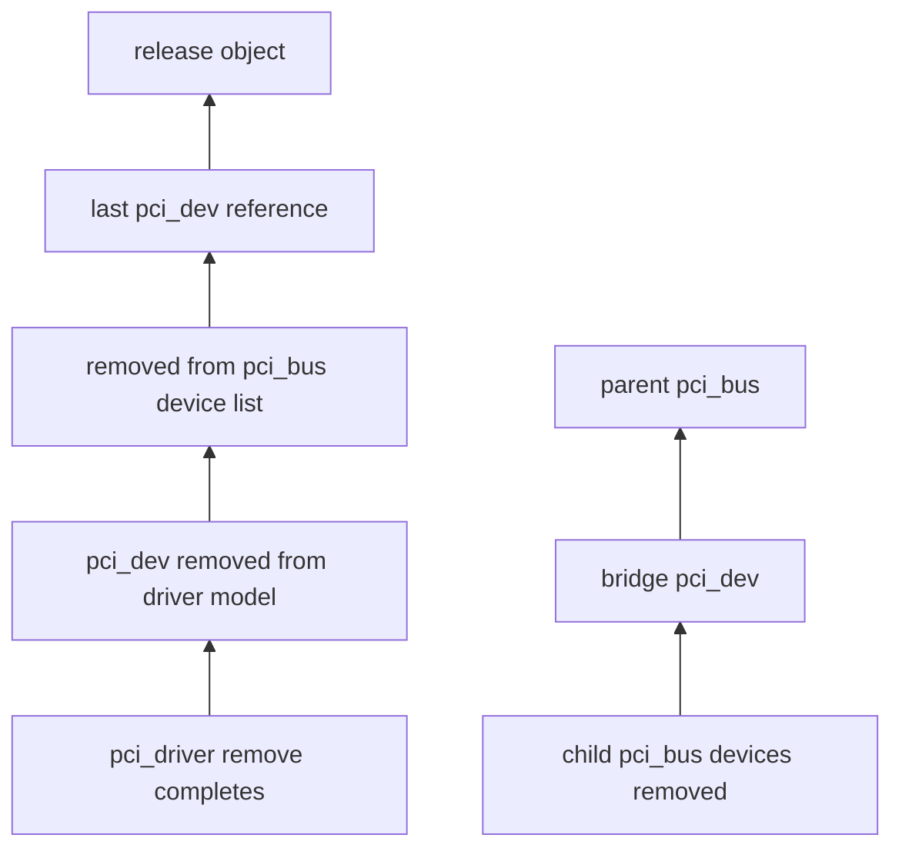

PCIe 设备驱动最常接触 `struct pci_dev`，但 `pci_dev` 并不是孤立对象。

它位于某个 `pci_bus`，由 Host Bridge 提供配置访问方法，经桥窗口和资源树获得地址，并作为 `struct device` 参加 Linux Driver Model。

如果只背 `pci_enable_device()` 与 `pci_iomap()`，很难解释：

- 为什么一个 BDF 会出现在某条 Bus。
- ECAM 与非 ECAM 平台如何共享 PCI Core。
- 桥的 Secondary/Subordinate Bus Number 如何限制扫描。
- BAR 资源为何同时出现在 `pci_dev.resource[]` 与全局 iomem 树。
- Capability 为什么存偏移而不是通用对象。
- AER、PM、DMA 与 IOMMU 状态挂在哪里。

本文固定以 Linux 6.12 为代码基线，先建立 PCI Core 的对象和所有权模型。

## 一、PCI Core 位于固件/控制器与功能驱动之间

平台先提供 PCI Host Bridge：配置空间访问、Bus Number 范围、CPU/PCI 地址窗口、中断映射和控制器资源。

PCI Core 使用这些能力扫描拓扑、创建设备、分配资源并匹配功能驱动。

功能驱动只管理某个 Function 的 BAR、IRQ、DMA 与业务协议。



PCI Core 不是某个 Root Complex 的寄存器驱动。

它是所有体系结构共享的枚举、对象、资源和驱动模型层。

控制器差异通过 Host Bridge、`pci_ops`、IRQ domain、IOMMU 和体系结构 hook 接入。

## 二、pci_host_bridge 表示主机侧入口

`struct pci_host_bridge` 描述一个 Root Bus 的 Host 侧资源与策略。

它通常包含：

- `bus`：扫描后创建的 Root `pci_bus`。
- `windows`：可分配给下游的 I/O、Memory、Prefetchable 窗口。
- `ops`：配置空间访问操作。
- `sysdata`：体系结构/控制器私有数据。
- `busnr`：Root Bus 起始编号。
- MSI、DMA ranges 与策略信息。

Device Tree 平台常由 `of_pci_get_host_bridge_resources()` 等路径解析 `bus-range`、`ranges`。

ACPI 平台可能从 MCFG、_CRS 与 Root Bridge 方法获得信息。

Host Bridge Driver 应先准备窗口与配置访问，再调用通用扫描接口。

如果窗口错误，设备仍可能通过配置空间被发现，却无法正确分配 BAR。

## 三、pci_bus 是一段编号域和拓扑节点

`struct pci_bus` 表示一个 PCI Bus Number 对应的逻辑总线。

Root Bus 由 Host Bridge 创建。

PCI-to-PCI Bridge 的下游形成 Child Bus。

重要关系：

- `parent`：上级 Bus。
- `children`：下级 Bus 链表。
- `devices`：该 Bus 上的 `pci_dev`。
- `self`：创建本 Bus 的 Bridge `pci_dev`；Root Bus 为 NULL。
- `bridge`：Linux Device Model 中的桥设备。
- `ops`：最终配置访问方法。
- `number`、`primary`：Bus Number。
- `resources`：该 Bus 可向设备分配的窗口。



BDF 中的 Bus 字段来自 `pci_bus.number`。

Device/Function Number 只在该 Bus 内有意义。

`pci_dev->bus` 与 `pci_dev->devfn` 一起确定 Function 的拓扑地址。

## 四、Bridge 的 pci_dev 与 Child pci_bus 是两个对象

一个 PCI-to-PCI Bridge 自身是上游 Bus 上的 Function，因此有 `pci_dev`。

它的下游又是一个新的 `pci_bus`。

Bridge 配置头中的 Primary、Secondary、Subordinate Bus Number 定义路由范围。

`pci_bus.self` 指向这个 Bridge Function。

不要把 Bridge `pci_dev` 的 BAR 与下游 Bus Window 混为一谈。

Bridge Window 位于 Type 1 Header 的 I/O Base/Limit、Memory Base/Limit 与 Prefetchable Base/Limit。

它们决定哪些下游地址事务可以穿过桥。

Endpoint BAR 已分配但不落在桥窗口内，CPU 访问仍会失败。

## 五、pci_dev 表示一个 Function

`struct pci_dev` 对应一个 PCI Function，而不是整块卡。

多功能设备的 Function 0..7 分别拥有独立 `pci_dev`、配置空间、BAR、Capability 和 Driver。

常用字段按职责分类：

| 类别 | 字段/内容 | 含义 |
| --- | --- | --- |
| 拓扑 | `bus`、`subordinate`、`devfn` | 所属 Bus、桥下游、Device/Function |
| 身份 | `vendor`、`device`、`subsystem_*`、`class` | 配置头身份与 Class Code |
| 资源 | `resource[PCI_NUM_RESOURCES]` | BAR、ROM、Bridge Window 等 |
| 能力 | `pm_cap`、`msi_cap`、`msix_cap`、PCIe 字段 | 常用 Capability 偏移与状态 |
| 驱动 | `driver`、`driver_override` | 当前绑定关系 |
| 电源/错误 | `current_state`、error state、saved config | PM/AER/恢复 |
| 设备模型 | `dev` | 引用、sysfs、DMA、IOMMU、PM |

一个 Endpoint 可能暴露 SR-IOV Physical Function 与多个 Virtual Function。

每个 VF 也有独立 `pci_dev`，但资源和生命周期受 PF/SR-IOV Core 管理。

## 六、pci_dev 嵌入 struct device

`pci_dev.dev` 让 PCI Function 参加通用 Driver Core。

由此获得：

- sysfs 目录与 uevent。
- 引用计数和 release。
- parent/child 关系。
- DMA mask、IOMMU group 与 DMA ops。
- runtime/system PM。
- device link 与 managed resource。

转换 helper：

```c
struct pci_dev *pdev = to_pci_dev(dev);
struct device *dev = &pdev->dev;
```

DMA API 接收 `&pdev->dev`，因为 DMA 映射属于通用 Device/IOMMU 模型。

PCI 配置与资源 API 接收 `pdev`，因为它们需要 PCI Function 语义。

## 七、pci_ops 抽象配置空间访问

`struct pci_ops` 的核心是 read/write：

```c
struct pci_ops {
	int (*map_bus)(struct pci_bus *bus, unsigned int devfn,
		       int where, void __iomem **addr);
	int (*read)(struct pci_bus *bus, unsigned int devfn,
		    int where, int size, u32 *val);
	int (*write)(struct pci_bus *bus, unsigned int devfn,
		     int where, int size, u32 val);
};
```

具体字段会随内核版本/配置有所差异，Linux 6.12 头文件是最终依据。

ECAM 平台可将 BDF 与 offset 映射为 MMIO 地址。

另一些 SoC Root Complex 使用专用 Address/Data 寄存器、ATU Window 或 Firmware Call。

上层 `pci_bus_read_config_*()` 和 `pci_read_config_*()` 不需要知道硬件方法。



## 八、配置访问有三种常见入口层级

Bus 级：

```c
pci_bus_read_config_byte(bus, devfn, where, &value8);
pci_bus_read_config_word(bus, devfn, where, &value16);
pci_bus_read_config_dword(bus, devfn, where, &value32);
```

Device 级：

```c
pci_read_config_word(pdev, where, &value16);
pci_write_config_dword(pdev, where, value32);
```

Capability 级 helper：

```c
pci_read_config_word(pdev, pdev->pcie_cap + PCI_EXP_DEVCTL, &ctl);
pcie_capability_read_word(pdev, PCI_EXP_LNKSTA, &status);
```

功能驱动已有 `pdev` 时优先使用 Device/Capability helper。

Host Bridge/枚举代码尚未创建 `pci_dev` 时使用 Bus 级接口。

返回通常是 PCIBIOS 状态，不一定是负 errno。

调用者必须按 API 合同解释。

## 九、配置空间读取也需要序列化

配置访问可能与 reset、power transition、AER recovery 或用户空间 sysfs 并发。

`pci_cfg_access_lock()`/`pci_cfg_access_unlock()` 可阻止其他配置访问穿过需要独占的阶段。

它不是功能驱动随便保护私有寄存器的通用 mutex。

`pci_block_cfg_access()` 等内部机制在恢复路径阻断访问。

设备进入 D3cold 后配置空间可能不可访问。

读取全 `0xffff` 或 `0xffffffff` 既可能是设备不存在，也可能是链路/电源/路由失败。

不能在该状态下继续写 Capability 试图“唤醒”。

## 十、枚举如何创建 pci_dev

扫描逻辑对每个 devfn 读取 Vendor ID。

不存在的 Function 通常返回全 1。

发现后分配 `pci_dev`，读取配置头、Header Type、Class、Subsystem、BAR 与 Capability，并加入 Bus 列表。

Bridge Function 会触发子 Bus 扫描。

典型调用概念链：

```text
pci_scan_root_bus_bridge
  -> pci_scan_child_bus
  -> pci_scan_slot
  -> pci_scan_single_device
  -> pci_setup_device
  -> pci_read_bases / capability setup
```

具体内部辅助函数随内核演进，但 Linux 6.12 的对象边界保持上述逻辑。

设备对象在资源与属性准备后注册到设备模型，随后才触发 `pci_driver` 匹配。

## 十一、resource[] 把 BAR 变成 Linux 资源对象

配置头 BAR 是编码寄存器。

PCI Core 探测大小、类型和地址后，填充 `pdev->resource[]`。

每个 `struct resource` 包含 start、end、flags、parent/child/sibling 关系。

常用访问：

```c
resource_size_t start = pci_resource_start(pdev, bar);
resource_size_t len = pci_resource_len(pdev, bar);
unsigned long flags = pci_resource_flags(pdev, bar);
```

资源还要插入全局 I/O Port 或 iomem Resource Tree。

`pci_request_regions()`/`pci_request_region()` 声明驱动占用，防止其他驱动重叠映射。

BAR 地址有效不代表驱动已经拥有它。

## 十二、Bus Window 与 Endpoint Resource 的包含关系

下游 Endpoint Memory BAR 应被每级 Bridge Memory Window 包含，并最终落在 Host Bridge 可达窗口。



Linux Resource Tree 能显示声明关系，但 ATU 与硬件路由还必须正确编程。

嵌入式 RC 常出现 `lspci` 可见、BAR 地址也有值，但 MMIO 读全 1 或 abort；这时要同时检查 Resource Tree 与 outbound ATU。

## 十三、Capability 用链表偏移表达

标准 Capability 位于前 256 字节，通过 Capability Pointer 单链表连接。

PCIe、PM、MSI、MSI-X 等都有 Capability ID。

Extended Capability 从 0x100 开始，每个头包含 ID、Version 与 Next Offset。

AER、SR-IOV、ATS、PRI、PASID 等位于扩展空间。

`pci_find_capability()` 和 `pci_find_ext_capability()` 返回偏移。

返回 0 表示未找到。

PCI Core 会缓存部分常用 offset，但驱动仍应使用 helper，不要假设固定地址。

能力链来自设备，遍历必须检查对齐、范围和环。

Linux 通用 helper 已实现这些防御，驱动不应重复手写不安全链表遍历。

## 十四、pci_dev 的引用与查找

`pci_get_device()`、`pci_get_class()` 等查找函数返回带引用的 `pci_dev`。

使用后调用 `pci_dev_put()`。

驱动 probe 参数对应的设备在绑定期间由 Driver Core 保证寿命，但把指针交给长期异步对象仍需遵守驱动自己的取消规则。

引用只保护内存，不保证：

- Link 仍为 L0。
- 设备仍在 D0。
- BAR 仍可访问。
- reset 没有发生。

Hotplug/remove 会先让驱动停止数据面、解绑并释放资源，最终才释放对象。

## 十五、sysfs 是 PCI Core 对象的可观察投影

典型目录：

```text
/sys/bus/pci/devices/0000:01:00.0/
```

常用属性：

- `vendor`、`device`、`class`。
- `config`：配置空间二进制文件。
- `resource` 与 `resourceN`。
- `enable`。
- `power/`。
- `driver` 链接。
- `iommu_group` 链接。
- `msi_irqs/`。
- `reset`、`reset_method`（按设备能力）。

sysfs 读取配置或资源也受权限和设备状态约束。

用户空间写 config/resourceN 可能破坏正在运行的驱动，不是普通调试首选。

## 十六、modalias 与 pci_driver 匹配

PCI uevent 产生包含 Vendor、Device、Subsystem 与 Class 的 modalias。

`MODULE_DEVICE_TABLE(pci, ids)` 生成模块 alias。

`struct pci_device_id` 可以按：

- Vendor/Device。
- Subvendor/Subdevice。
- Class/Mask。

匹配成功后 Driver Core 调用 PCI Core probe 包装，再进入 `pci_driver.probe()`。

匹配只证明 ID 表接受设备，不证明 BAR、DMA Mask、IRQ 或私有协议可用。

probe 仍必须验证全部运行前提。

## 十七、PM、AER 与 reset 状态为何属于 pci_dev

Power Management Capability、PCIe Capability 与 AER Capability 都位于配置空间，但 Linux 需要跨驱动协调。

因此 `pci_dev` 保存 current power state、saved state、error state、reset 方法和 Capability offset。

功能驱动提供 `dev_pm_ops` 与 `pci_error_handlers`，PCI Core 负责调用时机和通用状态迁移。

驱动不应绕过 Core 直接写 PMCSR 后继续访问 BAR。

也不应在 AER recovery 中忽略 `pci_channel_io_frozen` 等通用状态。

## 十八、DMA 与 IOMMU 通过 struct device 接入

PCI Function 发起 DMA 时，使用：

```c
dma_set_mask_and_coherent(&pdev->dev, DMA_BIT_MASK(64));
dma_map_single(&pdev->dev, buffer, len, DMA_TO_DEVICE);
```

`pdev->dev` 关联 DMA ops、IOMMU domain、NUMA node 和 coherent mask。

PCI Core 负责设备发现与 bus mastering 开关，DMA API 负责 CPU 地址到 DMA Address 的平台转换。

BAR MMIO Address 与 DMA Address 是两个不同地址域。

把 `virt_to_phys()` 结果写进设备描述符会绕过 IOMMU/SWIOTLB，属于严重错误。

## 十九、Host Bridge 与体系结构代码的边界

x86 常有标准 ECAM/固件生态。

ARM/ARM64 SoC 可能使用 DesignWare PCIe、Cadence、Rockchip 等控制器，结合 Device Tree `ranges`、ATU 与 MSI domain。

RISC-V 平台也可能通过 ECAM 或特定控制器接入。

通用 PCI Core 不负责打开某块板的 REFCLK/PERST#，也不理解某个 RC 的 LTSSM 寄存器。

Host Controller Driver 完成硬件 Bring-up 并提供通用接口后，扫描与功能驱动才有共同语义。

## 二十、对象释放与热插拔顺序

设备移除的大致责任链：

1. Hotplug/链路事件进入 PCI Core。
2. 停止新 driver probe 与用户访问。
3. 调用功能驱动 remove，停止 IRQ/DMA/用户接口。
4. 释放 BAR/IRQ/managed resources。
5. 从 sysfs 与 Bus 列表移除 `pci_dev`。
6. 对 Bridge 递归移除 Child Bus。
7. 最后引用归零释放对象。

驱动 remove 返回后，不应再有中断、timer、work 或 DMA completion 访问 `pdev` 私有状态。

PCIe Hotplug 通常比 USB 拔出更依赖平台插槽控制与 AER，但内存寿命与硬件在线状态仍需分开。

## 二十一、阅读 Linux 6.12 源码的路线

建议按对象追踪：

1. `include/linux/pci.h`：`pci_bus`、`pci_dev`、`pci_driver`。
2. `drivers/pci/probe.c`：Host Bridge、扫描与设备创建。
3. `drivers/pci/access.c`：配置空间访问。
4. `drivers/pci/setup-bus.c`：资源与 Bridge Window。
5. `drivers/pci/pci-driver.c`：匹配、probe/remove 与 PM。
6. `drivers/pci/search.c`：对象查找与引用。
7. 体系结构/控制器目录：具体 `pci_ops` 与地址窗口。

对每个函数记录输入对象状态、获得的引用/资源、发布点和错误回滚。

## 二十二、一手资料

- [Linux 6.12 PCI driver API](https://www.kernel.org/doc/html/v6.12/driver-api/pci/pci.html)
- [Linux PCI bus subsystem](https://docs.kernel.org/PCI/index.html)
- [Linux stable PCI probe source](https://git.kernel.org/pub/scm/linux/kernel/git/stable/linux.git/tree/drivers/pci/probe.c?h=linux-6.12.y)
- [PCI-SIG specifications](https://pcisig.com/specifications)

## 二十三、对象销毁按拓扑从叶子向根收敛



Bridge 的 Child Bus 必须先清空，不能先释放提供下游路由的 Bridge Function。

## 二十四、小结

Linux PCI Core 的核心不是几组 enable/map API，而是一棵对象和资源树。

`pci_host_bridge` 提供 Root Bus 的配置访问与地址窗口。

`pci_bus` 表示编号域和拓扑节点，Bridge `pci_dev` 与其 Child Bus 是不同对象。

`pci_dev` 表示一个 Function，并嵌入 `struct device` 接入 sysfs、DMA、IOMMU 与 PM。

`pci_ops` 隔离 ECAM、控制器寄存器和 Firmware 等配置访问差异。

`resource[]` 把 BAR/Bridge Window 转化为 Linux Resource Tree。

Capability 是配置空间偏移链，应通过通用 helper 访问。

对象引用只保护内存，不保证 Link、电源、BAR 或 DMA 仍可用。

掌握这些边界后，下一篇的 Driver Lifecycle 才能解释每个 API 在修改哪个对象、取得什么资源，以及失败时为何必须逆序撤销。
