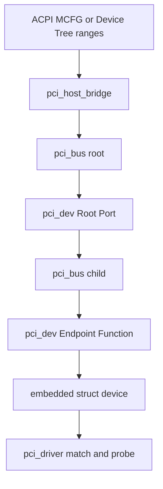
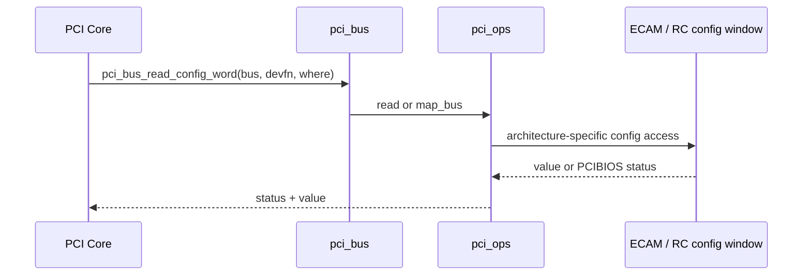

前三篇已经从协议和地址角度回答了设备怎样被发现、BAR 怎样得到地址，但功能驱动真正接收到的参数不是 Bus Number 或 BAR Register，而是一个 `struct pci_dev *`。这个对象是谁创建的，它与 Root Complex、Bridge 和 Linux Device Model 又是什么关系？

如果直接翻看 `struct pci_dev` 字段，会同时看到资源、Capability、PM、AER、DMA、IOMMU 和设备模型信息，读者很容易把它理解成“所有 PCIe 概念的容器”。更有效的方法是按对象创建顺序追踪：平台先提供 Host Bridge，PCI Core 才能创建 Bus；扫描 Bus 发现 Function，才创建 `pci_dev`；对象发布后，Driver 才可能匹配。

本文固定 Linux 6.12，并只解决 PCI Core 的对象与所有权问题。IRQ、DMA、PM 和 AER 在这里说明它们挂在哪里，但具体机制仍留给后续文章，避免在对象模型尚未建立时提前进入异常路径。

## 一、先看问题：枚举结果在 Linux 中变成什么

第 02 篇中的枚举过程产生三类事实：平台有一条可扫描的 Root Bus，桥后还有 Child Bus，每个已发现 Function 拥有身份、配置空间和资源。Linux PCI Core 需要把这些事实保存成可引用、可匹配、可热插拔的对象。



因此 `pci_bus` 与 `pci_dev` 不是两种可互换的设备表示。`pci_bus` 表示一段 Bus Number 域和拓扑节点，`pci_dev` 表示该 Bus 上一个具体 Function。Bridge 自身是上游 Bus 上的 `pci_dev`，它的下游则是另一个 `pci_bus`。

PCI Core 也不是 Root Complex 的寄存器驱动。控制器驱动负责时钟、复位、PHY、ATU、配置访问和 Host Window，PCI Core 则使用这些能力执行通用枚举、资源管理和 Driver Model 发布。把两者分开，才能理解为什么同一个 `pci_driver` 可以运行在 x86 ECAM、RK356x DesignWare 和其他 Host Controller 上。

## 二、pci_host_bridge 是 Host 侧入口

`struct pci_host_bridge` 描述一个 PCI Host Hierarchy 的软件入口。它通常包含 Root Bus Number 范围、配置访问操作、CPU/PCI Resource Window、体系结构私有数据以及 MSI、DMA Range 等平台信息。

Device Tree 平台的 Host Controller Driver 会解析 `bus-range`、`ranges`、`dma-ranges`、Interrupt Map 等属性；ACPI 平台则可能从 MCFG、_CRS 和 Root Bridge 方法得到相同类别的信息。来源不同，但 PCI Core 最终需要的是“哪些 Bus 可以扫描、配置请求怎样发出、哪些地址范围可以分给下游”。

```text
platform firmware / controller driver
  -> allocate pci_host_bridge
  -> fill bus number range
  -> attach pci_ops
  -> add CPU/PCI resource windows
  -> call common host probe
  -> create root pci_bus
```

因为资源窗口与配置访问是扫描的前提，所以 Host Bridge Driver 必须先把它们准备完整。如果 `pci_ops` 正常但 Memory Window 错误，设备可能仍能通过配置空间被发现，却无法为 BAR 分配可访问地址；这个现象正好对应第 03 篇的 Config Path 与 Memory Path 区别。

## 三、pci_bus 表示编号域和拓扑节点

`struct pci_bus` 对应一个 Bus Number。Root Bus 由 Host Bridge 创建，PCI-to-PCI Bridge、Root Port 或 Switch Port 的下游形成 Child Bus。Bus 对象保存父子关系、该 Bus 上的 Function 列表、配置访问方法和可分配 Resource Window。

关键关系可以按问题理解，而不必背完整结构体：

| 问题 | `pci_bus` 关系 | 含义 |
| --- | --- | --- |
| 这是哪条 Bus | `number`、`domain_nr()` | 形成 BDF 的 Domain/Bus 部分 |
| 上游是谁 | `parent` | Root Bus 为 `NULL` |
| 哪个桥创建了它 | `self` | 指向上游 Bus 上的 Bridge `pci_dev` |
| 下游有哪些 Bus | `children` | 递归拓扑 |
| Bus 上有哪些 Function | `devices` | `pci_dev` 列表 |
| 配置请求怎样发出 | `ops` | 最终调用平台 `pci_ops` |
| BAR 可分到哪里 | `resources` | Bridge/Host 可用窗口 |

`pci_bus.self` 很容易被误解。对于 Child Bus，它指向创建该 Bus 的 Bridge Function；对于 Root Bus，没有上游 PCI Bridge，因此通常为 `NULL`。Bridge 的 BAR 与 Child Bus Window 也不是一回事，前者属于 Bridge Function 自己，后者控制下游事务能否穿过。

因为 Bus Number 只在一个 Domain 中有意义，所以完整设备位置需要 Domain、Bus 和 `devfn` 一起确定。Linux 打印的 `0000:01:00.0` 正是从 `pci_bus` 和 `pci_dev->devfn` 组合出来，而不是设备永久烧录的地址。

## 四、pci_dev 表示一个 Function

`struct pci_dev` 对应 PCI Function。多功能设备的 Function 0～7 分别拥有独立配置空间、BAR、Capability、驱动和电源状态，因此“一块卡”可以同时出现多个 `pci_dev`，甚至由不同 Driver 管理。

`pci_dev` 的字段可以按产生阶段分组：

| 阶段 | 典型信息 | 来源 |
| --- | --- | --- |
| 发现 | `vendor`、`device`、`class`、`revision` | Type 0/1 Header |
| 拓扑 | `bus`、`devfn`、`subordinate` | 递归扫描 |
| 资源 | `resource[]` | BAR sizing 与分配 |
| 能力 | `pm_cap`、`msi_cap`、`msix_cap`、PCIe 字段 | Capability 链 |
| 驱动 | `driver`、`driver_data`、`dev` | Driver Model 匹配 |
| 运行状态 | Enable、Bus Master、Power/Error 状态 | PCI Core 与功能驱动 |

这张表的重点是时间顺序：`probe()` 被调用时，身份、拓扑、资源和常用 Capability 已经由 PCI Core 建立。功能驱动不应重新扫描 Bus，也不应自行计算 BAR Size；它通过 `pci_dev` 读取枚举结果，并只管理这个 Function 的业务状态。

`pci_dev` 内嵌 `struct device dev`，所以 PCI Function 同时参加 Linux Device Model。sysfs 路径、uevent、Driver Link、DMA API、Runtime PM 和设备生命周期都通过这个通用 `struct device` 接入，而 PCI 专有信息仍保存在外层 `pci_dev`。

## 五、pci_ops 只抽象配置空间访问

`struct pci_ops` 的核心职责是按 Bus、`devfn` 和 Offset 读取或写入 Configuration Space。它不提供设备 BAR 业务访问，也不替功能驱动管理 Queue、IRQ 或 DMA。

```c
struct pci_ops {
    int (*map_bus)(struct pci_bus *bus,
                   unsigned int devfn,
                   int where,
                   void __iomem **addr);
    int (*read)(struct pci_bus *bus,
                unsigned int devfn,
                int where,
                int size,
                u32 *val);
    int (*write)(struct pci_bus *bus,
                 unsigned int devfn,
                 int where,
                 int size,
                 u32 val);
};
```

不同内核版本和 Host 实现选择的成员组合可能不同，功能驱动不应直接调用这些回调。通用代码使用 `pci_bus_read_config_byte/word/dword()`、`pci_bus_write_config_*()`，已绑定 Function 的驱动则通常使用 `pci_read_config_*()` 和 `pci_write_config_*()`。

调用关系如下：



因为配置访问可能返回 `PCIBIOS_*` 状态，而普通驱动 API 习惯 Linux errno，所以代码应使用相应 Helper 转换或检查返回值。读取失败时输出未初始化变量，会把访问异常伪装成真实寄存器内容。

## 六、resource[] 把 BAR 接入系统资源树

第 03 篇讲过 BAR Address Path，`pci_dev->resource[]` 就是该结果在 Function 对象中的保存位置。它不仅包含 Endpoint BAR，也可能包含 ROM、Bridge Window 等 Resource，因此索引和 Flags 必须结合 Function/Header Type 解释。


`pci_resource_start()`、`pci_resource_len()` 和 `pci_resource_flags()` 读取 Core 已保存的 Resource，不会再次执行 BAR sizing。`pci_request_region()` 再从系统 Resource Tree 声明 Driver 所有权，`pci_iomap()` 才建立 CPU I/O Mapping。

因此“`resource[]` 有值”只证明分配结果存在，不能证明 Driver 已经申请、Command Memory Enable 已打开、ATU 正确或设备响应。把这些状态分开记录，才能在 Probe 失败时知道应该撤销哪一步。

## 七、struct device 把 Function 发布给 Driver Model

PCI Core 完成 `pci_dev` 基本初始化后，通过 `device_add()` 把内嵌 `struct device` 发布到 Linux Driver Model。此后 sysfs 出现设备目录，uevent 包含 modalias，Bus Type 的 Match 回调可以把设备与 `pci_driver.id_table` 比较。

```text
pci_setup_device
  -> identity and header parsed
  -> BAR resources recorded
  -> capabilities cached
  -> device_add(&pdev->dev)
  -> pci_bus_type.match
  -> pci_device_id match
  -> PCI driver probe wrapper
  -> driver->probe(pdev, id)
```

因为 Match 发生在对象发布之后，所以 `lspci` 能看到设备但没有 Driver Link，说明配置访问、扫描和 `pci_dev` 创建已经完成。下一步应检查 modalias、模块是否加载、ID Table 是否匹配和 Probe 返回值，而不是继续排查 LTSSM。

`pci_set_drvdata()` 最终把功能驱动私有对象挂到通用 Device Driver Data 上，`pci_get_drvdata()` 在 Remove、PM 和 Error Handler 中取回。它不是设备硬件内存，也不由 PCI Core替驱动分配。

## 八、Capability、PM、AER 和 DMA 在对象建立后接入

PCI Core 在枚举阶段遍历标准与扩展 Capability，并缓存常用 Offset 或状态。功能驱动使用 `pci_find_capability()`、`pci_find_ext_capability()` 或专用 Helper，而不是自己假设 MSI、AER、PM 固定在某个地址。

PM 和 AER 看起来像 `pci_dev` 的“额外字段”，实际代表其他生命周期参与者。Runtime PM 通过内嵌 `struct device` 计数和回调，PCI Power State 通过配置能力改变 Function；AER Recovery 则由 Port Service、PCI Core 和功能驱动 Error Handler 协作。

DMA API 接收 `&pdev->dev`，因为地址限制、IOMMU Domain 和 DMA Ops 属于 Linux Device Model；`pci_set_master()` 则改变 PCI Command 中 Bus Master Enable。两者一个建立系统地址映射规则，一个允许设备发起事务，不能互相替代。

本篇只需要建立挂接关系：这些子系统都以已经存在且引用有效的 `pci_dev`/`struct device` 为中心。后续文章会逐一解释状态变化，而不是把所有异常分支塞进对象创建过程。

## 九、引用、热插拔与对象销毁

热插拔和 Surprise Removal 说明 `pci_dev *` 不是永久有效的裸指针。内核通过 Device Model Reference Count 管理对象生命周期；异步 Worker、用户文件或跨函数缓存若需要延长引用，应使用 PCI/Device Helper，而不是假设 Driver 绑定期间所有外部任务都会自动停止。

正常移除的顺序是先解除 Driver 绑定，让 `remove()` 停止业务、IRQ 和 DMA，再从 Bus/Device Model 删除对象。Bridge 被移除时，其 Child Bus 和下游 Function 也按拓扑撤销。因此删除顺序与创建顺序相反，并且必须先停止所有可能访问 MMIO 或 `pci_dev` 的执行上下文。

Surprise Removal 时配置空间可能已经读全 1，清理路径不能依赖设备对 Stop 命令作出响应。因为软件对象可能仍需完成引用释放，所以“硬件不响应”与“可以立刻释放所有内存”不是同一个结论。

## 十、本篇检查点

现在应当能够从平台入口按顺序讲出对象创建链：Host Controller/Firmware 提供配置访问和资源窗口，PCI Core 创建 `pci_host_bridge` 与 Root `pci_bus`，递归扫描发现 Function 并创建 `pci_dev`，将 BAR 放入 `resource[]`，再通过内嵌 `struct device` 发布给 Driver Model。

还应能解释四个边界：`pci_ops` 只抽象配置空间访问；`pci_bus` 表示编号域而 `pci_dev` 表示 Function；`resource[]` 是分配结果而不是 Driver 所有权；`lspci` 可见但 Driver 未绑定时，故障层已经从枚举移动到 Match/Probe。

## 十一、小结：下一篇沿 probe() 改变设备状态

Linux PCI Core 把平台差异收敛到 Host Bridge 和 `pci_ops`，把拓扑保存为 `pci_bus` 树，把每个 Function 保存为 `pci_dev`，再借助 `struct device` 接入统一 Driver Model。资源、Capability、PM、AER 和 DMA 都建立在这些对象已经存在的前提上。

本文解释了对象怎样产生，但对象出现不等于设备已经可用。下一篇将跟随一个 `pci_driver` 从注册、匹配到 `probe()`，逐步观察 Enable、Request Region、Map BAR、DMA Mask、IRQ 和业务发布如何改变状态，以及失败时为什么必须逆序回滚。

**一手资料**

- [Linux 6.12 PCI driver API](https://www.kernel.org/doc/html/v6.12/driver-api/pci/pci.html)
- [Linux 6.12 PCI probe source](https://git.kernel.org/pub/scm/linux/kernel/git/stable/linux.git/tree/drivers/pci/probe.c?h=linux-6.12.y)
- [Linux Driver Model overview](https://docs.kernel.org/driver-api/driver-model/overview.html)
