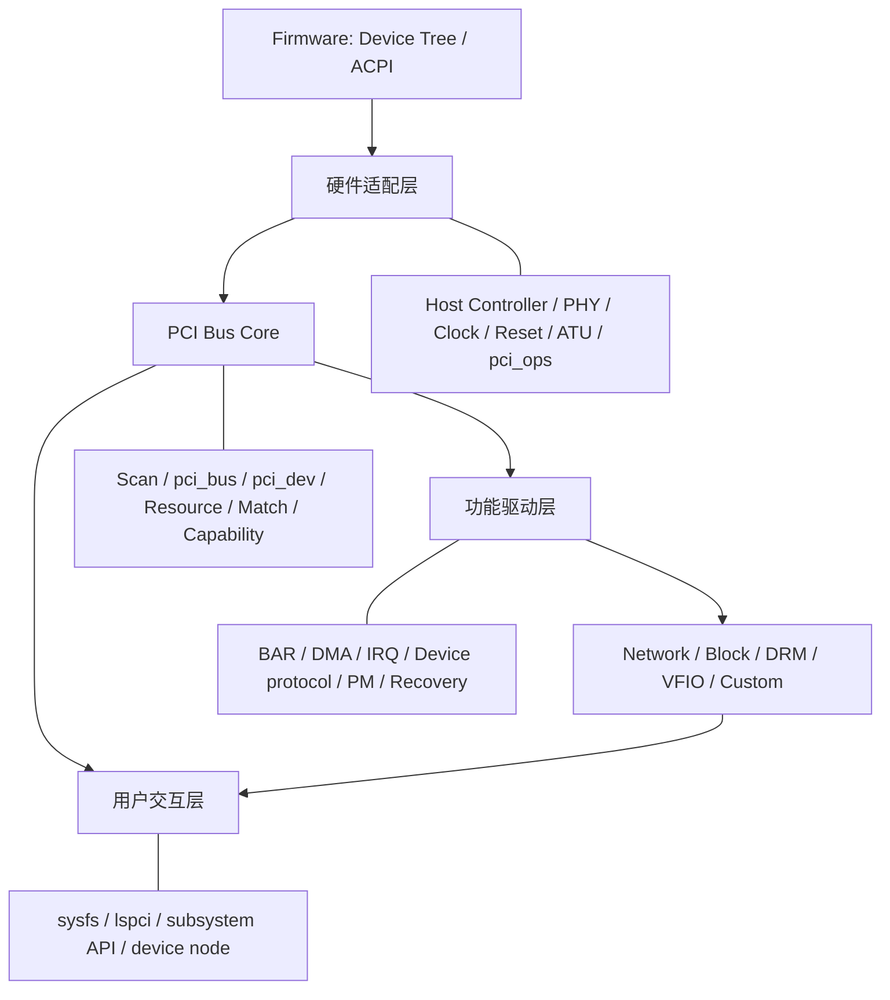
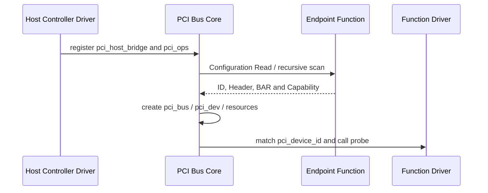

前三篇解决了 PCIe 协议、枚举和 BAR 地址问题。进入 Linux Driver 前，还需要先建立子系统全景：是谁把 SoC 控制器接入内核，谁扫描设备和分配资源，谁管理某块网卡或 NVMe，用户又通过什么接口观察和使用设备。

Linux 6.12 的 PCI 子系统可以分为四层：硬件适配层、PCI Bus Core、功能驱动层和用户交互层。野火 PCI 教程先讲总体架构再进入结构体，这个顺序很重要；如果直接从 `struct pci_dev` 开始，读者会看见很多字段，却不知道这些字段由哪一层产生。

## 一、四层架构总览



这四层不是四个独立模块，而是一条依赖链。硬件适配层先提供可用的 Root Bus 和配置访问，PCI Bus Core 才能扫描并创建对象；功能驱动绑定对象后才能启动设备；用户接口最后发布，不能早于底层资源准备完成。

## 二、硬件适配层连接 SoC 与通用 PCI Core

硬件适配层处理平台差异。x86 常从 ACPI MCFG 获得 ECAM，嵌入式 SoC 则可能使用 Device Tree、DesignWare Controller、独立 PHY、Clock、Reset、Regulator 和 iATU。

这一层的典型职责包括：

- 打开 Power Domain、Clock 和 PHY。
- 控制 PERST#，启动 LTSSM 并等待 Link Up。
- 解析 `bus-range`、`ranges`、`dma-ranges` 和中断映射。
- 建立 Configuration、Memory 和 I/O Outbound Window。
- 向通用层提供 `struct pci_ops` 配置访问。
- 创建并注册 `struct pci_host_bridge`。

如果硬件适配层只完成配置窗口，设备可能出现在 `lspci`，但 BAR MMIO 仍失败；如果 LTSSM 未进入 L0，PCI Core 连 Vendor ID 都读不到。功能驱动不能修复这一层的问题。

## 三、Firmware 描述资源，不代替驱动

Device Tree 或 ACPI 告诉内核硬件资源和拓扑入口。以 Device Tree 为例，Host 节点可能描述 Register、Clock、Reset、PHY、Bus Range、地址窗口和 Interrupt Map。

```dts
/* 简化示意：具体属性和地址必须以目标 SoC Binding 为准。 */
pcie@fe260000 {
    compatible = "vendor,soc-pcie";
    reg = <...>;          /* Controller/DBI/ATU Register Window */
    bus-range = <0x00 0xff>;
    ranges = <...>;       /* PCI Bus Address 与 CPU Address 的对应关系 */
    phys = <&pcie_phy>;   /* Link PHY 由平台驱动初始化 */
    status = "okay";
};
```

Firmware 描述的是资源和连接，Host Controller Driver 仍要执行初始化、错误回滚和 PM。把错误的 `ranges` 写进 Device Tree不会由 PCI Core自动纠正，只会在更晚阶段表现为 BAR 分配或访问异常。

## 四、PCI Bus Core 提供通用总线能力

PCI Bus Core 位于 `drivers/pci/`，它不理解网卡收包或 SSD 命令，而是实现所有 PCI Function 共享的机制：

- Root/Child Bus 创建与递归扫描。
- BDF 和 Configuration Header 解析。
- BAR Sizing、Resource 分配与 Bridge Window。
- `pci_bus`、`pci_dev`、Capability 和 sysfs 对象。
- `pci_driver` 注册、ID Match、Probe/Remove 调度。
- MSI、PM、AER、Hotplug 和 Reset 的通用协调。



Core 的输出是标准化对象和资源。下一篇会集中讲这些结构，第 06 篇再讲操作它们的函数。

## 五、功能驱动层管理设备业务

功能驱动只负责某类 Function，例如 `rtw88` 无线网卡、NVMe Controller、DRM GPU 或自定义 FPGA。它从 `probe(struct pci_dev *pdev, ...)` 接收已枚举对象，不重新扫描总线。

功能驱动通常完成：

1. Enable Function 与申请 BAR。
2. Iomap 并验证设备寄存器协议。
3. 设置 DMA Mask，分配 Ring/Buffer。
4. 申请 MSI/MSI-X/INTx。
5. 初始化 Firmware、Queue 和设备状态。
6. 注册到 Network、Block、DRM 等上层子系统。
7. 在 Remove、PM、AER 和 Reset 中停止并重建数据路径。

设备私有 BAR Offset、Descriptor 格式和 Firmware 命令都属于这一层，不能写入 PCI Bus Core，也不能推广为 PCIe 标准。

## 六、上层子系统提供统一业务接口

成熟设备通常继续接入 Linux 上层子系统。网卡注册 `net_device`/mac80211，NVMe 接入 Block Layer，GPU 接入 DRM，采集设备接入 V4L2。上层为用户提供稳定接口，也帮助处理 Queue、PM 和 Hotplug。

自定义驱动可以提供 Character Device、UIO、VFIO 或 sysfs，但选择接口应由业务模型决定。高频数据不适合通过 sysfs，未经隔离的控制 BAR 也不适合直接 mmap 给任意用户。

## 七、用户交互层既包含业务也包含管理

用户交互层有两类接口：

| 类型 | 示例 | 主要作用 |
| --- | --- | --- |
| PCI 管理/观察 | `/sys/bus/pci`、`lspci`、`setpci` | 查看拓扑、配置、资源和绑定 |
| 业务接口 | Network、Block、DRM、Char Device、VFIO | 使用设备实际功能 |

`lspci` 能看见 Function只证明枚举完成；能看到 Driver Link说明 Match/Probe成功；真正业务是否可用还要看对应子系统。调试时不能用一条命令替代整条证据链。

```bash
# 查看总线拓扑和目标 Function 的标准配置，不访问设备私有 BAR。
lspci -tv
lspci -s 0000:01:00.0 -vv

# 将 BDF 替换为目标设备，确认绑定驱动和 Resource。
readlink /sys/bus/pci/devices/0000:01:00.0/driver
cat /sys/bus/pci/devices/0000:01:00.0/resource
```

## 八、一次设备出现经历哪些层

```text
Board power / clock / reset / PHY
  -> Host Controller Driver 建立 Link 与 Window
  -> PCI Bus Core 扫描并创建 pci_dev
  -> pci_driver ID Match
  -> Function Driver probe 建立 BAR/DMA/IRQ
  -> 上层子系统注册
  -> 用户看到业务接口
```

这条顺序也决定故障定位。设备完全不可见查硬件适配层，资源分配异常查 PCI Core/Window，Driver不绑定查 Match/Probe，业务异常再查功能驱动与上层子系统。

## 九、源码阅读入口

| 层 | Linux 6.12 主要目录/文件 |
| --- | --- |
| 通用 PCI Core | `drivers/pci/` |
| 枚举 | `drivers/pci/probe.c` |
| 配置访问 | `drivers/pci/access.c` |
| 资源分配 | `drivers/pci/setup-bus.c`、`setup-res.c` |
| DesignWare Controller | `drivers/pci/controller/dwc/` |
| 功能驱动案例 | `drivers/net/wireless/realtek/rtw88/`、`drivers/nvme/host/` |

阅读时先确定函数属于哪一层，再追调用链；否则容易把 Controller DBI、PCI Core Capability 和设备私有 BAR 混在一起。

## 十、小结

Linux PCI 子系统由硬件适配层、PCI Bus Core、功能驱动层和用户交互层组成。硬件适配层解决平台差异，Core 解决通用枚举和对象，功能驱动管理设备协议，上层/用户接口提供实际使用方式。

理解四层边界后，下一步才适合阅读 `pci_host_bridge`、`pci_bus`、`pci_dev`、`pci_driver`、`pci_device_id` 和 `pci_ops` 等核心结构。

**一手资料**

- [Linux 6.12 PCI driver API](https://www.kernel.org/doc/html/v6.12/driver-api/pci/pci.html)
- [Linux PCI subsystem source](https://git.kernel.org/pub/scm/linux/kernel/git/stable/linux.git/tree/drivers/pci?h=linux-6.12.y)
- [Linux DesignWare PCIe source](https://git.kernel.org/pub/scm/linux/kernel/git/stable/linux.git/tree/drivers/pci/controller/dwc?h=linux-6.12.y)

**主要教学参考**

- [野火 Linux PCI 子系统总体架构](https://doc.embedfire.com/linux/rk356x/driver/zh/latest/linux_driver/subsystem_pci_subsystem.html)
