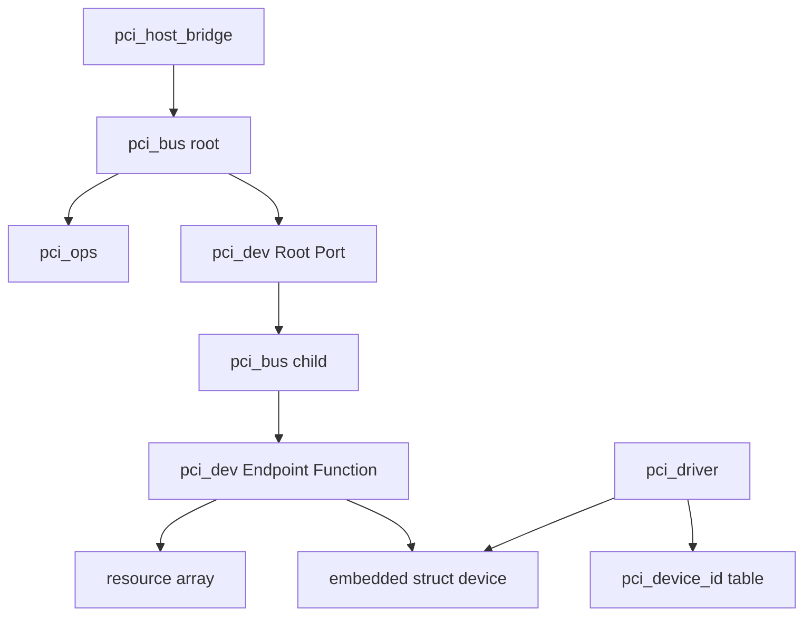
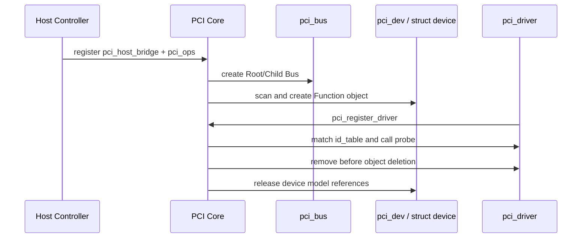

第 04 篇已经建立四层架构，本篇只回答对象问题：Linux 用哪些结构保存 Host、Bus、Function、Driver、匹配条件、配置访问和 BAR Resource，它们由谁创建、何时有效、彼此怎样连接。

野火 PCI 教程把 `pci_dev`、`pci_driver`、`pci_bus`、`pci_device_id` 和 `pci_ops` 作为五个核心结构。Linux 6.12 还需要把它们放回 `pci_host_bridge`、`struct device` 和 `struct resource` 的上下文，才能解释完整生命周期。

## 一、对象关系总览



Host Controller Driver创建 `pci_host_bridge` 并提供 `pci_ops`；PCI Core创建 `pci_bus` 和 `pci_dev`；功能模块注册 `pci_driver` 与 ID Table；Driver Match后，`pci_dev` 内嵌的 `struct device` 与 Driver 建立绑定。

## 二、pci_host_bridge：Root Bus 的平台入口

`struct pci_host_bridge` 表示一条 Host Hierarchy 的入口，保存 Root Bus、Bus Number范围、CPU/PCI Resource Window、配置访问和平台策略。

```c
/* Linux 6.12 简化注释版：只保留理解对象关系所需字段。 */
struct pci_host_bridge {
    struct device dev;          /* 接入 Driver Model 的 Host 对象 */
    struct pci_bus *bus;        /* 扫描后创建的 Root Bus */
    struct list_head windows;   /* 可分配给下游的 I/O/Memory Window */
    struct pci_ops *ops;        /* Configuration Space 访问方法 */
    void *sysdata;              /* Controller/体系结构私有上下文 */
    int busnr;                  /* Root Bus 起始编号 */
};
```

它由 Host Controller/平台代码分配和填写，在调用通用 Host Probe 前必须准备好 Window 与 `pci_ops`。Window错误时可能配置空间可读但 BAR无法分配，`ops` 错误时则连枚举都无法开始。

## 三、pci_bus：一个 Bus Number 对应的拓扑节点

`struct pci_bus` 表示一段编号域。Root Bus来自 Host Bridge，PCI-to-PCI Bridge 的下游形成 Child Bus。

```c
/* Linux 6.12 简化注释版：字段名称以官方源码为准。 */
struct pci_bus {
    struct list_head node;        /* 挂入父 Bus 的 children */
    struct pci_bus *parent;       /* Root Bus 的 parent 为 NULL */
    struct list_head children;    /* 下游 Child Bus */
    struct list_head devices;     /* 当前 Bus 上的 pci_dev */
    struct pci_dev *self;         /* 创建该 Child Bus 的 Bridge Function */
    struct pci_ops *ops;          /* 最终配置访问方法 */
    unsigned char number;         /* BDF 中的 Bus Number */
    struct resource *resource[PCI_BRIDGE_RESOURCE_NUM];
};
```

`pci_bus.self` 指向上游 Bus 上的 Bridge `pci_dev`，不是 Child Bus 上的 Endpoint。Root Bus没有上游 PCI Bridge，因此 `self` 为空。

## 四、pci_dev：一个 PCI Function

`struct pci_dev` 对应一个 Function，而不是整块卡。多功能设备的每个 Function可以拥有不同 BAR、Capability、Driver和 Power State。

```c
/* Linux 6.12 简化注释版：按信息来源分组。 */
struct pci_dev {
    struct list_head bus_list;    /* 挂入 pci_bus.devices */
    struct pci_bus *bus;          /* Function 所在 Bus */
    struct pci_bus *subordinate;  /* Bridge 才有的下游 Bus */
    unsigned int devfn;           /* Device/Function 编码 */

    u16 vendor, device;           /* Configuration Header 身份 */
    u16 subsystem_vendor, subsystem_device;
    u32 class;

    struct resource resource[DEVICE_COUNT_RESOURCE]; /* BAR/ROM/Window */
    struct device dev;            /* 接入通用 Driver Model */
};
```

PCI Core扫描配置空间后创建并初始化该对象。功能驱动 `probe()` 收到的 `pdev` 已经包含身份、拓扑和 BAR Resource，驱动不应重新执行总线扫描或 BAR Sizing。

## 五、pci_driver：Function Driver 的生命周期入口

`struct pci_driver` 由功能驱动定义并注册，描述支持哪些 Function以及 Probe、Remove、PM、Shutdown和 Error Recovery回调。

```c
/* 简化注释版：真实 Linux 6.12 结构还包含更多 Driver Core 字段。 */
struct pci_driver {
    struct list_head node;
    const char *name;                         /* 模块和 sysfs 中的驱动名 */
    const struct pci_device_id *id_table;    /* 以空项结束的匹配表 */
    int (*probe)(struct pci_dev *, const struct pci_device_id *);
    void (*remove)(struct pci_dev *);        /* 解绑时逆序释放资源 */
    void (*shutdown)(struct pci_dev *);      /* 系统关机，不等同 remove */
    const struct pci_error_handlers *err_handler;
    struct device_driver driver;             /* 接入通用 Driver Core */
};
```

`pci_register_driver()` 只把 Driver加入 PCI Bus Type，真正硬件初始化发生在匹配成功后的 `probe()`。`remove()` 没有返回值，因为解绑已经发生，Driver必须完成清理。

## 六、pci_device_id：匹配条件与 Driver Data

`struct pci_device_id` 可以按 Vendor、Device、Subsystem和 Class匹配。`driver_data` 允许同一 Probe选择不同 Chip Specification。

```c
/* 精确 ID 最不容易误绑定；示例 ID 仅用于教学。 */
static const struct pci_device_id demo_ids[] = {
    { PCI_DEVICE(0x1d6a, 0x1001),
      .driver_data = (kernel_ulong_t)&demo_gen1 },
    { PCI_DEVICE(0x1d6a, 0x1002),
      .driver_data = (kernel_ulong_t)&demo_gen2 },
    { } /* 终止项：PCI Core 依赖它判断表尾 */
};
MODULE_DEVICE_TABLE(pci, demo_ids);
```

Class-only匹配只适合真正遵守公开类规范的通用驱动。范围过宽会抢占网卡、存储或显示设备，不能把它当作“兼容更多设备”的捷径。

## 七、pci_ops：配置空间访问抽象

`struct pci_ops` 属于 Host/Bus侧，抽象 ECAM或 Controller Config Window差异。功能驱动通常不直接调用回调，而使用 `pci_read_config_*()`。

```c
/* Linux 6.12 简化注释版：回调返回 PCIBIOS 状态。 */
struct pci_ops {
    int (*read)(struct pci_bus *bus, unsigned int devfn,
                int where, int size, u32 *value);
    int (*write)(struct pci_bus *bus, unsigned int devfn,
                 int where, int size, u32 value);
};
```

`pci_ops` 只处理 Configuration Space，不访问 Endpoint业务 BAR，也不管理 DMA/IRQ。把两类访问混在一起会破坏 PCI Core与功能驱动的边界。

## 八、struct device 与 Driver Data

`pci_dev` 内嵌 `struct device`，因此 sysfs、uevent、DMA API、Runtime PM、Reference Count和 Parent/Child关系都通过通用 Device Model接入。

`pci_set_drvdata(pdev, data)` 把功能驱动私有对象挂到 `pdev->dev`，后续 Remove/PM/AER通过 `pci_get_drvdata()` 取回。它不把数据写进设备硬件，也不会替 Driver增加额外 `pci_dev` 引用。

异步 Worker或用户文件若需要在解绑期间持有设备对象，必须设计引用与停止合同。`pci_dev *` 不是可以永久缓存的裸指针。

## 九、struct resource 与 BAR 所有权

`pci_dev.resource[]` 保存 BAR、ROM和 Bridge Window的 Linux Resource。`start/end/flags` 表示 CPU侧地址范围和类型，父 Resource表达 Host/Bridge包含关系。

读取 `pci_resource_start/len/flags` 不改变所有权；`pci_request_region(s)` 才声明 Driver占用；`pci_iomap()` 再建立 `__iomem` 映射。三个阶段不能混为一个“拿 BAR”操作。

## 十、对象创建与销毁顺序



销毁按依赖逆序进行：先解绑功能驱动并停止业务，再从 Bus/Device Model删除对象，最后由 Host层回收平台资源。Surprise Removal时硬件可能已不响应，软件对象仍要安全完成引用释放。

## 十一、小结

`pci_host_bridge` 提供 Host入口，`pci_bus` 保存拓扑编号，`pci_dev` 表示 Function，`pci_driver` 表示功能驱动，`pci_device_id` 描述匹配，`pci_ops` 抽象配置访问，`struct device` 接入通用模型，`resource` 保存 BAR与窗口。

下一层不是继续增加结构体，而是学习操作这些对象的核心函数：注册、Enable、配置访问、Resource、Mapping、Capability、Bus Master与 PM。

**一手资料**

- [Linux 6.12 PCI driver API](https://www.kernel.org/doc/html/v6.12/driver-api/pci/pci.html)
- [Linux PCI core headers](https://git.kernel.org/pub/scm/linux/kernel/git/stable/linux.git/tree/include/linux/pci.h?h=linux-6.12.y)
- [Linux Driver Model](https://docs.kernel.org/driver-api/driver-model/overview.html)

**主要教学参考**

- [野火 PCI 核心结构章节](https://doc.embedfire.com/linux/rk356x/driver/zh/latest/linux_driver/subsystem_pci_subsystem.html)
