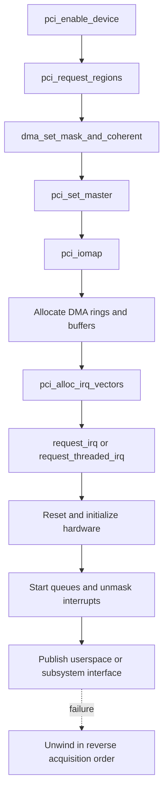
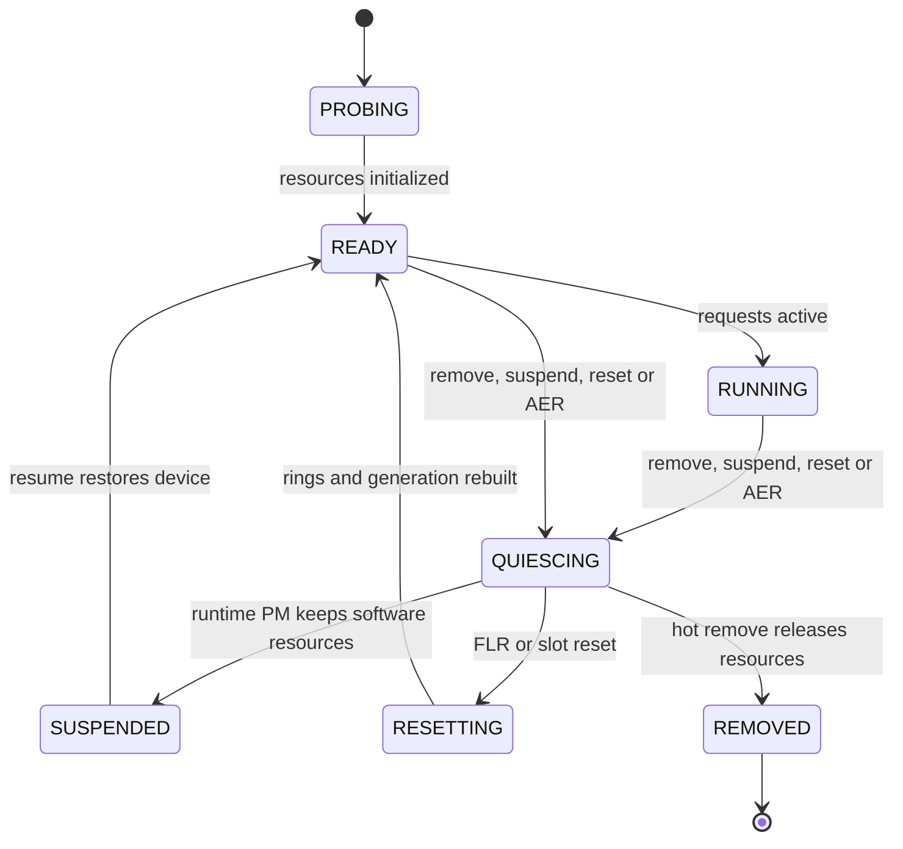
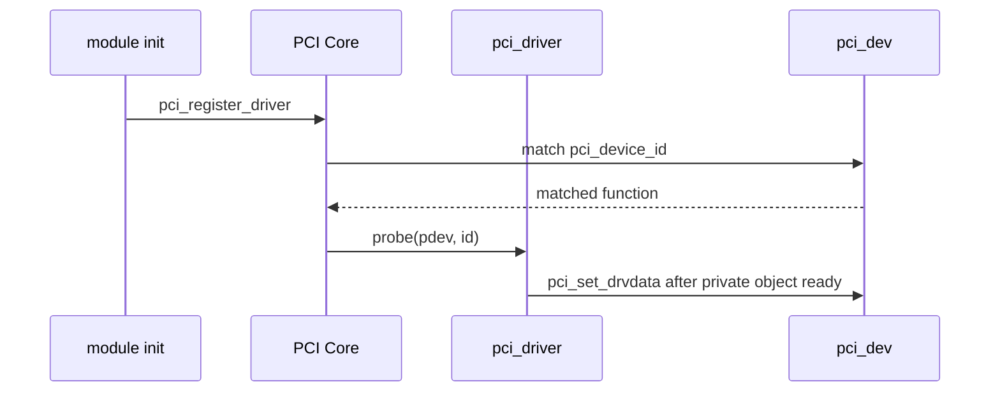
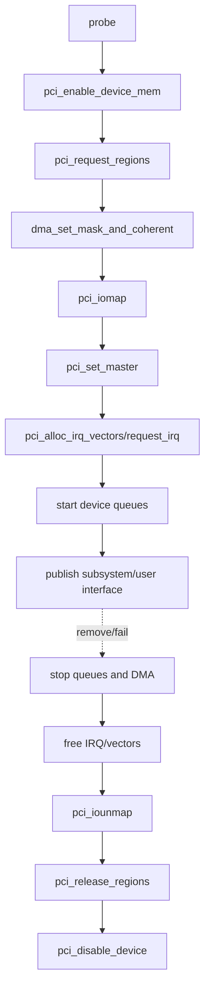
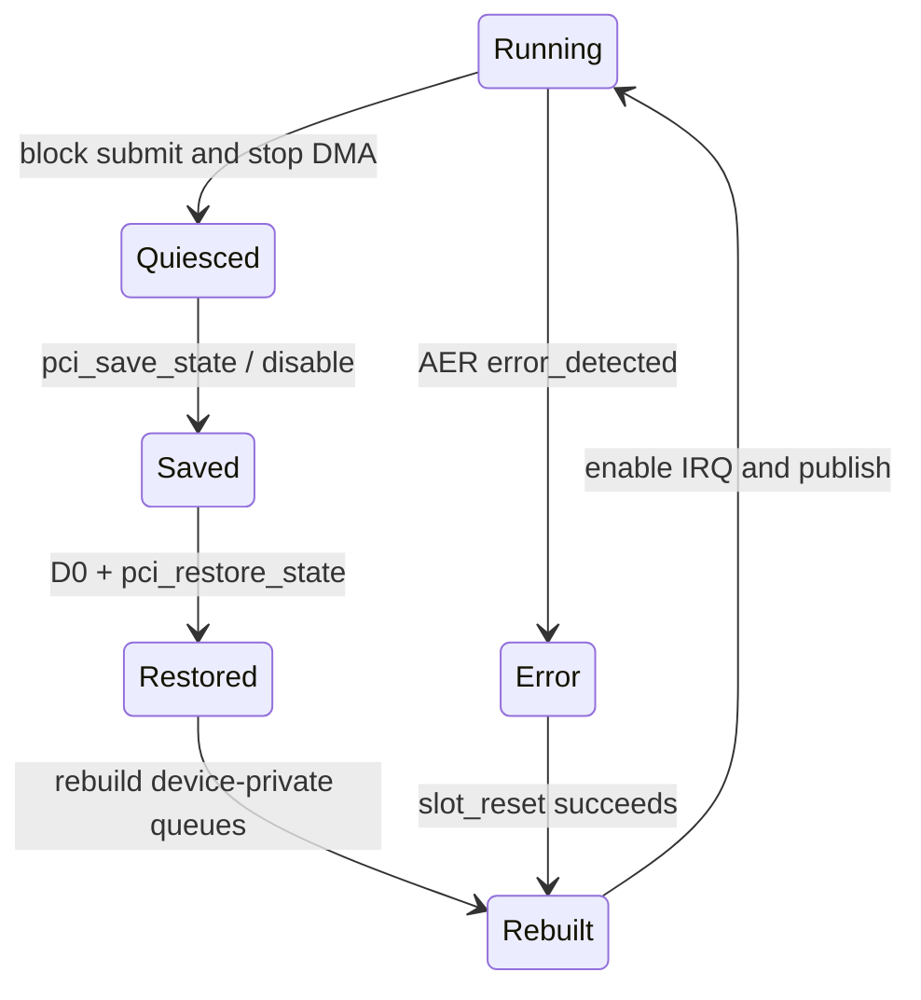

前三篇已经证明：Endpoint 完成链路训练后，PCI Core 通过配置空间创建 `pci_dev`、分配 BAR，并把资源放入系统地址树。Device Driver 的工作是安全接管这些资源、配置设备、发布业务接口，并在任何失败或硬件消失时逆序收敛。

本文所有 API 与生命周期回调固定以 Linux 6.12 为基线。

驱动框架的核心不是 `module_pci_driver()` 宏，而是**状态发布边界**：设备何时可以发 DMA/中断，用户何时可以提交请求，发生错误后哪些对象仍可信。

## 一、struct pci_driver 把匹配和生命周期入口连接起来

`struct pci_driver` 至少提供 name、ID table、probe/remove；还可提供 shutdown、PM 与 AER error handler。

```c
static const struct pci_device_id demo_ids[] = {
    { PCI_DEVICE(0x1a2b, 0x1000) },
    { }
};
MODULE_DEVICE_TABLE(pci, demo_ids);

static struct pci_driver demo_driver = {
    .name = "demo_pcie",
    .id_table = demo_ids,
    .probe = demo_probe,
    .remove = demo_remove,
    .driver.pm = &demo_pm_ops,
    .err_handler = &demo_err_handlers,
};
module_pci_driver(demo_driver);
```

进入 probe 时，Link 与配置访问已经工作，`pci_dev` 和 BAR resource 已存在；但 Memory Space/Bus Master、DMA mask、映射、IRQ 和设备内部状态未必启用。驱动仍需验证 Device revision、BAR 大小和 capability。

`pci_set_drvdata()` 只把私有对象指针挂到 `pci_dev`，不增加引用。remove/PM/AER callback 可通过 `pci_get_drvdata()` 取回。私有对象寿命必须覆盖 IRQ、work、用户 fd、DMA 和所有 callback。

## 二、probe 按依赖顺序取得资源

可靠顺序是：enable device -> request BAR -> DMA mask -> bus master -> iomap -> allocate queue/DMA -> allocate IRQ vector -> request IRQ -> initialize hardware -> 发布用户接口。



```c
static int demo_probe(struct pci_dev *pdev,
                      const struct pci_device_id *id)
{
    struct demo_dev *dev;
    int ret;

    ret = pci_enable_device(pdev);
    if (ret)
        return ret;

    ret = pci_request_regions(pdev, "demo_pcie");
    if (ret)
        goto err_disable;

    ret = dma_set_mask_and_coherent(&pdev->dev, DMA_BIT_MASK(64));
    if (ret) {
        ret = dma_set_mask_and_coherent(&pdev->dev, DMA_BIT_MASK(32));
        if (ret)
            goto err_regions;
    }

    pci_set_master(pdev);
    dev = devm_kzalloc(&pdev->dev, sizeof(*dev), GFP_KERNEL);
    if (!dev) {
        ret = -ENOMEM;
        goto err_master;
    }

    dev->pdev = pdev;
    mutex_init(&dev->state_lock);
    dev->state = DEMO_PROBING;
    pci_set_drvdata(pdev, dev);

    dev->bar0 = pci_iomap(pdev, 0, 0);
    if (!dev->bar0) {
        ret = -ENOMEM;
        goto err_data;
    }

    ret = demo_alloc_queues(dev);
    if (ret)
        goto err_iounmap;

    ret = pci_alloc_irq_vectors(pdev, 1, DEMO_MAX_QUEUES,
                                PCI_IRQ_MSIX | PCI_IRQ_MSI | PCI_IRQ_LEGACY);
    if (ret < 0)
        goto err_queues;
    dev->num_vec = ret;

    ret = demo_request_irqs(dev);
    if (ret)
        goto err_vectors;

    ret = demo_hw_init(dev);
    if (ret)
        goto err_irqs;

    dev->state = DEMO_READY;
    return demo_publish(dev);

err_irqs:
    demo_free_irqs(dev);
err_vectors:
    pci_free_irq_vectors(pdev);
err_queues:
    demo_free_queues(dev);
err_iounmap:
    pci_iounmap(pdev, dev->bar0);
err_data:
    pci_set_drvdata(pdev, NULL);
err_master:
    pci_clear_master(pdev);
err_regions:
    pci_release_regions(pdev);
err_disable:
    pci_disable_device(pdev);
    return ret;
}
```

DMA mask 必须在分配/map 前设置；`pci_set_master()` 必须在设备发 DMA 前设置；IRQ handler 在 hardware start 前注册，可以避免早到中断无人处理，但设备中断仍应保持 mask，直到 ring/status 清理完成。

## 三、硬件启动和用户接口是两个发布边界

初始化硬件通常包含 reset、读取 capability/version、写 ring base/size、清 stale status、设置 vector mapping，再 enable queue/interrupt。每一步都应有 timeout 和可恢复错误，而不是无限轮询。

只有 ring base/ownership、IRQ handler 和设备状态一致后才能启动 DMA。启动后才发布 misc/char device、netdev、block 或 accelerator API，保证用户一旦进入 submit，底层已 READY。

用户 fd 会让对象寿命跨越 remove。驱动需要 open/reference count、dead flag 和 wait queue：remove 先撤销入口，已有 fd 的 ioctl/read/poll 返回 `-ENODEV` 或 HUP；最终内存在最后引用释放后回收。不能在 remove 直接 `kfree(dev)` 后让 file operations 继续访问。

中断 handler 也只能访问在 `synchronize_irq()` 前仍有效的对象。workqueue/tasklet/NAPI/timer 必须在释放 queue/BAR 前 cancel/flush。

## 四、Managed API 减少释放代码，但不替代状态机

PCI managed API 如 `pcim_enable_device()`、`pcim_iomap_regions()`、`pcim_iomap_table()` 可以在 detach 时自动释放。devm 可管理内存、IRQ 等。它们适合减少 error label，但不会自动执行设备协议停机。

正确顺序仍是：撤销用户入口 -> 阻止新请求 -> mask/stop device -> flush posted write -> 等待 DMA idle -> synchronize IRQ -> cancel work -> 释放 mapping/buffer。若依赖 devm 在 remove 返回后自动 free IRQ/BAR，却没有先停止设备，硬件仍可能 DMA 到已释放内存。

managed 与 manual API 不应对同一资源混用。使用 `pcim_iomap_regions()` 后不再手工 `pci_release_regions()`；否则 double release。团队应为每类资源统一策略并在 code review 中检查。

## 五、remove、runtime PM、reset 与 AER 复用同一停止路径

这些入口原因不同，但都需要 quiesce：阻止新请求、停止 queue/DMA、mask IRQ、等待 in-flight 收敛、保存或重建状态。



remove 示例：

```c
static void demo_remove(struct pci_dev *pdev)
{
    struct demo_dev *dev = pci_get_drvdata(pdev);

    demo_unpublish(dev);
    mutex_lock(&dev->state_lock);
    dev->state = DEMO_QUIESCING;
    mutex_unlock(&dev->state_lock);

    demo_hw_stop(dev);
    demo_free_irqs(dev);        /* includes synchronize_irq */
    pci_free_irq_vectors(pdev);
    demo_cancel_all_work(dev);
    demo_free_queues(dev);
    pci_iounmap(pdev, dev->bar0);
    pci_clear_master(pdev);
    pci_release_regions(pdev);
    pci_disable_device(pdev);
    pci_set_drvdata(pdev, NULL);
}
```

runtime PM suspend 保留软件对象，但设备可能进入 D3、丢失寄存器。进入前需 `pci_save_state()`/设备协议保存，resume 恢复 power、配置状态、ring、IRQ，再允许请求。`pm_runtime_get_sync()`/put 的引用必须与用户操作配对。

AER 通过 `struct pci_error_handlers` 调用 `error_detected()`、`slot_reset()`、`resume()` 等。error_detected 阻止 I/O并报告能否恢复；slot_reset 在 reset 后重建硬件；resume 重新发布。恢复必须使用新 generation，丢弃 reset 前迟到 completion。

## 六、验证 probe 和 teardown 的证据

```bash
lspci -s BDF -vv
readlink /sys/bus/pci/devices/BDF/driver
cat /proc/interrupts
cat /sys/bus/pci/devices/BDF/power/runtime_status
dmesg -w
```

probe 失败保留第一个错误：BAR size/ID、DMA mask、IRQ vector、reset timeout。不要在统一 `return -ENODEV` 时丢失证据。Fault injection 可以覆盖分配/IRQ/timeout error label。

teardown 测试包含：模块加载/卸载循环、用户 fd 保持时 remove、业务中 FLR/hot reset、runtime suspend/resume、AER 注入、surprise removal。每轮后检查 IRQ/work、DMA mapping、queue request、引用计数和 resource tree 回到基线。

**参考资料**

- [How To Write Linux PCI Drivers](https://docs.kernel.org/PCI/pci.html)
- [Linux PCI Error Recovery](https://docs.kernel.org/PCI/pci-error-recovery.html)
- [PCI Power Management](https://docs.kernel.org/power/pci.html)

## 七、注册、匹配与 probe 的真实入口

`module_pci_driver()` 展开模块 init/exit，内部调用 `pci_register_driver()` 与 `pci_unregister_driver()`。

Driver 注册后，PCI Bus 会尝试匹配已存在 Function；以后 Hotplug Function 也进入同一流程。



`pci_set_drvdata()` 是关联点，不应早于私有对象完整初始化，也不应晚于用户接口发布。

remove 开头可取回对象并阻止新入口。

## 八、推荐的资源获取与逆序回滚



DMA Mask 通常应在分配 DMA Buffer 前设置。

Bus Master 应在设备真正需要发 DMA 前打开，stop/remove 时先让设备停止，再清理映射与资源。

Managed API 自动执行释放 callback，但仍要在 remove/PM/AER 中主动停止硬件。

## 九、PM 与 AER 恢复通用配置和私有配置

System/runtime suspend 常调用 `pci_save_state()`，resume 调用 `pci_restore_state()`，并恢复 enable/bus master。

这些接口保存 PCI Configuration State，不包含 BAR 内 Device Queue、Firmware Context 与 Descriptor Ring。



AER `error_detected`、`slot_reset` 与 PM resume 可以复用底层 stop/rebuild helper，但不能重复注册用户接口。

## 十、小结

Linux PCI 驱动要按依赖顺序接管 `pci_dev`：enable、resource、DMA、bus master、MMIO、queue、IRQ、hardware、用户接口。错误和 remove 按相反顺序收敛，managed API 只能帮助释放，不能替代设备停机。

runtime PM、FLR、AER 和 hot remove 都应复用同一 quiesce/reset 状态机。下一篇将展开异步通知，解释 INTx、MSI 和 MSI-X 如何把设备事件送到正确 CPU/queue。
