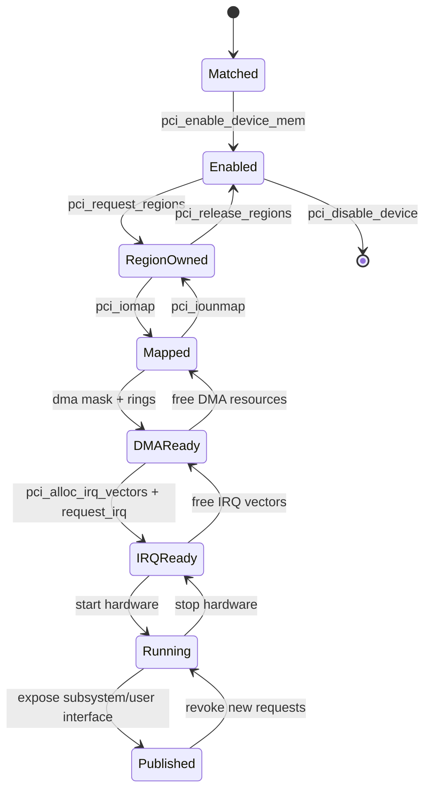
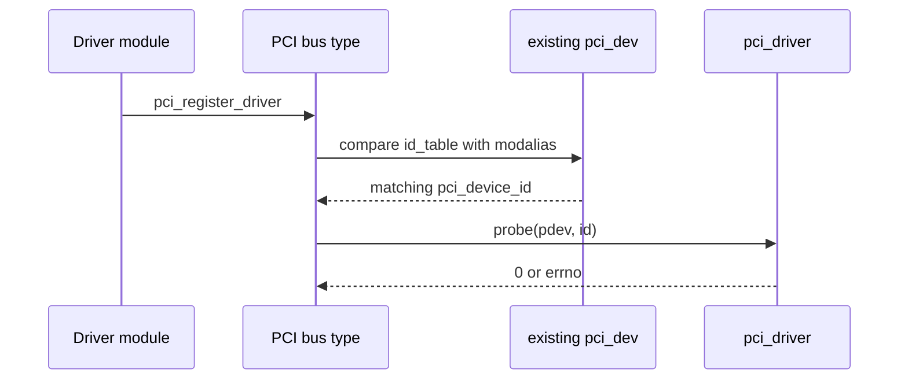

第 04 篇已经建立 `pci_dev`，但此时设备只是“被 PCI Core 认识”，并不代表它能执行 DMA 或响应用户请求。功能驱动必须按依赖顺序打开 Decode、申请 BAR、建立映射、设置 DMA 能力、申请 IRQ、启动硬件，最后才把业务接口发布给其他内核子系统或用户空间。

很多 PCIe 教程把这些 API 排成清单，读者能记住函数名，却无法回答中途失败时哪些状态已经改变。本文把 `probe()` 视为一个状态机：每成功一步就获得一种能力，也新增一种必须撤销的责任；任何失败都只能逆序回滚到进入 `probe()` 前的状态。

本文以 Linux 6.12 为基线，使用原创的通用设备骨架说明生命周期。示例 VID/DID 和寄存器协议只表示教学设备，不能直接改成真实网卡 ID 后加载。

## 一、先看问题：probe() 到底要把设备带到什么状态

`probe()` 的目标不是“返回 0”，而是建立一个对并发和移除都成立的运行合同。返回成功时，设备必须已经具备业务所需的 BAR、DMA、IRQ 和私有状态，并且任何外部入口都只能看到完整初始化后的对象。



因为外部调用者可能在接口发布后立刻进入，所以“发布”必须是最后一步。反过来 remove 的第一步是撤销或关闭新请求入口，然后才停止硬件。若先发布字符设备再申请 IRQ，另一个 CPU 可能在 `probe()` 尚未结束时访问未初始化队列。

这条状态机也解释了错误标签为什么按逆序排列。`goto err_dma` 不是代码风格偏好，而是记录当前已经拥有的最高层资源；跳转目标只撤销已经成功的步骤，不能重复释放，也不能漏掉早期状态。

## 二、pci_register_driver() 触发匹配，不直接控制硬件

一个 PCI 功能驱动通常定义 `struct pci_driver`：

```c
static const struct pci_device_id demo_ids[] = {
    { PCI_DEVICE(0x1d6a, 0x1001) }, /* teaching-only ID */
    { }
};
MODULE_DEVICE_TABLE(pci, demo_ids);

static struct pci_driver demo_driver = {
    .name = "pcie_teaching",
    .id_table = demo_ids,
    .probe = demo_probe,
    .remove = demo_remove,
};

module_pci_driver(demo_driver);
```

`module_pci_driver()` 最终调用 `pci_register_driver()`，把 Driver 注册到 PCI Bus Type。Driver Model 会把它与已经存在的 `pci_dev` 比较，也会在以后热插入设备时再次匹配。因此注册顺序与设备枚举顺序可以不同。

匹配主要依据 `pci_device_id` 中的 Vendor、Device、Subsystem、Class 和 Mask。精确 `PCI_DEVICE()` 最安全；Class 匹配适合真正遵守公开类规范的通用驱动，但范围过宽会抢占本应由专用驱动管理的设备。



`probe()` 返回 0 后 Driver Core 才认为绑定成功。返回负 errno 时，`pci_dev` 仍由 PCI Core 拥有，但本次 Driver 不得残留 BAR、IRQ、DMA 或外部接口；这就是回滚必须完整的原因。

## 三、第一步建立私有对象和 Driver Data

驱动通常先分配一个私有结构，集中保存 `pci_dev`、BAR 映射、Queue、IRQ Vector、锁、状态和用户接口对象：

```c
struct demo_dev {
    struct pci_dev *pdev;
    void __iomem *bar0;
    int nvec;
    bool stopping;
    /* DMA rings, locks and subsystem objects follow. */
};
```

`pci_set_drvdata(pdev, demo)` 把私有对象挂到内嵌 `struct device` 的 Driver Data 上，后续 `remove()`、PM 或 AER 回调可以用 `pci_get_drvdata()` 取回。它不改变硬件，也不增加 `pci_dev` 引用，只建立当前绑定关系中的软件关联。

| API | 调用前提 | 成功变化 | 失败/撤销 |
| --- | --- | --- | --- |
| `devm_kzalloc()` | `pdev->dev` 有效 | 获得零初始化私有对象 | 返回 `NULL`，尚无硬件状态 |
| `pci_set_drvdata()` | 私有对象已分配 | 回调可找到同一对象 | `pci_set_drvdata(pdev, NULL)` 可清除 |
| `pci_get_drvdata()` | Driver 已设置数据 | 返回原指针 | 未设置时为 `NULL` |

即使使用 Managed Allocation，驱动仍要设计停机顺序。Managed Resource 只保证对象在解绑时最终释放，不会自动阻止 IRQ Handler、Worker 或用户线程继续访问即将失效的私有状态。

## 四、pci_enable_device_mem() 打开可用的 Memory Decode

`pci_enable_device_mem()` 检查并启用 Memory BAR 所需状态，可能恢复固件/电源变化后的资源设置，并增加 Enable 引用。它不会申请 BAR 所有权，不会映射寄存器，也不会自动允许 Bus Master DMA。

| 项目 | `pci_enable_device_mem()` |
| --- | --- |
| 调用前提 | `pci_dev` 已枚举，BAR Resource 已由 Core 记录 |
| 输入 | 当前 Function 与平台资源状态 |
| 核心动作 | 确保 Memory Resource 可用并打开相应 Command Decode |
| 成功结果 | Function 能响应已分配 Memory BAR 的事务 |
| 失败结果 | 返回 errno，Driver 仍不能访问 BAR |
| 对称清理 | `pci_disable_device()` |

为什么 Enable 必须早于 BAR 业务访问？因为 BAR Register 有地址并不代表 Command Memory Space Enable 已打开。另一方面，它又应早于 `pci_request_regions()`，这样失败路径可以清晰地表示“设备 Enabled 但尚未拥有 Region”。

`pci_enable_device()` 同时考虑 I/O 与 Memory Resource；只使用 Memory BAR 的现代设备通常可以选择 `_mem` 版本表达需求。选择哪个接口应由设备 Resource 类型决定，而不是机械复制模板。

## 五、Request Region 与 Iomap 分别建立所有权和访问能力

驱动接着检查 `pci_resource_flags()` 与 `pci_resource_len()`，确认 BAR Index、类型和最小长度符合设备协议。检查完成后使用 `pci_request_regions()` 申请所有可请求 BAR，或者使用 `pci_request_region(pdev, bar, name)` 只申请需要的 BAR。

| API | 状态变化 | 常见失败 | 对称清理 |
| --- | --- | --- | --- |
| `pci_request_regions()` | Resource Tree 标记 Driver 拥有 BAR | `-EBUSY`，已有 Owner | `pci_release_regions()` |
| `pci_iomap()` | 建立 `void __iomem *` CPU 映射 | `NULL`，映射失败 | `pci_iounmap()` |
| `pci_resource_len()` | 只读取 Core 保存的长度 | 不改变状态 | 无 |

因为 Request 解决所有权、Iomap 解决 CPU 地址映射，所以顺序不能颠倒。先映射后申请会让 Driver 在冲突被发现之前短暂持有并可能访问不属于自己的区域。

映射成功仍不表示设备协议正确。Probe 通常读取一个无副作用的 ID/Version Register，验证它与预期 ABI 一致；未知设备 BAR 不能用“读取前 64 字节看看”的方式探测，因为 Read-Clear、FIFO 和状态寄存器可能产生副作用。

## 六、DMA Mask 与 Bus Master 是两种不同许可

设备要访问 Host Memory，驱动先设置 DMA Address 能力：

```c
ret = dma_set_mask_and_coherent(&pdev->dev, DMA_BIT_MASK(64));
if (ret) {
    ret = dma_set_mask_and_coherent(&pdev->dev, DMA_BIT_MASK(32));
    if (ret)
        goto err_iounmap;
}

pci_set_master(pdev);
```

`dma_set_mask_and_coherent()` 告诉 DMA Layer 设备能够产生多少位地址，并影响 Direct Mapping、IOMMU 或 SWIOTLB 选择。`pci_set_master()` 则设置 PCI Command Bus Master Enable，允许 Function 发起 Memory Request。一个解决地址可达性，一个打开事务权限，因此不能只调用其中一个。

| API | 调用前状态 | 成功结果 | 对称动作 |
| --- | --- | --- | --- |
| `dma_set_mask_and_coherent()` | 尚未分配业务 DMA Buffer | DMA API 知道地址位宽 | 通常随 Device 生命周期结束 |
| `pci_set_master()` | Device Enabled，协议允许 DMA | Bus Master Enable 置位 | `pci_clear_master()` 或 `pci_disable_device()` |

DMA Ring 和 Payload 必须在 Mask 成功后分配，否则早期分配得到的地址可能超出设备能力。Bus Master 可以在 Queue 尚未启动时打开，但设备私有寄存器不能在 Descriptor、IRQ 和 Stop 路径准备好之前启动真正 DMA。

## 七、IRQ 准备好后才能启动硬件和发布接口

现代驱动使用 `pci_alloc_irq_vectors()` 在 MSI-X、MSI 与 INTx 之间按能力分配向量，再通过 `pci_irq_vector()` 获得 Linux IRQ Number，并调用 `request_irq()` 或 `request_threaded_irq()` 注册 Handler。

```c
nvec = pci_alloc_irq_vectors(pdev, 1, wanted,
                             PCI_IRQ_MSIX | PCI_IRQ_MSI | PCI_IRQ_LEGACY);
if (nvec < 0) {
    ret = nvec;
    goto err_dma;
}

ret = request_threaded_irq(pci_irq_vector(pdev, 0),
                           demo_irq, demo_irq_thread,
                           IRQF_SHARED, "pcie_teaching", demo);
if (ret)
    goto err_vectors;
```

| API | 成功变化 | 失败后状态 | 清理 |
| --- | --- | --- | --- |
| `pci_alloc_irq_vectors()` | PCI/MSI Domain 与 Device Vector 建立 | 尚无 Handler | `pci_free_irq_vectors()` |
| `request_threaded_irq()` | Linux IRQ 可以进入 Driver | Vector 仍已分配 | `free_irq()` 后再 Free Vector |

硬件中断 Mask 应在 Handler 注册前保持关闭。Queue、DMA Buffer、锁和 Handler 全部准备好后，驱动才清状态、Program Vector、启动 DMA，并最终发布 netdev、block device、char device 或 sysfs 接口。

因此正确可见性顺序是“内部资源完整 -> 硬件开始 -> 外部接口发布”。remove 则先撤销外部入口，再设置 `stopping`、Mask Device IRQ、停止 DMA、`synchronize_irq()`，然后释放 Handler 和 Vector。

## 八、完整 probe() 用单一回滚链表达状态

下面的骨架省略设备私有寄存器，但保留资源依赖：

```c
static int demo_probe(struct pci_dev *pdev,
                      const struct pci_device_id *id)
{
    struct demo_dev *demo;
    int ret;

    demo = devm_kzalloc(&pdev->dev, sizeof(*demo), GFP_KERNEL);
    if (!demo)
        return -ENOMEM;
    demo->pdev = pdev;
    pci_set_drvdata(pdev, demo);

    ret = pci_enable_device_mem(pdev);
    if (ret)
        return ret;

    ret = pci_request_regions(pdev, "pcie_teaching");
    if (ret)
        goto err_disable;

    demo->bar0 = pci_iomap(pdev, 0, 0);
    if (!demo->bar0) {
        ret = -ENOMEM;
        goto err_regions;
    }

    ret = dma_set_mask_and_coherent(&pdev->dev, DMA_BIT_MASK(64));
    if (ret)
        goto err_iounmap;
    pci_set_master(pdev);

    ret = demo_alloc_dma(demo);
    if (ret)
        goto err_master;

    ret = demo_request_irqs(demo);
    if (ret)
        goto err_dma;

    ret = demo_start_hardware(demo);
    if (ret)
        goto err_irqs;

    return demo_publish(demo);

err_irqs:
    demo_free_irqs(demo);
err_dma:
    demo_free_dma(demo);
err_master:
    pci_clear_master(pdev);
err_iounmap:
    pci_iounmap(pdev, demo->bar0);
err_regions:
    pci_release_regions(pdev);
err_disable:
    pci_disable_device(pdev);
    return ret;
}
```

真实代码还必须处理 `demo_publish()` 失败：如果硬件已经启动，先阻止新请求并停止硬件，再进入 IRQ/DMA 回滚。这里的核心不是标签名称，而是每个 Label 对应一个明确状态边界。

## 九、remove、PM 与 AER 共享同一停止合同

`remove()` 不返回错误，因为解绑已经发生；它必须把对象带回未绑定状态。典型顺序是撤销外部接口、设置 Stopping、停止硬件、同步异步上下文、释放 IRQ、释放 DMA、清 Bus Master、解除映射、释放 Region、Disable Device。

Runtime Suspend、System Suspend 和 AER Recovery 不一定释放所有资源，但同样需要一个“Quiesce Contract”：停止新提交，等待或取消在途请求，Mask IRQ，保证设备不会继续 DMA。因为这些路径共享状态，所以把停止逻辑拆成可复用、幂等或有明确前提的 Helper，比在每个回调复制顺序更可靠。

System Resume 常见状态恢复顺序为 `pci_restore_state()`、重新启用 Device、恢复 Bus Master、重建设备私有寄存器与 Queue，再开放请求。`pci_restore_state()` 只恢复 PCI Core 保存的配置状态，不会替驱动恢复设备内部 Ring、Firmware 或业务状态。

AER `slot_reset()` 之后也要按设备复位后的真实状态重建。若旧 DMA Completion 在 Reset 后晚到，驱动还需要 Generation/Request ID 隔离；这些细节会在第 09 和第 12 篇展开。

## 十、本篇检查点

现在应当能够为 `pci_enable_device_mem()`、`pci_request_regions()`、`pci_iomap()`、`dma_set_mask_and_coherent()`、`pci_set_master()`、`pci_alloc_irq_vectors()` 分别说出调用前提、成功后的新增能力和对称释放，而不是只背一个固定函数顺序。

还应能够解释为什么接口最后发布、remove 最先撤销接口，为什么 DMA Mask 与 Bus Master 不能互相替代，以及为什么 Managed Resource 不会自动停止 IRQ、Worker 和用户请求。

## 十一、小结：下一篇先观察 PCI Core 已经准备了什么

`pci_register_driver()` 把 Driver 接入 Bus Match，`probe()` 再按 Enable、Region、Map、DMA、IRQ、Hardware、Publish 的顺序把一个已枚举 Function 变成可用设备。每一步成功都会新增所有权，因此失败与 remove 必须逆序撤销。

下一篇不会立即控制 DMA，而是编写一个只读 PCI Explorer，观察 `pci_dev` 中已经存在的身份、Capability 和 Resource。这样读者可以先把 02～05 的对象与系统输出对应起来，再进入中断和数据搬运。

**一手资料**

- [Linux 6.12 PCI driver API](https://www.kernel.org/doc/html/v6.12/driver-api/pci/pci.html)
- [Linux Managed PCI Resource API](https://docs.kernel.org/driver-api/driver-model/devres.html)
- [Linux 6.12 PCI driver core source](https://git.kernel.org/pub/scm/linux/kernel/git/stable/linux.git/tree/drivers/pci/pci-driver.c?h=linux-6.12.y)
