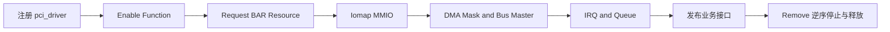

核心结构说明“对象是什么”，核心函数说明“驱动可以怎样改变对象和硬件状态”。函数不能只记名字：必须知道调用前提、成功后获得的能力、失败时仍拥有什么，以及哪个函数负责对称清理。

本篇沿用野火 PCI 核心函数分类，并以 Linux 6.12 官方 API 为准。每组先给函数原型和语义，最后再把它们组合成可回滚的 `probe()`。




## 一、注册与注销 pci_driver

```c
int __pci_register_driver(struct pci_driver *drv,
                          struct module *owner,
                          const char *mod_name);
void pci_unregister_driver(struct pci_driver *drv);
```

Driver通常调用宏 `pci_register_driver(drv)` 或 `module_pci_driver(drv)`。注册成功只表示 Driver进入 PCI Bus Type，已有/未来 `pci_dev` 可以与 `id_table` 匹配；没有匹配设备也不算注册失败。

注销会对所有已绑定设备调用 `remove()`，等待 Driver解除绑定后再移出 Bus。模块退出不能先释放全局状态再注销 Driver，否则 Remove可能访问已释放对象。

## 二、Enable 与 Disable

```c
int pci_enable_device(struct pci_dev *pdev);
int pci_enable_device_mem(struct pci_dev *pdev);
void pci_disable_device(struct pci_dev *pdev);
```

`pci_enable_device()` 面向 I/O 与 Memory Resource，`pci_enable_device_mem()` 只要求 Memory Resource。它们唤醒设备、确认资源并启用相应 Decode，调用可能失败。

| 项目 | 含义 |
| --- | --- |
| 前提 | `pci_dev` 已枚举，Resource 已由 PCI Core 建立 |
| 成功 | Function 可以响应所需 I/O/Memory Window |
| 失败 | 不能访问 BAR，尚未获得 Region/Mapping |
| 清理 | 每次成功 Enable 最终对应一次 `pci_disable_device()` |

Enable 有引用计数语义，重复 Enable不能用一次 Disable强制关闭所有用户。

## 三、配置空间读写

```c
/* 配置访问按宽度分组；返回值表示访问状态，寄存器值通过指针返回。 */
int pci_read_config_byte(struct pci_dev *pdev, int where, u8 *val);
int pci_read_config_word(struct pci_dev *pdev, int where, u16 *val);
int pci_read_config_dword(struct pci_dev *pdev, int where, u32 *val);

int pci_write_config_byte(struct pci_dev *pdev, int where, u8 val);
int pci_write_config_word(struct pci_dev *pdev, int where, u16 val);
int pci_write_config_dword(struct pci_dev *pdev, int where, u32 val);
```

`where` 是 Configuration Space Offset，访问宽度必须与对齐和寄存器定义一致。返回值不是读取数据，必须单独检查；失败时不能输出未初始化变量。

```c
u16 command;
int ret;

/* 读取标准 Command Register；返回状态和寄存器值必须分别处理。 */
ret = pci_read_config_word(pdev, PCI_COMMAND, &command);
if (ret)
    return pcibios_err_to_errno(ret);

/* 此处只观察标准字段，不写未知设备配置空间。 */
dev_info(&pdev->dev, "PCI_COMMAND=%#x\n", command);
```

配置写可能改变 BAR、Bus Master、MSI、PM或 Reset，未知设备上不能“试写看看”。

## 四、读取 BAR Resource

```c
resource_size_t pci_resource_start(struct pci_dev *pdev, int bar);
resource_size_t pci_resource_len(struct pci_dev *pdev, int bar);
unsigned long pci_resource_flags(struct pci_dev *pdev, int bar);
```

这三个函数只读取 PCI Core保存的 Resource，不会重新 BAR Sizing，也不声明 Driver所有权。`bar` 是 Resource Index，驱动先检查 Flags和Length再使用。

```c
/* BAR0 必须是 Memory Resource，且长度覆盖设备协议使用的寄存器。 */
if (!(pci_resource_flags(pdev, 0) & IORESOURCE_MEM))
    return -ENODEV;
if (pci_resource_len(pdev, 0) < DEMO_BAR0_MIN_SIZE)
    return -ENOSPC;
```

## 五、申请与释放 BAR 所有权

```c
int pci_request_region(struct pci_dev *pdev, int bar, const char *name);
int pci_request_regions(struct pci_dev *pdev, const char *name);
void pci_release_region(struct pci_dev *pdev, int bar);
void pci_release_regions(struct pci_dev *pdev);
```

Request成功后，Resource Tree标记当前 Driver占用范围，避免其他驱动或管理接口并发使用。常见失败是 `-EBUSY`，此时不能继续 Iomap/访问。

申请单 BAR还是全部 BAR由设备协议决定。只使用 BAR2的驱动可以 Request单个资源；设备需要多个控制/数据窗口时可统一 Request。

## 六、Iomap 与 Iounmap

```c
void __iomem *pci_iomap(struct pci_dev *pdev, int bar,
                        unsigned long maxlen);
void pci_iounmap(struct pci_dev *pdev, void __iomem *addr);
```

`pci_iomap()` 在 Region所有权成功后建立 I/O Mapping，返回 `__iomem` 地址，失败返回 `NULL`。`maxlen=0` 表示映射完整 Resource。

```c
/* 先拥有 BAR，再映射；成功后只能使用 I/O Accessor。 */
bar0 = pci_iomap(pdev, 0, 0);
if (!bar0)
    return -ENOMEM;

/* 读取公开定义的无副作用 ID Register，验证设备协议。 */
device_id = readl(bar0 + DEMO_REG_ID);
```

映射成功不证明 Link/ATU/Offset正确。Remove时先停止 IRQ/DMA和用户访问，再 Iounmap/Release。

## 七、Driver Data

```c
void pci_set_drvdata(struct pci_dev *pdev, void *data);
void *pci_get_drvdata(struct pci_dev *pdev);
```

Driver Data连接 `pci_dev` 与功能驱动私有对象。Probe设置后，Remove、PM和 Error Handler取回同一对象。

它不管理硬件资源，也不替 Driver同步异步线程。清理时可置空帮助发现错误访问，但真正安全依赖停止合同和引用管理。

## 八、查找 Standard 与 Extended Capability

```c
u8 pci_find_capability(struct pci_dev *pdev, int cap);
u16 pci_find_ext_capability(struct pci_dev *pdev, int cap);
```

返回 Capability Offset，0 表示不存在。Standard Capability位于传统配置空间，Extended Capability从 `0x100` 开始。

```c
/* Capability Offset 由链表决定，不能假设所有设备固定在同一位置。 */
msix = pci_find_capability(pdev, PCI_CAP_ID_MSIX);
aer = pci_find_ext_capability(pdev, PCI_EXT_CAP_ID_ERR);

if (msix)
    dev_info(&pdev->dev, "MSI-X capability at %#x\n", msix);
```

Capability存在只表示设备声明支持，不等于平台和 Driver已经启用功能。

## 九、Bus Master 与 DMA Mask

```c
void pci_set_master(struct pci_dev *pdev);
void pci_clear_master(struct pci_dev *pdev);
```

`pci_set_master()` 打开 Bus Master Enable，允许 Function主动发 Memory Request。它不建立 DMA Mapping，也不说明地址位宽。

```c
/* 先告诉 DMA Layer 设备地址能力，再允许 Function 发起总线事务。 */
ret = dma_set_mask_and_coherent(&pdev->dev, DMA_BIT_MASK(64));
if (ret)
    return ret;

pci_set_master(pdev);
```

DMA Mask解决地址可达性，Bus Master解决事务许可，两者不能互相替代。停止路径应先停 Queue/DMA，再 Clear Master或 Disable Device。

## 十、保存与恢复 PCI 状态

```c
int pci_save_state(struct pci_dev *pdev);
void pci_restore_state(struct pci_dev *pdev);
```

`pci_save_state()` 保存 PCI Core关心的配置状态，`pci_restore_state()` 恢复它。它们不保存设备私有 Firmware、Ring、Producer/Consumer和业务状态。

Runtime/System Resume或 AER Reset后，Driver还要重新 Program私有寄存器、DMA Ring、IRQ和 Queue，最后才开放请求。

## 十一、完整 Probe：资源状态与错误回滚

```c
static int demo_probe(struct pci_dev *pdev,
                      const struct pci_device_id *id)
{
    struct demo_dev *demo;
    int ret;

    /* 1. 先创建软件对象；此时尚未改变硬件状态。 */
    demo = devm_kzalloc(&pdev->dev, sizeof(*demo), GFP_KERNEL);
    if (!demo)
        return -ENOMEM;
    demo->pdev = pdev;
    pci_set_drvdata(pdev, demo);

    /* 2. 打开 Memory Decode；失败时没有 Region 需要释放。 */
    ret = pci_enable_device_mem(pdev);
    if (ret)
        return ret;

    /* 3. 声明所有 BAR 所有权，避免其他访问者并发使用。 */
    ret = pci_request_regions(pdev, "pcie_teaching");
    if (ret)
        goto err_disable;

    /* 4. 建立 MMIO Mapping；后续失败必须先 Iounmap。 */
    demo->bar0 = pci_iomap(pdev, 0, 0);
    if (!demo->bar0) {
        ret = -ENOMEM;
        goto err_regions;
    }

    /* 5. 配置 DMA 地址能力，再启用 Bus Master。 */
    ret = dma_set_mask_and_coherent(&pdev->dev, DMA_BIT_MASK(64));
    if (ret)
        goto err_iounmap;
    pci_set_master(pdev);

    /* 6. Queue/IRQ/业务接口应在内部资源完整后建立。 */
    ret = demo_start(demo);
    if (ret)
        goto err_master;
    return 0;

    /* 错误标签对应明确资源边界，按获取顺序逆序撤销。 */
err_master:
    pci_clear_master(pdev);
err_iounmap:
    pci_iounmap(pdev, demo->bar0);
err_regions:
    pci_release_regions(pdev);
err_disable:
    pci_disable_device(pdev);
    return ret;
}
```

Remove从撤销用户/上层入口开始，停止新提交，Mask/同步 IRQ，停 DMA并确认 Device不再访问，再释放 Queue、Mapping、Region和 Enable。

## 十二、核心函数速查表

| 阶段 | 获取/操作 | 对称清理或注意事项 |
| --- | --- | --- |
| Driver | `pci_register_driver` | `pci_unregister_driver` |
| Enable | `pci_enable_device_mem` | `pci_disable_device` |
| Resource | `pci_request_regions` | `pci_release_regions` |
| Mapping | `pci_iomap` | `pci_iounmap` |
| Bus Master | `pci_set_master` | 先停 DMA，再 `pci_clear_master` |
| Config | `pci_read/write_config_*` | 检查返回值，未知设备谨慎写 |
| Capability | `pci_find_*capability` | 0 表示不存在 |
| PM | `pci_save_state` | `pci_restore_state` 只恢复 PCI 状态 |

## 十三、小结

PCI Core函数组成一条状态链：注册 Driver，匹配 Function，Enable设备，申请和映射 BAR，配置 DMA/Bus Master，建立 IRQ/Queue，最后发布业务。任何成功步骤都新增一项必须撤销的责任。

下一篇将阅读 Linux 6.12 `rtw88`，观察真实 Driver如何组合这些 API，而不是再增加孤立函数。

**一手资料**

- [Linux 6.12 PCI driver API](https://www.kernel.org/doc/html/v6.12/driver-api/pci/pci.html)
- [Linux PCI Driver HOWTO](https://docs.kernel.org/PCI/pci.html)
- [Linux PCI driver core source](https://git.kernel.org/pub/scm/linux/kernel/git/stable/linux.git/tree/drivers/pci/pci-driver.c?h=linux-6.12.y)

**主要教学参考**

- [野火 PCI 核心函数章节](https://doc.embedfire.com/linux/rk356x/driver/zh/latest/linux_driver/subsystem_pci_subsystem.html)
