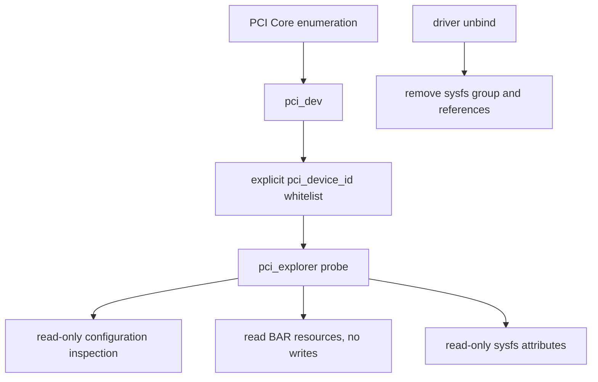
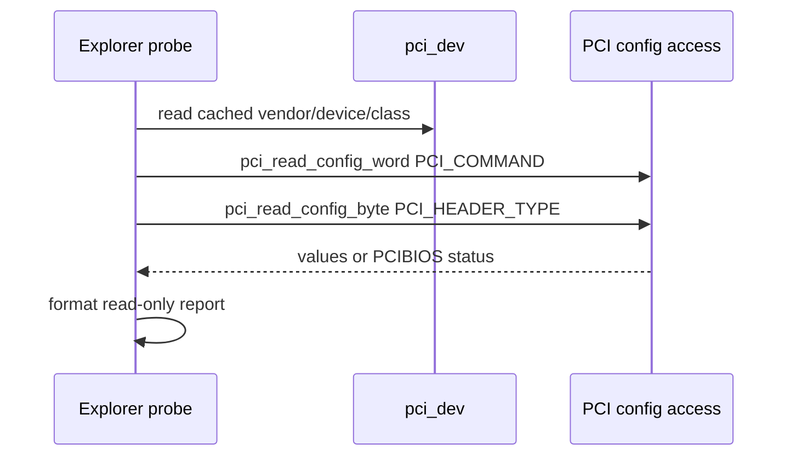
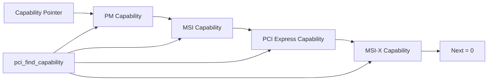
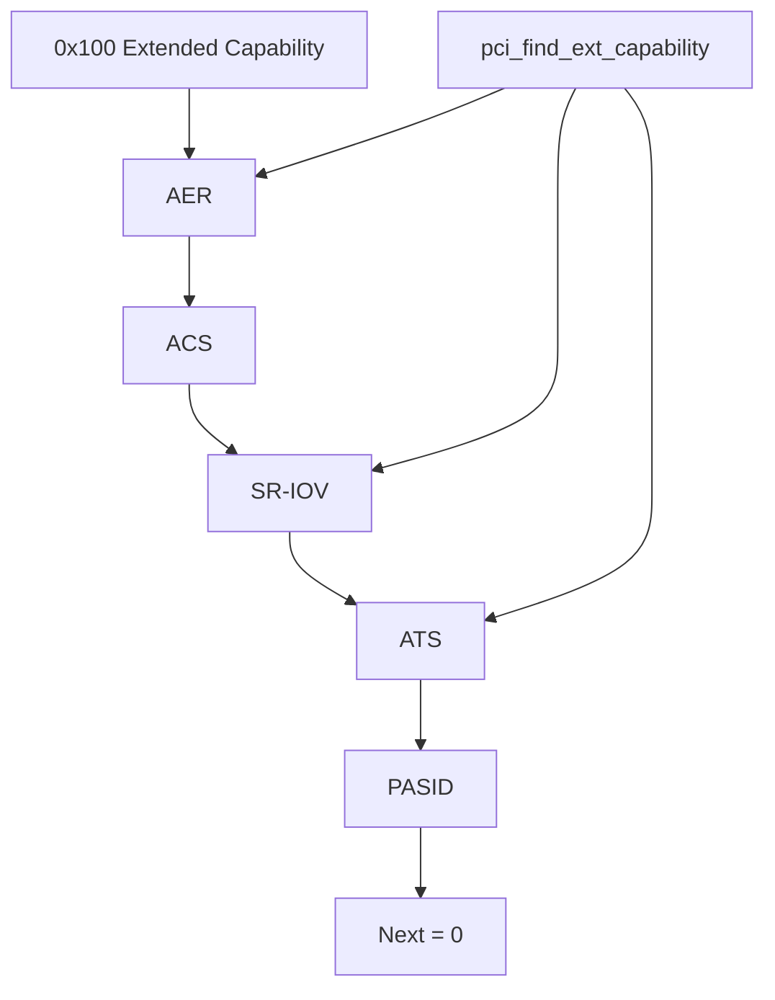
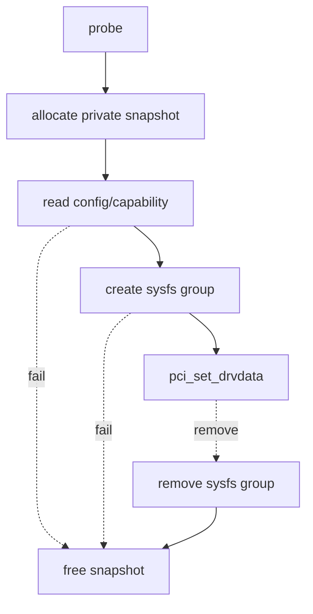

学习 PCI Core 时，最有价值的第一份 Driver 不是立即控制 DMA，而是安全地观察 `pci_dev` 已经包含什么。

只读 PCI Explorer 可以把以下事实关联起来：

- BDF 与配置头身份。
- Standard Capability 与 Extended Capability。
- BAR 的 Bus Address、Linux Resource 与属性。
- Power State、PCIe Link、MSI/MSI-X 和 AER 能力。
- sysfs 与 `lspci` 能证明的边界。

Explorer 的第一原则是：对未知硬件不写配置空间、不写 BAR、不启用 Bus Master、不触发 reset。

本文固定以 Linux 6.12 为基线，配套 `pci_explorer.c` 只匹配显式教学 ID，并仅输出安全信息。

## 一、为什么未知 PCIe 设备不能“试写看看”

配置空间与 BAR 中的写操作可能：

- 关闭 Memory Space/Bus Master。
- 改写 BAR 地址，破坏资源路由。
- 触发 Function Level Reset。
- 修改 MSI-X Table/Mask。
- 清除 W1C Error Status。
- 启动 DMA Engine。
- Pop FIFO 或确认不可恢复事件。

同一个 offset 在不同 Device 上语义完全不同。

没有公开 Programming Manual 就不能把别的设备寄存器模板套上去。

Explorer 只读通用 PCI Header/Capability，并把任何可选 BAR 读取限制在明确白名单协议。

## 二、Explorer 在 PCI Driver Model 中的位置

Explorer 仍是普通 `pci_driver`。

它通过 `pci_device_id` 匹配显式 VID/DID，probe 接收 `pci_dev`。



不使用 Class-only ID 匹配所有网卡/存储/显示设备。

否则 Explorer 会抢占真实功能驱动，导致系统网络、磁盘或显示失效。

实验可用保留教学 ID 或通过 `new_id` 只对一块确认安全的设备动态绑定。

## 三、probe 不需要启用 Bus Master

读取 PCI Configuration Header 使用 PCI Core 配置访问，不需要 Device 发 DMA。

读取 `pci_resource_*()` 也只是读取 Core 已解析的 Resource 对象。

因此 Explorer 默认不调用：

- `pci_set_master()`。
- DMA Mask/Allocation API。
- `pci_alloc_irq_vectors()`。
- Device 私有 BAR 写。

若只读取配置，也不必 `pci_iomap()`。

最小权限减少错误影响范围。

## 四、读取配置头身份

`pci_dev` 已缓存：

```c
pdev->vendor;
pdev->device;
pdev->subsystem_vendor;
pdev->subsystem_device;
pdev->class;
pdev->revision;
pdev->devfn;
```

也可以使用 `pci_read_config_*()` 读取标准 Header Offset，对照缓存值。



每次读取检查返回值。

配置访问失败时不要把未初始化 value 输出为真实寄存器。

## 五、pci_cfg_access_lock 的用途

配置空间可能与 reset、AER Recovery、Power Transition 或其他管理访问并发。

`pci_cfg_access_lock(pdev)`/`pci_cfg_access_unlock(pdev)` 可在需要一致快照时序列化配置访问。

Explorer 不应长期持锁，也不能在锁内等待用户输入。

推荐：

1. 进入一次短读取函数。
2. 锁住配置访问。
3. 读取少量 Header/Capability 字段到私有 snapshot。
4. 解锁。
5. 在锁外格式化 sysfs 输出。

如果 Device 已进入不可访问的 D3cold，应返回错误，不强行恢复一个绑定到其他管理策略的设备。

## 六、Standard Capability 链

Status Register 的 Capabilities List bit 表示存在链。

Header 中 Capability Pointer 指向第一个节点。

每个节点前两个字节是 ID 与 Next Pointer。

常见 ID：

- `PCI_CAP_ID_PM`
- `PCI_CAP_ID_MSI`
- `PCI_CAP_ID_EXP`
- `PCI_CAP_ID_MSIX`

使用 `pci_find_capability(pdev, id)`。

不要手写无限循环遍历外部提供的 next pointer。



Capability 顺序不固定。

缺少某能力应显示 absent，而不是假设 offset。

## 七、PCIe Capability 的只读字段

PCIe Capability 可读取：

- Device/Port Type。
- Device Capabilities：MPS Supported、Extended Tag 等。
- Device Control/Status：MPS、MRRS、Error Reporting。
- Link Capabilities：Maximum Speed/Width、ASPM。
- Link Control/Status：Current Speed/Width、Training、DLLLA。

使用 `pcie_capability_read_word/dword()`。

Explorer 可以输出“能力”和“当前配置”两列。

例如 Max Speed Gen4、Current Speed Gen3 表示链路降级或上游限制，不应把二者混成“支持 Gen3”。

## 八、MSI 与 MSI-X 能力只观察不申请

MSI Capability 可显示支持的 Multiple Message 数、64-bit Address 与 Mask Capability。

MSI-X Capability 可显示 Table Size、Function Mask、Enable，以及 Table/PBA 的 BAR Indicator/Offset。

Explorer 不调用 `pci_alloc_irq_vectors()`，因为它没有要服务的硬件中断。

也不映射/写 MSI-X Table。

读取 Table Size 能帮助理解设备能力，但真实向量数还受 Linux、IRQ Domain、平台与 Driver 请求限制。

## 九、Extended Capability 链

Extended Capability 从 offset 0x100 开始。

Header 包含 ID、Version、Next Offset。

常见：

- AER。
- Device Serial Number。
- ACS。
- ARI。
- SR-IOV。
- ATS。
- PRI。
- PASID。

使用 `pci_find_ext_capability()`。



读取 AER Status 可能涉及 W1C 语义，但纯 read 不清 bit。

Explorer 不主动 clear，以免破坏 AER Service/真实 Driver 的证据。

## 十、BAR Resource 应从 pci_dev 读取

遍历 `PCI_STD_NUM_BARS`：

```c
for (bar = 0; bar < PCI_STD_NUM_BARS; bar++) {
	resource_size_t start = pci_resource_start(pdev, bar);
	resource_size_t len = pci_resource_len(pdev, bar);
	unsigned long flags = pci_resource_flags(pdev, bar);
}
```

输出：

- BAR Number。
- Start/End/Length。
- IORESOURCE_IO 或 IORESOURCE_MEM。
- 64-bit/Prefetchable 等 flags。
- 当前是否有 Driver Resource Owner（通过系统资源视图辅助判断）。

Length 为 0 表示未实现或未分配，不应 `pci_iomap()`。

## 十一、为什么 Explorer 默认不读 BAR 内容

即使只 `readl()`，某些 Register 也可能：

- Clear-on-Read。
- Pop Completion FIFO。
- Latch/Unlock 下一个状态。

所以“只读 MMIO”也不一定无副作用。

Explorer 默认只报告 BAR Resource，不读取 BAR 内字节。

只有教学硬件公开指定一个 side-effect-free ID/Version Register 时，才能通过模块参数显式允许映射小范围读取。

该选项应同时检查 VID/DID、BAR、Offset、Length 与 Device Power State。

## 十二、sysfs 属性的生命周期

Explorer 可用 `sysfs_create_group()` 或 Device Attribute Group 暴露只读 snapshot：

```text
identity
capabilities
extended_capabilities
bars
link
```

show callback 可能与 remove 并发。

Device Core 在 Attribute Removal 与 callback 生命周期上提供框架保证，但私有 snapshot 仍需按绑定寿命管理。

remove 先 `sysfs_remove_group()`，再释放 snapshot/private。

不要让 sysfs show 在持配置锁时输出大量文本。

## 十三、lspci 与 Explorer 的互补

`lspci -nnvvxxxx -s BDF`：

- 通用、无需专用 Driver。
- 解码 Header/Capability。
- 可读取原始配置空间。

Explorer：

- 展示 Kernel `pci_dev` 缓存和 API 视角。
- 可演示 config access lock 与 sysfs 生命周期。
- 可固定白名单和输出格式。

二者都不能证明：

- BAR 内业务协议正确。
- DMA 正确。
- MSI-X 实际产生。
- Link 物理信号质量。

## 十四、安全绑定与恢复真实驱动

如果目标 Function 已绑定真实 Driver，先确认停止业务和解绑影响。

不要把 Root Filesystem NVMe、唯一网卡或显示 GPU 绑定到教学 Explorer。

实验应使用独立 FPGA/Test Endpoint。

结束后：

1. 从 Explorer unbind。
2. 删除 dynamic ID（若添加）。
3. bind 回原 Driver 或执行正常 rescan。
4. 验证业务与 PM/AER 状态恢复。

## 十五、Explorer 的错误回滚

probe 只分配 snapshot、创建 sysfs，不接管 DMA/IRQ/BAR。

回滚：



`pci_set_drvdata()` 的发布点要与 sysfs 可见性顺序一致。

remove 后没有 work、timer、IRQ 或 DMA，因此生命周期应保持简单。

## 十六、不要把 Explorer 变成危险万能工具

不添加“任意 offset 写任意 value”的 sysfs/ioctl。

不提供任意 BAR mmap。

不自动 enable Bus Master。

不自动 reset。

不清 AER Status。

需要这些操作时，应为明确硬件协议编写专用 Driver，并定义权限、状态、锁和错误恢复。

## 十七、Linux 6.12 源码阅读入口

- `include/linux/pci.h`
- `drivers/pci/access.c`
- `drivers/pci/pci.c`
- `drivers/pci/probe.c`
- `drivers/pci/msi/`
- `drivers/pci/pcie/aer.c`

一手资料：

- [Linux 6.12 PCI driver API](https://www.kernel.org/doc/html/v6.12/driver-api/pci/pci.html)
- [Linux sysfs PCI ABI](https://docs.kernel.org/PCI/sysfs-pci.html)
- [Linux stable PCI access source](https://git.kernel.org/pub/scm/linux/kernel/git/stable/linux.git/tree/drivers/pci/access.c?h=linux-6.12.y)
- [PCI-SIG specifications](https://pcisig.com/specifications)

## 十八、小结

PCI Explorer 的价值是安全地把 `pci_dev`、配置空间、Capability、BAR Resource 与 sysfs 连接起来。

它使用显式 ID 白名单，不抢占任意 Class Device。

配置快照可用 `pci_cfg_access_lock()` 短时序列化，读取失败必须保留错误语义。

Standard/Extended Capability 使用 PCI Core helper 遍历，不假设固定 offset。

BAR 默认只报告 Resource，不读取可能有 side effect 的 Device Register。

Explorer 不启用 Bus Master、不申请 DMA/IRQ、不提供任意 write/mmap/reset。

sysfs 属性在 remove 前撤销，私有 snapshot 只有一个清晰绑定寿命。

在这条最小权限路径上理解 PCI Core，才适合进入真正控制 Device Queue、DMA 与中断的专用驱动。
