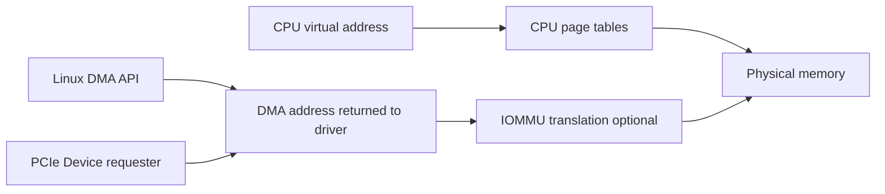
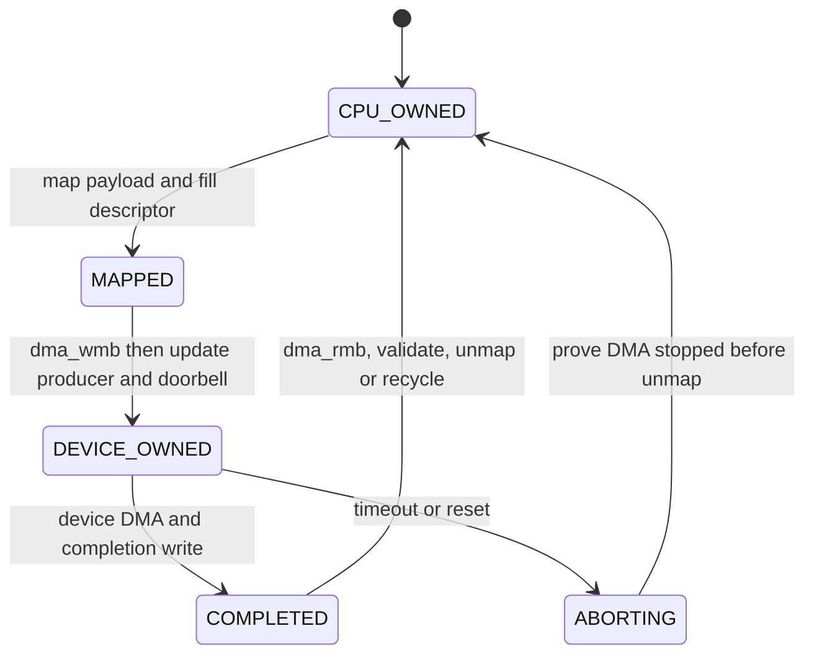
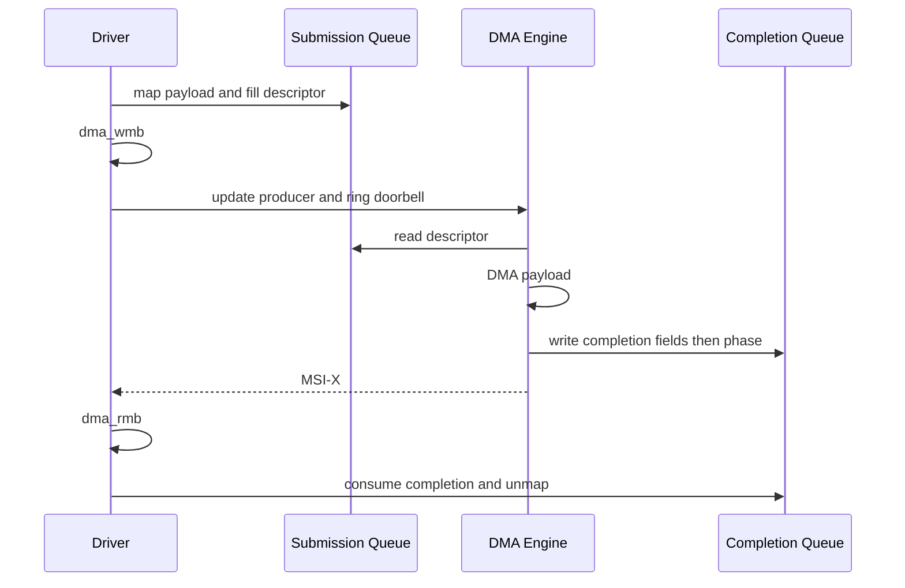

PCIe 设备的价值之一，是不让 CPU 用 MMIO 一字一字搬运大数据。设备内部 DMA Engine 读取 descriptor，直接访问 Host memory，再通过 completion 和中断通知驱动。性能来自异步并行，风险也来自异步：地址、cache、映射和 buffer ownership 任何一项错误都可能破坏内存。

本篇先区分地址，再解释 Linux DMA API，最后以 descriptor ring 建立完整发布/完成/取消协议。

## 一、CPU 虚拟地址、物理地址与 DMA 地址

`kmalloc()` 返回 CPU virtual address，CPU MMU 将它映射到 physical page；设备 descriptor 中要写 DMA address。DMA address 可能等于 bus-visible physical address，也可能是 IOMMU 分配的 IOVA，驱动不能自行转换。



驱动在 probe 早期设置 DMA 能力：

```c
int ret = dma_set_mask_and_coherent(&pdev->dev, DMA_BIT_MASK(64));
if (ret) {
    ret = dma_set_mask_and_coherent(&pdev->dev, DMA_BIT_MASK(32));
    if (ret)
        return ret;
}
```

mask 表示设备能在 descriptor/TLP 中生成多少位地址。Streaming 与 coherent mask 都要满足硬件。设备只实现 32-bit address 时，IOMMU 可能把高物理内存映射到低 IOVA；没有 IOMMU 时 DMA API 可能使用 SWIOTLB bounce，或分配失败。

`pci_set_master()` 设置配置空间 Bus Master Enable，允许 Function 发起 Memory Request。它不是 DMA mapping 的替代；必须在设备真正启动 DMA 前完成。

## 二、Coherent allocation 适合长期共享控制结构

`dma_alloc_coherent()` 同时返回 CPU address 和 DMA address，适合 descriptor ring、completion queue、doorbell record 等长期由 CPU/设备共享的结构：

```c
dev->sq = dma_alloc_coherent(&pdev->dev, sq_bytes,
                             &dev->sq_dma, GFP_KERNEL);
if (!dev->sq)
    return -ENOMEM;
```

Coherent 表示 CPU 与设备对该区域的 cache 可见性由平台保证，不表示访问自动有序。CPU 填 descriptor 后仍需 barrier；设备写 completion 后 CPU 读取字段也要 barrier。

分配大小、对齐和 DMA mask 共同影响成功。大量连续 coherent memory 可能因 CMA/IOMMU/内存碎片受限，不能用系统 free memory 总量判断。队列应在 probe/reset 中复用，而不是每个请求动态分配。

释放必须配对且设备已停止：

```c
dma_free_coherent(&pdev->dev, sq_bytes, dev->sq, dev->sq_dma);
```

若 reset 后设备仍保存旧 `sq_dma`，提前 free 会让迟到 DMA 写入已重用页面。先让 DMA Engine quiescent，再释放或更换 generation。

## 三、Streaming mapping 表达阶段性所有权

普通数据 buffer 常使用 streaming mapping。`dma_map_single()` 返回 DMA address，并按 direction 执行平台 cache/IOMMU 操作：

```c
dma_addr_t dma = dma_map_single(&pdev->dev, buf, len, DMA_TO_DEVICE);
if (dma_mapping_error(&pdev->dev, dma))
    return -EIO;

desc->addr = cpu_to_le64(dma);
desc->len = cpu_to_le32(len);
```

Direction 是设备视角：`DMA_TO_DEVICE` 表示设备读 Host memory，`DMA_FROM_DEVICE` 表示设备写 Host memory，`DMA_BIDIRECTIONAL` 只在确实双向时使用。方向错误可能导致 cache 不同步或 IOMMU permission 不符。

Map 后到 unmap 前，buffer ownership 通常属于 Device。CPU 不能随意访问；若需要在映射保持期间切换所有权，使用 `dma_sync_single_for_cpu()` 和 `dma_sync_single_for_device()`：

```c
dma_sync_single_for_cpu(dev, dma, len, DMA_FROM_DEVICE);
consume(buf);
dma_sync_single_for_device(dev, dma, len, DMA_FROM_DEVICE);
```

Scatter-gather buffer 用 `dma_map_sg()`。输入 nents 是 CPU scatterlist 数，返回值是合并后的 DMA segment 数，设备 descriptor 必须按返回 segment 遍历，而不是原始 nents：

```c
int mapped = dma_map_sg(&pdev->dev, sgl, nents, DMA_TO_DEVICE);
if (!mapped)
    return -EIO;

for_each_sg(sgl, sg, mapped, i) {
    desc[i].addr = cpu_to_le64(sg_dma_address(sg));
    desc[i].len = cpu_to_le32(sg_dma_len(sg));
}
```

完成后用原始 nents 调 `dma_unmap_sg()`，这是容易写错的 API 契约。

## 四、Descriptor Ring 是一份共享所有权状态机

Submission Queue（SQ）由 CPU producer 填入 request descriptor，设备 consumer 读取；Completion Queue（CQ）由设备 producer 写 completion，CPU consumer 回收。索引和 entry 内容跨越两个执行体，必须定义谁在什么阶段能写。



一个 request 需要保存 CPU buffer、DMA address、length、direction、request ID 和 generation，不能只保存 descriptor index。Ring wrap 后 index 会复用，迟到 completion 需要 generation/phase 区分。

队列 full 条件必须留一个 slot 或使用 phase bit，避免 producer == consumer 同时表示 empty/full。索引类型、wrap 和硬件可见 endian 要在协议中固定。

## 五、Barrier、Doorbell 与 Completion 的发布顺序

CPU 发布 SQ entry：

```c
desc->addr = cpu_to_le64(req->dma);
desc->len = cpu_to_le32(req->len);
desc->id = cpu_to_le16(req->id);
desc->flags = cpu_to_le16(DEMO_DESC_VALID);

dma_wmb();
WRITE_ONCE(sq->producer, next);
writel(next, dev->bar0 + REG_SQ_DOORBELL);
```

`dma_wmb()` 保证设备在观察到 producer/doorbell 后，能看到完整 descriptor。普通 `wmb()` 与 DMA barrier 的适用范围不同，使用 DMA API 文档规定的 primitive。

设备完成时应先写 payload/CQ fields，再写 phase/producer，最后发 MSI-X。Host handler/poll：

```c
if (READ_ONCE(cqe->phase) != expected_phase)
    return false;

dma_rmb();
status = le16_to_cpu(cqe->status);
bytes = le32_to_cpu(cqe->bytes);
```

随后按 direction unmap：

```c
dma_unmap_single(&pdev->dev, req->dma, req->len, req->dir);
```

MSI-X 到达只证明通知 Memory Write 到达，不自动证明设备内部所有 DMA 顺序正确；硬件协议必须保证 completion data 在中断前可见。



## 六、用户内存、mmap 和 IOMMU 增加约束

用户 buffer 不能直接用普通 virtual address。驱动若支持异步 DMA 到用户页，需要 pin pages、构造 SG、map DMA，并处理进程退出、unmap、长期 pin 对内存回收的影响。新内核 API 与长期 pin 规则应按目标版本选择。

把 coherent ring `mmap()` 给用户可以减少 ioctl/copy，但会暴露 descriptor、doorbell 和设备安全边界。至少需要验证 VMA 长度/offset、禁止映射控制寄存器、使用 generation 和 memory barrier，并在 Device remove 时阻止新访问。

IOMMU 为每个 mapping 分配 IOVA 并限制访问范围。越界或 unmap 后 DMA 会产生 fault，而不是静默写任意物理内存；关闭 IOMMU 可能把可见 fault 变成内存破坏。下一篇专门展开。

## 七、DMA 故障的证据闭环

常见故障与证据：

- `dma_mapping_error()`：mask、IOMMU/IOVA 或资源不足。
- IOMMU fault：记录 requester、IOVA、读写方向，回查 request descriptor/mapping 生命周期。
- 数据旧/部分更新：检查 direction、sync、barrier 和硬件 completion 顺序。
- 仅高地址失败：设备地址宽度、descriptor 高位、DMA mask。
- reset 后随机破坏：旧 generation DMA 未停止，过早 unmap/reuse。
- 高吞吐受限：map/unmap、IOTLB、SWIOTLB bounce、NUMA/memory bandwidth、ring 空闲。

```bash
dmesg | grep -Ei 'iommu|dma|swiotlb|fault'
cat /sys/bus/pci/devices/BDF/dma_mask_bits 2>/dev/null
perf stat -e cycles,cache-misses ./workload
```

驱动维护 submitted/completed/inflight/map_fail/timeout/reset/fault 计数。停止后 `submitted = completed + failed` 且 inflight/mapping/pool 回到基线，才证明资源守恒。

**参考资料**

- [Dynamic DMA Mapping Guide](https://docs.kernel.org/core-api/dma-api-howto.html)
- [DMA API](https://docs.kernel.org/core-api/dma-api.html)
- [How To Write Linux PCI Drivers](https://docs.kernel.org/PCI/pci.html)

## 八、小结

Linux DMA API 返回设备可用地址并管理 cache/IOMMU 生命周期。Coherent memory 适合长期共享控制结构，streaming mapping 表达阶段性所有权，scatter-gather 允许非连续页面被设备访问。

高可靠 DMA 驱动的核心是 ring ownership：map、填 descriptor、`dma_wmb()`、doorbell、设备完成、`dma_rmb()`、unmap/recycle；reset 必须先证明 DMA 停止。下一篇将解释 IOMMU 如何在这条路径中翻译和隔离 IOVA。
