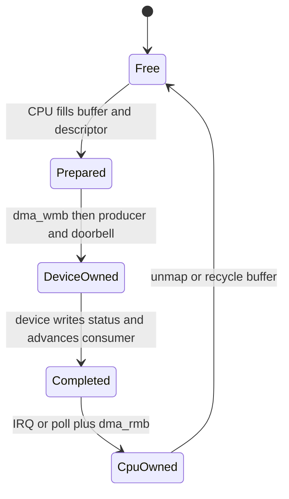

PCIe 高吞吐来自设备直接 DMA 访问内存，CPU 只准备 descriptor、敲 doorbell、回收 completion。最危险的错误也集中在这里：把 CPU 虚拟地址写给设备、忘记 DMA mask、错误使用 streaming buffer、缺少 memory barrier，或在设备仍拥有 buffer 时释放。

本篇从地址域与 DMA API 开始，建立 descriptor ring 的所有权协议。

## CPU 虚拟地址、物理地址和 DMA 地址不是同一个值

CPU 使用普通虚拟地址访问内存；物理地址描述 RAM 位置；设备看到的是 `dma_addr_t`。IOMMU 打开时 DMA 地址通常是 IOVA，经过页表转换到物理页；没有 IOMMU 时也可能受 Host bridge offset、总线限制或 bounce buffer 影响。

驱动只能把 DMA API 返回的 `dma_addr_t` 写入设备。`virt_to_phys()`、页表物理地址或用户指针都不能替代映射。

probe 先设置：

```c
ret = dma_set_mask_and_coherent(&pdev->dev, DMA_BIT_MASK(64));
if (ret)
    ret = dma_set_mask_and_coherent(&pdev->dev, DMA_BIT_MASK(32));
```

这同时决定 streaming 与 coherent allocation 能否满足设备地址宽度。失败应终止 probe，而不是截断高位。

## Coherent allocation 适合共享控制结构

```c
ring = dma_alloc_coherent(&pdev->dev, ring_bytes,
                          &ring_dma, GFP_KERNEL);
```

返回 CPU pointer 和 DMA address。Coherent 表示 CPU/设备对同一内存的可见性由平台保证，不代表访问顺序自动正确。Descriptor 字段写完后仍要在交 ownership/doorbell 前执行 `dma_wmb()`。

Ring、completion queue、doorbell shadow 等长期共享结构适合 coherent memory。大 payload 全部使用 coherent 可能浪费受限区域或降低 cache 性能。

## Streaming mapping 适合有明确所有权阶段的数据 buffer

```c
memcpy(buf, src, len);
dma = dma_map_single(&pdev->dev, buf, len, DMA_TO_DEVICE);
if (dma_mapping_error(&pdev->dev, dma))
    return -EIO;
/* device owns mapping */
...
dma_unmap_single(&pdev->dev, dma, len, DMA_TO_DEVICE);
```

方向必须准确：TO_DEVICE 让设备读 CPU 准备的数据，FROM_DEVICE 让设备写、CPU 后读，BIDIRECTIONAL 成本更高且不能用来掩盖协议不清。

映射后直到 unmap/sync-for-cpu，CPU 不应访问由设备拥有的 streaming buffer；CPU 修改后再次交设备前用 sync-for-device。非一致 cache 平台依赖这些 API clean/invalidate。

Scatterlist 使用 `dma_map_sg()` 后，以返回的 DMA segment 数遍历，而不是原始 sg entry 数。IOMMU 或合并可能改变 segment 边界。

## Descriptor ring 是一份所有权状态机



CPU 填 descriptor 地址、长度和 flag，执行 `dma_wmb()`，再更新 producer/ownership bit并写 doorbell。设备按顺序读取。Completion 到来后，CPU先读取设备 producer/status，执行 `dma_rmb()`，再读 descriptor 和 payload。

`volatile` 只能影响编译器单次访问，不能替代 DMA barrier/cache maintenance。Doorbell MMIO ordering 与 descriptor memory ordering要一起满足。

Ring full/empty 通常由 monotonic producer/consumer 或 generation/phase bit区分。只用相等判断而没有额外状态，容易把 full 与 empty 混淆。

## DMA completion 不等于数据可以立即释放

设备写 completion 后触发 MSI-X。Handler/轮询读取 completion，确认 descriptor 已完成，再 unmap streaming buffer、通知用户或放回 pool。若硬件支持 out-of-order completion，不能按提交顺序盲目释放。

超时处理需要先停止/abort queue，确认设备不再访问 descriptor 和 payload，再 unmap/free。仅因为软件 timer 到期就释放，会让迟到 DMA 写入已复用内存。

## 用户内存、pin 和 mmap 增加生命周期约束

直接 DMA 用户页需要 pin pages、构建 sg、map DMA，并在设备完成后 unmap/unpin。长期 pin 会影响内存迁移与回收，不能无限保留。更安全的入门设计是内核管理 DMA buffer，通过 read/write 或受控 mmap 暴露。

Coherent ring mmap 给用户时，用户不能直接修改硬件 ownership 字段，除非 ABI 明确定义边界和 barrier。生产驱动常将 control ring 保留内核，只映射 payload pool。

## 如何定位 DMA 地址与一致性问题

IOMMU fault 给出 device、IOVA 和访问类型，先对照 descriptor DMA address、长度和方向；无 fault 但数据旧，检查 sync/barrier/cache；设备读错地址，检查 mask、高低 32 位寄存器写序；随机越界，检查 descriptor length、ring wrap 和设备停止时机。

```bash
dmesg | grep -Ei 'iommu|dma|fault'
cat /sys/kernel/debug/iommu/* 2>/dev/null
```

压力测试同时记录 submitted/completed、producer/consumer、mapping failure、timeout 和 reset 次数。只看平均吞吐无法发现偶发 ownership 破坏。

## 小结

PCIe DMA 驱动必须区分 CPU、物理和 DMA 地址，先设置 mask，再选择 coherent 或 streaming API。Descriptor ring 用所有权、barrier 和 doorbell连接 CPU/设备，completion 后才能 unmap/recycle。`dma_alloc_coherent`、`dma_map_single`、`dma_wmb` 各自解决不同问题。下一篇加入 IOMMU，解释 DMA 地址如何被隔离和转换。
