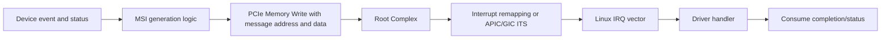
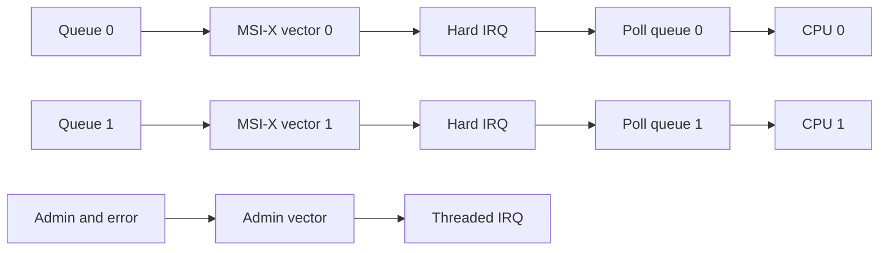
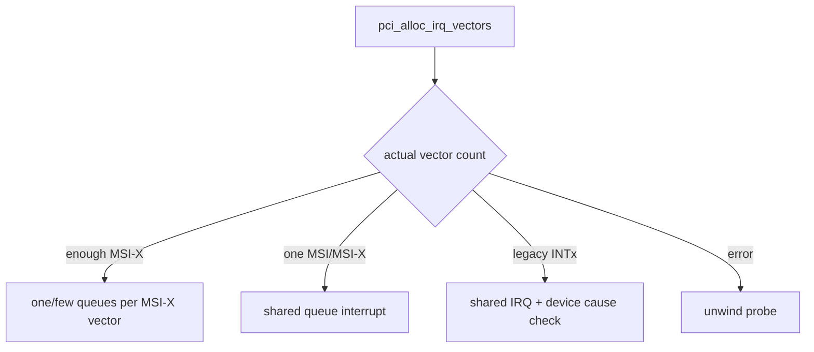
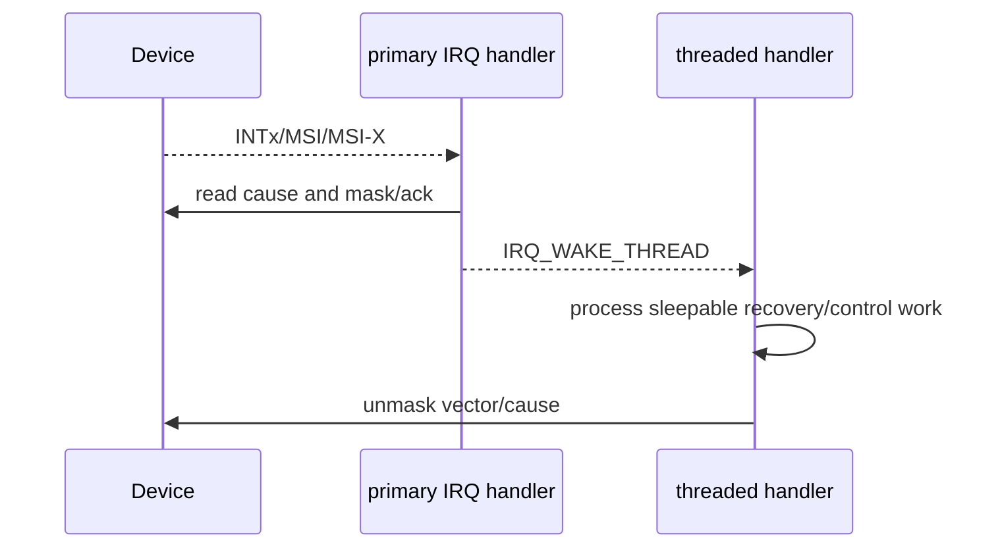
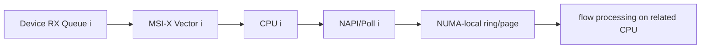

CPU 不能持续轮询每个 PCIe 设备寄存器。设备完成 DMA、收到网络包或发生错误时，需要异步通知 CPU。PCIe 兼容传统 INTx，同时提供 MSI 和 MSI-X。三者最终都会进入 Linux IRQ 子系统，但设备侧触发、共享关系和多队列能力不同。

本文 API、IRQ Domain 与取消顺序固定以 Linux 6.12 为基线。

## 一、INTx 是需要设备撤销的共享电平事件

传统 PCI 定义 INTA#..INTD#。在 PCIe 上，INTx 可被编码成 Message TLP 穿过 fabric，但软件仍看到共享、level-triggered 语义。设备置 pending/status 并 assert INTx；Handler 必须确认事件属于本设备、处理/记录状态，再让设备 deassert。

多个设备共享 IRQ 时，handler 收到调用不能假设自己有事件：

```c
static irqreturn_t demo_intx(int irq, void *data)
{
    struct demo_dev *dev = data;
    u32 status = readl(dev->bar0 + REG_IRQ_STATUS);

    if (!(status & DEMO_IRQ_MASK))
        return IRQ_NONE;

    writel(status, dev->bar0 + REG_IRQ_STATUS); /* W1C */
    readl(dev->bar0 + REG_IRQ_STATUS);          /* Flush if required. */
    demo_schedule_poll(dev, status);
    return IRQ_HANDLED;
}
```

若先返回而未清 source，level line 持续有效，CPU 形成 interrupt storm。若读 status 有 read-clear side effect，shared handler 还要遵守设备规范，不能为判断归属破坏状态。

## 二、MSI 是一笔由设备发起的 Memory Write

Message Signaled Interrupt（MSI）不使用共享电平线。系统在 MSI Capability 中为设备编程 message address 和 data；设备触发时发一笔 Memory Write Request，RC/中断控制器把它解释为目标 vector。



MSI 写是 posted TLP。PCIe ordering 要保证设备在发 MSI 前已经按设备协议发布 completion/data；Host handler 看到通知后仍可能需要 `dma_rmb()` 再读取 DMA memory。若硬件先发 MSI 再写 completion，软件 barrier 无法修复硬件顺序。

MSI vector 是连续的 power-of-two 集合，设备 Capability 表示最大数量。MSI 不共享传统线，handler 无需返回 `IRQ_NONE` 判断其他设备，但仍要确认设备队列/状态并处理 spurious event。

### MSI Capability 如何表达地址宽度和多消息数量

MSI Capability 的 Message Control 包含 64-bit Address Capable、Per-Vector Masking、Multiple Message Capable/Enable。32-bit 设备只有一个 Message Address dword；64-bit 设备再增加 upper address。Message Data 的低位可能被平台用于 vector 编码，驱动不应自行填写。

设备声明最多 8 条 MSI 时，Multiple Message Capable 编码能力，系统在 Enable 中选择实际数量。MSI 多消息通常要求 message data 连续/按位选择，灵活性低于 MSI-X，因此现代多队列设备更常使用 MSI-X。

启用顺序要避免早到事件：先让设备内部 source 保持 mask，PCI/MSI Core 编程 message 和 enable，request handler，清 stale status，最后解除设备 source mask。若设备在 message 尚未完整编程时发 MSI，事件可能丢失或指向错误 vector。

Per-vector mask 存在时，设备必须在 masked 期间保留 pending，unmask 后补发。没有该能力时，驱动需要先在设备业务寄存器关闭 source，再操作 MSI 状态。

## 三、MSI-X 用 Table 和 PBA 支持独立多队列

MSI-X 支持更多 vector，每项可独立 message address/data 和 mask。MSI-X Capability 指向某个 BAR 内的 Table 和 Pending Bit Array（PBA）：

- Table entry 包含 message address low/high、data、vector control mask。
- PBA 在 vector 被 mask 时记录 pending。
- Function Mask 可以一次 mask 全部 vector。

Driver 不应直接 ioremap Table 后手写 message，Linux MSI Core 负责平台中断 remapping、安全和 affinity。设备硬件根据 queue/event 选择 table entry 并发 Memory Write。

MSI-X Table 每项 16 字节，Table BIR/offset 指明它位于哪个 BAR；PBA 也由 BIR/offset 定位。Table/PBA 是设备内部 MSI-X 功能的规范窗口，不等于普通业务寄存器。BAR sizing 必须包含它们，设备实现要阻止业务 DMA 与 Table 地址冲突。

Vector Control 的 mask bit 只阻止对应 message 发出，不应清除业务事件。mask 期间发生事件时，PBA 置 pending；unmask 后设备重新评估并发送。若硬件只置 PBA 却不在 unmask 后补发，会出现“压力下偶发丢中断”。

Function Mask 适合初始化/reset 批量隔离。正确 reset 顺序通常是 function/vector mask -> 停止 queue -> 清/记录 source -> 重新编程 queue/vector -> 解除 function mask；直接清 PBA 可能丢掉尚未消费的完成。

MSI-X 适合多队列：每个 RX/TX/completion queue 一个 vector，管理/错误单独 vector。这样 IRQ、poll worker 和 buffer 可以按 CPU/NUMA 对齐，减少共享锁。

## 四、Linux 统一申请 vector 并允许能力降级

```c
int nvec;

nvec = pci_alloc_irq_vectors(pdev, 1, desired,
        PCI_IRQ_MSIX | PCI_IRQ_MSI | PCI_IRQ_LEGACY);
if (nvec < 0)
    return nvec;

dev->num_vec = nvec;
for (int i = 0; i < nvec; i++) {
    int irq = pci_irq_vector(pdev, i);
    int ret = request_threaded_irq(irq, demo_irq, demo_irq_thread,
                                   0, dev_name(&pdev->dev),
                                   &dev->queues[i]);
    if (ret)
        goto err_irqs;
}
```

`pci_alloc_irq_vectors()` 返回实际数量，可能小于 desired。驱动必须根据返回值重新安排 queue-vector mapping；不能仍按 16 queue 访问只分到 4 个 vector。

若要求每个 queue 独立 vector，可把 min/max 都设为要求值，失败则拒绝或切换明确的共享策略。`pci_irq_vector()` 把逻辑索引转换为 Linux IRQ，不能假设 IRQ 连续。

释放顺序：先 mask/stop device，`free_irq()`（内部等待 handler），再 `pci_free_irq_vectors()`。若先 free vector 而设备仍发 MSI，可能送到已重分配的中断目标。

## 五、Handler、threaded IRQ、NAPI/poll 和 affinity

硬中断上半部只做最少工作：读/屏蔽原因、ack 必要状态、安排 poll/thread。大量 completion 回收放 NAPI、irq thread 或 workqueue，限制 budget，避免一次 IRQ 长时间占 CPU。



Affinity 让 IRQ 靠近消费 CPU/NUMA memory。驱动可使用 `irq_set_affinity_hint()` 提供提示，但要与 irqbalance/系统策略协调；现代代码也可使用 managed affinity 描述。不能把提示当作硬保证。

Queue 与 vector 不必一一对应。若只分到少量 vector，可以多个 queue 共享一个 vector，但 handler/poll 必须遍历共享 completion queue status；若每个 queue 一个 vector，仍可能让多个 vector 映射同一 CPU。设计时分别记录 queue count、vector count、IRQ affinity、worker affinity 和 buffer NUMA node。

多 Function/SR-IOV 中，PF 和每个 VF 拥有各自 MSI-X capability/Table，平台还受总 vector 与 interrupt-remapping 资源限制。创建 VF 成功不保证每个 VF 都能得到期望 vector，VF driver 同样必须接受 `pci_alloc_irq_vectors()` 实际返回值。

中断合并（interrupt moderation/coalescing）按 completion 数或 timer 触发。更大阈值降低 IRQ/CPU、提高 batch，却增加平均和 P99 延迟。实时管理 queue 与高吞吐数据 queue 应使用不同策略。

## 六、丢中断必须沿设备、PCIe、IRQ、队列四层检查

`/proc/interrupts` 不增长：检查设备 event/status、vector enable/mask、MSI-X Table mapping、PCI Capability、Memory Write 是否发出、IOMMU/interrupt remapping 和 Linux IRQ registration。

IRQ 增长但任务不完成：handler 是否读错 queue、completion 是否写回、`dma_rmb()` 与 phase bit 是否正确、poll 是否因 budget/状态漏掉事件。此时“中断正常”只证明通知到达，不证明数据路径完成。

计数暴涨：INTx source 未清、MSI-X event condition 一直成立、completion queue 未消费或 W1C 语义错误。先 mask vector 停止风暴，再读取设备内部原因；不要仅在 Linux disable IRQ 而让设备无限累积 pending。

MSI-X 在虚拟化/IOMMU 下失败而 INTx 可用，检查 interrupt remapping、VF/PF vector 配置和平台固件。降级到 INTx 可用于对比，但不能隐藏生产配置错误。

Teardown 时还要处理“迟到 MSI”。设备停止条件必须保证不再产生 message，随后 mask source、flush posted write、`synchronize_irq()`/`free_irq()`，最后释放 vector。若先释放 Linux IRQ，旧 message 可能命中已重用 vector；若只 mask PCI MSI-X 而 DMA queue 继续完成，PBA 会累积并在未来 unmask 形成错误事件。

**参考资料**

- [The MSI Driver Guide HOWTO](https://docs.kernel.org/PCI/msi-howto.html)
- [How To Write Linux PCI Drivers](https://docs.kernel.org/PCI/pci.html)
- [PCI-SIG Specifications](https://pcisig.com/specifications)

## 七、vector 分配要允许能力降级

推荐用 `pci_alloc_irq_vectors()` 表达最小/最大向量与允许类型。

例如优先 MSI-X/MSI，必要时回退 INTx：

```c
nvec = pci_alloc_irq_vectors(pdev, 1, wanted,
			     PCI_IRQ_MSIX | PCI_IRQ_MSI | PCI_IRQ_LEGACY);
```

返回值是实际分配向量数。

驱动必须按实际数量重新决定 Queue Mapping，不能仍访问 `wanted` 个向量。



`pci_irq_vector(pdev, index)` 把 PCI Vector Index 转成 Linux IRQ Number。

释放顺序是先 `free_irq()`，再 `pci_free_irq_vectors()`。

## 八、INTx Handler 必须判断并清除设备原因

INTx 是共享电平。

Handler 首先读取 Device Interrupt Cause，若不是本设备事件返回 `IRQ_NONE`。

若是本设备事件，按硬件协议 mask/ack/clear Source，再安排 Thread/Poll。

如果不清 Device Source，电平持续有效会形成中断风暴。

如果无条件返回 `IRQ_HANDLED`，会掩盖共享线上的错误来源。

MSI/MSI-X 不共享传统 Pin，但 Handler 仍要处理 Queue Cause、Error Cause 与 Mask/Unmask 顺序。

## 九、Threaded IRQ 解决可睡眠下半部

`request_threaded_irq()` 注册 Primary Handler 与 Thread Function。

Primary Handler 在硬中断上下文：

- 快速读取/确认原因。
- 必要时 mask Device Interrupt。
- 返回 `IRQ_WAKE_THREAD`。

Thread Function 可以睡眠，执行较慢控制流程，然后 unmask。



高包率网络/存储 Queue 常使用 NAPI/Poll，而不是每个 Completion 都运行 Threaded Handler。

选择取决于子系统合同。

## 十、DMA Completion 的可见性先于消费

Device 通常先 DMA 写 Completion/RX Data，再发 MSI-X。

IRQ/Poll 看到完成标志后使用 `dma_rmb()`，再读取 Descriptor 的其他字段和 Payload Metadata。

MSI-X Message 与 DMA Write 的 Ordering 还受 Device 实现、PCIe Attribute 与平台规则影响，硬件协议应明确“中断发布意味着哪些写已完成”。

CPU 锁不能替代 DMA Barrier。

如果中断到达但 Completion 内容偶尔是旧值，先检查 Device 发布顺序与 `dma_rmb()`，不要只增加 delay。

## 十一、Affinity 是 Queue/CPU/NUMA 的联合设计

多向量可以用 `irq_set_affinity_hint()` 或更现代的 affinity 管理接口给出提示。

真实放置还受 irqbalance、cpuset、managed IRQ 和系统策略影响。

理想数据局部性：



把所有向量固定到 CPU0 会失去 Multi-queue 价值。

过度固定也可能与系统调度、隔离 CPU 或能耗策略冲突。

## 十二、中断调节与 Lost Interrupt 检测

Device Interrupt Moderation 合并多个 Completion。

调节过强增加延迟，过弱增加 IRQ Rate。

Lost Interrupt 的证据链：

1. Device Queue Head/Tail 是否前进。
2. Completion Memory 是否已有有效 Entry。
3. MSI-X Table Entry 是否 Enabled/Masked。
4. `/proc/interrupts` 对应 IRQ 是否增长。
5. Handler 是否执行但未 Poll。
6. Poll 是否因 budget/状态丢失未继续。

如果 CQ 已有完成而 IRQ 不增长，可使用临时 Poll 证明数据面与中断面分界。

不能把长期定时轮询当作修复而不查 MSI-X Root Cause。

## 十三、remove/reset 的中断停止顺序

1. 阻止上层新 Request。
2. Mask Device Interrupt Sources。
3. 停止 Device DMA/Queue。
4. `synchronize_irq()` 等待在途 Handler/Thread。
5. 停止 NAPI/Work。
6. `free_irq()`。
7. `pci_free_irq_vectors()`。
8. 释放 Ring/BAR。

先 free Ring 再 synchronize IRQ，会让延迟 Handler 访问已释放内存。

reset 后 MSI-X Table/Device Mask State 可能丢失，需要重新初始化。

## 十四、一手资料

- [Linux 6.12 MSI Driver Guide](https://www.kernel.org/doc/html/v6.12/PCI/msi-howto.html)
- [Linux generic IRQ documentation](https://docs.kernel.org/core-api/genericirq.html)
- [Linux stable PCI MSI source](https://git.kernel.org/pub/scm/linux/kernel/git/stable/linux.git/tree/drivers/pci/msi?h=linux-6.12.y)
- [PCI-SIG specifications](https://pcisig.com/specifications)

IRQ Number 是 Linux 分配结果，不是 MSI-X Table Index，也不是 Device Queue Number。

驱动应保存三者的显式映射，不能通过简单加减在 reset/降级后猜测。

## 十五、小结

INTx 是共享电平语义，必须识别并撤销 source；MSI/MSI-X 是设备发出的 Memory Write，MSI-X 通过 Table/PBA 为多队列提供独立 vector。Linux 用 `pci_alloc_irq_vectors()` 和 `pci_irq_vector()` 统一管理能力与平台映射。

可靠中断路径还依赖设备先发布 DMA completion、Host 使用正确内存屏障、handler 与 poll 分工、vector affinity 和 teardown 顺序。下一篇将深入中断前后的 DMA buffer 与 descriptor ownership。
