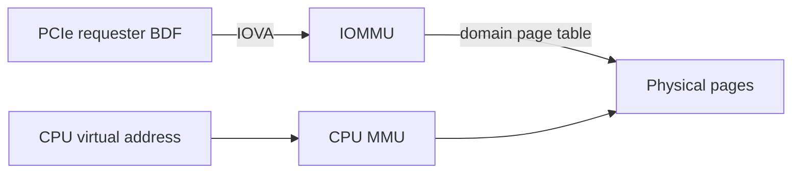

IOMMU 位于 PCIe requester 与内存之间，把设备发出的 DMA 地址（IOVA）翻译为物理页，并按 device/domain 隔离访问。它既能让 32 位设备访问高内存，也能阻止故障或恶意设备越界；代价是页表、IOTLB 和映射生命周期。

本篇从 DMA API 到 `iommu_domain`，解释 IOVA、fault、SWIOTLB、ATS/PASID 和 VFIO 的边界。

## IOVA 是设备地址空间中的虚拟地址

CPU 虚拟地址由 CPU MMU 翻译，IOVA 由 IOMMU 翻译。两套页表面向不同 master。设备 descriptor 中保存 IOVA，IOMMU 根据 requester ID 选择 domain，再查 I/O page table 得到物理页和权限。



同一物理 buffer 对 CPU 和设备可以有完全不同地址。不同设备可把相同数值 IOVA 映射到不同物理页。

## DMA API 隐藏平台是否启用 IOMMU

驱动调用 `dma_map_single()`，DMA layer 可能建立 IOMMU mapping、直接返回 bus address，或使用 bounce buffer。驱动只保存返回的 DMA address，并在完成后配对 unmap。

Linux 为设备选择 DMA ops。`iommu_domain` 通常由 IOMMU/DMA subsystem 管理，普通 PCI driver 不应绕过 DMA API 自行 map IOMMU，否则会破坏 ownership、cache 与回收。

Coherent allocation 同样可能得到 IOVA。`dma_set_mask_and_coherent()` 约束 DMA 地址范围，IOMMU allocator 会尽量在该范围分配。

## Domain 提供隔离、页表和 attach 关系

Domain 包含 IOVA 到物理页的映射和权限，设备或一组必须共享上下文的设备 attach 到 domain。PCIe ACS、IOMMU group 和拓扑决定隔离粒度；同一 group 内设备可能无法安全分给不同用户/VM。

Map 时选择页大小、read/write permission，unmap 后还要失效 IOTLB。频繁小映射会产生页表与 invalidation 开销，批量/长期 buffer 可减少成本，但增加 pinned memory 和生命周期压力。

### IOMMU group 决定最小安全隔离单元

Requester ID通常选择 domain，但缺少 ACS或共享桥/别名时多个 function可能无法隔离，Linux把它们放入同一 IOMMU group。VFIO只能安全地把整个 group交给一个用户/VM；只解绑其中一个 function不一定阻止伙伴发起访问。

`/sys/kernel/iommu_groups/*/devices` 展示分组。组过大时先检查硬件拓扑/ACS和平台限制，不应通过忽略 group强行直通。

Domain页表权限包含 read/write，map/unmap后还需 IOTLB invalidation。设备缓存 ATS translation时，还要同步失效 device TLB。

## Fault 是最直接的越界证据

IOMMU fault 常包含 requester、IOVA、读写方向和原因。典型根因：

- descriptor 地址高低位写反或截断；
- length 超过 mapped range；
- buffer 已 unmap，设备迟到访问；
- DMA direction/permission 错误；
- reset 后设备仍使用旧 ring；
- SR-IOV VF/PASID 上下文配置错误。

记录 fault IOVA 后，应回到软件 descriptor/ring 查对应请求，而不是简单关闭 IOMMU。`iommu=off` 能“绕过”问题时，往往只是让越界变成静默内存破坏。

### DMA map 到 IOVA 的完整生命周期

`dma_map_single()` 检查 DMA mask、选择 IOVA区间、建立物理页映射并执行平台 cache操作；descriptor只保存返回 IOVA。Device完成后 unmap撤销映射/失效 IOTLB，地址可被重用。

长期 buffer pool可减少 map/IOTLB成本，但 reset/remove仍要统一 unmap。Unmap后迟到 DMA可能 fault到同一旧 IOVA；若 IOVA已重新分配，还可能静默破坏新 buffer，因此 generation与设备 quiescent同样重要。

大页/连续 IOVA可减少 IOTLB miss，但物理页不必连续。IOVA allocator碎片、页表内存和 invalidation批次也要纳入性能测量。

## SWIOTLB 是 bounce，不是 IOMMU 隔离

设备 DMA mask 无法到达目标物理页、平台又没有合适 IOMMU mapping 时，DMA layer可能使用 SWIOTLB：分配设备可达的低地址 bounce buffer，TO_DEVICE 前复制进去，FROM_DEVICE 后复制回来。

它解决 addressability，不提供 IOMMU 页表隔离，并受到有限 bounce pool 容量与复制性能限制。高吞吐设备出现 `swiotlb buffer is full`，应检查 DMA mask、IOMMU 状态和 buffer 大小，而不是只增大队列。

## ATS、PRI 与 PASID 把地址模型进一步扩展

Address Translation Service（ATS）允许设备缓存地址转换；Page Request Interface（PRI）允许请求缺页服务；PASID 标识进程/地址空间。它们用于 SVA、加速器和虚拟化，但要求 PCIe capability、IOMMU 和驱动协同。

启用 ATS 后还要维护 device TLB invalidation；PASID 不等于自动安全，设备必须在每个请求携带正确标识。普通 DMA ring 驱动不需要为了“性能”自行打开这些能力。

### ATS、PRI、PASID 的调用关系

ATS让设备请求并缓存 IOMMU translation；PRI让设备在访问缺页时发 Page Request；PASID在 TLP中标识进程/地址空间。三者组合可实现 Shared Virtual Address，但需要 PCIe capability、IOMMU、mmu notifier和设备 fault恢复共同支持。

PASID并不自动等于权限，设备每个 request必须带正确 PASID，IOMMU为其选择 page table。进程退出或 unmap时要 invalidate CPU/IOMMU/device三处 translation。普通固定 DMA ring没有需求时不应自行启用。

## VFIO 把 IOMMU 隔离交给用户态/虚拟机

VFIO 将 IOMMU group 绑定到用户进程或 VM，用户注册内存、建立 IOVA mapping，再通过 mmap BAR 和 eventfd 中断控制设备。安全前提是 group 真正隔离，设备 reset 能清除旧 DMA，上层不会访问未映射地址。

内核功能驱动与 VFIO 不能同时拥有同一 function。解绑/绑定前必须停止业务；SR-IOV PF/VF 还要考虑共享资源和 reset 影响。

## 性能调优先测映射和 IOTLB，而不是关闭保护

大量短生命周期 map/unmap 会增加开销；大页、批量映射、buffer pool 和合理 ring 深度可以改善。IOTLB miss、NUMA 远端内存和 bounce copy 都可能限制吞吐。

调试时结合：

```bash
dmesg | grep -Ei 'iommu|swiotlb|fault'
find /sys/kernel/iommu_groups -type l
lspci -s BDF -vv | grep -E 'ATS|PRI|PASID|SR-IOV'
```

先保证 mapping/ownership 正确，再评估关闭/旁路的影响。安全与性能是显式取舍，不应通过隐藏 fault 获得数字。

## 小结

IOMMU 用 `iommu_domain` 将 requester 的 IOVA 翻译到物理页，DMA API 让普通驱动跨 IOMMU/直映射/SWIOTLB 工作。Fault 是 descriptor 地址、长度和生命周期错误的重要证据；ATS/PASID/VFIO 建立在更严格的隔离与 invalidation 上。下一篇把 BAR、DMA、MSI-X 和用户接口组合成完整驱动。
