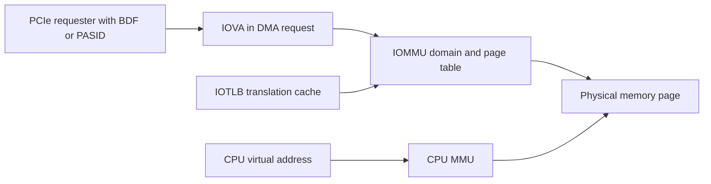
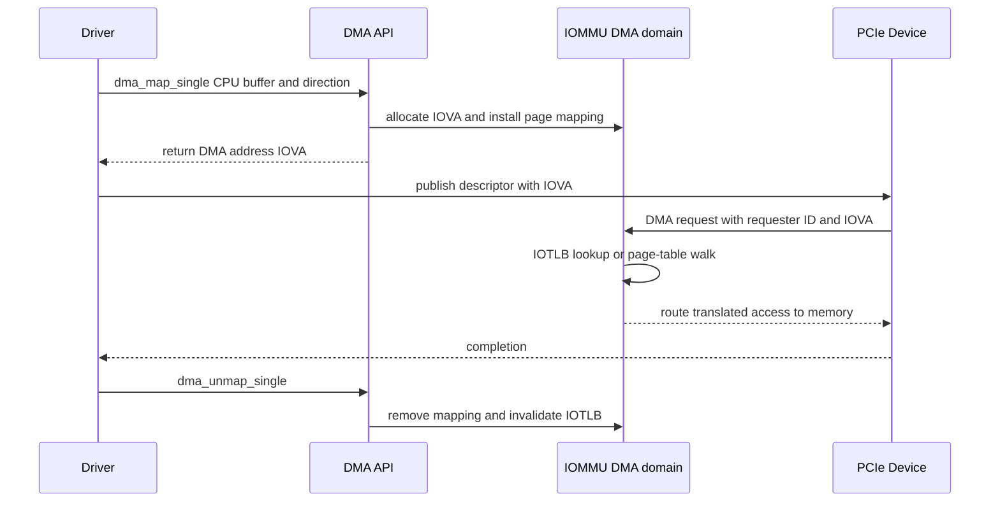

没有 IOMMU 时，PCIe Device 发出的 DMA address 通常直接进入系统物理地址路由。一个错误 descriptor 可以覆盖内核、其他进程或其他设备的内存。IOMMU 位于 Device requester 与 memory 之间，为 DMA 增加地址翻译和访问权限。

它不只是“让 32-bit Device 访问高内存”，更重要的是把 Device 可访问范围限制在 DMA API 当前映射的页面。理解 IOMMU 后，DMA fault、VFIO passthrough、SVA 和压力下的 stale DMA 才能放到同一模型。

## 一、IOVA 是设备地址空间中的虚拟地址

CPU virtual address 由 CPU MMU 翻译；IOVA（I/O Virtual Address）由 IOMMU 翻译。Device descriptor 保存 IOVA，IOMMU 根据 requester identity 选择 `iommu_domain`，再查 I/O page table 得到 physical page 和 read/write permission。



同一个物理 buffer 对 CPU/Device 可以有不同地址；不同 domain 可把同一数值 IOVA 映射到不同页面。驱动只使用 DMA API 返回的 address，不需要也不应查询真实 physical address。

`iommu_domain` 表示一套 IOVA page table、几何范围、权限和 attached Device。普通 PCI Driver 通常不直接创建 domain；DMA/IOMMU subsystem 根据平台、group 和 policy 选择 DMA ops。

## 二、DMA API 把 direct、IOMMU 和 bounce 隐藏在同一接口后

`dma_map_single()` 在不同平台可能：

1. 直接返回可达的 bus/physical address。
2. 分配 IOVA，建立 IOMMU PTE 并返回 IOVA。
3. 使用 SWIOTLB bounce buffer，复制并返回低地址。

驱动代码不应根据地址数值猜是哪一种。map/unmap、direction、sync 和 mask 语义保持一致。



Unmap 后 IOVA 可被 allocator 复用。若 Device 仍发迟到 DMA，它可能产生 fault；更危险的是同一 IOVA 已映射给新 buffer，旧 DMA 会合法写入错误对象。因此 reset/remove 必须先证明 Device quiescent，再 unmap。

驱动日志应把 DMA address 与 request ID/generation 关联，而不是只打印 CPU pointer：

```c
req->dma = dma_map_single(dev, req->buf, req->len, req->dir);
if (dma_mapping_error(dev, req->dma))
    return -EIO;

trace_demo_dma_map(req->id, req->generation,
                   req->dma, req->len, req->dir);
```

出现 fault 时可以用 IOVA 反查尚未完成请求；若完全找不到，通常是已 unmap 或设备地址损坏。若找到但 fault offset 超过 length，则是设备长度/descriptor 越界。只有建立这个关联，fault log 才能从“系统报错”变成可定位证据。

Coherent allocation 也可能得到 IOVA。长期 pool 减少 map/unmap 和 IOTLB invalidation，但增加 pinned memory 与 reset 管理；短 streaming mapping 提供更小访问窗口，却有更高开销。

## 三、IOMMU Group 是最小安全隔离单元

理想情况下每个 PCIe Function 有唯一 requester ID 并能被上游隔离。现实中 multi-function、桥、alias、缺少 ACS（Access Control Services）可能让多个 Device 的事务绕过上游隔离或共享 requester context。Linux 把不能彼此可靠隔离的 Device 放进同一个 IOMMU group。

```bash
find /sys/kernel/iommu_groups -type l -maxdepth 3
readlink /sys/bus/pci/devices/BDF/iommu_group
```

VFIO 把整个 group 作为安全边界交给用户进程/虚拟机。只解绑 group 中一个 Function 并不能保证其他 Function/peer 不访问它的内存。所谓 ACS override 可能让软件强行拆 group，但不会创造硬件隔离，安全语义必须明确。

PCIe peer-to-peer DMA 还可能在 RC/IOMMU 之前经 Switch 路由，平台对 P2P、ACS 和 IOMMU 的支持决定是否安全/可达。不能假设所有 DMA 都必经同一 IOMMU。

## 四、Fault 是地址、权限和生命周期的直接证据

IOMMU fault 通常包含 requester、IOVA、read/write、reason。典型根因：

- descriptor 地址高低位写反、截断或 endian 错误；
- length 超过 mapped range；
- direction/permission 与实际访问相反；
- buffer 已 unmap，Device 迟到访问；
- reset 后 Device 继续使用旧 ring；
- VF/PASID/queue context 指向错误 domain；
- Device 固件越过 descriptor 边界。

定位方法：先用 requester 找 BDF/Function，再用 IOVA 查询驱动当前 request/ring 日志，核对 map length/direction/generation。不要第一步关闭 IOMMU；`iommu=off` 后“能跑”可能只是把可见 fault 变成静默物理内存破坏。

Fault handler 不能总是恢复。Page Response/PRI 支持的设备可以等待缺页；普通 DMA fault 往往意味着硬件/驱动协议已失步，应停止 queue/reset，防止继续破坏。

一个完整 fault 恢复流程是：mask queue/vector，阻止新 descriptor；读取并冻结 producer/consumer；记录 fault requester/IOVA/access；停止 DMA 并确认 idle；按 request table 找到受影响 mapping；reset queue/Function；提升 generation；重建 ring 和 mapping；最后恢复服务。仅清 IOMMU fault status 会让设备重复访问同一坏地址。

## 五、IOTLB、页大小与映射性能

IOMMU 使用 IOTLB 缓存 IOVA translation。大量随机小 buffer 会增加 page-table walk 和 invalidation；频繁 map/unmap 也会产生锁和 TLB flush。性能优化可考虑：

- buffer pool，复用 mapping；
- scatter-gather 合并，减少 DMA segment；
- 大页或连续 IOVA，降低 IOTLB miss；
- 按 NUMA node 分配内存；
- 批量 invalidation（由 DMA/IOMMU layer 支持）。

长期 mapping 不是免费：占用 IOVA 空间/page table/pinned memory，扩大 Device 可访问时间窗。优化时同时测 mapping latency、IOTLB miss、memory bandwidth、P99 和安全边界。

IOVA 连续不要求物理连续；这正是 IOMMU 对大 DMA window 的价值。相反，没有 IOMMU 的旧设备可能需要物理连续或 SG 能力。

### Map、PTE 发布和 IOTLB invalidation 的顺序

DMA/IOMMU layer 建立 mapping 时，先选择 IOVA、写 page table，再确保 IOMMU page-table walker 可见，最后 Device 才能收到该地址。Unmap 则移除 PTE、执行 IOTLB invalidation，并在完成后允许 IOVA 重用。驱动不直接发 invalidation，但必须遵守 map/unmap 生命周期，不能把 DMA address 长期藏在硬件中跨越 unmap。

启用 ATS 后还有 Device TLB。IOMMU invalidation 需要经 PCIe ATS invalidate 协议让 Device 丢弃缓存；Device 若错误保留 translation，会在 IOVA 重用后访问旧 physical page。ATS 性能收益必须以正确 invalidation 和 reset 语义为前提。

长压中可观察 mapping rate、IOTLB miss、invalidation、IOVA fragmentation 和 page-table memory。吞吐随 buffer pool 改善并不必然来自 PCIe Link，可能只是减少 IOMMU 管理开销。

## 六、SWIOTLB 是地址可达性的 bounce，不是隔离

Device DMA mask 无法到达目标 physical page、平台又不能用 IOMMU 映射到低 IOVA 时，DMA layer 可使用 SWIOTLB：分配 Device 可达的 bounce buffer，`DMA_TO_DEVICE` 前复制进去，`DMA_FROM_DEVICE` 完成后复制回来。

SWIOTLB 解决 addressability，不提供 per-device page-table isolation；copy 还消耗 CPU/memory bandwidth，pool 容量有限。日志出现 `swiotlb buffer is full` 时，检查 DMA mask、IOMMU 是否启用、单次 mapping 大小和并发数量，不要只增大 queue。

数据错误可能来自错误 sync/direction，使 FROM_DEVICE 数据未复制回原 buffer。驱动仍只使用标准 DMA API，不能绕过 bounce 直接把 physical address 给设备。

## 七、ATS、PRI、PASID、SVA 与 VFIO 的作用边界

ATS（Address Translation Service）允许 Device 向 Host 请求 translation 并缓存到 Device TLB；启用后 IOMMU unmap 需要同步 invalidation Device cache。ATS 减少重复 translation 延迟，但扩大一致性协议。

PRI（Page Request Interface）允许 Device 对缺页/权限问题发 Page Request，等待系统补页或拒绝。普通不可恢复 DMA fault 不会因为硬件声明 PRI 就自动变成可恢复。

PASID 为每个请求携带 Process Address Space ID，使同一 Function/queue 区分多个地址空间。SVA（Shared Virtual Addressing）可让 Device 使用进程虚拟地址模型，但需要 PASID、IOMMU、mmu notifier、page fault 和 Device context teardown 协同。

VFIO 则把 group、IOMMU mapping、BAR mmap 和 eventfd interrupt 暴露给受控用户/VM。安全前提包括 group 隔离、Device reset 清除旧 DMA、用户只访问已 map IOVA。内核功能驱动与 VFIO 不能同时拥有同一 Function。

这些能力不是普通 ring driver 的必选优化。先用标准 DMA API 做对 mapping/ownership/reset，再根据 workload 和平台能力引入。

**参考资料**

- [Dynamic DMA Mapping Guide](https://docs.kernel.org/core-api/dma-api-howto.html)
- [VFIO - Virtual Function I/O](https://docs.kernel.org/driver-api/vfio.html)
- [PCI-SIG Specifications](https://pcisig.com/specifications)

## 八、小结

IOMMU 按 requester/domain 把 IOVA 翻译到 physical page，并限制 read/write 权限；DMA API 让驱动跨 direct、IOMMU 和 SWIOTLB 工作。IOMMU group 表示最小隔离边界，fault 则直接暴露地址、权限和生命周期错误。

ATS/PRI/PASID/SVA/VFIO 在基础模型上扩展 translation cache、缺页、多地址空间和用户态直通，但都要求更严格的 invalidation/reset。下一篇会把 BAR、DMA、MSI-X 和用户接口组合成完整设备驱动。
