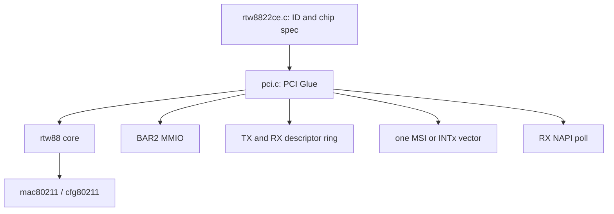
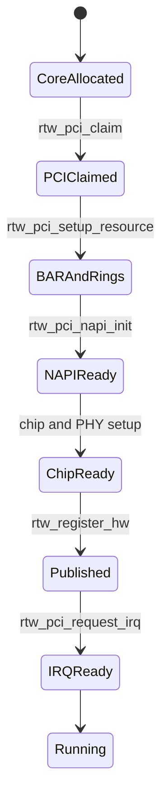
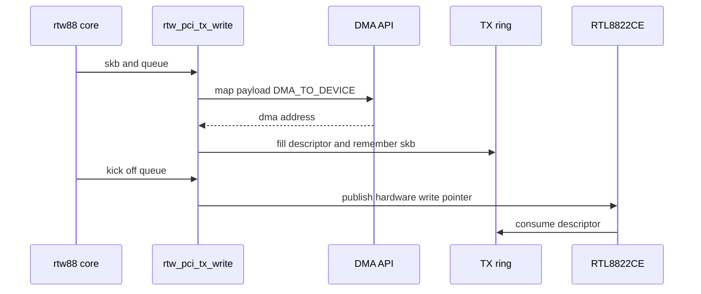
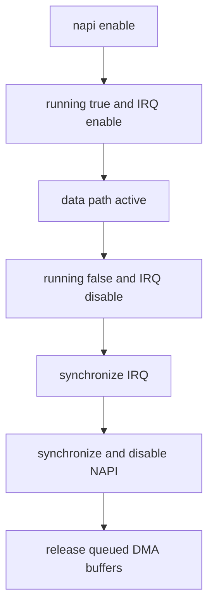

前六篇已经建立 PCIe 协议、枚举、BAR、Linux 子系统架构、核心结构和函数。现在用一块真实 PCIe 无线网卡观察这些机制怎样在同一个 Driver 中组合，并明确哪些部分属于 Linux PCI Glue、哪些属于 Realtek 私有实现。

本文选择 Linux 6.12 主线 `rtw88` 的 RTL8822CE PCI Glue 作为局部案例。选择它是为了观察通用机制怎样落地，不是把系列改成 Realtek 驱动教程；Realtek 私有寄存器和 Descriptor Bit 只属于对应芯片，不能推广成 PCIe 规范。

源码路径以 Linux v6.12 `drivers/net/wireless/realtek/rtw88/pci.c` 与 `rtw8822ce.c` 为准。野火章节用于参考“从对象到接口再到真实源码”的教学层次，本文的正文、图示和推导重新编写。

## 一、rtw88 由哪几层共同组成

`rtw88` 不是一个单文件 Driver。RTL8822CE 模块负责 PCI ID 与 Chip Specification，公共 PCI Glue 负责 BAR、DMA、IRQ 和 NAPI，rtw88 Core 管理 Firmware/无线状态，mac80211/cfg80211 再把设备接入 Linux 无线子系统。



这种分层让多个 rtw88 芯片复用同一套 PCI 生命周期。因为 `id->driver_data` 提供具体 Chip Information，所以 `rtw_pci_probe()` 可以保持通用；芯片差异通过 Hardware Specification 与 Operation Table 进入，而不是复制整套 Probe。

阅读时首先标记边界：`pci_enable_device()`、`pci_request_regions()`、DMA API 和 IRQ Vector 是 Linux PCI/Driver 机制；Channel、Rate、Firmware Command 和 Realtek Register 是设备业务。只有前一类可以直接迁移到其他 PCIe 驱动。

## 二、RTL8822CE 模块只负责匹配和选择规格

Linux 6.12 的 `rtw8822ce.c` 很短，ID Table 匹配 Realtek `0xC822` 与 `0xC82F`，`driver_data` 指向 `rtw8822c_hw_spec`。`struct pci_driver` 的 `.probe`、`.remove`、PM、Shutdown 和 Error Handler 则指向公共 PCI 实现。

```text
PCI ID match
  -> choose rtw8822c hardware specification
  -> call common rtw_pci_probe
  -> common PCI Glue uses chip-specific sizes and operations
```

这说明 ID Table 不只是“允许绑定”。匹配项还把设备族信息传入公共代码，因此 Probe 后续知道 Descriptor Size、Chip Operation 和能力差异。RTL8821CE 的组织方式相同，但 ID 和 Chip Specification 不同。

## 三、rtw_pci_probe() 按依赖顺序建立设备

官方 v6.12 源码中的主路径可以整理为：分配 `ieee80211_hw/rtw_dev`，初始化 rtw88 Core，Claim PCI Function，建立 BAR 与 DMA Ring，初始化 NAPI，读取 Chip Information 和 PHY，注册 mac80211 Hardware，最后申请 IRQ。



每个错误标签都撤销已经成功的阶段。IRQ 申请发生在 mac80211 注册之后，所以 IRQ 失败时源码先注销 `ieee80211_hw`，再销毁 NAPI、Ring、BAR 与 PCI Claim；这仍然符合“先撤销外部入口，再释放内部资源”的原则。

因为设备中断在 Start 前保持受控状态，所以注册上层对象与申请 IRQ 的具体先后可以由该驱动合同决定。不能只从一份模板判断顺序对错，要检查什么时候硬件真正可能产生事件。

## 四、PCI Claim 与 BAR2 映射建立寄存器访问

`rtw_pci_claim()` 调用 `pci_enable_device()`、`pci_set_master()` 并保存 Driver Data，使 Function 能响应资源事务并具备 Bus Master 权限。它不重新扫描设备，也不自己给 BAR 分配全局地址，因为这些结果已经位于 `pci_dev->resource[]`。

资源建立函数先 `pci_request_regions()`，再读取 BAR2 长度并调用 `pci_iomap()`，映射结果保存在 PCI Private Object 中。后续 `rtw_pci_read8/16/32` 和写函数最终使用标准 I/O Accessor 访问这段 `__iomem`。


BAR2 是 Realtek 设备协议选择，不是 PCIe 规则。其他设备可能使用 BAR0 或多个 BAR，因此能迁移的是 Request/Map/Accessor 的生命周期，而不是 BAR Number。

## 五、Descriptor Ring 与 Packet Buffer 使用不同 DMA 语义

TX/RX Descriptor Ring 由 `dma_alloc_coherent()` 分配，因为 CPU 与设备长期共享控制字段。TX `skb` 在提交时使用 `DMA_TO_DEVICE` Streaming Mapping，RX Buffer 使用 `DMA_FROM_DEVICE`，完成或销毁时按原方向解除映射。

```text
TX descriptor ring -> coherent allocation
RX descriptor ring -> coherent allocation
TX skb payload     -> streaming map to device
RX skb buffer      -> streaming map from device
```

这与第 08 篇建立的模型完全一致：Coherent Ring 不等于自动有内存顺序，Streaming Payload 也不能在设备 Ownership 期间由 CPU 随意访问。设备私有 Descriptor 中保存 DMA Address，但字段宽度与字节序只由 Realtek ABI 决定。

初始化失败时，源码只释放已经分配的 TX/RX Ring 和 Buffer；这说明批量资源初始化仍需要精确记录进度，不能在第 `i` 项失败后假设全部数组都有效。

## 六、TX 路径体现 Map、Descriptor、Kick 与回收

HCI Operation 把发送入口映射到 `rtw_pci_tx_write()`，把硬件通知映射到 `rtw_pci_tx_kick_off()`。TX 路径选择 Hardware Queue，确认 Descriptor 可用，Map `skb`，填写 Buffer Descriptor，并把 `skb` 加入对应软件队列，随后更新 Hardware Write Pointer。



TX Completion 进入 `rtw_pci_tx_isr()`，Driver 读取 Hardware Read Pointer，回收已完成 `skb`，按保存的 DMA Address Unmap，再向上层报告发送状态。可迁移的数据路径是 Map → Publish → Completion → Unmap，Queue Index 和 Descriptor Bit 不能迁移。

## 七、RX 使用预映射 Buffer 与 NAPI 批量消费

RX Ring 初始化时为每个 Slot 准备 `skb`，建立 `DMA_FROM_DEVICE` Mapping，并把 DMA Address 写入 Descriptor。设备收到 Frame 后写入 Buffer 和 RX Descriptor，随后产生中断。

IRQ 路径调度 NAPI，`rtw_pci_napi_poll()` 按 Budget 调用 RX Consumer。Consumer 将 Buffer 同步给 CPU、解析设备私有 RX Descriptor、把 Frame 交给 `ieee80211_rx_napi()`，再把原 Buffer同步回 Device 并推进 Ring Index。

NAPI 完成后重新 Enable Interrupt，并再次检查 DMA Ring 是否已经出现新数据。因为 Frame 可能在 Poll Complete 与中断恢复的窗口到达，所以这次 Recheck 是防止丢事件的必要握手，而不是重复工作。

## 八、该版本只使用一个 MSI 或 INTx Vector

Linux 6.12 `rtw_pci_request_irq()` 申请最少和最多各一个 Vector，默认允许 MSI 与 INTx；Module Parameter 可以禁止 MSI。随后 Driver 注册 Hard Handler 和 Thread Function。

因此这个案例**没有使用 MSI-X 多队列 Vector**。MSI-X 是第 07 篇介绍的通用机制，第 17 篇还会讨论多队列设计，但不能为了“完整”而把源码不存在的机制写进 rtw88。

Hard Handler 先关闭设备中断并返回 `IRQ_WAKE_THREAD`。Thread Function 读取并清除设备 Interrupt Status，处理各 TX Queue Completion，RX 事件则安排 NAPI，最后只在 `running` 状态下重新 Enable Interrupt。

一个 Vector 可以承载多个事件源，所以真正的事件分类来自设备 Status 和 Ring，而不是 Linux IRQ Number。这再次说明中断只是通知，业务事实仍在 Completion/Descriptor 中。

## 九、Start/Stop 展示正确的异步停止合同

`rtw_pci_start()` 先 Enable NAPI，再设置 `running=true` 并 Enable Interrupt。这样即使通知立即到达，后续 Poll Context 也已经准备完成。

`rtw_pci_stop()` 先设置 `running=false`、关闭设备中断，然后 `synchronize_irq()`，停止 NAPI，最后释放仍排队的 DMA Buffer。因为 Handler 和 Poll 都可能访问 Ring，所以它们退出后才能 Unmap/Free。



这条 Stop Contract 能迁移到其他 PCIe Driver：阻止新进入、关闭通知源、同步异步执行上下文、确认 Device 不再访问，最后释放 DMA 与 MMIO。

## 十、ASPM 代码体现标准能力与私有实现的边界

rtw88 先通过标准 PCIe Capability 读取 Link Control，确认 Host 对 CLKREQ/ASPM 的配置，再通过 Realtek 私有 DBI/MDIO 路径启用芯片内部对应模块。标准配置和设备私有开关都满足，机制才真正工作。

源码还针对部分 Chip/Bridge 组合协调 NAPI 与 Link Power，说明 ASPM 可能与高吞吐 RX 路径产生互操作问题。这个案例验证了第 11 篇的结论：Link Power 不能脱离业务状态和板级 CLKREQ# 单独调整。

但具体 Workaround 不具有通用性。另一个设备应依据自身 Capability、公开手册和平台信号设计，而不是复制 Realtek DBI Register 操作。

## 十一、Remove 与错误回滚怎样保持所有权完整

Probe 失败会依次撤销已经建立的 mac80211、NAPI、PCI Resource、PCI Claim、Core 和 Hardware Object。Linux 6.12 的 `rtw_pci_remove()` 则先注销上层 Hardware，关闭中断和 NAPI，再销毁 Ring/BAR、Disable PCI Function、释放 IRQ 和 Core。

阅读 Remove 时应按所有权提问：谁先阻止 mac80211 提交，谁让 IRQ/NAPI 退出，谁确保 DMA 不再引用 `skb`，谁最后解除 BAR。函数顺序不一定是 Probe 文本的严格镜像，但每个活动执行上下文必须早于其数据释放。

Shutdown 只负责系统关机语义，可能执行 Chip Shutdown 并进入 D3hot；它不等于完整 Remove，因此不能用 Shutdown 回调替代正常解绑。

## 十二、常见误解与审查重点

现在应当能够沿 `rtw_pci_probe()` 讲出 Core、PCI Claim、BAR/Ring、NAPI、Chip/mac80211、IRQ 的依赖，并描述 TX 的 Map/Descriptor/Kick/Completion/Unmap 与 RX 的预映射/IRQ/NAPI/Sync/Recycle。

可以迁移的是 PCI Glue 生命周期、DMA ownership、IRQ/NAPI 停止合同和标准 Capability 边界；不能迁移的是 BAR2、Device ID、Descriptor Layout、Queue Register、DBI/MDIO Offset 和芯片 Workaround。真实设备案例的价值正是同时看见这两类内容。

## 十三、小结

Linux 6.12 `rtw88` 通过短小芯片 ID 模块和公共 PCI Glue，把 BAR2、DMA Descriptor Ring、单 Vector MSI/INTx、Threaded IRQ、NAPI、ASPM 与 mac80211 组合起来。它没有改变前面通用机制，只为每个机制填入 Realtek 设备协议。

设备案例到这里结束。下一篇切换到 Host 侧：当 Linux 连 `pci_dev` 都无法创建时，如何从 RK356x Root Complex 的供电、REFCLK、PERST#、PHY、LTSSM、ATU 和配置访问逐层 Bring-up；这时修改 rtw88 ID 或 TX Ring 已经没有意义。

**一手资料**

- [Linux 6.12 stable rtw88 PCI source](https://git.kernel.org/pub/scm/linux/kernel/git/stable/linux.git/tree/drivers/net/wireless/realtek/rtw88/pci.c?h=linux-6.12.y)
- [Linux 6.12 stable RTL8822CE glue](https://git.kernel.org/pub/scm/linux/kernel/git/stable/linux.git/tree/drivers/net/wireless/realtek/rtw88/rtw8822ce.c?h=linux-6.12.y)
- [Linux 6.12 PCI driver API](https://www.kernel.org/doc/html/v6.12/driver-api/pci/pci.html)
- [野火 Linux PCI 子系统章节（教学框架参考）](https://doc.embedfire.com/linux/rk356x/driver/zh/latest/linux_driver/subsystem_pci_subsystem.html)
