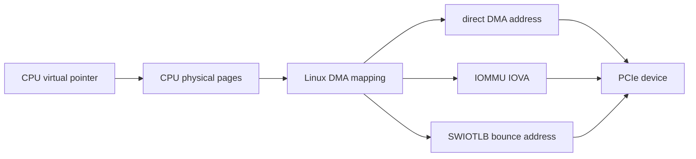
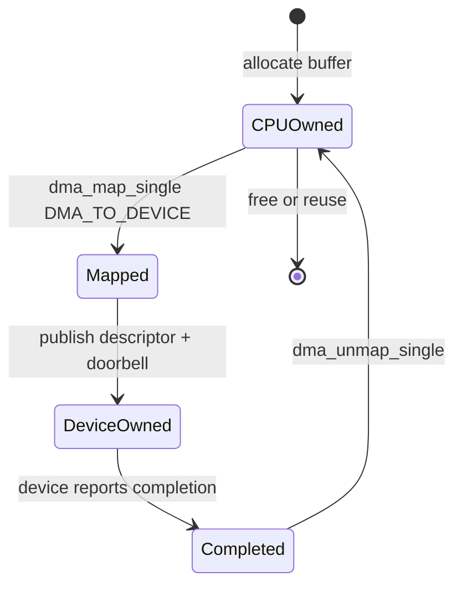
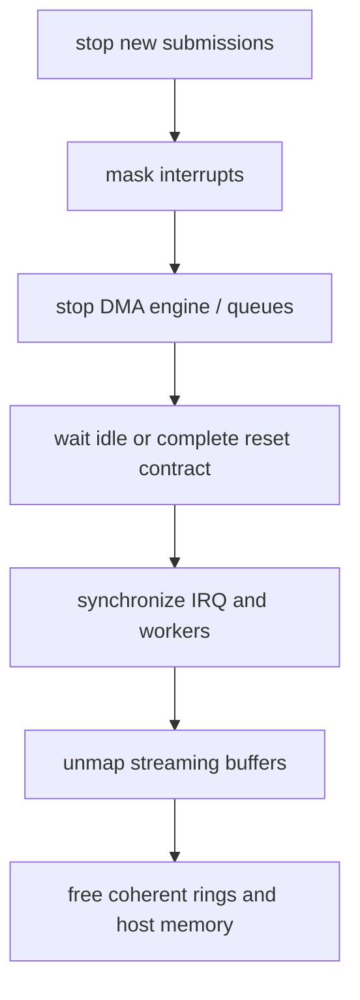

第 07 篇解释了设备怎样通知 CPU，但通知通常只表示“某个 DMA 请求完成”。真正的数据位于 Host Memory，设备却不能直接使用驱动手里的普通 C 指针。那么驱动把一块 Buffer 交给设备时，地址怎样转换，Cache 由谁同步，完成前后谁可以访问？

DMA 最难的地方不是函数多，而是三个问题经常混在一起：地址是否可达、缓存是否可见、访问顺序是否正确。Linux DMA API 分别提供 Mask/Mapping、Sync 和 Barrier 来处理它们；少调用一个接口，系统可能只在 IOMMU、非一致性 ARM 或高并发下暴露故障。

本文以 Linux 6.12 为基线，先追踪一个 TX Buffer 的完整 ownership，再进入 Coherent Ring、Scatter-Gather、SWIOTLB 和故障证据。示例中的设备协议为教学模型。

## 一、先看问题：设备为什么不能使用 CPU 指针

驱动通过 `kmalloc()` 得到的地址是 CPU Virtual Address，只在当前内核页表和 CPU Address Space 中有意义。PCIe Device 发出的 Memory Request 使用 DMA Address；它可能等于 CPU Physical Address，也可能是 IOMMU 分配的 IOVA，或指向 SWIOTLB Bounce Buffer。



因此 Driver 不能用 `virt_to_phys()` 或强制类型转换把指针交给硬件。这样做跳过了 IOMMU、地址位宽、Bounce 和 Cache Maintenance，代码也许在一台 x86 无 IOMMU 主机上“能跑”，却不具备可移植 DMA 语义。

DMA API 的返回值只在指定 Device、Direction、Length 和 Mapping Lifetime 内有效。把另一个 `pci_dev` 的 DMA Address 复用过来，或者在 `dma_unmap_single()` 后继续让设备访问，都是所有权错误。

## 二、一个 TX Buffer 的最小 ownership 生命周期

假设 CPU 准备一帧数据，设备通过 DMA Read 取走。完整路径是：CPU 分配并填写 Buffer，Driver 建立 Streaming Mapping，Descriptor 记录 DMA Address，Barrier 发布 Descriptor，Doorbell 把 ownership 交给设备；Completion 到达后，Driver 回收 Mapping 和 Buffer。



```c
buf = kmalloc(len, GFP_KERNEL);
if (!buf)
    return -ENOMEM;

fill_packet(buf, len);

dma = dma_map_single(&pdev->dev, buf, len, DMA_TO_DEVICE);
if (dma_mapping_error(&pdev->dev, dma)) {
    kfree(buf);
    return -EIO;
}

desc->addr = cpu_to_le64(dma);
desc->len = cpu_to_le32(len);
desc->flags = cpu_to_le32(DEMO_DESC_READY);
dma_wmb();
writel(new_tail, bar0 + DEMO_TX_DOORBELL);
```

从 `dma_map_single()` 成功到 Completion 回收之前，Buffer 的业务 ownership 属于 Device。CPU 不应修改内容或提前 `kfree()`，因为设备可能仍在读取；这意味着“Doorbell 已写”不是本地函数结束，而是所有权转移点。

Completion 后调用 `dma_unmap_single()` 结束 Mapping，CPU 才能安全释放或重新写入。若硬件支持取消/Reset，Driver 仍要先证明 DMA 已停止，再 Unmap；Reset 命令已经发出不等于旧 Request 已经从 PCIe Fabric 和 Device Engine 中消失。

## 三、先设置 DMA Mask，再分配任何 DMA 资源

设备能够产生多少位 DMA Address 由硬件决定。Driver 在 Probe 中使用 `dma_set_mask_and_coherent()` 告诉 DMA Layer Streaming 与 Coherent 的地址位宽：

```c
int ret;

ret = dma_set_mask_and_coherent(&pdev->dev, DMA_BIT_MASK(64));
if (ret) {
    ret = dma_set_mask_and_coherent(&pdev->dev, DMA_BIT_MASK(32));
    if (ret)
        return ret;
}
```

Mask 必须早于 `dma_alloc_coherent()`、`dma_map_single()` 和 `dma_map_sg()`。因为 Mapping Backend 会据此选择可达地址、IOMMU IOVA 或 Bounce Buffer，所以先分配后改 Mask 会让已有资源不符合最终约束。

64-bit Capability 不意味着任何平台都能直接返回 64-bit Physical Address。IOMMU 可以把高物理页映射到低 IOVA，SWIOTLB 可以 Bounce，Host Bridge 也可能有 `dma-ranges`；Driver 应相信 DMA API 的结果，而不是根据 CPU 地址猜测硬件是否可达。

## 四、Coherent Allocation 适合长期共享控制结构

Descriptor Ring、Completion Ring 和 Doorbell Record 常由 CPU 与 Device 长期共享，适合 `dma_alloc_coherent()`：

```c
ring = dma_alloc_coherent(&pdev->dev, ring_bytes,
                          &ring_dma, GFP_KERNEL);
if (!ring)
    return -ENOMEM;
```

Coherent 表示 CPU 与 Device 对该区域的缓存可见性由平台保证，不需要每次调用 `dma_sync_*()`。它不表示访问具有自动顺序，也不表示 Descriptor 字段可以任意重排；发布 Descriptor 前仍可能需要 `dma_wmb()`，消费 Completion 后仍可能需要 `dma_rmb()`。

返回的 CPU Pointer 用于软件访问，`ring_dma` 用于写入设备寄存器或 Descriptor。两者不能交换。释放时必须使用完全相同的 Device、Size、CPU Pointer 和 DMA Handle：

```c
dma_free_coherent(&pdev->dev, ring_bytes, ring, ring_dma);
```

Coherent Memory 可能昂贵、受限或使用特殊映射，因此不应把所有 Payload 都改成 Coherent 来回避 ownership。大块、短期数据通常更适合 Streaming Mapping。

## 五、Streaming Mapping 强调方向和使用阶段

Streaming API 通过 `dma_map_single()`、`dma_map_page()` 和 `dma_map_sg()` 建立有限生命周期 Mapping。Direction 从设备视角命名：

| Direction | 数据主要方向 | CPU 在 Device Ownership 期间 |
| --- | --- | --- |
| `DMA_TO_DEVICE` | Host -> Device | 不应修改发送内容 |
| `DMA_FROM_DEVICE` | Device -> Host | 不应读取未完成内容 |
| `DMA_BIDIRECTIONAL` | 双向 | 规则最保守，不能为省事默认使用 |

Direction 会影响 Cache Clean/Invalidate 和平台优化。错误地把 RX Buffer 映射为 `DMA_TO_DEVICE`，可能让 CPU 在设备写回后继续看到旧 Cache；全部使用 `DMA_BIDIRECTIONAL` 虽有时能工作，却隐藏协议方向并增加同步成本。

每次 Map 后必须调用 `dma_mapping_error()`。返回的 `dma_addr_t` 为 0 也可能是合法地址，因此不能用 `if (!dma)` 判断失败。

## 六、长寿命 Streaming Mapping 需要显式 Sync

有些驱动预先 Map 一批 RX Page，并在 CPU 与 Device 之间多次循环使用，而不是每次完成都 Unmap。此时 ownership 转换使用 `dma_sync_single_for_cpu()` 与 `dma_sync_single_for_device()`。

```text
mapped for DMA_FROM_DEVICE
  -> device owns and fills buffer
  -> completion arrives
  -> dma_sync_single_for_cpu
  -> CPU parses data
  -> CPU prepares buffer for reuse
  -> dma_sync_single_for_device
  -> publish descriptor back to device
```

Sync 不是锁，也不等待设备完成。Driver 必须先通过 Completion/Status 证明 Device 已经交还 ownership，再 Sync 给 CPU；反方向也要在 CPU 完成修改后 Sync 给 Device。因此同步接口依赖协议状态机，而不是替代状态机。

在 Fully Coherent 平台上 Sync 可能实现为空，但仍应保留，因为它表达生命周期并让同一 Driver 能运行在 Non-Coherent ARM/RISC-V 上。

## 七、Scatter-Gather 把离散内存转换成设备可用 Segment

网络包、Block I/O 或用户页通常物理不连续。Driver 先构造 `struct scatterlist`，再调用 `dma_map_sg()`：

```c
int mapped_nents;

mapped_nents = dma_map_sg(&pdev->dev, sgl, orig_nents,
                          DMA_TO_DEVICE);
if (!mapped_nents)
    return -EIO;

for_each_sg(sgl, sg, mapped_nents, i) {
    dma_addr_t addr = sg_dma_address(sg);
    unsigned int len = sg_dma_len(sg);
    demo_emit_desc(addr, len);
}
```

`mapped_nents` 可能小于 `orig_nents`，因为 DMA Layer 可以合并相邻 Segment，或按 IOMMU/Device 限制重新组织。因此硬件 Descriptor 必须遍历 Mapping 后的 DMA Entry，不能继续使用原始 Page 数量。

Unmap 时 API 要求传入原始 `orig_nents`，不是 `mapped_nents`：

```c
dma_unmap_sg(&pdev->dev, sgl, orig_nents, DMA_TO_DEVICE);
```

因为 Map 后的 DMA Length 可能受 Segment Boundary、Max Segment Size 和 Alignment 限制，所以高性能 Driver 还要设置或读取 Device DMA Parameters，并在 Descriptor 数量不足时实施 Backpressure。

## 八、dma_wmb() 与 dma_rmb() 保护 Descriptor 发布

考虑 CPU 依次写 Descriptor Address、Length、Flags，然后敲 Doorbell。编译器、CPU 和互连可能重排普通内存写；设备若先看到 Ready Flag 或 Doorbell，就会读取半初始化 Descriptor。

```c
WRITE_ONCE(desc->addr, cpu_to_le64(payload_dma));
WRITE_ONCE(desc->len, cpu_to_le32(len));
WRITE_ONCE(desc->flags, cpu_to_le32(DEMO_DESC_READY));
dma_wmb();
writel(tail, bar0 + DEMO_DOORBELL);
```

`dma_wmb()` 保证此前对 DMA Coherent/Shared Memory 的写，在后续设备可见操作之前发布。`writel()` 表达 MMIO Doorbell，但两者约束对象不同，因此不应假设一个普通 `wmb()`、CPU Mutex 或 `volatile` 可以替代 DMA Barrier。

设备写 Completion 时也要先写 Payload/Length，最后发布 Owner/Phase。CPU 看到完成标志后使用 `dma_rmb()`，再读取其他字段：

```c
if (READ_ONCE(cqe->phase) == expected_phase) {
    dma_rmb();
    len = le32_to_cpu(READ_ONCE(cqe->len));
}
```

Barrier 只建立顺序，不执行 Cache Sync、不分配 IOVA、也不证明设备已经完成。地址、缓存、顺序三类问题必须分别由 Mapping、Sync 和 Barrier 处理。

## 九、SWIOTLB 和 IOMMU 是 DMA API 的后端选择

当 Device 只能访问低地址，而系统物理内存位于高地址，SWIOTLB 可以分配可达 Bounce Buffer。`DMA_TO_DEVICE` Map 时先把数据复制到 Bounce，`DMA_FROM_DEVICE` Unmap/Sync 时再复制回原 Buffer，因此吞吐和 CPU 占用会受到影响。

IOMMU 则为 Device 建立 IOVA 到 Physical Page 的页表。Driver 仍只看到 `dma_addr_t`，并不直接操作 IOMMU Page Table。因为同一个 API 可以选择 Direct、IOMMU 或 SWIOTLB，所以正确 Driver 不需要为这些后端写三套数据路径。

若性能突然下降，应检查是否启用 SWIOTLB、IOMMU Page Size、Map/Unmap Frequency 和 IOTLB Miss，而不是先把 DMA API 替换成 Physical Address。第 10 篇会进一步解释 IOMMU Domain、Group、ATS、PRI、PASID 与 SVA。

## 十、停止、Reset 与错误路径必须先收回 ownership

Probe 回滚或 remove 不能看到 `dma_map_*()` 成功就立即 Unmap 所有 Buffer。Driver 必须先停止新提交，Mask IRQ，命令设备停止 Queue，Flush Posted Write，并通过 Idle/Reset/Controller Contract 证明 Device 不再发起访问。



Timeout 只说明软件没有按时看到完成，不自动把 ownership 交还 CPU。若硬件仍可能访问，提前 Free 会造成 Use-After-Free、IOMMU Fault 或内存破坏。因此错误恢复需要明确的“设备已停止”证据，而不是用更长延时掩盖竞态。

## 十一、怎样从证据区分地址、缓存和顺序问题

IOMMU Fault 通常包含 Device、IOVA、Read/Write 和权限，说明设备访问了未映射或不允许的地址。若 Fault IOVA 与 Descriptor 中地址不一致，应检查字节序、Descriptor 越界、Use-After-Unmap 和设备寄存器编程。

没有 Fault 但 CPU 读到旧数据，更像 Direction/Sync/Ownership 问题；Descriptor 偶发半写、Doorbell 压力下才失败，则更像 Barrier 或 MMIO Ordering。数据总在 4 GiB 以上失败，可能是 DMA Mask、地址高位或硬件 Descriptor 宽度。

有效故障记录至少包括 BDF、Queue、Request ID、DMA Address、Length、Direction、Map/Unmap 时间、Producer/Consumer 和 IOMMU/AER 日志。只记录“DMA Timeout”无法判断请求在哪个 ownership 状态停住。

## 十二、本篇检查点

现在应当能够完整描述一个 TX Buffer：CPU 分配并填写，`dma_map_single()` 得到 Device 可用的 DMA Address，Descriptor 和 `dma_wmb()` 发布 ownership，Device 读取并产生 Completion，CPU 再 Unmap 和释放。

还应能严格区分 CPU Virtual、Physical、DMA Address 与 IOVA，解释 Coherent 不等于有顺序，Sync 不等于等待完成，Barrier 不等于 Cache Maintenance，以及 `dma_map_sg()` 为什么返回的 Entry 数可以少于原始 SG 数。

## 十三、小结：下一篇把单个 Buffer 扩展成 Ring

Linux DMA API 把 Direct、IOMMU 和 SWIOTLB 后端隐藏在统一 Mapping 语义后面。Mask 解决可达地址范围，Map/Unmap 定义 Mapping 生命周期，Sync 处理 Streaming Cache Ownership，Barrier 保证 Descriptor 与 Doorbell 的可见顺序。

下一篇将把一个 Buffer 扩展为持续运行的 Submission/Completion Ring，解释 Producer、Consumer、Wrap、Phase Bit、Backpressure 和 Generation 怎样共同防止覆盖未完成请求与误收旧 Completion。

**一手资料**

- [Linux 6.12 DMA API HOWTO](https://www.kernel.org/doc/html/v6.12/core-api/dma-api-howto.html)
- [Linux 6.12 DMA API](https://www.kernel.org/doc/html/v6.12/core-api/dma-api.html)
- [Linux Memory Barriers](https://docs.kernel.org/core-api/wrappers/memory-barriers.html)
