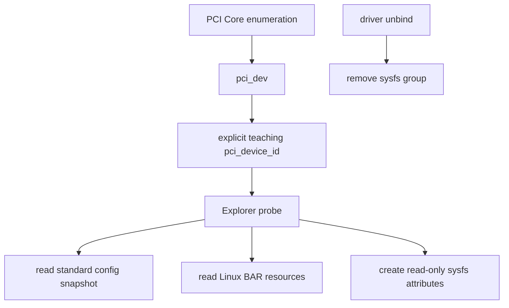
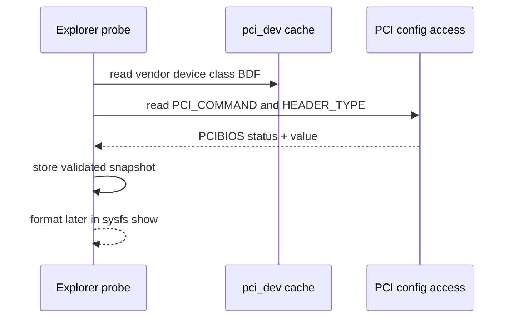

前七篇已经介绍配置空间、BAR、核心对象/API 和真实 `rtw88` Driver。现在通过一个低风险 Explorer 把这些知识对应到 `lspci`、sysfs 和 `pci_dev`，不启动 DMA、不修改未知设备寄存器。

PCI Explorer 的价值不是再造一个 `lspci`，而是把用户看到的 BDF 和配置字段，与驱动回调中的 `struct pci_dev` 关联起来。通过这一步，读者可以验证“枚举完成后，功能驱动究竟拿到了什么”，再进入 IRQ 和 DMA。

本文以 Linux 6.12 和仓库配套的 `pci_explorer.c` 为基础。Explorer 只匹配显式教学 ID，只读取标准 Configuration Space 与 Linux Resource；RTL8822CE/RTL8821CE 只用于展示标准 `lspci` 格式，不读取或写入它们的私有 BAR。

## 一、从一行 lspci 对应到 pci_dev

假设系统显示下面的代表性格式：

```text
01:00.0 Network controller [0280]: Realtek Semiconductor Co., Ltd. Device [10ec:c822]
```

这行文字并不是 `lspci` 扫描了厂商业务寄存器。Linux PCI Core 已经通过配置访问创建 `pci_dev`，sysfs 暴露标准属性，`lspci` 再读取 Configuration Space 与 PCI ID Database 进行解码。

在 Driver `probe(struct pci_dev *pdev, ...)` 中，对应信息已经缓存为：

```c
/* 这些字段由 PCI Core 从标准配置头缓存，不需要先映射 BAR。 */
pdev->vendor;
pdev->device;
pdev->subsystem_vendor;
pdev->subsystem_device;
pdev->class;
pdev->revision;
pdev->bus;
pdev->devfn;
```

因为这些字段来自通用 Header，所以读取它们不需要先 `pci_iomap()`，也不需要启用 Bus Master。Explorer 的第一条设计原则就是按最小权限观察：如果目标只是证明枚举和资源结果，就不要获得 DMA、IRQ 或设备私有寄存器的控制权。

## 二、Explorer 仍然是普通 pci_driver

Explorer 使用 `pci_driver` 的原因是它需要在受控绑定生命周期中访问 `pci_dev`，并创建与设备共同生灭的 sysfs Attribute。它并没有绕过 Driver Model，也不能同时与真实功能驱动绑定同一个 Function。



若 Explorer 使用 Class-only ID 匹配所有网络或存储设备，它可能抢占系统网卡、NVMe 或 GPU，导致业务功能消失。因此示例必须使用保留的教学 VID/DID，或者只在明确知道后果时通过 `new_id` 对一块测试设备动态绑定。

即便通过 `new_id` 绑定真实设备，原功能驱动也会先解绑。解绑可能停止网络、卸载存储或破坏正在使用的设备，因此“只读 Explorer 本身安全”不等于“驱动切换过程没有影响”。

## 三、最小 probe() 先取得一致快照

只读 Explorer 不调用 `pci_set_master()`、DMA Allocation、`pci_alloc_irq_vectors()` 或设备私有 BAR 写。它只需要保存 `pdev`、读取标准配置字段，并发布只读 Attribute：

```c
/* Probe 只建立只读快照和 sysfs，不启用 Bus Master、DMA 或 IRQ。 */
static int explorer_probe(struct pci_dev *pdev,
                          const struct pci_device_id *id)
{
    struct explorer *exp;
    int ret;

    exp = devm_kzalloc(&pdev->dev, sizeof(*exp), GFP_KERNEL);
    if (!exp)
        return -ENOMEM;

    exp->pdev = pdev;
    pci_set_drvdata(pdev, exp);

    ret = explorer_take_snapshot(exp);
    if (ret)
        return ret;

    return sysfs_create_group(&pdev->dev.kobj,
                              &explorer_attr_group);
}
```

`explorer_take_snapshot()` 把少量配置字段读取到 Driver Private Memory，sysfs Show Callback 只格式化这份快照。因为 Show 可能由任意用户线程反复调用，所以不应每次都持有配置锁、唤醒设备或遍历可能变化的链表。

一次快照只能证明某个时间点的状态。Link Speed、Power State、AER Status 和 Command Register 可能后来改变，因此需要实时信息时，应明确使用动态读取并处理设备离线，而不是把静态快照标成当前状态。

## 四、配置头读取要检查返回状态

虽然 `pci_dev` 已缓存身份字段，Explorer 仍可读取少量标准寄存器与缓存值对照：

```c
/* 每次配置读取都检查返回状态，失败时不能输出未初始化值。 */
u16 command;
u8 header_type;
int ret;

ret = pci_read_config_word(pdev, PCI_COMMAND, &command);
if (ret)
    return pcibios_err_to_errno(ret);

ret = pci_read_config_byte(pdev, PCI_HEADER_TYPE, &header_type);
if (ret)
    return pcibios_err_to_errno(ret);
```

Configuration Access 返回的可能是 `PCIBIOS_*` 状态，不总是 Linux errno。若忽略返回值并输出局部变量，访问失败会被伪装成随机寄存器值。因此 Explorer 必须先判断状态，再把字段写入有效 Snapshot。

Header Type 决定 Type 0/Type 1 Layout，Command 表示 Memory/IO Decode 与 Bus Master 状态，Status 表示 Capability List 等通用状态。Explorer 可以解释这些标准位，但不能据此断言厂商 Firmware 或业务队列已经运行。



## 五、Standard Capability 先形成一条可验证链

Status Register 的 Capabilities List Bit 表示标准 Capability 存在，Header 中的 Capability Pointer 指向第一个节点。每个节点前两个字节是 Capability ID 和 Next Pointer，因此软件可以顺链发现 PM、MSI、MSI-X 和 PCIe Capability。

Explorer 不必手写遍历器。Linux 6.12 提供 `pci_find_capability()`，例如：

```c
int pm = pci_find_capability(pdev, PCI_CAP_ID_PM);
int msi = pci_find_capability(pdev, PCI_CAP_ID_MSI);
int msix = pci_find_capability(pdev, PCI_CAP_ID_MSIX);
int exp = pci_find_capability(pdev, PCI_CAP_ID_EXP);
```

返回值是 Capability 在 Configuration Space 中的 Offset，0 表示未找到。这个 Offset 不是通用对象地址，而是后续读取 Capability Register 的基准；不同设备的同一 Capability 可以位于不同位置。

PCIe Capability 中的 `LnkCap` 和 `LnkSta` 能展示最大与当前 Speed/Width，`DevCap/DevCtl` 能展示 MPS/MRRS 能力与配置。因为 Capability 表示标准机制，所以这些字段适合 Explorer；但改变 ASPM、MPS 或 MSI Enable 会影响正在运行设备，不属于只读观察范围。

## 六、Extended Capability 从 0x100 继续扩展

Extended Capability Header 从 Offset `0x100` 开始，包含 ID、Version 和 Next Pointer。常见 ID 包括 AER、ACS、ARI、SR-IOV、ATS、PRI、PASID 和 Resizable BAR。

```c
int aer = pci_find_ext_capability(pdev, PCI_EXT_CAP_ID_ERR);
int ats = pci_find_ext_capability(pdev, PCI_EXT_CAP_ID_ATS);
int pasid = pci_find_ext_capability(pdev, PCI_EXT_CAP_ID_PASID);
```

找到 Capability 只证明设备声明支持相关结构，不证明平台、Root Port、IOMMU 和 Driver 已经启用整条功能。例如 Endpoint 有 ATS Capability，但 IOMMU、PCI Core 策略或 Driver 未建立 ATS Translation Cache 时，不能据此声称 ATS 正在工作。

Explorer 若需要通用遍历所有 Extended Capability，也要防止坏 Next Pointer、自环、未对齐和越界。Linux Helper 已经处理常规查找，教学代码应优先复用，而不是为了展示循环而降低鲁棒性。

## 七、BAR 应观察 Resource，不应盲读内容

Explorer 可以安全读取 PCI Core 保存的 BAR Resource：

```c
/* 只读取 PCI Core 保存的 Resource，不访问未知 BAR 内部寄存器。 */
for (int bar = 0; bar < PCI_STD_NUM_BARS; bar++) {
    resource_size_t start = pci_resource_start(pdev, bar);
    resource_size_t len = pci_resource_len(pdev, bar);
    unsigned long flags = pci_resource_flags(pdev, bar);

    if (!len)
        continue;
    dev_info(&pdev->dev,
             "BAR%d start=%pa len=%pa flags=%#lx\n",
             bar, &start, &len, flags);
}
```

这些 API 读取的是第 03 篇建立的 Linux Resource 结果，不会再次执行 BAR sizing，也不会申请 Region。因为只读 Explorer 不准备访问业务寄存器，所以通常不需要 `pci_request_regions()` 或 `pci_iomap()`。

不要把“映射 BAR 后读取前 64 字节”设计成通用功能。某些 offset 是 Read-Clear 状态、FIFO、Doorbell Response 或访问后触发硬件动作；没有 Programming Manual 时，连读取都可能有副作用。因此 Explorer 的 BAR 报告止于 Start、Length 和 Flags。

如果确实有一块公开协议的教学 Endpoint，可以额外定义 VID/DID、BAR Index、最小长度和只读 Offset 白名单。这个扩展属于该设备协议，不应混入标准 PCI Explorer 路径。

## 八、sysfs 与 lspci 各自证明什么

`/sys/bus/pci/devices/0000:01:00.0/` 把 Driver Model、Resource 和配置访问暴露给用户。常见属性包括 `vendor`、`device`、`class`、`resource`、`config`、`driver`、`iommu_group`、`current_link_speed` 和 `current_link_width`，具体文件取决于平台和能力。

```bash
# 将 BDF 替换为目标 Function；以下命令只读身份、资源、绑定和 IOMMU 关系。
DEV=/sys/bus/pci/devices/0000:01:00.0
cat "$DEV/vendor" "$DEV/device" "$DEV/class"
cat "$DEV/resource"
readlink "$DEV/driver"
readlink "$DEV/iommu_group"
lspci -s 0000:01:00.0 -vv
```

`lspci -vv` 适合解码配置空间，sysfs 适合观察 Linux 对象、绑定和 Resource，Explorer 适合证明 Driver 回调拿到的 `pci_dev` 与这些输出一致。三者都不是协议抓包，也不能独立证明 DMA 数据是否正确传输。

自定义 sysfs Attribute 的生命周期必须跟随 Driver Binding。`sysfs_create_group()` 成功后，`remove()` 先调用 `sysfs_remove_group()`，阻止新的 Show 进入，再释放其依赖状态。Show Callback 还应检查 Snapshot 有效性并使用 `sysfs_emit()` 控制缓冲区。

## 九、正常读取完成后再讨论并发与电源边界

配置空间可能与 Reset、AER Recovery、Power Transition 或其他管理访问并发。需要一组一致字段时，可在短临界区中使用 `pci_cfg_access_lock(pdev)` 与 `pci_cfg_access_unlock(pdev)`：锁内只读取到本地 Snapshot，锁外再格式化和等待用户。

```text
lock config access
  -> read a bounded set of standard registers
  -> validate every return status
  -> copy into private snapshot
unlock config access
  -> format sysfs/debug output
```

不应长期持有配置锁，也不能在锁内等待 Runtime Resume 或用户输入。因为锁是配置访问序列化手段，不是设备在线保证，所以 Surprise Removal 时读取仍可能失败或返回全 1。

D3cold 状态下 Function 的配置空间可能不可访问。Explorer 不应为了显示一项字段就擅自改变真实设备的 Runtime PM 策略；需要实时读取时，应通过合法 PM Reference 唤醒设备，并在完成后对称释放。对于只读教学模块，绑定时快照通常更安全。

配置写入风险包括关闭 Memory Space/Bus Master、改写 BAR、触发 FLR、改变 MSI-X Mask、清除 W1C AER Status 或启动 DMA。因此未知设备上“试写看看”的影响远大于 Explorer 本身，通用文章不提供此类白名单外写入。

## 十、remove 与错误回滚保持最小状态

Explorer 的 Probe 状态很少：私有对象、Snapshot 和 sysfs Group。若 Snapshot 失败，尚未发布 Group，直接返回即可；若 Group 创建成功，remove 只需先删除 Group，再清理 Driver Data，Managed Private Object 最后释放。

```c
/* 先撤销用户可见 sysfs 入口，再让私有对象随设备生命周期释放。 */
static void explorer_remove(struct pci_dev *pdev)
{
    struct explorer *exp = pci_get_drvdata(pdev);

    sysfs_remove_group(&pdev->dev.kobj, &explorer_attr_group);
    WRITE_ONCE(exp->online, false);
    pci_set_drvdata(pdev, NULL);
}
```

如果 Show Callback 可能并发执行，还要用适合的引用或同步保证 `exp` 在最后一个回调退出前有效。Managed Allocation 的释放时机通常晚于 Driver `remove()` 返回，但具体并发合同仍应在代码中明确，而不是依赖“通常不会同时发生”。

## 十一、常见误解与审查重点

现在应当能够从一行 `lspci` 输出追到 `pci_dev` 的身份字段、Capability Offset、`resource[]` 和 sysfs 路径，并说明它们分别证明枚举、标准能力、资源分配和 Driver Binding 的哪一层事实。

还应能够解释为什么只读配置观察不需要 Bus Master，为什么 Capability 存在不等于功能启用，为什么 BAR Resource 可以读取而 BAR 内容不能通用盲读，以及 `pci_cfg_access_lock()` 为什么要短持有并在锁外格式化。

## 十二、小结

只读 Explorer 把前四篇的抽象对象落到了可观察证据：BDF 对应 `pci_dev`，标准/扩展 Capability 通过 Linux Helper 查找，BAR 通过 Resource API 报告，sysfs 和 `lspci` 从不同角度展示同一 Function。

它同时建立了后续实验的安全边界：标准配置可按返回状态读取，未知 BAR 不盲读写，不启用不需要的 Bus Master、IRQ 和 DMA。下一篇将在设备协议明确的前提下进入中断，解释设备完成工作后怎样从 INTx、MSI 或 MSI-X 通知 CPU。

**一手资料**

- [Linux 6.12 PCI driver API](https://www.kernel.org/doc/html/v6.12/driver-api/pci/pci.html)
- [Linux PCI sysfs documentation](https://docs.kernel.org/PCI/sysfs-pci.html)
- [Linux 6.12 PCI access source](https://git.kernel.org/pub/scm/linux/kernel/git/stable/linux.git/tree/drivers/pci/access.c?h=linux-6.12.y)
