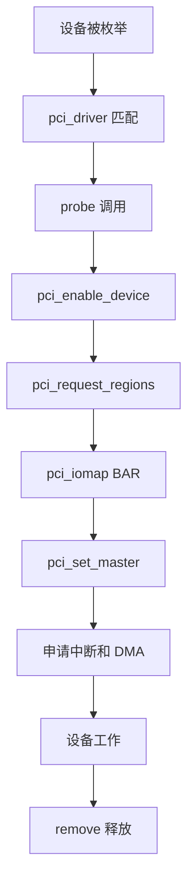

前面已经讲过 PCIe 架构、配置空间、BAR、Linux PCI 驱动框架、中断、DMA 和 IOMMU。这一篇把这些知识串成一个最小 PCIe 设备驱动实践。

实践目标不是写一个完整网卡或加速器驱动，而是掌握 PCIe 驱动最核心的工程链路：**匹配设备 → 使能设备 → 映射 BAR → 读写寄存器 → 申请中断 → 配置 DMA → 安全释放**。

## 一、实践目标

这一篇的目标是实现一个教学型 PCIe 驱动，假设设备具备：

- 一个 BAR0 寄存器空间
- 一个状态寄存器
- 一个控制寄存器
- 支持 MSI 中断
- 支持一块 DMA buffer

通过这个例子，建立 PCIe 驱动的基本骨架。

## 二、驱动整体流程



这条流程就是 PCIe 驱动实践的主线。

## 三、驱动基本骨架

```c
#include <linux/module.h>
#include <linux/pci.h>
#include <linux/interrupt.h>
#include <linux/dma-mapping.h>

#define VENDOR_ID 0x1234
#define DEVICE_ID 0x5678

struct demo_pci {
    struct pci_dev *pdev;
    void __iomem *bar0;
    int irq;
    void *dma_cpu;
    dma_addr_t dma_handle;
    size_t dma_size;
};

static const struct pci_device_id demo_ids[] = {
    { PCI_DEVICE(VENDOR_ID, DEVICE_ID) },
    { }
};
MODULE_DEVICE_TABLE(pci, demo_ids);
```

私有结构体里保存设备对象、BAR 映射、中断号和 DMA buffer 信息。

## 四、probe 初始化流程

```c
static int demo_probe(struct pci_dev *pdev,
                      const struct pci_device_id *id)
{
    struct demo_pci *dev;
    int ret;

    dev = devm_kzalloc(&pdev->dev, sizeof(*dev), GFP_KERNEL);
    if (!dev)
        return -ENOMEM;

    dev->pdev = pdev;
    pci_set_drvdata(pdev, dev);

    ret = pci_enable_device(pdev);
    if (ret)
        return ret;

    ret = pci_request_regions(pdev, "demo_pci");
    if (ret)
        goto err_disable;

    dev->bar0 = pci_iomap(pdev, 0, 0);
    if (!dev->bar0) {
        ret = -ENOMEM;
        goto err_regions;
    }

    pci_set_master(pdev);
    return 0;

err_regions:
    pci_release_regions(pdev);
err_disable:
    pci_disable_device(pdev);
    return ret;
}
```

这个流程体现了资源申请和错误回滚的对称性。

## 五、寄存器读写

假设设备寄存器定义如下：

```c
#define REG_CTRL   0x00
#define REG_STATUS 0x04
#define REG_DMA_LO 0x08
#define REG_DMA_HI 0x0c
#define REG_LEN    0x10
#define REG_DOORBELL 0x14
```

驱动访问寄存器：

```c
writel(0x1, dev->bar0 + REG_CTRL);
status = readl(dev->bar0 + REG_STATUS);
```

MMIO 访问一定要用 `readl/writel` 这类接口，不要当普通内存访问。

## 六、配置 DMA buffer

```c
dev->dma_size = 4096;
dev->dma_cpu = dma_alloc_coherent(&pdev->dev, dev->dma_size,
                                  &dev->dma_handle, GFP_KERNEL);
if (!dev->dma_cpu)
    return -ENOMEM;
```

写 DMA 地址给设备：

```c
writel(lower_32_bits(dev->dma_handle), dev->bar0 + REG_DMA_LO);
writel(upper_32_bits(dev->dma_handle), dev->bar0 + REG_DMA_HI);
writel(dev->dma_size, dev->bar0 + REG_LEN);
writel(1, dev->bar0 + REG_DOORBELL);
```

这里体现了 PCIe 驱动最典型的数据启动方式：准备 buffer，写地址，敲 doorbell。

## 七、申请中断

```c
static irqreturn_t demo_irq(int irq, void *data)
{
    struct demo_pci *dev = data;
    u32 status = readl(dev->bar0 + REG_STATUS);

    if (!status)
        return IRQ_NONE;

    writel(status, dev->bar0 + REG_STATUS);
    return IRQ_HANDLED;
}
```

申请中断：

```c
ret = pci_alloc_irq_vectors(pdev, 1, 1, PCI_IRQ_MSI | PCI_IRQ_LEGACY);
if (ret < 0)
    return ret;

dev->irq = pci_irq_vector(pdev, 0);
ret = request_irq(dev->irq, demo_irq, 0, "demo_pci", dev);
```

真实设备里，中断处理一般只做快速确认和唤醒，复杂处理放到底半部。

## 八、remove 清理流程

```c
static void demo_remove(struct pci_dev *pdev)
{
    struct demo_pci *dev = pci_get_drvdata(pdev);

    free_irq(dev->irq, dev);
    pci_free_irq_vectors(pdev);

    if (dev->dma_cpu)
        dma_free_coherent(&pdev->dev, dev->dma_size,
                          dev->dma_cpu, dev->dma_handle);

    if (dev->bar0)
        pci_iounmap(pdev, dev->bar0);

    pci_release_regions(pdev);
    pci_disable_device(pdev);
}
```

退出顺序要注意：先停止设备和 DMA，再释放中断和内存，最后释放 BAR 和设备资源。

## 九、调试命令

```bash
lspci -nn
lspci -vv -s <bus:dev.fn>
dmesg -w
cat /proc/interrupts | grep demo
ls /sys/bus/pci/devices/
```

重点观察：

- 设备是否被枚举
- BAR 是否分配
- 驱动是否 probe
- 中断是否增长
- DMA 是否完成

## 十、常见问题

### 1. probe 没触发

检查 Vendor ID / Device ID 是否匹配。

### 2. BAR 映射失败

检查资源是否被系统分配，`pci_request_regions()` 是否失败。

### 3. DMA 不工作

检查 `pci_set_master()`、DMA mask、DMA 地址和设备寄存器。

### 4. 中断不来

检查 MSI/MSI-X 是否启用、设备是否真的写了中断、状态位是否正确清除。

## 十一、验证清单

- `lspci` 能看到设备
- `probe()` 正常触发
- BAR0 映射成功
- 寄存器读写有效
- MSI/INTx 至少一种中断可用
- DMA buffer 能被设备访问
- 卸载驱动无资源泄漏

## 十二、小结

PCIe 驱动实践的核心不是孤立 API，而是一条完整链路：

**枚举匹配 → BAR 映射 → MMIO 控制 → DMA 搬运 → 中断通知 → 安全释放**。

掌握这条链路后，再看网卡、SSD、FPGA、NPU/GPU 加速器驱动，就有了基础框架。

> 🏷️ PCIe驱动 / BAR / MMIO / DMA / MSI / Linux内核

---

## 初学者扩展讲解


## PCIe 学习中的关键主线

PCIe 的核心主线可以概括为：链路训练、配置空间、资源分配、BAR 映射、中断通知、DMA 搬运。初学者不要一开始就陷入 TLP、DLLP 等协议细节，先把 Linux 驱动真正会接触到的对象搞清楚。

设备上电后，Root Complex 会尝试和 Endpoint 建立链路，这个过程叫链路训练。链路训练成功以后，系统才能扫描配置空间。配置空间里有 Vendor ID、Device ID、Class Code、BAR、Capability 等信息。系统根据这些信息识别设备、分配 MMIO 地址空间、配置中断能力，然后内核 PCI 子系统根据匹配表调用具体驱动的 `probe()`。

如果 `lspci` 看不到设备，通常说明问题还在驱动 probe 之前。此时要优先检查供电、PERST#、REFCLK、lane 连接、Root Complex 配置和设备树。很多初学者会在驱动代码里找半天，但设备根本没有枚举，驱动没有任何机会执行。

## BAR 和 MMIO 要这样理解

PCIe 设备内部有寄存器，但 CPU 不能直接凭空访问这些寄存器。BAR 可以理解为设备向系统声明的一扇窗口：设备说“我需要一段地址空间”，系统分配一个 CPU 可访问的物理地址范围，驱动再把这段范围映射成内核虚拟地址。之后驱动通过 `readl()`、`writel()` 读写这段地址，就相当于访问设备寄存器。

典型流程是：

```c
pci_enable_device(pdev);
pci_request_regions(pdev, "demo");
bar = pci_iomap(pdev, 0, 0);
value = readl(bar + REG_STATUS);
writel(0x1, bar + REG_CTRL);
```

这里每一步都有意义。`pci_enable_device()` 使能设备；`pci_request_regions()` 申请 BAR 资源，避免多个驱动冲突；`pci_iomap()` 建立映射；`readl/writel` 才是真正访问寄存器。不要用普通指针直接访问 MMIO，也不要用 `memcpy` 随便操作寄存器区域。

## DMA、IOMMU 和 cache 一致性

PCIe 高速设备通常不会依赖 CPU 一字节一字节搬数据，而是使用 DMA。DMA 的意思是设备直接读写内存，CPU 只负责准备 buffer、告诉设备地址和长度、等待完成通知。

这里有三个地址概念必须区分：CPU 虚拟地址、CPU 物理地址、设备看到的 DMA 地址。驱动不能把普通虚拟地址直接写给设备，而要通过 DMA API 获取设备可访问地址：

```c
void *cpu_addr;
dma_addr_t dma_addr;

cpu_addr = dma_alloc_coherent(&pdev->dev, size, &dma_addr, GFP_KERNEL);
```

`cpu_addr` 给 CPU 访问，`dma_addr` 给设备访问。如果平台启用了 IOMMU，`dma_addr` 可能是 IOVA，不等于真实物理地址。使用 DMA API 的好处是内核会帮你处理映射、权限和 cache 一致性问题。工程中很多“DMA 写了但 CPU 看不到”“偶发数据错误”“IOMMU fault”，本质都是地址、cache 或生命周期管理出错。

## PCIe 排错的顺序

PCIe 排错建议按下面顺序：

```bash
lspci
lspci -vv
lspci -xxx
cat /proc/interrupts
dmesg -w
```

`lspci` 看设备是否枚举；`lspci -vv` 看 BAR、链路速率、链路宽度、MSI/MSI-X 和驱动绑定；`lspci -xxx` 看配置空间原始内容；`/proc/interrupts` 看中断是否触发；`dmesg` 看驱动日志、AER 错误、IOMMU fault 和 DMA 报错。性能问题还要进一步看 `perf`、ftrace、队列深度、buffer 大小和 CPU 亲和性。

## PCIe 驱动代码阅读建议

阅读 PCIe 驱动时，先看 `pci_device_id` 匹配表，再看 `pci_driver` 结构体。进入 `probe()` 后，重点看是否调用 `pci_enable_device()`、`pci_request_regions()`、`pci_set_master()`、`dma_set_mask_and_coherent()`、`pci_iomap()` 和中断申请函数。随后再看驱动如何创建 DMA 描述符队列、如何启动硬件、如何在中断处理里回收完成项。

一个成熟的 PCIe 驱动不只是能收发数据，还要处理热插拔、错误恢复、DMA 超时、中断丢失、设备复位、IOMMU fault 和长时间压力测试。初学时可以先跑通最小路径，但最终必须理解这些异常路径。


## 面向初学者的阅读方法

刚开始学习这类驱动文章时，最容易犯的错误，是把每一个名词都当成孤立知识点去背。实际工程里，驱动不是由名词堆起来的，而是一条从硬件连接、总线枚举、内核匹配、资源申请、数据传输到用户态验证的完整链路。读这一篇时，建议先抓住三件事：第一，这个机制解决什么问题；第二，Linux 内核用什么对象表达它；第三，出现故障时应该从哪一层开始查。

例如看到“枚举”，不要只记住它叫 enumeration，而要理解为：系统需要先发现设备、识别设备能力、给设备分配地址或资源，然后才可能让具体驱动接管。看到“驱动匹配”，也不要只背 `probe()`，而要继续追问：是谁触发 `probe()`？匹配表里放了什么？设备还没有出现时驱动会不会执行？驱动执行以后第一步应该申请什么资源？这些问题连起来，才是真正能在板子上排错的知识。

## 从硬件到软件的完整路径

一条外设链路通常可以分成五层。第一层是硬件层，包括供电、时钟、复位、信号线、连接器和外设本身。第二层是总线层，也就是 USB、PCIe、I2C、SPI 这类协议如何发现设备、传输数据。第三层是内核框架层，Linux 会把设备抽象成 `struct device`、总线对象、驱动对象和资源对象。第四层是具体驱动层，驱动负责把通用框架和具体芯片寄存器、端点、队列、描述符连接起来。第五层是用户态验证层，包括命令行工具、测试程序、日志和性能统计。

初学者排错时不要一上来就怀疑驱动代码。设备没有被系统看到时，驱动代码通常还没有执行；驱动没有绑定时，可能是匹配表或描述符问题；驱动绑定了但不能传输时，才更可能进入 buffer、DMA、中断、同步和协议细节。按照这个顺序排查，可以避免在错误层面浪费时间。

## 建议准备的实验环境

学习 USB/PCIe 驱动，最好准备一台 Linux 主机、一块支持外设扩展的开发板，以及至少一个真实设备。USB 方向可以从 U 盘、USB 串口、USB 摄像头、USB 网卡开始；PCIe 方向可以从 NVMe、PCIe 网卡、PCIe 转串口卡、FPGA PCIe Endpoint 或开发板自带 PCIe 插槽开始。没有 PCIe 硬件时，也可以先通过 `lspci` 观察 PC 上已有设备，理解配置空间、BAR 和驱动绑定。

每次实验都建议记录四类信息：硬件连接照片或说明、内核版本和设备树/配置、关键命令输出、问题现象和解决过程。驱动学习的进步往往不是来自“看懂一段代码”，而是来自反复把现象、日志、源码和硬件状态对应起来。

## 常用观察命令

无论是 USB 还是 PCIe，都建议养成先看系统状态的习惯：

```bash
uname -a
dmesg -w
lsmod
cat /proc/interrupts
cat /proc/iomem
```

`uname -a` 用来确认内核版本；`dmesg -w` 用来实时观察设备插拔、枚举和驱动 probe 日志；`lsmod` 用来看模块是否加载；`/proc/interrupts` 用来看中断是否触发；`/proc/iomem` 可以帮助理解 MMIO 资源分配。不要小看这些基础命令，很多现场问题并不是复杂 bug，而是设备没枚举、驱动没加载、资源没分配或中断没到。

## 初学者最容易混淆的点

第一，不要把“用户态能看到设备节点”等同于“驱动完全正常”。设备节点只说明某个驱动创建了接口，真正的数据通路还要看读写、ioctl、mmap、poll、DMA 和中断是否正常。

第二，不要把“驱动 probe 成功”等同于“硬件已经工作”。probe 成功通常只代表资源申请和初始化基本完成，后续传输仍可能因为时钟、复位、buffer、协议状态或固件问题失败。

第三，不要把“命令没有报错”等同于“性能达标”。高速设备还要统计吞吐、延迟、CPU 占用、内存拷贝次数、DMA 是否真正生效，以及异常恢复是否可靠。

## 推荐的验证闭环

一篇驱动文章学完以后，不建议只停留在阅读层面。至少做一个小闭环：先用命令确认设备存在，再找到它绑定的驱动，然后观察内核日志，再做一次最小读写或传输测试，最后故意制造一个小错误，例如拔掉设备、改错匹配 ID、禁用模块或调整 buffer 数量，观察系统如何报错。只有经历过“正常路径”和“异常路径”，才能真正理解驱动框架为什么这样设计。
