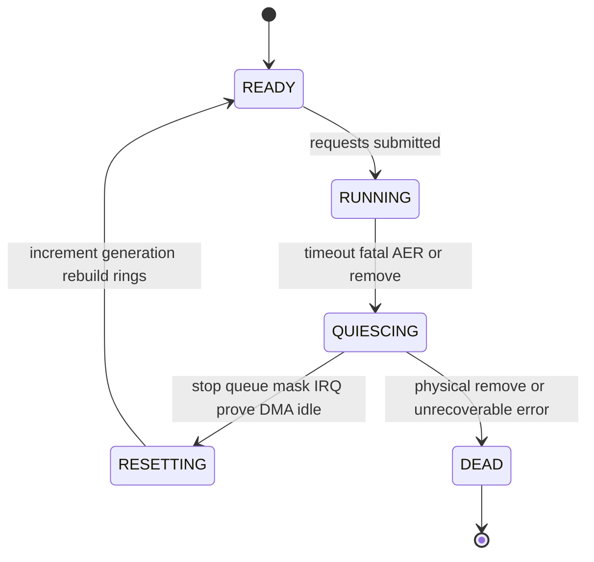

前七篇分别建立了 PCIe 拓扑、配置空间、BAR、驱动生命周期、中断、DMA 和 IOMMU。本篇不再给彼此无关的 API 片段，而是先定义一个 Endpoint 协议，再写能被审计的 Linux 驱动。

示例是教学用 FPGA/加速器，但所有寄存器和 descriptor 都在文中明确，不假装来自真实厂商。真实项目必须以硬件 spec 为准。

## 一、先定义硬件协议和错误边界

Endpoint 使用 BAR0 暴露控制寄存器，使用一对 Submission/Completion Ring 搬运任务，MSI-X vector 0 通知 completion，vector 1 通知 fatal/error。

| BAR0 offset | 名称 | 语义 |
| --- | --- | --- |
| 0x0000 | ID | 固定只读标识 `0x44454d4f` |
| 0x0004 | VERSION | major/minor |
| 0x0010 | CONTROL | bit0 ENABLE，bit1 RESET |
| 0x0014 | STATUS | READY/BUSY/FATAL |
| 0x0020..0x0038 | SQ base/size/producer | 64-bit DMA address 与索引 |
| 0x0040..0x0058 | CQ base/size/consumer | 64-bit DMA address 与索引 |
| 0x0060 | DOORBELL | 写 SQ producer |
| 0x0070 | IRQ_STATUS | W1C completion/error |

Submission Descriptor 包含 opcode、request ID、generation、source/destination DMA address、length；Completion Entry 包含 request ID、generation、status、bytes 和 phase。硬件只有在读取完整 descriptor 后才消费 producer；写完整 completion 后才更新 phase 并发 MSI-X。

Reset 协议要求：驱动先停止新提交，写 RESET，等待 READY；硬件停止旧 DMA/MSI，清内部 consumer，并递增/接受新 generation。若硬件无法保证 reset 后没有迟到 DMA，软件不能安全 unmap 旧 buffer。


## 二、probe 建立私有对象和所有资源

```c
struct demo_dev {
    struct pci_dev *pdev;
    void __iomem *bar0;
    resource_size_t bar0_len;

    struct demo_sq_entry *sq;
    dma_addr_t sq_dma;
    struct demo_cq_entry *cq;
    dma_addr_t cq_dma;
    u16 q_depth;
    u16 sq_prod;
    u16 cq_cons;
    u8 cq_phase;
    u32 generation;

    spinlock_t sq_lock;
    struct mutex state_lock;
    wait_queue_head_t completion_wait;
    struct xarray requests;
    enum demo_state state;
    int num_vec;
};
```

probe 按上一讲依赖顺序执行，并在发布用户接口前完成硬件自检：

```c
static int demo_probe(struct pci_dev *pdev,
                      const struct pci_device_id *id)
{
    struct demo_dev *dev;
    int ret;

    ret = pci_enable_device(pdev);
    if (ret)
        return ret;
    ret = pci_request_regions(pdev, "demo_accel");
    if (ret)
        goto err_disable;
    ret = dma_set_mask_and_coherent(&pdev->dev, DMA_BIT_MASK(64));
    if (ret)
        goto err_regions;
    pci_set_master(pdev);

    dev = devm_kzalloc(&pdev->dev, sizeof(*dev), GFP_KERNEL);
    if (!dev) {
        ret = -ENOMEM;
        goto err_master;
    }
    dev->pdev = pdev;
    mutex_init(&dev->state_lock);
    spin_lock_init(&dev->sq_lock);
    init_waitqueue_head(&dev->completion_wait);
    xa_init(&dev->requests);
    pci_set_drvdata(pdev, dev);

    dev->bar0_len = pci_resource_len(pdev, 0);
    if (dev->bar0_len < DEMO_BAR0_MIN_SIZE) {
        ret = -ENOSPC;
        goto err_data;
    }
    dev->bar0 = pci_iomap(pdev, 0, 0);
    if (!dev->bar0) {
        ret = -ENOMEM;
        goto err_data;
    }
    if (readl(dev->bar0 + REG_ID) != DEMO_ID) {
        ret = -ENODEV;
        goto err_iounmap;
    }

    ret = demo_alloc_rings(dev);
    if (ret)
        goto err_iounmap;
    ret = demo_setup_irqs(dev);
    if (ret)
        goto err_rings;
    ret = demo_reset_and_program(dev);
    if (ret)
        goto err_irqs;
    ret = demo_register_misc(dev);
    if (ret)
        goto err_stop;

    WRITE_ONCE(dev->state, DEMO_READY);
    return 0;
    /* reverse-order labels omitted here only after being shown in PCIe 04 */
}
```

这里不能真的省略实现中的错误标签；注释只避免重复整段示例。`pci_set_drvdata()` 后任一 callback 都可能取对象，因此清理时在释放前置 NULL，并保证 callback 已同步结束。

## 三、Ring 初始化、request table 和提交路径

SQ/CQ 使用 `dma_alloc_coherent()`，队列深度为 2 的幂。初始化时清内存、设置 phase、写 64-bit base/size，readback/等待 READY，再解除设备中断 mask。

每个 userspace request 先创建内核 `demo_req`，分配唯一 ID，保存 generation、DMA mapping、方向和状态，插入 xarray。Descriptor 只保存 ID/generation，不保存 CPU pointer。

```c
spin_lock_irqsave(&dev->sq_lock, flags);
if (demo_sq_full(dev)) {
    spin_unlock_irqrestore(&dev->sq_lock, flags);
    return -EAGAIN;
}

slot = &dev->sq[dev->sq_prod & (dev->q_depth - 1)];
slot->id = cpu_to_le32(req->id);
slot->generation = cpu_to_le32(dev->generation);
slot->src = cpu_to_le64(req->src_dma);
slot->dst = cpu_to_le64(req->dst_dma);
slot->len = cpu_to_le32(req->len);
slot->opcode = cpu_to_le16(req->opcode);

dma_wmb();
dev->sq_prod++;
writel(dev->sq_prod, dev->bar0 + REG_SQ_DOORBELL);
spin_unlock_irqrestore(&dev->sq_lock, flags);
```

若 map/xa insert 成功后 SQ full，驱动要保持 request 在 pending queue 或完整 unmap/erase，不能泄漏半初始化对象。阻塞提交可等待 slot wait queue；`O_NONBLOCK` 返回 `-EAGAIN`。

## 四、MSI-X、completion poll 和用户通知

设备 completion vector 的硬中断只读取/清 IRQ status、mask queue interrupt 并安排 poll/work。Poll 批量读取 CQ，先检查 phase，再 `dma_rmb()`，按 ID/generation 找 request，验证 bytes/status，unmap DMA，更新状态并唤醒用户。

```c
static int demo_poll_cq(struct demo_dev *dev, int budget)
{
    int done = 0;

    while (done < budget) {
        struct demo_cq_entry *cqe;
        struct demo_req *req;

        cqe = &dev->cq[dev->cq_cons & (dev->q_depth - 1)];
        if (READ_ONCE(cqe->phase) != dev->cq_phase)
            break;
        dma_rmb();

        req = xa_erase(&dev->requests, le32_to_cpu(cqe->id));
        if (req && req->generation == le32_to_cpu(cqe->generation))
            demo_complete_req(dev, req, cqe);
        else
            dev->stale_completions++;

        if (++dev->cq_cons % dev->q_depth == 0)
            dev->cq_phase ^= 1;
        done++;
    }
    writel(dev->cq_cons, dev->bar0 + REG_CQ_CONSUMER);
    return done;
}
```

错误 vector 读取 fatal/status、mask 所有 queue 并安排 reset work。不要在 hard IRQ 中等待 reset 或释放大量 mapping。

## 五、ioctl、poll 与 mmap 的边界

ioctl 适合提交/查询结构化命令：使用固定宽度字段和 version/size，检查 opcode、length、alignment、overflow 和用户 pointer。不要把内核结构体直接当 UAPI。

`poll()` 在有 completion、queue 可写、设备 dead/error 时返回对应 mask。它与 ioctl/read 使用同一 wait queue 和状态条件：

```c
poll_wait(file, &ctx->wait, wait);
if (demo_has_completion(ctx))
    mask |= EPOLLIN | EPOLLRDNORM;
if (demo_has_sq_space(dev))
    mask |= EPOLLOUT | EPOLLWRNORM;
if (READ_ONCE(dev->state) == DEMO_DEAD)
    mask |= EPOLLHUP | EPOLLERR;
```

`mmap()` 只开放明确 data buffer/doorbell page，不直接开放 BAR0 全部控制寄存器。验证 VMA length/offset，使用 `dma_mmap_coherent()` 映射 coherent buffer，Device remove 后禁止新 fault/access。安全产品还要限制用户伪造 DMA address/descriptor。

## 六、timeout、reset 与 generation 防止旧请求污染新队列

每个 request 有 deadline。Timeout work 不能直接 unmap 正在被硬件访问的 buffer，应先尝试 queue abort；协议不支持单请求 abort 时，进入 Function reset。



Reset 顺序：设置 QUIESCING 阻止 submit；mask IRQ/stop queue；等待/强制硬件 idle；同步 IRQ/work；标记旧 request failed；安全 unmap；执行 FLR/设备 reset；generation++；清 ring/phase；重写 DMA base/vector；恢复 READY。

Completion 同时携带 request ID 与 generation。旧 completion 在 reset 后到达时被计为 stale，不得从新 xarray 取同 ID request。仅清 ring 内存而没有 generation，wrap/迟到事件会产生 ABA 问题。

## 七、remove、错误回滚和验证

remove 先 `misc_deregister()`/撤销子系统入口，标记 DEAD，唤醒所有 poll/wait；复用 quiesce 停止 DMA/IRQ，取消 timeout/reset work，完成/失败所有 request，释放 ring/vector/BAR/resource。

已有 fd 通过 reference count 保留软件 context，但任何硬件操作返回 `-ENODEV`。用户 `mmap` 必须在设计中处理 Device 消失，不能让 VMA 永久访问失效 BAR。

验证阶段：单请求 MMIO ID；ring wrap；queue full/非阻塞；多线程 submit/completion；DMA/IOMMU fault；MSI-X affinity；timeout；FLR/hot reset；remove with open fd；长压资源守恒。记录 submitted/completed/failed/inflight/stale/reset/map error。

**参考资料**

- [How To Write Linux PCI Drivers](https://docs.kernel.org/PCI/pci.html)
- [Dynamic DMA Mapping Guide](https://docs.kernel.org/core-api/dma-api-howto.html)
- [The MSI Driver Guide HOWTO](https://docs.kernel.org/PCI/msi-howto.html)

## 八、小结

完整 PCIe 驱动建立在明确硬件协议之上：BAR 控制状态，DMA Ring 搬运请求，MSI-X 通知 completion，ioctl/poll/mmap 只暴露受控接口。probe 按依赖顺序发布，remove/reset 按状态机收敛。

Request ID + generation、DMA ownership 和 reset 前证明 idle，是避免迟到 DMA/completion 破坏新队列的关键。下一篇将在同一模型上建立性能与稳定性测量方法。
