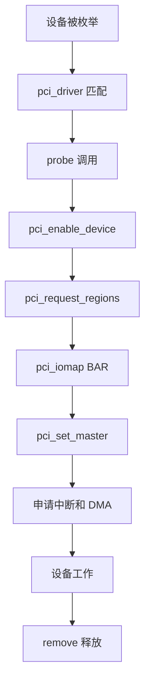

前面已经讲过 PCIe 架构、配置空间、BAR、Linux PCI 驱动框架、中断、DMA 和 IOMMU。这一篇把这些知识串成一个最小 PCIe 设备驱动实践。

实践目标不是写一个完整网卡或加速器驱动，而是掌握 PCIe 驱动最核心的工程链路：**匹配设备 → 使能设备 → 映射 BAR → 读写寄存器 → 申请中断 → 配置 DMA → 安全释放**。

## 一、实践目标

这一篇的目标是实现一个教学型 PCIe 驱动，假设设备具备：

- 一个 BAR0 寄存器空间
- 一个状态寄存器
- 一个控制寄存器
- 支持 MSI 中断
- 支持一块 DMA buffer

通过这个例子，建立 PCIe 驱动的基本骨架。

## 二、驱动整体流程



这条流程就是 PCIe 驱动实践的主线。

## 三、驱动基本骨架

```c
#include <linux/module.h>
#include <linux/pci.h>
#include <linux/interrupt.h>
#include <linux/dma-mapping.h>

#define VENDOR_ID 0x1234
#define DEVICE_ID 0x5678

struct demo_pci {
    struct pci_dev *pdev;
    void __iomem *bar0;
    int irq;
    void *dma_cpu;
    dma_addr_t dma_handle;
    size_t dma_size;
};

static const struct pci_device_id demo_ids[] = {
    { PCI_DEVICE(VENDOR_ID, DEVICE_ID) },
    { }
};
MODULE_DEVICE_TABLE(pci, demo_ids);
```

私有结构体里保存设备对象、BAR 映射、中断号和 DMA buffer 信息。

## 四、probe 初始化流程

```c
static int demo_probe(struct pci_dev *pdev,
                      const struct pci_device_id *id)
{
    struct demo_pci *dev;
    int ret;

    dev = devm_kzalloc(&pdev->dev, sizeof(*dev), GFP_KERNEL);
    if (!dev)
        return -ENOMEM;

    dev->pdev = pdev;
    pci_set_drvdata(pdev, dev);

    ret = pci_enable_device(pdev);
    if (ret)
        return ret;

    ret = pci_request_regions(pdev, "demo_pci");
    if (ret)
        goto err_disable;

    dev->bar0 = pci_iomap(pdev, 0, 0);
    if (!dev->bar0) {
        ret = -ENOMEM;
        goto err_regions;
    }

    pci_set_master(pdev);
    return 0;

err_regions:
    pci_release_regions(pdev);
err_disable:
    pci_disable_device(pdev);
    return ret;
}
```

这个流程体现了资源申请和错误回滚的对称性。

## 五、寄存器读写

假设设备寄存器定义如下：

```c
#define REG_CTRL   0x00
#define REG_STATUS 0x04
#define REG_DMA_LO 0x08
#define REG_DMA_HI 0x0c
#define REG_LEN    0x10
#define REG_DOORBELL 0x14
```

驱动访问寄存器：

```c
writel(0x1, dev->bar0 + REG_CTRL);
status = readl(dev->bar0 + REG_STATUS);
```

MMIO 访问一定要用 `readl/writel` 这类接口，不要当普通内存访问。

## 六、配置 DMA buffer

```c
dev->dma_size = 4096;
dev->dma_cpu = dma_alloc_coherent(&pdev->dev, dev->dma_size,
                                  &dev->dma_handle, GFP_KERNEL);
if (!dev->dma_cpu)
    return -ENOMEM;
```

写 DMA 地址给设备：

```c
writel(lower_32_bits(dev->dma_handle), dev->bar0 + REG_DMA_LO);
writel(upper_32_bits(dev->dma_handle), dev->bar0 + REG_DMA_HI);
writel(dev->dma_size, dev->bar0 + REG_LEN);
writel(1, dev->bar0 + REG_DOORBELL);
```

这里体现了 PCIe 驱动最典型的数据启动方式：准备 buffer，写地址，敲 doorbell。

### DMA mask、ring 和中断必须在启动前闭合

示例在 `dma_alloc_coherent()` 前应先尝试 `dma_set_mask_and_coherent()`，64 位失败再按硬件能力回退 32 位；不能分配后再发现设备地址寄存器装不下。`pci_set_master()` 只允许设备发事务，不替代 mapping。

单 buffer演示能验证一次 DMA，但长期数据通路应使用 descriptor ring：CPU填地址/长度、`dma_wmb()`、推进 producer并写 doorbell；IRQ读取 completion前 `dma_rmb()`，按 request id回收。Request table记录 FREE/PREPARED/DEVICE_OWNED/DONE/FAILED和generation。

申请 IRQ后设备源保持 mask，直到 ring、lock和waitqueue初始化完成。停止时先 mask/stop、`synchronize_irq()`，再释放 ring，防止早到/迟到中断。

## 七、申请中断

```c
static irqreturn_t demo_irq(int irq, void *data)
{
    struct demo_pci *dev = data;
    u32 status = readl(dev->bar0 + REG_STATUS);

    if (!status)
        return IRQ_NONE;

    writel(status, dev->bar0 + REG_STATUS);
    return IRQ_HANDLED;
}
```

申请中断：

```c
ret = pci_alloc_irq_vectors(pdev, 1, 1, PCI_IRQ_MSI | PCI_IRQ_LEGACY);
if (ret < 0)
    return ret;

dev->irq = pci_irq_vector(pdev, 0);
ret = request_irq(dev->irq, demo_irq, 0, "demo_pci", dev);
```

真实设备里，中断处理一般只做快速确认和唤醒，复杂处理放到底半部。

## 把完成事件交给用户态：ioctl、poll 与 mmap

真实驱动需要把“提交”和“完成”变成稳定 ABI。ioctl 可以接收 command、buffer index、length，驱动验证参数和设备状态后填 DMA descriptor、执行 `dma_wmb()`、推进 producer 并写 doorbell。Ring 满时阻塞或返回 `-EAGAIN`，不能覆盖仍由设备拥有的槽位。

中断处理读取 completion、更新 request 状态并 `wake_up_interruptible()`。`poll()` 根据完成队列、设备错误和拔出状态返回 `EPOLLIN/EPOLLERR/EPOLLHUP`；read/ioctl 再取结果并回收 buffer。IRQ 数增长但 poll 不醒时，应检查 completion id、waitqueue 条件和 wake 是否在状态提交之后。

`mmap` 只应暴露适合用户拥有的 payload buffer。控制 BAR、doorbell 和 descriptor ownership 字段通常留在内核，否则用户可绕过验证启动任意 DMA。Coherent buffer 可用 `dma_mmap_coherent()`，VMA open/close 参与对象引用；remove 后禁止新 fault/submit，已有 mapping 只能访问被明确保留的内存，不能继续 MMIO。

零拷贝不是简单调用 mmap。必须定义 CPU/设备/用户三方何时拥有 buffer、谁执行 cache sync/barrier、进程异常退出如何回收、reset 后旧 buffer 如何失效。

## Timeout 与 reset 先停止 DMA，再回收内存

DMA timeout 后不能立即 free buffer。驱动先阻止新提交、mask IRQ、停止或 abort queue，确认设备 quiescent，再 unmap/recycle in-flight request。若设备不再响应，可执行 Function Level Reset 或设备自定义 reset，并重建 BAR 内 queue base、producer/consumer 和 MSI-X 状态。

Reset 期间 ioctl 返回 busy，poll 唤醒错误。每次 reset 增加 generation，迟到 completion 若携带旧 id/generation必须丢弃，不能误完成新请求。Remove 复用同一 stop 状态机：撤销用户入口、停止 DMA、同步 IRQ/work，最后释放 coherent memory、BAR 和 PCI resource。

## 电源管理、AER 与并发状态机

Runtime PM空闲时停止 queue并进入低功耗，resume重新写 BAR内 queue base/doorbell/IRQ状态。System suspend、FLR和AER slot_reset也应复用 stop/init函数，避免 probe与恢复路径分叉。

`struct pci_error_handlers` 的 `error_detected()` 先冻结 I/O，`slot_reset()` 重建硬件，`resume()` 恢复提交。与 remove并发时用全局状态和锁保证只执行一次资源释放。

多进程 open/mmap使用 reference count延长软件对象，但 dead状态后禁止 MMIO/DMA。最后一个 reference只释放内存，硬件资源已由 remove/恢复状态机停止。

## 八、remove 清理流程

```c
static void demo_remove(struct pci_dev *pdev)
{
    struct demo_pci *dev = pci_get_drvdata(pdev);

    free_irq(dev->irq, dev);
    pci_free_irq_vectors(pdev);

    if (dev->dma_cpu)
        dma_free_coherent(&pdev->dev, dev->dma_size,
                          dev->dma_cpu, dev->dma_handle);

    if (dev->bar0)
        pci_iounmap(pdev, dev->bar0);

    pci_release_regions(pdev);
    pci_disable_device(pdev);
}
```

退出顺序要注意：先停止设备和 DMA，再释放中断和内存，最后释放 BAR 和设备资源。

## 九、调试命令

```bash
lspci -nn
lspci -vv -s <bus:dev.fn>
dmesg -w
cat /proc/interrupts | grep demo
ls /sys/bus/pci/devices/
```

重点观察：

- 设备是否被枚举
- BAR 是否分配
- 驱动是否 probe
- 中断是否增长
- DMA 是否完成

## 十、常见问题

### 1. probe 没触发

检查 Vendor ID / Device ID 是否匹配。

### 2. BAR 映射失败

检查资源是否被系统分配，`pci_request_regions()` 是否失败。

### 3. DMA 不工作

检查 `pci_set_master()`、DMA mask、DMA 地址和设备寄存器。

### 4. 中断不来

检查 MSI/MSI-X 是否启用、设备是否真的写了中断、状态位是否正确清除。

## 十一、验证清单

- `lspci` 能看到设备
- `probe()` 正常触发
- BAR0 映射成功
- 寄存器读写有效
- MSI/INTx 至少一种中断可用
- DMA buffer 能被设备访问
- 卸载驱动无资源泄漏

## 十二、小结

PCIe 驱动实践的核心不是孤立 API，而是一条完整链路：

**枚举匹配 → BAR 映射 → MMIO 控制 → DMA 搬运 → 中断通知 → 安全释放**。

掌握这条链路后，再看网卡、SSD、FPGA、NPU/GPU 加速器驱动，就有了基础框架。

> 🏷️ PCIe驱动 / BAR / MMIO / DMA / MSI / Linux内核

---
