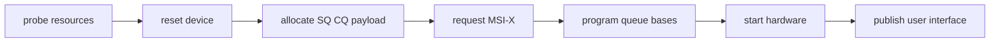

前面已经具备 BAR、MSI-X、DMA 和 IOMMU 基础。本篇用一台自定义 PCIe 采集设备串起完整驱动：BAR0 是控制面，DMA ring 是数据面，MSI-X 报告 completion，字符设备通过 ioctl 提交任务、poll 等待结果，并可选择 mmap payload buffer。

重点是状态和所有权，而不是堆出一个不可运行的大代码文件。

## 先定义硬件与软件共享协议

假设 BAR0 提供 CONTROL、STATUS、SQ_BASE、CQ_BASE、QUEUE_SIZE、SQ_TAIL、CQ_HEAD 和 DOORBELL。设备从 submission ring 读取 descriptor，把结果写到预映射 payload，再在 completion ring 写入 id/status/length 并触发 MSI-X。

```c
struct demo_desc {
    __le64 dma_addr;
    __le32 len;
    __le16 id;
    __le16 flags;
};

struct demo_cqe {
    __le16 id;
    __le16 status;
    __le32 actual;
};
```

所有字段 endian、对齐和 ownership bit 必须写进硬件 ABI。没有协议文档时，驱动和 FPGA 各自“猜结构体布局”会产生最难定位的错误。

## probe 发布资源的顺序

probe 依次完成：enable/regions、DMA mask、bus master、BAR map、hardware reset、coherent SQ/CQ、payload pool、MSI-X/IRQ、软件队列、写硬件 base/size、unmask/start，最后注册 misc/char device。

Reset 要在 ring 地址写入前确保旧 DMA 停止。若 function 刚经历热复位，设备可能保留 pending status；启动前 clear/mask，request IRQ 后再 unmask。



错误路径严格反向。用户接口从未注册时无需 deregister；IRQ 已申请但硬件未启动仍要 mask/clear；DMA ring 释放前必须证明设备停止 bus master访问。

## ioctl 提交任务要检查 ring 与 buffer 所有权

用户传入 buffer index、length 和 command。驱动验证范围、设备状态和 ring space，取得 FREE request，准备 payload/mapping，填写 descriptor，执行 `dma_wmb()`，更新 software producer，再写 SQ tail/doorbell。

Ring full 时可以返回 `-EAGAIN` 或阻塞等待 completion，语义必须稳定。不能覆盖仍是 DEVICE_OWNED 的 descriptor，也不能让用户修改 ring 控制字段。

每个 request 记录 id、buffer、DMA mapping、状态和完成结果。设备可能乱序完成，completion 按 id 找 request，不按“最早提交”猜测。

## IRQ 只确认 completion，重活交给可调度上下文

MSI-X handler 读取 CQ producer/status，执行 `dma_rmb()` 后批量消费 cqe，更新 request 为 DONE，推进 CQ head 并 ack。随后 wake_up `poll_wait` 或安排 work。

Handler 应设置 budget，防止一次处理无界 completion。若队列持续活跃，可以采用 IRQ mask + threaded/NAPI 式轮询，处理到空后再 unmask，避免中断风暴。

`poll()` 根据 completed queue、device dead 和 error 状态返回 `EPOLLIN/EPOLLERR/EPOLLHUP`。read/ioctl 获取结果并回收 request，使 buffer 重新 FREE。

## mmap 只暴露适合用户拥有的区域

BAR 控制寄存器一般不直接 mmap 给无特权用户，否则可绕过驱动启动任意 DMA。更合理的是 mmap payload pool，ring 和 doorbell 仍由内核管理。

Coherent buffer 可使用 `dma_mmap_coherent()`；其他页需按映射类型选择 API。VMA open/close 增加引用，remove 时标记 dead 并阻止新 fault/submit，等现有 mapping 生命周期结束。

用户 mmap 后的 cache/ownership 协议必须写入 ABI。CPU 写入 payload 后通过 ioctl 提交，由驱动做必要 sync/barrier；不能要求用户靠 `volatile` 保证 DMA 可见。

## timeout 与 reset 是一条受控状态迁移

任务超时不能立即 free buffer。驱动先停止 queue/设备，mask IRQ，等待或确认 DMA quiescent，再把 in-flight request 标记失败、unmap/recycle。若硬件支持 per-request abort，可缩小影响；否则执行 function-level 或设备自定义 reset 并重建所有 queue。

Reset 期间新 ioctl 返回 busy，poll 唤醒 error。恢复后 ring generation/producer/consumer 全部重新同步，旧 completion 必须丢弃。设备反复 timeout 应触发 health 统计和上层错误，而不是无限 reset 隐藏问题。

## remove 关闭所有入口并等待并发收敛

remove 先 deregister 用户入口/标记 dead，唤醒 waiters，停止 submit；随后 reset/stop DMA、mask IRQ、`synchronize_irq()`、cancel work；再 free IRQ/vector、ring/payload、BAR/regions，最后 disable device。

Open file 和 VMA 使用引用计数延长私有对象，但硬件资源在 remove 后不可访问。file operation 检查 dead 并返回 `-ENODEV`，不能因为对象内存仍在就继续 MMIO。

## 验证驱动要覆盖状态而不只测吞吐

记录 submitted/completed/timeout/reset、ring high-watermark、IRQ count、DMA mapping failure 和 AER/IOMMU fault。测试正常提交、ring full、乱序完成、用户退出、并发 open、I/O 中拔卡、设备无响应和 reset 后恢复。

```bash
cat /proc/interrupts
lspci -s BDF -vv
trace-cmd record -e irq -e workqueue ./demo_test
```

性能达标前先要求 producer/consumer、request state 和 mapping 数量在压力结束后回到一致状态。

## 小结

完整 PCIe 驱动把 BAR 控制面、DMA 数据面、MSI-X completion 和用户生命周期组合成明确状态机。probe 按依赖发布，ioctl 通过 descriptor ownership 提交，IRQ/poll 回收，mmap 只暴露安全 payload，timeout/reset/remove 先停止 DMA 再释放。下一篇将讨论链路、payload、队列、中断和 NUMA 如何共同决定性能与稳定性。
