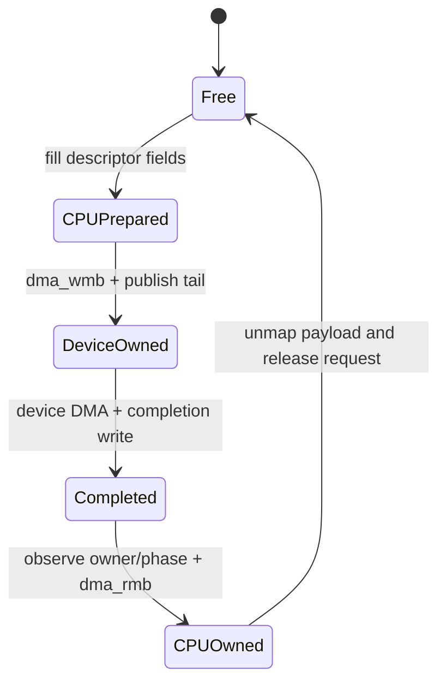
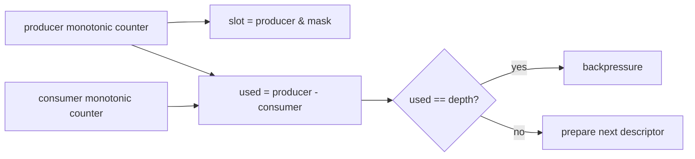
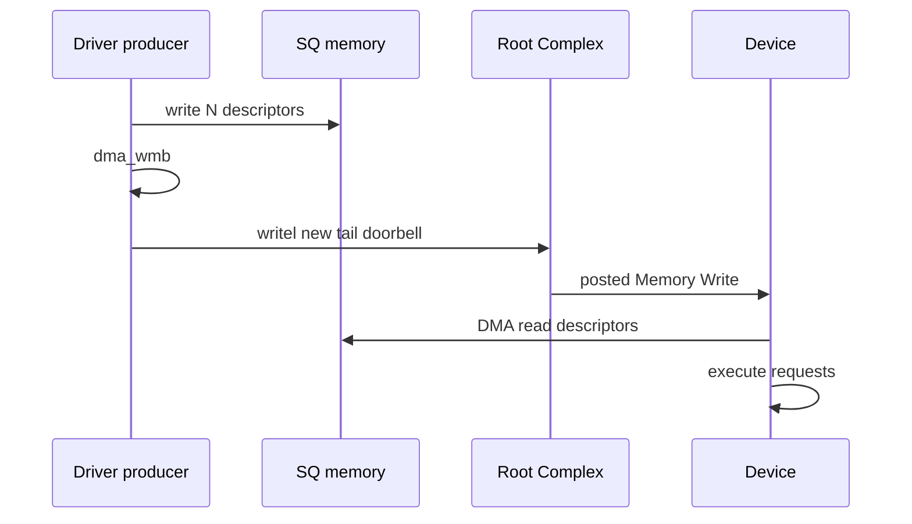
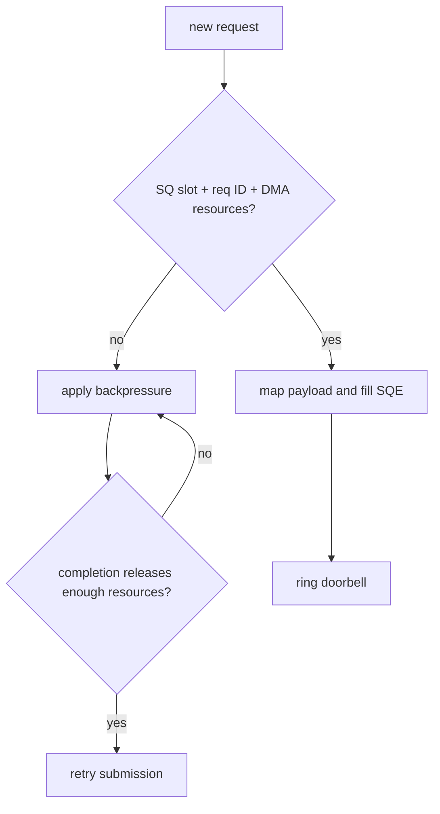
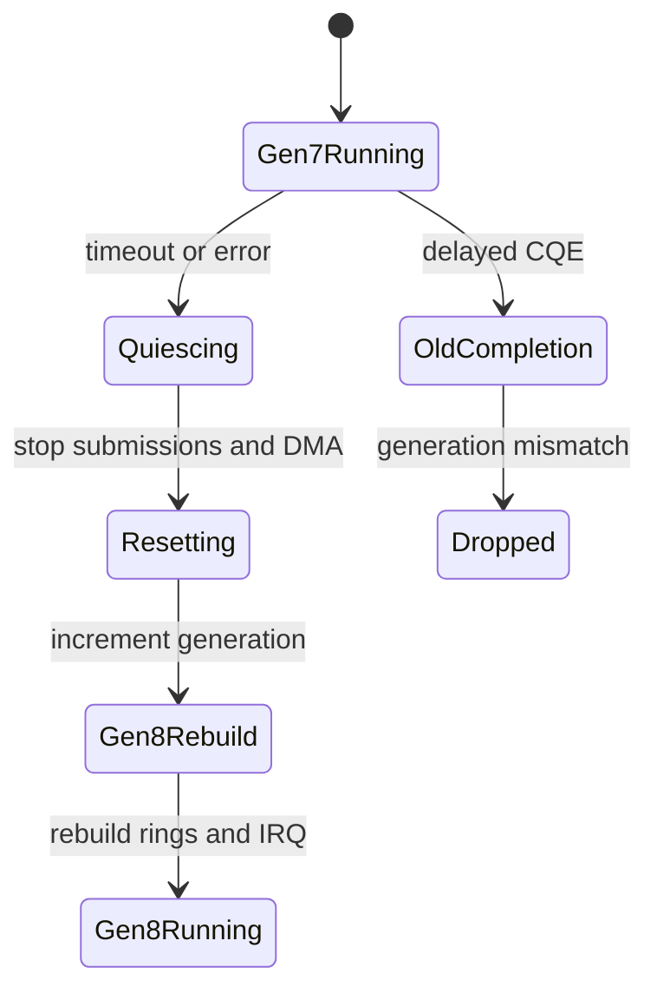

第 08 篇只提交了一个 Buffer，但真实网卡、NVMe、采集卡和加速器需要持续并发处理大量请求。若每次请求都重新分配控制结构、写寄存器并等待完成，PCIe 往返延迟和 CPU 开销会把吞吐限制在很低水平。

Descriptor Ring 用一段共享内存批量描述请求，Doorbell 只通知“Producer 前进到哪里”，Completion Ring 再让设备批量交还所有权。难点不是 Ring 是圆形，而是 CPU 与 Device 如何在 Wrap、并发、超时和 Reset 中对每个槽位保持唯一 Owner。

本文使用原创教学协议解释通用机制。寄存器、Descriptor Layout 和 VID/DID 都不能直接套到真实设备；`rtw88`、NVMe 或其他主线驱动只在后续作为这些模式的具体实现案例。

## 一、先看问题：一个 Descriptor 怎样完成所有权循环

先忽略 Ring，只看一个 Submission Descriptor。CPU 填写 DMA Address、Length 和 Request ID，Barrier 后把 Descriptor 交给 Device；Device 读取并执行 DMA，在 Completion 中写回相同 Request ID；CPU 消费 Completion 后才能复用槽位和 Payload。



每个状态都对应允许的访问者。FREE 时 CPU 可以重写；DEVICE_OWNED 时 CPU 不能修改 Descriptor 或 Payload Mapping；COMPLETED 只表示设备已经发布完成，CPU 还要用 Barrier 和 Request Table 恢复软件上下文。

因为 Slot Index 会循环复用，所以仅靠“第 7 号槽位完成”不足以判断它属于哪一代请求。Request ID、Phase Bit 和 Generation 分别解决请求关联、Ring Wrap 和 Reset 后旧完成隔离，三者不应混成一个字段。

## 二、教学协议只定义理解 Ring 所需的最小字段

Submission Queue（SQ）由 CPU 生产、Device 消费；Completion Queue（CQ）由 Device 生产、CPU 消费。代表性 Descriptor 如下：

```c
struct demo_sqe {
    __le64 payload_dma;
    __le32 payload_len;
    __le16 request_id;
    __le16 flags;
};

struct demo_cqe {
    __le16 request_id;
    __le16 status;
    __le32 result_len;
    u8 phase;
    u8 reserved[7];
};
```

SQE/CQE 通常放在 `dma_alloc_coherent()` 得到的内存中，因为双方长期共享控制字段；Payload 使用 Streaming Mapping，因为数据更大、生命周期随请求变化。Coherent 只省去显式 Cache Sync，不省略 `dma_wmb()`/`dma_rmb()`。

设备寄存器只需要表达 Queue Base、Depth、Head/Tail 或 Doorbell。真实设备可能使用不同布局、Shadow Doorbell 或 Event Index，但它们都在解决“共享内存已经更新，另一方何时开始处理”的通知问题。

## 三、Producer 和 Consumer 定义容量而不是数组长度

长度为 `N` 的 Ring 常用单调递增 Producer/Consumer 计数，实际数组索引为 `counter & (N - 1)`，要求 `N` 是 2 的幂。可用条目数由两者差值决定：

```text
used = producer - consumer
free = depth - used
slot = producer & (depth - 1)
```

如果只保存取模后的 Head/Tail，`head == tail` 同时可能表示 Empty 和 Full，因此还需要保留一个空槽、Phase/Wrap Bit 或单调计数。选择哪种方案必须在软件和硬件协议中一致。



Ring Full 不是异常，而是正常流控状态。因为覆盖一个仍由 Device 拥有的 Descriptor 会同时破坏 DMA Address、Request ID 和 Completion 关联，所以提交路径必须在获得槽位前实施 Backpressure。

## 四、SQ 发布顺序把 CPU 数据交给设备

提交路径先在 Request Table 预留 Software Context 和唯一 Request ID，再 Map Payload，最后填写 SQE。只有全部字段写完，才能增加 Producer 并写 Doorbell：

```c
sqe = &sq[prod & ring_mask];
sqe->payload_dma = cpu_to_le64(dma);
sqe->payload_len = cpu_to_le32(len);
sqe->request_id = cpu_to_le16(req_id);
sqe->flags = cpu_to_le16(DEMO_SQE_VALID);

dma_wmb();
WRITE_ONCE(ring->sq_prod, prod + 1);
writel(prod + 1, bar0 + DEMO_SQ_DOORBELL);
```

`dma_wmb()` 的位置表示：Device 一旦观察到新 Tail，就必须同时看到完整 SQE 和 Payload Mapping。若先更新 Producer 再填 Address，设备可能把半初始化字段当成真实 DMA Address。

Request Table 必须在 Doorbell 前可查询，因为快速设备可能在 `writel()` 返回前就完成请求并触发 IRQ。把 Software Context 放到 Doorbell 后才登记，会造成 Completion 找不到 Request 的竞态。

## 五、Doorbell 是通知，不是数据与完成

Doorbell 通常只携带新 Tail、Queue ID 或新增数量。Descriptor 内容已经在 Host Memory 中，设备收到 Doorbell 后通过 DMA Read 获取；因此频繁敲 Doorbell 会增加 MMIO Posted Write，而批量更新可以分摊成本。



因为 Doorbell Write 是 Posted，CPU 不应把 `writel()` 返回当成 Device 已经取走 Descriptor。若停止或 Reset 需要确认此前 Doorbell 到达，应使用设备协议定义的 Safe Readback 或 Queue Idle，而不是随意读取可能有副作用的寄存器。

Doorbell Batch 需要在吞吐和延迟之间权衡。Batch 太小增加 MMIO 开销，Batch 太大让第一个 Request 等待更久；第 13 和第 17 篇会把它放进完整性能模型。

## 六、CQ Phase Bit 解决 Wrap 后的新旧条目判定

Completion Queue 常由 Device 顺序写入，CPU 保存 `cq_cons` 和 `expected_phase`。CQ Slot 初始 Phase 与 Expected 不同；Device 写完 Completion 其他字段后，最后写 Phase，CPU 看到匹配 Phase 才认为条目有效。

```c
cqe = &cq[cq_cons & ring_mask];
phase = READ_ONCE(cqe->phase);
if (phase != expected_phase)
    return 0;

dma_rmb();
req_id = le16_to_cpu(READ_ONCE(cqe->request_id));
status = le16_to_cpu(READ_ONCE(cqe->status));
```

`dma_rmb()` 放在确认 Phase 之后，因为 Phase 是 Device 发布 Completion 的 Owner Field。它保证 CPU 之后读取的 Request ID、Status 和 Result Length 不会越过 Owner 检查。

Consumer 绕过 Ring 末尾时翻转 `expected_phase`。这样同一个 Slot 上一圈遗留的 Completion 仍带旧 Phase，不会被误认为新完成。Phase Bit 解决 Wrap，不解决 Reset：Reset 后旧 DMA 可能晚到，因此还需要 Generation。

## 七、Request Table 把硬件完成恢复成软件请求

Descriptor 为了紧凑通常只保存 `request_id`，真正的 Buffer Pointer、DMA Mapping、Callback、Timeout 和 Upper-Layer Context 保存在 Driver Request Table。提交时分配 ID，完成时按 ID 查找并验证状态。

```text
request_id -> {
    generation,
    payload pointer,
    dma address and length,
    direction,
    completion callback,
    submit timestamp,
    state
}
```

完成路径必须防止重复 Completion、越界 ID 和状态不匹配。若 `request_id` 不存在或已完成，不应继续 Unmap 任意地址；应记录硬件错误并进入受控恢复。

因为 Request ID 会循环复用，所以 Table Entry 还要有 State/Generation，或者保证 ID 在旧请求彻底结束前不复用。只使用 16-bit ID 的设备可以有很高吞吐，但软件必须处理 Wrap 和在途深度。

## 八、Backpressure 要在覆盖前发生

当 SQ Free Slot、Request ID、DMA Mapping、Credit 或 Upper-Layer Budget 不足时，提交路径必须拒绝或排队，而不是覆盖旧槽位。网络驱动可以 Stop TX Queue，Block Driver 可以返回 Resource，异步设备可以让用户等待 Poll/Completion。



Wake 条件应使用阈值和内存顺序，避免每完成一个请求就反复 Stop/Wake。因为 Producer 与 Consumer 可能由不同 CPU 更新，所以共享 Counter 还要选择锁、Atomic 或 Per-Queue Single Producer/Consumer Contract。

Backpressure 是端到端的：硬件 Ring 有空间，但 Request Table、DMA Map 或 Upper Layer Budget 耗尽时仍不能提交。只检查 `sq_prod - sq_cons` 会把其他资源耗尽误判成可用。

## 九、中断与 Poll 只负责推动 Consumer

设备写 CQ 后通过 MSI/MSI-X 通知 CPU。Handler 可以直接消费少量 Completion，也可以 Mask Vector 并调度 Poll/NAPI，由 Poll 按 Budget 批量处理，最后在 Ring Empty 时 Unmask 并 Recheck。

```text
IRQ
  -> mask queue vector
  -> poll CQ up to budget
  -> for each CQE: dma_rmb, lookup request, unmap, callback
  -> advance cq_cons and notify device if required
  -> if more work: continue poll
  -> if empty: unmask, then recheck pending/CQ
```

Consumer Index 何时写回设备由协议定义。过于频繁写 Head Doorbell 增加 MMIO，过于延迟又可能让设备认为 CQ Full。因此 Completion Batch 与 Interrupt Moderation 应一起调节。

丢中断时，Poll/Watchdog 可能发现 CQ 已前进但 `/proc/interrupts` 不增；IRQ 正常但 Request 不完成，则更像 CQ Owner/Phase、DMA Visibility 或 Request Table 问题。通知证据和数据证据必须分开。

## 十、多队列减少共享状态但增加映射关系

多队列把 Producer/Consumer、Lock、Request Table 分片到多个 Queue，减少不同 CPU 对同一 Cache Line 的竞争。常见映射为 Queue Pair 对应一个 MSI-X Vector，再绑定到处理该流量的 CPU。

每个 Queue 应尽量保持 Single Producer/Single Consumer，或明确 Multi-Producer Lock。把所有 Queue 的 Statistics、Doorbell Record 和 Consumer 放在同一 Cache Line，会产生 False Sharing，抵消分片收益。

多队列也引入 Queue ID、Vector ID、CPU、NUMA Node 和 Reset Scope 的映射。调试日志若只打印 Request ID 而没有 Queue ID，同一个 ID 在不同 Queue 中可能重复，无法还原现场。

## 十一、Timeout、Reset 与 generation 隔离旧完成

Request Timeout 只说明软件没有按期看到 Completion，不证明 Device 已停止访问 Payload。恢复路径先停止新提交、Mask IRQ、停止 Queue，并通过 Device Reset Contract 让旧 DMA 失效，然后才能回收 Mapping。

每次 Queue/Device Reset 增加 `generation`。提交的 Request 记录当前 Generation，Completion 回来时必须与当前 Queue Generation 匹配；不匹配的旧完成只记录并丢弃，不能对已经复用的 Request Entry 再次 Unmap/Callback。



Generation 不能替代真正停止 DMA；它只防止软件误接收旧 Completion。如果设备仍用旧 DMA Address 写 Host Memory，IOMMU Fault 或内存破坏仍会发生，因此 Reset 的硬件停止证据是前提。

## 十二、释放顺序从 ownership 反推

正常 remove 先撤销用户/上层提交，停止所有 Queue，Mask/同步 IRQ，确认 Device 不再访问 Ring 与 Payload，然后逐请求 Unmap，释放 Coherent SQ/CQ，最后解除 BAR 和 Device Enable。

```text
stop new submissions
  -> quiesce queues and device DMA
  -> synchronize IRQ / poll / workers
  -> complete or cancel request table entries
  -> unmap streaming payloads
  -> free coherent SQ/CQ
  -> free IRQ vectors
  -> unmap BAR and disable device
```

若先 Free Ring，设备可能继续写 CQ；若先 Unmap Payload，旧 Descriptor 仍可能引用该地址；若先 Free IRQ，Completion 无人消费且停止握手可能永远等不到。因此每一步都由当前 Owner 推导，而不是按 API 名称倒序机械排列。

## 十三、本篇检查点

现在应当能够追踪一个 SQE：CPU 获得 Free Slot，预留 Request ID，Map Payload，填字段，`dma_wmb()` 后更新 Producer 和 Doorbell；Device 完成后先写 CQE 内容、最后写 Phase，CPU 匹配 Phase、`dma_rmb()`、查 Request Table 并回收 Mapping。

还应能区分 Producer/Consumer 与数组索引，Phase Bit 与 Generation，Doorbell 与 Descriptor 内容，Ring Full 与错误，以及为什么 Timeout 不能自动交还 ownership。

## 十四、小结：下一篇解释 DMA Address 背后的 IOMMU

Descriptor Ring 把单次 DMA 扩展成持续并发协议。Producer/Consumer 管理容量，Doorbell 通知进度，Phase Bit识别 Wrap，Request Table 恢复软件上下文，Backpressure 防止覆盖，Generation 隔离 Reset 前后的请求。

下一篇将继续追踪 Descriptor 中的 DMA Address：它怎样成为 IOMMU IOVA，Domain 与 Group 怎样限制设备，IOTLB 为什么影响性能，以及 ATS、PRI、PASID 和 SVA 为什么必须按依赖顺序启用。

**一手资料**

- [Linux 6.12 DMA API HOWTO](https://www.kernel.org/doc/html/v6.12/core-api/dma-api-howto.html)
- [Linux Memory Barriers](https://docs.kernel.org/core-api/wrappers/memory-barriers.html)
- [Linux 6.12 PCI driver API](https://www.kernel.org/doc/html/v6.12/driver-api/pci/pci.html)
