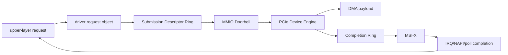
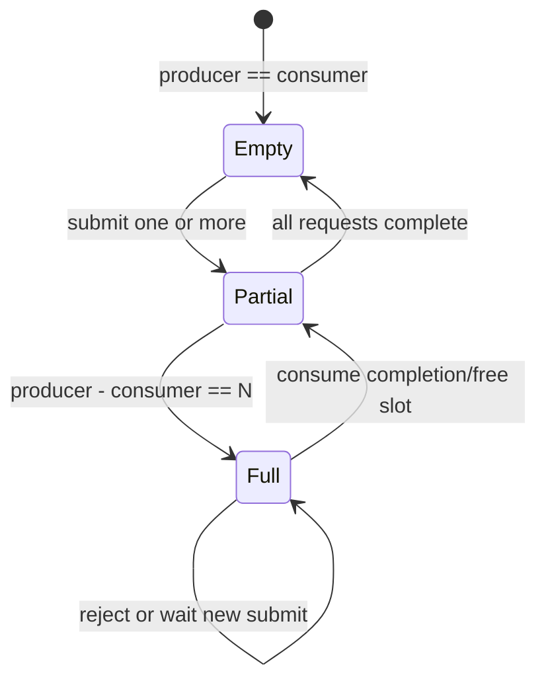
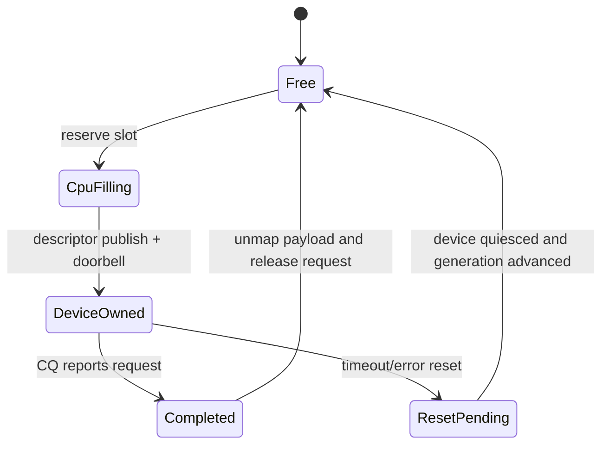
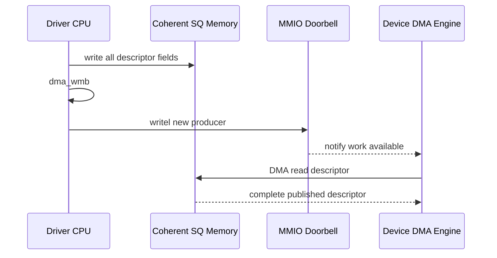
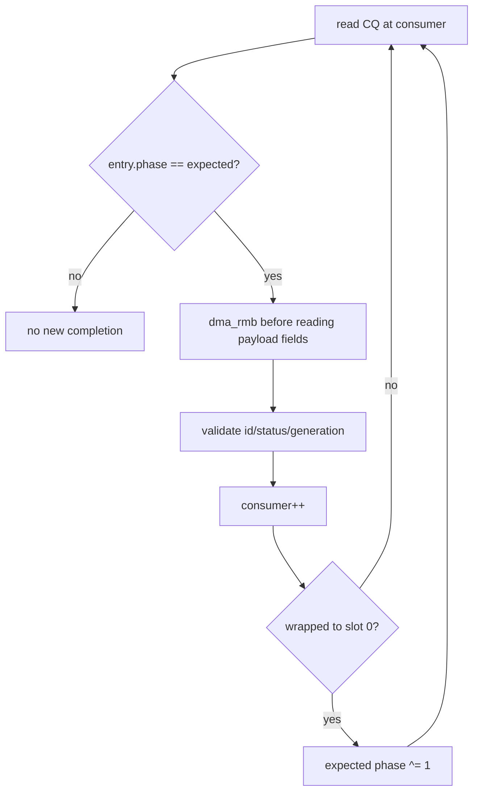
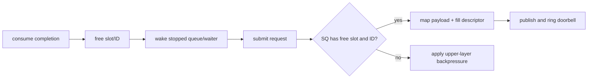
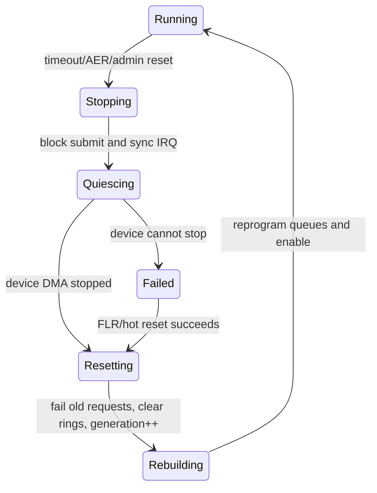

高吞吐 PCIe 设备很少为每个请求只提供一组“地址、长度、启动”寄存器。

更常见的设计是 Descriptor Ring：Host 在内存中发布一批描述符，Device DMA 读取并执行，再把完成状态写回 Completion Ring 或原描述符。

Ring 的难点不在环形下标，而在并发协议：

- 谁拥有某个槽位。
- Descriptor 字段何时对设备可见。
- Doorbell 与内存写入的先后如何保证。
- Completion 数据何时对 CPU 可见。
- Ring 满时如何把背压传到上层。
- timeout/reset 后旧完成为何不能污染新请求。

本文以 Linux 6.12 DMA API 为基线，使用一个明确标注为虚构的教学设备协议说明这些机制。

## 一、先定义教学设备的寄存器与描述符合同

本文假设设备有：

- Submission Queue（SQ）：Host 生产，Device 消费。
- Completion Queue（CQ）：Device 生产，Host 消费。
- 每队列 Doorbell 寄存器。
- MSI-X Completion Interrupt。
- Queue Enable/Reset/Status 寄存器。

这不是任何真实芯片的寄存器定义。

实际驱动必须以公开 Hardware Programming Manual 为准。



一个 SQ Descriptor 可包含：

```c
struct teach_sq_desc {
	__le64 dma_addr;
	__le32 length;
	__le16 command;
	__le16 request_id;
	__le32 flags;
	__le32 generation;
};
```

CQ Entry 可包含：

```c
struct teach_cq_desc {
	__le16 request_id;
	__le16 status;
	__le32 bytes_done;
	__le32 generation;
	u8 phase;
	u8 reserved[3];
};
```

字段大小、字节序和对齐都属于硬件 ABI。

## 二、Ring Capacity 与下标表示法

设 Ring 深度为 `N`，且 `N` 是 2 的幂。

数组槽位可用：

```c
slot = counter & (N - 1);
```

常见两种计数模型：

1. producer/consumer 只保存 0..N-1 下标，留一个空槽区分满与空。
2. 使用单调递增的扩展 counter，`producer - consumer` 表示占用数，可用全部 N 个槽。

第二种更适合软件，前提是整数回绕比较经过设计。



Ring Size 不应由设备未验证值直接决定分配。

驱动要限制最小/最大深度、对齐、每队列内存上限和设备 capability。

## 三、SQ 的槽位所有权状态机

一个 SQ 槽位可经历：

```text
FREE -> CPU_FILLING -> DEVICE_OWNED -> COMPLETED -> FREE
```

CPU_FILLING 时只有 Driver 可以写 Descriptor。

发布后 Device 取得所有权，CPU 不得修改 DMA Address、Length 或 Flags。

Completion 到达且设备不再读取 Descriptor 后，Driver 才能回收。



“写完 Descriptor”不是所有权自动转移。

真正发布点是完成所有字段、执行 DMA write barrier、更新可见 producer，并写 Doorbell。

## 四、为什么 coherent ring 仍然需要内存屏障

`dma_alloc_coherent()` 保证 CPU 与设备对这块内存具有一致性 DMA 语义。

它不保证编译器/CPU 会按源代码顺序把 Descriptor 字段写入和 MMIO Doorbell 发出。

提交路径通常：

```c
desc->dma_addr = cpu_to_le64(payload_dma);
desc->length = cpu_to_le32(length);
desc->request_id = cpu_to_le16(id);
desc->generation = cpu_to_le32(queue->generation);

dma_wmb();
writel(queue->producer, queue->doorbell);
```

`dma_wmb()` 保证此前对 DMA coherent memory 的写，在设备观察到后续发布动作前可见。

具体硬件还可能要求读取某寄存器 flush posted MMIO write。

不要用 `barrier()` 替代 DMA Memory Barrier。

编译器屏障不解决 CPU/Interconnect/Device 可见顺序。

## 五、Doorbell 是通知，不是 Descriptor 数据本身

Doorbell 通常携带新 producer index 或新增数量。

Device 收到 Doorbell 后从 SQ DMA 读取 Descriptor。

如果 Doorbell 先于 Descriptor 字段可见，设备可能读到上一轮数据或半写状态。



Doorbell batching 可以减少 MMIO 写。

Driver 可连续填充多个 Descriptor，只执行一次 barrier 和 Doorbell。

批量过大则增加首个请求等待时间。

吞吐与尾延迟需要测量，不应固定一个“万能 batch size”。

## 六、Payload 使用 Streaming DMA Mapping

Ring Descriptor 常驻且频繁复用，适合 coherent allocation。

业务 Payload 体积大、方向明确，常使用 streaming mapping：

```c
dma_addr_t dma = dma_map_single(&pdev->dev, buffer, length,
				DMA_TO_DEVICE);
if (dma_mapping_error(&pdev->dev, dma))
	return -EIO;
```

Mapping 成功后直到 unmap，CPU 不应访问由设备拥有的缓冲。

Completion 后：

```c
dma_unmap_single(&pdev->dev, dma, length, DMA_TO_DEVICE);
```

DMA_FROM_DEVICE 数据要在 Device 完成并经过正确可见性顺序后才交给 CPU/上层。

Scatter-Gather Payload 使用 `dma_map_sg()`，Descriptor 可能指向 SG List 或拆成多个硬件条目。

不要假设返回 segment 数等于输入 `nents`。

## 七、CQ 的 phase bit 解决环回歧义

CQ 由 Device 写，CPU 读。

若 producer index 不通过 MMIO 暴露，可在每个 CQ Entry 使用 phase bit。

Host 维护 expected phase。

当 Entry 的 phase 等于 expected，说明它属于当前环次。

consumer 从最后一个槽回到 0 时翻转 expected phase。



phase bit 必须由 Device 最后写入，或硬件协议保证它是 Entry 发布标志。

如果硬件先写 phase 再写其他字段，Host 仍可能读到半完成 Entry。

协议文档必须定义 Entry 原子发布顺序。

## 八、读取 CQ 需要 dma_rmb

CPU 观察到有效 phase/owner 后，应执行 `dma_rmb()`，再读取 status、bytes 与 request_id。

这保证设备在发布 owner/phase 前的 DMA 写，对 CPU 后续读取可见。

典型：

```c
if (READ_ONCE(cqe->phase) != queue->phase)
	break;

dma_rmb();
id = le16_to_cpu(cqe->request_id);
status = le16_to_cpu(cqe->status);
bytes = le32_to_cpu(cqe->bytes_done);
```

`READ_ONCE()` 防止编译器合并/重排该标志读取，但不能替代 `dma_rmb()`。

若 CQ 位于 non-coherent streaming buffer，还需要 DMA sync API；硬件协议通常让 Ring 使用 coherent memory以简化。

## 九、Request Table 把 request_id 映射回软件对象

Descriptor 只保存有限位宽的 request_id。

Driver 需要 Request Table：

```c
struct teach_request {
	void *buffer;
	dma_addr_t dma;
	size_t length;
	u32 generation;
	unsigned long deadline;
	/* upper-layer completion context */
};
```

提交前保留 ID 并把 Request Object 发布到 Table。

CQ 消费时先验证 ID 范围、Table Entry 存在、generation 相符，再释放。

设备返回重复、越界或已释放 ID 属于协议/硬件错误，不能直接数组越界访问。

ID 复用过快会让延迟完成错误命中新 Request。

generation 或更宽 tag 用于隔离。

## 十、Ring Full 时背压必须传播

SQ 满时不能覆盖 DeviceOwned Descriptor。

不同上层可选择：

- 网络驱动停止 TX Queue，Completion 后 wake。
- Block Driver 返回 resource/重排队。
- 字符驱动阻塞 write 或 `O_NONBLOCK` 返回 `-EAGAIN`。
- 内核 API 返回 `-EBUSY`。



背压阈值不一定等到完全满。

保留少量 Descriptor 可用于管理命令、flush 或 reset，取决于硬件协议。

## 十一、中断处理与 Completion Poll 分工

MSI-X Handler 应快速确认向量来源、屏蔽/确认必要状态，并安排 Poll。

大量 CQ Entry 可在 NAPI、tasklet/threaded IRQ 或 workqueue 中批量处理。

选择取决于子系统与延迟要求。

处理顺序：

1. 确认 CQ 有有效 Entry。
2. `dma_rmb()` 后读取字段。
3. 验证 request_id/generation。
4. 解除 Payload DMA Mapping。
5. 把结果完成给上层。
6. 更新 consumer。
7. 写 CQ Doorbell/Head 告知设备已回收。
8. 按预算决定继续或重新开中断。

不要在持有 Ring spinlock 时调用可能重新进入 submit 的上层 completion。

可以先把已完成 Request 移到本地列表，释放锁后再回调。

## 十二、多个队列减少锁竞争

单个 SQ/CQ 会让所有 CPU 竞争 producer/consumer 锁。

Multi-queue 设计常让一个 Queue Pair 对应一个 MSI-X Vector 和 CPU affinity。

请求按 CPU、Flow、Hardware Context 或 NUMA Node 分流。

每队列拥有独立：

- coherent Ring。
- producer/consumer/phase。
- request_id space。
- spinlock。
- Doorbell。
- interrupt/poll state。

Queue 数不是越多越好。

每队列占用内存、MSI-X Vector、Device Context 和 cache footprint。

## 十三、timeout 只说明 Request 未按期完成

timeout 到期时可能是：

- Device 尚未取 Descriptor。
- DMA 正在进行。
- Completion 已写但中断丢失。
- CQ 消费线程卡住。
- Device/Firmware Hang。
- Link/AER/IOMMU Fault。

不能直接 unmap/free Payload，让仍在 DMA 的设备继续访问。

先收集：

- SQ producer/Device consumer。
- CQ producer/phase/Host consumer。
- Doorbell 与 Queue Status。
- MSI-X count。
- AER 与 IOMMU fault。
- Request deadline/generation。

只有设备被 quiesce 或 reset 并确认 DMA 停止后，才能强制回收。

## 十四、Reset 的第一步是停止新提交

Queue Reset 协议：

1. 原子设置 queue stopping。
2. 上层停止新 Request。
3. 屏蔽/同步 IRQ 与 Poll。
4. 请求设备停止 Queue/DMA。
5. 等待有界 quiesce；失败升级 FLR/Bus Reset。
6. 处理所有未完成 Request 为错误。
7. unmap Payload。
8. 清空 SQ/CQ 与 Request Table。
9. 增加 generation，重置 phase/index。
10. 重新编程 Ring DMA Address/Size。
11. 启用 Queue、IRQ 和上层提交。



## 十五、generation 隔离旧完成

每次 Queue 重新初始化增加 generation。

SQ Descriptor 与 Request Object 记录当前值。

CQ Entry 返回 generation 或使用包含 generation 的 tag。

Completion 不匹配时不能完成当前 Request。

如果硬件 ABI 没有 generation 字段，可通过更宽 request_id、延迟 ID 复用、reset 后清空 CQ/等待硬件保证等方法降低风险。

仅在软件变量里增加 generation，而 CQ 没有任何可关联信息，无法识别一个看似合法的延迟旧 ID。

协议设计阶段应预留这一能力。

## 十六、内存释放顺序

正常 remove：

1. 停止上层 Queue。
2. 禁止 Device 产生新 DMA。
3. 同步 IRQ/Poll/Work。
4. 完成或失败所有 Request。
5. unmap 所有 streaming Payload。
6. `dma_free_coherent()` 释放 SQ/CQ。
7. 释放 MSI-X、BAR 和设备资源。

如果先 free coherent Ring，Device 仍可能 DMA 写入已被内核重新分配的页面。

这是数据破坏和安全问题，不只是 Driver Crash。

## 十七、常见错误设计

### Doorbell 前没有 dma_wmb

在强顺序测试平台上可能长期正常，在弱顺序 ARM/ARM64 上偶发设备读到旧 Descriptor。

### 只使用 volatile

`volatile` 不建立 CPU-Device happens-before，也不提供 DMA Barrier。

### Ring Full 覆盖未完成槽位

会把 DMA 地址和 request_id 改成新请求，导致任意内存访问或错误完成。

### timeout 直接 unmap

设备可能仍在 DMA，产生 IOMMU fault 或写入已复用内存。

### reset 后立即复用 request_id

延迟旧 CQ Entry 可能完成新请求。

### CQ 只看 status 不看 phase

环回后旧 Entry 被重复消费。

## 十八、验证与故障注入

至少验证：

- N=2、N=4 的极小 Ring 边界。
- producer/consumer 回绕数百万次。
- Queue Full 的阻塞/非阻塞背压。
- Completion 批处理预算。
- 中断丢失后 Poll 是否能发现 CQ。
- Payload Mapping 失败。
- Descriptor 填到一半触发 reset。
- timeout 与正常 completion 同时发生。
- reset 后注入旧 generation CQ。
- remove 时仍有 Request 在途。

使用 IOMMU、KASAN、KCSAN、lockdep 与 DMA API debug。

吞吐测试之外记录 P50/P99 延迟、Queue Occupancy、Doorbell Batch、Interrupt Rate 和 timeout count。

## 十九、Linux 6.12 一手资料

- [Linux 6.12 DMA API HOWTO](https://www.kernel.org/doc/html/v6.12/core-api/dma-api-howto.html)
- [Linux DMA API](https://docs.kernel.org/core-api/dma-api.html)
- [Linux memory barriers](https://docs.kernel.org/core-api/wrappers/memory-barriers.html)
- [Linux stable DMA mapping header](https://git.kernel.org/pub/scm/linux/kernel/git/stable/linux.git/tree/include/linux/dma-mapping.h?h=linux-6.12.y)
- [PCI-SIG specifications](https://pcisig.com/specifications)

## 二十、小结

Descriptor Ring 是 CPU 与 Device 共享的并发协议，不是普通循环数组。

SQ 的 producer/consumer 表示容量，槽位在 FREE、CPU_FILLING、DEVICE_OWNED、COMPLETED 间转移。

coherent Ring 仍需 `dma_wmb()` 保证 Descriptor 先于 Doorbell 发布。

CQ 通过 phase bit 区分环次，CPU 观察有效标志后用 `dma_rmb()` 读取完成字段。

Payload 常使用 streaming DMA Mapping，所有权在 submit 到 completion/unmap 之间属于设备。

Ring Full 必须把背压传给网络、块、字符或内部调用者。

timeout 不能直接释放可能仍被 DMA 的内存。

reset 必须先 quiesce，再失败旧请求、清 Ring、增加 generation、重新编程并恢复。

只有把这些发布与回收顺序写成明确协议，Ring 才能在弱内存序、IOMMU、热复位和高并发下可靠运行。
