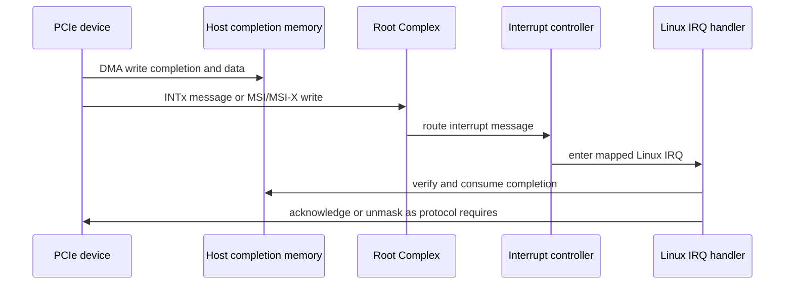
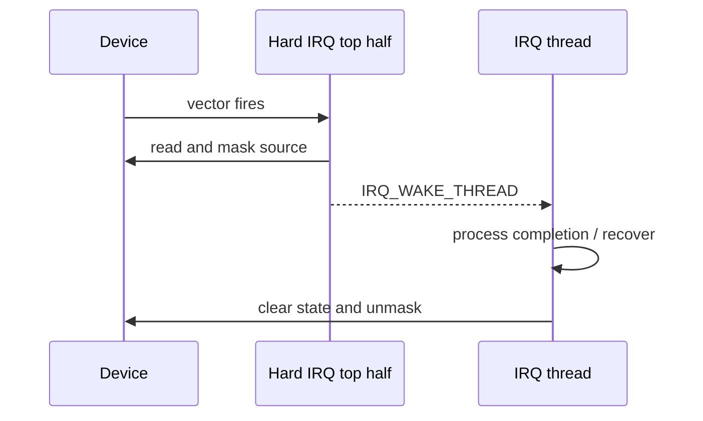
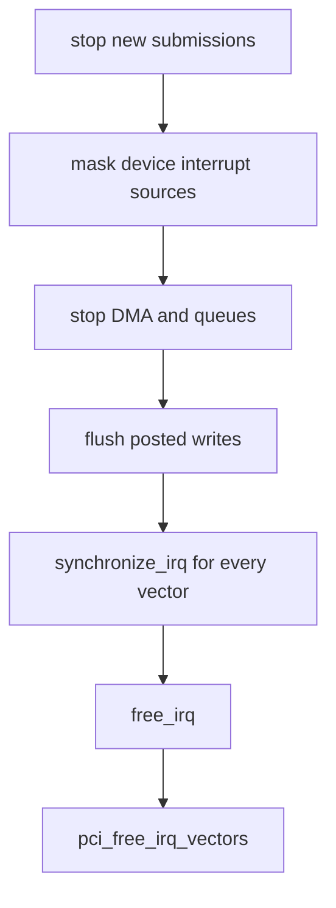

中断（Interrupt）是设备在出现完成、数据到达或错误事件时异步请求 CPU 处理的机制。它让 CPU 不必持续轮询状态寄存器；在理解中断本身之后，本篇再用 DMA Completion 说明真实设备怎样通知完成。

PCIe 保留了 INTx 兼容语义，也提供 MSI 和 MSI-X。三者最后都映射成 Linux IRQ，但“设备怎样产生通知、是否共享、可以分配多少 Vector、怎样撤销事件”完全不同。若只记 `request_irq()`，就无法解释中断风暴、丢中断和多队列亲和性。

本文以 Linux 6.12 为基线，先走通一个完成事件，再逐层增加 Vector 和并发。设备寄存器只使用原创教学协议，不套用 Realtek 或 NVMe 私有 Offset。

## 一、设备事件怎样到达 Linux Handler

假设驱动把 Descriptor 交给设备，设备完成后写回 Completion，并设置 Interrupt Status。通知路径至少包含设备事件、PCIe 消息或电平语义、Root Complex/Interrupt Controller、Linux IRQ Domain 和 Driver Handler。



通知本身不是业务数据。Handler 被调用后仍要读取 Completion Queue 或 Status，确认完成的是哪个 Request，并按设备协议清除、消费或重新使能。因此“IRQ Count 增加”只能证明通知进入 CPU，不能证明 DMA Payload 正确。

设备必须先让 Completion 对 Host 可见，再发通知；否则 CPU 可能先进入 Handler，却读到旧 Descriptor。因为这个先后顺序首先由硬件协议保证，所以软件 Barrier 只能完成自己的那一半，不能修复一颗先发中断后写数据的错误设备。

## 二、INTx 是共享且需要撤销的电平语义

传统 PCI 定义 INTA#～INTD#。PCIe 链路没有并行中断引脚，INTx Assert/Deassert 可以编码成 Message 在 Fabric 中传播，但软件仍看到共享、Level-Triggered 的兼容语义。

设备有事件时设置本地 Status 并 Assert INTx。只要中断源没有清除，电平就持续有效；Handler 返回后 CPU 会再次进入。因此正确 Handler 必须判断事件是否属于本设备、保存必要状态、清除或 Mask 中断源，再安排后续处理。

```c
/* 共享 INTx 必须先判断事件归属；没有本设备事件时返回 IRQ_NONE。 */
static irqreturn_t demo_intx(int irq, void *data)
{
    struct demo_dev *dev = data;
    u32 status = readl(dev->bar0 + DEMO_IRQ_STATUS);

    if (!(status & DEMO_IRQ_MASK))
        return IRQ_NONE;

    writel(status, dev->bar0 + DEMO_IRQ_STATUS); /* teaching W1C */
    readl(dev->bar0 + DEMO_IRQ_STATUS);          /* protocol-defined flush */
    demo_schedule_work(dev, status);
    return IRQ_HANDLED;
}
```

共享 IRQ 上的每个 Handler 都可能被调用，所以没有本设备事件时必须返回 `IRQ_NONE`。若无条件返回 `IRQ_HANDLED`，内核无法发现 Spurious Interrupt；若读取的是 Read-Clear 或 FIFO Register，判断归属本身又可能破坏状态，因此寄存器语义必须来自设备手册。

INTx 的优点是兼容性强，缺点是共享判断、单一电平和路由限制。现代高吞吐设备通常优先使用 MSI/MSI-X，但 Driver 仍可能把 INTx 作为降级路径。

## 三、MSI 是设备发起的一笔 Memory Write

Message Signaled Interrupt（MSI）不依赖共享电平。系统在 MSI Capability 中配置 Message Address 和 Message Data，设备触发时发出一笔特殊目的地址的 PCIe Memory Write，Root Complex 与 Interrupt Controller 把它解释成目标 Vector。


因为 MSI 是 Posted Write，它不会为每次通知返回 Completion。PCIe 的排序规则和设备实现要保证先前 Completion/Data 已经发布到可见点；Handler 读 DMA Memory 时再按 DMA API 使用 `dma_rmb()`，完成 CPU 侧可见性。

MSI 不与其他设备共享传统线，因此 Handler 通常不需要为别的设备返回 `IRQ_NONE`，但仍应检查 Queue/Status，处理合并事件或 Spurious Message。一个 Vector 可能对应多个事件源，具体由设备协议定义。

经典 MSI 支持的 Vector 数通常是 2 的幂并成组分配，数量受 Capability 和平台限制。它比 INTx 更容易扩展，但在需要大量独立队列 Vector 时，MSI-X 更灵活。

## 四、MSI-X 用 Table 和 PBA 管理独立 Vector

MSI-X Capability 指出 Table 和 Pending Bit Array（PBA）位于哪个 BAR、从哪个 Offset 开始以及共有多少 Table Entry。每个 Entry 包含独立 Message Address、Data 和 Vector Control，因此不同 Queue 可以拥有不同 IRQ 和 CPU Affinity。

```text
MSI-X Capability in configuration space
  -> Table BIR selects BAR
  -> Table Offset selects entries in that BAR
  -> Entry[i] contains message address/data and mask bit
  -> PBA records pending state while vector is masked
```

Table 位于设备 BAR，但功能驱动通常不自己按 Offset 写它。Linux PCI/MSI Core、IRQ Domain 和平台 Interrupt Remapping 协作完成配置，驱动只通过 Vector API 请求数量并取得 Linux IRQ Number。绕过 Core 手写 Table 会破坏 Remapping、安全隔离和热插拔状态。

MSI-X Entry 可以单独 Mask，这让 Driver 能按 Queue 暂停通知而不影响其他队列。PBA 表示 Mask 期间积累的 Pending Bit；Unmask 时设备仍需按规范重新发出通知。因此 Mask/Unmask 不等于清除业务 Completion，队列消费者仍要读取自己的 Ring。

## 五、pci_alloc_irq_vectors() 统一选择和降级

Linux 6.12 使用 `pci_alloc_irq_vectors()` 或 Affinity 版本统一申请 MSI-X、MSI 和 INTx：

```c
/* 允许 MSI-X、MSI、INTx 降级，并使用返回值作为实际 Vector 数量。 */
int nvec;

nvec = pci_alloc_irq_vectors(pdev, 1, wanted,
                             PCI_IRQ_MSIX |
                             PCI_IRQ_MSI |
                             PCI_IRQ_LEGACY);
if (nvec < 0)
    return nvec;
```

| 项目 | 含义 |
| --- | --- |
| `min_vecs` | 少于该数量则整个申请失败 |
| `max_vecs` | Driver 能利用的最大数量 |
| Flags | 允许 Core 在哪些机制间选择 |
| 返回值 | 实际成功分配的 Vector 数，不保证等于最大值 |

因为平台可能没有足够 MSI-X Entry、IRQ Domain 或 Remapping Resource，所以 Driver 不能把 `wanted` 当成必然结果。返回 1 时可以退化成单队列，返回较少 Vector 时可以合并 Admin/Data Queue；只有低于最小功能需求才应失败。

`pci_irq_vector(pdev, i)` 把设备内部第 `i` 个 Vector 映射为 Linux IRQ Number。这个 Number 不等于 MSI Message Data，也不应写回厂商寄存器，Driver 只把它传给 `request_irq()`/`request_threaded_irq()`。

## 六、Hard IRQ 与 Threaded IRQ 分担执行上下文

Hard IRQ Handler 运行在原子上下文，应快速读取/Mask 必要状态、记录事件并安排后续处理，不能睡眠或执行长时间事务。如果事件处理需要可睡眠总线访问、固件命令或复杂恢复，可以使用 `request_threaded_irq()`。

```c
/* Top Half 只确认/Mask 事件，可睡眠工作放到 Thread Function。 */
ret = request_threaded_irq(pci_irq_vector(pdev, 0),
                           demo_irq_top,
                           demo_irq_thread,
                           IRQF_ONESHOT,
                           "pcie_teaching",
                           dev);
```

Top Half 返回 `IRQ_WAKE_THREAD` 时唤醒 Thread Function。`IRQF_ONESHOT` 可让 Core 在 Thread 完成前保持该 IRQ Line/Vector Masked，避免同一来源重入；但设备内部其他 Vector 和 Queue 仍可能并发运行，所以 Driver Locking 不能只依赖 ONESHOT。



网络和存储驱动常使用 Poll/NAPI 类机制，让 IRQ 只负责从 Interrupt Mode 切到 Poll Mode，再批量消费 Completion。这样可以降低每包中断开销，但必须保证“Mask -> Poll -> Ring Empty -> Unmask -> Recheck”不会丢掉边缘事件。

## 七、Queue、Vector 与 CPU Affinity 应一起设计

多队列设备通常希望一组 Queue Pair 对应一个 MSI-X Vector，再把 Vector Affinity 指向消费该 Queue 的 CPU。这样 Descriptor、Completion、IRQ 和上层处理集中在同一 CPU/NUMA Node，减少 Cache Line 迁移。

```text
Queue 0 -> MSI-X 0 -> Linux IRQ 120 -> CPU 2
Queue 1 -> MSI-X 1 -> Linux IRQ 121 -> CPU 3
Queue 2 -> MSI-X 2 -> Linux IRQ 122 -> CPU 4
Admin   -> MSI-X 3 -> Linux IRQ 123 -> housekeeping CPU
```

Vector 不足时可以让多个 Queue 共享一个 IRQ，再在 Handler/Poll 中检查各 Queue Completion。因为共享发生在同一设备内部，Handler 仍返回 `IRQ_HANDLED`，但数据结构和 Lock 粒度必须能区分 Queue，避免一个繁忙队列阻塞全部流量。

Affinity 不是单纯“把中断绑到最快 CPU”。它需要与 RSS/Queue Mapping、Worker、Memory Allocation、NUMA 和 CPU Hotplug 协同；否则 IRQ 在 CPU 2，而应用和 Buffer 位于另一个 NUMA Node，可能增加远程内存和尾延迟。

## 八、Mask、Clear、Unmask 的顺序决定是否丢中断

一个常见竞态发生在 Poll 完成准备 Unmask 时：设备刚好写入新 Completion。如果 Driver 先判断 Ring Empty，再 Unmask，而设备在两者之间产生事件且硬件不会重新触发，就可能永久丢失通知。

安全协议通常由设备定义为以下一种：Unmask 后硬件若仍有 Pending 会重新发中断；或者 Driver 在 Unmask 后再次检查 Ring，发现非空则重新进入 Poll；或者使用 PBA/Event Index 等机制完成握手。

```text
mask vector
  -> consume completions until budget/ring condition
  -> publish consumer index
  -> clear device cause as specified
  -> unmask vector
  -> recheck completion/pending state
  -> if work appeared, mask and continue polling
```

因为寄存器可能是 W1C、Read-Clear 或 Level Status，所以清除顺序不能套用通用模板。Driver 必须明确“事件源是什么、谁拥有 Pending、什么操作会让硬件再次通知”。

## 九、remove 和 reset 必须先关闭通知源

卸载时不能先 `free_irq()` 再让设备继续产生中断。正确顺序是撤销新业务提交、设置 `stopping`、Mask Device Interrupt、停止 DMA/Queue、Flush Posted Write，然后对每个 Linux IRQ 调用 `synchronize_irq()`，等待正在执行的 Handler/Thread 退出。

之后才能 `free_irq()`，最后 `pci_free_irq_vectors()`。二者顺序不能颠倒，因为 Handler 注册依赖 `pci_irq_vector()` 对应的映射；先释放 Vector 会让仍注册的 IRQ 失去设备侧配置基础。



Reset 路径也要先 Quiesce IRQ。复位可能让 MSI-X Table、Device Mask 和 Queue 状态丢失，恢复时应先重建 Ring/Vector Routing，再 Unmask 并开放提交；不能假设 PCI Core 保存的 Capability 状态等于设备内部完全恢复。

## 十、丢中断与中断风暴怎样分层取证

丢中断首先比较三组计数：设备 Completion Producer 是否前进，设备 Interrupt Cause/Pending 是否变化，`/proc/interrupts` 对应 Linux IRQ 是否增长。Producer 前进但 IRQ 不增，问题在设备通知、MSI-X Mask、Table/Remapping 或链路；IRQ 增长但 Consumer 不前进，问题更接近 Handler、Queue 映射或 DMA 可见性。

```bash
grep -E 'pcie_teaching|MSI' /proc/interrupts
lspci -s BDF -vv
cat /sys/bus/pci/devices/BDF/msi_bus
```

中断风暴则检查 Status 是否始终为真、W1C 是否写错、Posted Clear 是否 Flush、INTx 是否 Deassert、Handler 是否返回了正确结果。只通过提高 Interrupt Moderation 可能掩盖风暴，却没有清除根因。

记录时要把 Queue ID、Vector Index、Linux IRQ、CPU、Cause、Producer/Consumer 和时间戳关联。单独一张 `/proc/interrupts` 截图只能证明总次数，不能定位一次 Request 为什么超时。

## 十一、常见误解与审查重点

现在应当能够从设备完成事件讲到 Linux Handler：先发布 Completion，再通过 INTx Assert 或 MSI/MSI-X Memory Write 通知 Root Complex，IRQ Domain 映射为 Linux IRQ，Handler 消费 Queue 并按协议 Clear/Unmask。

还应能解释 INTx 为什么共享且要 Deassert，MSI 为什么是一笔 Posted Write，MSI-X Table/PBA 为什么适合多队列，`pci_alloc_irq_vectors()` 为什么返回实际数量，以及 `free_irq()` 为什么必须早于 `pci_free_irq_vectors()`。

## 十二、小结

PCIe 中断不是独立于数据路径的“回调”。它通知 CPU 某个设备状态或 Completion 可能可用，真正的数据仍在 MMIO Status 或 DMA Ring 中。INTx、MSI 和 MSI-X 的差异决定共享、Vector 数量和 Mask 方式，Linux Vector API 再把这些差异收敛为 IRQ 生命周期。

下一篇将把注意力从通知移到数据：设备看到的 DMA Address 为什么不一定是 CPU 物理地址，Buffer 在 CPU 与 Device 之间怎样交接，以及 `dma_map_*()`、Cache Sync 和 Barrier 分别解决什么问题。

**一手资料**

- [Linux 6.12 MSI Driver Guide](https://www.kernel.org/doc/html/v6.12/PCI/msi-howto.html)
- [Linux 6.12 PCI driver API](https://www.kernel.org/doc/html/v6.12/driver-api/pci/pci.html)
- [Linux generic IRQ documentation](https://docs.kernel.org/core-api/genericirq.html)
