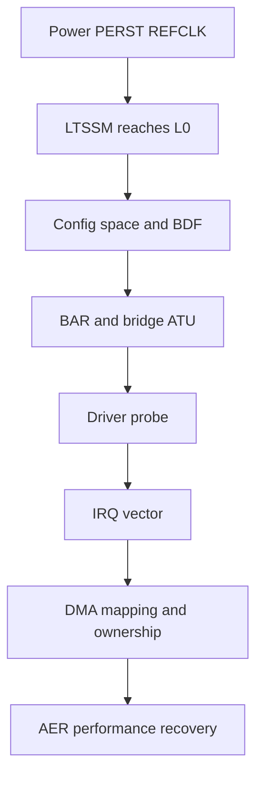

PCIe 故障必须按链路建立顺序排查。`lspci` 看不到设备时，驱动和 DMA 尚未参与；设备可见但 BAR 失败时，链路已经工作；中断正常但数据错，问题才进入 descriptor、DMA 和 IOMMU。混合修改各层只会丢失证据。

本篇从电源/PERST#/REFCLK、LTSSM 开始，逐层建立配置、BAR、IRQ、DMA、IOMMU 和 AER 的观察边界。

## 一、电源、PERST#、REFCLK 和 lane

确认各电源 rail、时序和功耗限制；PERST# 应在 REFCLK 与电源稳定后按规范释放；lane 数、极性反转、lane reversal 与板级连接要符合 RC/EP 支持。

示波器/协议分析仪确认 REFCLK、PERST# 和 receiver detect。Endpoint LTSSM debug register若停在 Detect，查连接/termination；Polling/Configuration 失败，查时钟、lane、equalization 和速率能力；进入 L0 后又 Recovery，查信号质量和错误。

`lspci` 完全无设备且 LTSSM 不到 L0，不需要先改 `pci_device_id`。

## 二、Host bridge 与配置空间访问

RC 自身要正确 probe，ECAM/config window 和 bus range 有效。检查启动日志和：

```bash
lspci -Dnn
lspci -tv
lspci -s BDF -vvxxxx
```

Vendor ID 可读但 header 后部异常，可能是配置访问宽度/ATU；bridge 下设备缺失，检查 secondary/subordinate bus 与 bridge reset/window；BDF 变化不应被脚本写死。

### Configuration Space 原始读取是枚举层的边界证据

Endpoint进入 L0后，Root Complex应能通过 ECAM/config window读取 Vendor ID和 Header。`lspci -xxxx` 与 sysfs config展示 Configuration Space；完全读全 1/abort时，检查 RC config ATU、bus range和 BDF，而不是 BAR driver。

Type 1 bridge的 secondary/subordinate bus和 memory window决定下游可见性。Bridge本身可见、下游缺失时，递归 bus number或 reset/window是独立故障层。

Capability链损坏会让 MSI/AER/PCIe能力解析异常；记录原始 offset/next，避免用 setpci盲改。

## 三、BAR 和地址转换

`lspci -vv` 查看 Region，sysfs resource 核对 Host 分配：

```bash
cat /sys/bus/pci/devices/BDF/resource
cat /proc/iomem | grep -i pci
```

BAR assignment failure 说明 aperture/window/地址空间不足；resource 有值但 MMIO read 全 1 或 abort，检查 RC outbound ATU、bridge window、Endpoint BAR decode/inbound translation 和 reset 状态。

不要在运行设备上随意写 BAR 全 1。先用驱动/只读工具确认分配，再通过最小 scratch register 验证。

## 四、驱动绑定和 probe 回滚

```bash
readlink /sys/bus/pci/devices/BDF/driver
cat /sys/bus/pci/devices/BDF/modalias
lspci -s BDF -k
```

未绑定看 ID/module/override；probe 失败按 enable、regions、DMA mask、BAR、IRQ、queue 的最后成功点定位。dynamic debug 应打印具体 errno 与硬件状态。

设备 enable 后 probe 失败还可能留下 bus master 或中断，检查错误路径是否反向回滚。

### Completion Timeout、Unsupported Request 与 Malformed TLP 指向不同问题

Memory Read有 request/completion配对。Completion Timeout说明目标没有在期限内返回，可能是 address route、Endpoint状态或内部总线卡住；Unsupported Request常见访问未实现 BAR/offset或属性不支持；Completer Abort表示目标接收但无法完成；Malformed TLP更接近格式/硬件协议错误。

AER header log可还原 TLP header，结合 requester/completer和 address定位。不要把所有 AER都归为信号质量，Receiver Error/Bad DLLP与 UR/CTO属于不同层。

Posted Write没有 completion，写错地址可能只通过 AER或后续业务超时体现。关键控制写按设备规范 readback确认。

## 五、INTx/MSI/MSI-X

`lspci -vv` 确认 capability Enabled，`/proc/interrupts` 看 vector 计数。计数不涨时检查设备 event、mask、MSI-X table、message address/data；计数涨但 completion 不动，检查 handler ack、queue mapping 和 ownership。

共享 INTx handler 返回值错误会影响其他设备；MSI-X vector 与 queue 数不匹配会读错 completion。中断风暴通常是源未清或 unmask 时机错误。

## 六、DMA 与 IOMMU fault

IOMMU fault 是设备访问了未映射/无权限 IOVA 的直接证据。记录 requester、IOVA、方向，再在 descriptor ring 找地址和 length：

```bash
dmesg | grep -Ei 'IOMMU fault|SMMU|DMAR|AMD-Vi|swiotlb'
```

无 fault 但数据旧，检查 streaming sync/cache/barrier；地址高位错误，检查 DMA mask 与寄存器写序；timeout 后内存被破坏，检查是否在设备 quiescent 前 unmap/free。

临时关闭 IOMMU 只可用于对比，不能作为修复；它可能把可见 fault 变成静默越界。

## 七、AER 和链路恢复

AER Correctable 持续增加说明链路有压力，Uncorrectable/Fatal 需要解析 TLP header log 和 source ID。Surprise Down、Completion Timeout、Unsupported Request、Malformed TLP 分别指向链路、目标响应、地址/请求和协议格式。

```bash
lspci -s BDF -vv | grep -A25 'Advanced Error'
dmesg -w | grep -i -E 'aer|pcie'
```

恢复可能执行 FLR、hot reset、secondary bus reset 或 slot power cycle。Reset 后 BAR 配置通常由 PCI core 保持/恢复，但设备内部 ring/IRQ 状态需要驱动重建。

### Reset 后必须重建哪些状态

FLR重置单 function，Secondary Bus Reset影响桥下链路，PERST#/slot power更彻底。Reset可能清设备 DMA engine、queue index、MSI-X table shadow和内部 firmware，但 Host配置空间/BAR由PCI core重新恢复部分状态。

驱动恢复顺序：冻结提交、停/确认 DMA、mask/sync IRQ、执行 reset、恢复 PCI state、重新写 BAR queue/doorbell、清旧 completion、增加 generation、unmask并唤醒。跳过任何一步都可能让旧 DMA访问新内存。

AER `error_detected/slot_reset/resume`、timeout recovery与remove需要共享状态机，防止并发双 reset或双释放。

## 八、用一张证据链避免跨层猜测



每层都要求一个可观察证据后再进入下一层。现场记录寄存器、lspci、dmesg、IOMMU fault 和 ring counters 的时间线，比只保存最终错误截图更有价值。

## 九、小结

PCIe 排错顺序是 PERST#/REFCLK/lane、LTSSM、配置空间、BAR/ATU、驱动、IRQ、DMA/IOMMU、AER/恢复。`lspci -vv` 只能证明配置层状态，不证明 DMA 正确；IOMMU fault 也不等于 IOMMU 本身有 bug。下一篇从 Endpoint 视角解释 Host 为何看到这些状态，以及 FPGA/SoC EP 如何建立最小 BAR 通路。
