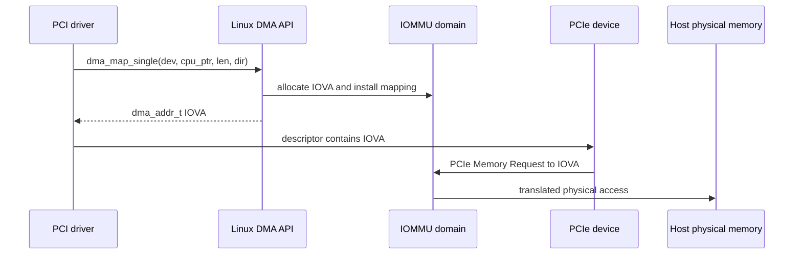
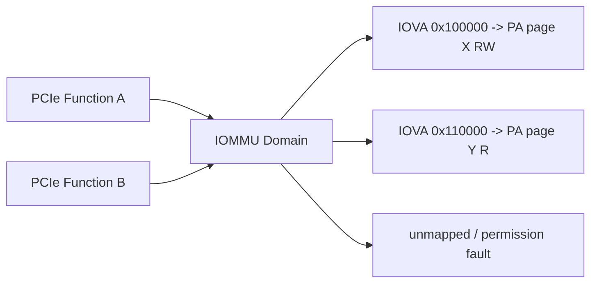
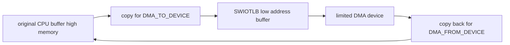
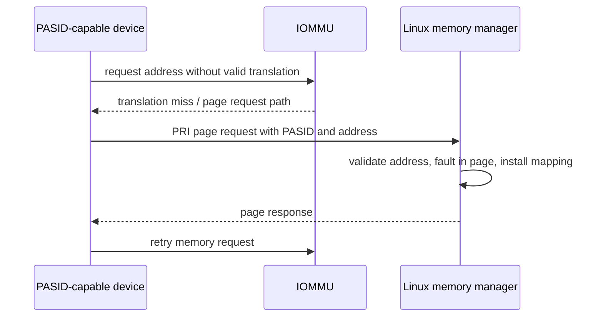

第 08～09 篇一直把 DMA API 返回值写进 Descriptor，但没有打开这个地址背后的实现。为什么同一 Driver 在关闭 IOMMU 时得到一个接近物理地址的数，打开 IOMMU 后却得到完全不同的 IOVA？为什么某个错误会产生 IOMMU Fault，而另一个低地址设备会使用 SWIOTLB？

理解这些问题必须先从普通 DMA Mapping 开始。ATS、PRI、PASID 和 SVA 并不是四个并列的“高级特性”，而是在设备需要缓存翻译、请求缺页、区分多个地址空间和共享进程页表时逐层增加的能力。

本文以 Linux 6.12 为基线，从一个 `dma_map_single()` 结果进入 IOMMU Domain，再按依赖顺序扩展到共享虚拟地址。设备只作为地址请求者，不绑定某款网卡或加速器私有协议。

## 一、Descriptor 中的地址由谁解释

CPU 把 Payload Virtual Address 传给 `dma_map_single()`，DMA Layer 为指定 Device 返回 `dma_addr_t`。设备把这个数放入 PCIe Memory Request Address，Host Bridge/IOMMU 再决定最终访问哪个 Physical Page。



若平台使用 Direct DMA，DMA Address 可能按 Offset 与 Physical Address 对应；若启用 IOMMU，它通常是 IOVA；若 Device 地址位宽不足，SWIOTLB 可能返回 Bounce Buffer 地址。因此 Driver 只应保存并使用 DMA API 返回值，不能通过数字外观判断后端。

Mapping 的 Device 参数很重要。IOMMU Domain、DMA Mask、Coherency 和 Host `dma-ranges` 都与 `&pdev->dev` 关联，所以同一 Physical Page 对不同 Device 可以得到不同 DMA Address。

## 二、IOMMU Domain 是一套设备可见页表

IOMMU Domain 可以理解为一套 IOVA -> Physical Address 的转换与权限环境。Device Attached 到 Domain 后，其 DMA Request 经过该 Domain；DMA Map 安装页表项，Unmap 撤销页表项并处理 IOTLB 一致性。



Domain 不一定与进程一一对应。普通 Kernel DMA 通常使用 DMA Domain；VFIO 可以为用户设备建立受控 IOMMU Container/IOAS；SVA 则让 Device Request 带 PASID 选择进程地址空间。不同模式仍然依赖平台 IOMMU 能力和隔离边界。

因为 IOMMU Page Table 位于 Host 并由内核管理，所以 Driver 不应直接修改它。`dma_map_*()`、VFIO/IOMMUFD 或 SVA API 才是建立合法映射的入口。

## 三、IOMMU Group 表示最小隔离单位

IOMMU Group 包含无法被平台可靠隔离的一组 Device/Function。原因可能是上游桥缺少 ACS、多个 Function 共享内部路径、Requester ID Alias，或者硬件拓扑让 Request 无法区分。

```bash
readlink /sys/bus/pci/devices/0000:01:00.0/iommu_group
find /sys/kernel/iommu_groups -maxdepth 2 -type l
```

将一个 Function 交给 VFIO 时，Group 中其他设备也可能影响隔离。如果只把网卡 Function 0 交给用户，却让同组 Function 1 留在 Host Driver，后者可能通过共享硬件路径访问前者映射，因此 VFIO 以 Group 为基本安全判断之一。

`IOMMU group` 不是性能队列，也不是 Driver Binding Group。它表达的是 DMA 隔离能力；启用 ACS Override 之类的策略可能让软件看到更细 Group，但不会凭空增加真实硬件隔离。

## 四、Map、Unmap 和 IOTLB 共同定义 Mapping 生命周期

IOMMU 与 CPU MMU 一样会缓存地址翻译，设备请求经过的缓存常称 IOTLB。Map 后需要让新页表项可见，Unmap 后必须使旧翻译失效，否则 Device 可能继续命中已经释放的 Physical Page。

```text
dma_map_single
  -> allocate IOVA range
  -> install IOMMU PTE with direction/permissions
  -> invalidate or synchronize translation state
  -> return IOVA to driver

dma_unmap_single
  -> revoke IOVA mapping
  -> invalidate IOTLB as required
  -> release IOVA range
```

因此 Map/Unmap 不是免费函数。高包速场景中，频繁建立小 Mapping 会产生页表、IOVA Allocator 和 IOTLB 开销；长期映射 Page Pool、批量 Map 或更大 Page 可以改善性能，但必须保持 ownership 和回收正确。

Unmap 前先停止 Device 访问仍然是硬要求。IOMMU 可以把 Use-After-Unmap 变成 Fault，帮助发现错误，却不能让错误访问变得安全；没有 IOMMU 时，同一错误可能直接写坏已复用内存。

## 五、IOMMU Fault 是地址、权限和身份的证据

Device 访问未映射 IOVA、违反 Read/Write Permission、使用错误 PASID 或在 Mapping 已撤销后继续访问，可能产生 IOMMU Fault。有效日志至少包含 Requester/BDF、IOVA、Read/Write、Reason、PASID（若有）和时间。

```text
representative fault record, not actual hardware output

device=0000:01:00.0
iova=0x0000000123400000
access=write
reason=unmapped
pasid=none
```

若 Fault IOVA 与 Descriptor 中 DMA Address 一致，但 Mapping 已经 Unmap，根因可能是过早释放或 Device 未停止；若 IOVA 高位/低位明显被截断，应检查 Descriptor Endian、字段宽度和 DMA Mask；若 Fault 指向下一个 Descriptor，可能是 Ring Index 或 Length 越界。

因为 Fault 记录的是 IOMMU 看到的请求，所以它不能直接证明上层 Request ID。Driver 需要同时记录 Queue、Descriptor、DMA Address、Length、Generation 和 Map/Unmap Timeline，才能把硬件请求关联回业务。

## 六、SWIOTLB 用复制解决地址不可达

SWIOTLB 不是 IOMMU 的同义词。它在 Device 无法访问原 Physical Page 时，分配一个位于可达范围的 Bounce Buffer，并在 CPU Buffer 与 Bounce 之间复制数据。



`DMA_TO_DEVICE` 在 Map/Sync For Device 时把数据复制到 Bounce；`DMA_FROM_DEVICE` 在 Sync For CPU/Unmap 时复制回来。因为多了一次或两次内存复制，吞吐下降和 CPU 升高可能来自 SWIOTLB，而不是 PCIe Link 本身。

Driver 不需要识别并手工操作 Bounce。它仍按 Direction 和 Mapping Lifetime 使用 DMA API；性能分析可以从启动日志、SWIOTLB Usage、DMA Address 范围和 CPU Copy 开销判断后端。

## 七、ATS 让设备缓存 IOVA 翻译

普通 IOMMU 模式中，每笔 Device Request 都由 Host IOMMU 翻译。Address Translation Services（ATS）允许支持的 PCIe Device 请求地址翻译并在设备侧 Address Translation Cache 中保存结果，从而减少重复 Host Translation 开销。

ATS 的前提包括 Endpoint Capability、Root/Path 支持、IOMMU 支持、内核策略和 Driver/Subsystem 正确启用。配置空间存在 ATS Extended Capability 只表示设备声明能力，不代表当前 Translation Cache 已启用。

缓存带来一致性责任：Host 修改或撤销 Mapping 时，需要使 Device ATS Cache 中的旧 Translation 失效。因为错误的 Invalidation 会让 Device 使用过期 Physical Address，所以 ATS 不是“打开即可提速”的孤立开关。

## 八、PRI 让设备在缺页时请求 Host 服务

Page Request Interface（PRI）建立在更动态的地址使用上。Device 访问一个当前没有有效 Translation 的地址时，不立即把请求永久失败，而是向 Host 发送 Page Request；Host 可以建立/恢复 Mapping，再返回响应让设备重试。



PRI 需要处理 Queue Depth、Timeout、Invalid Request、Process Exit 和 Memory Revocation。因为 Device Fault 可以阻塞业务请求，驱动和用户 Runtime 还要定义取消、Reset 和错误传播，而不是无限重试。

ATS 解决设备缓存翻译，PRI 解决翻译不存在时的请求/恢复；两者相关但不是同一个 Capability。没有 PRI 的 ATS Device 仍可以缓存预先建立的 DMA Mapping。

## 九、PASID 让同一 Function 区分多个地址空间

Process Address Space ID（PASID）随 Request 标识地址空间上下文。没有 PASID 时，一个 Function 的 Request 通常只能按 Requester ID 进入一个 Domain；有 PASID 后，同一 Function 可以为不同进程或工作队列选择不同 Translation Context。

PASID 自身只是身份标签，必须与 IOMMU PASID Table、Process Lifetime、Permission 和 Device Queue 绑定。若 Queue 仍在运行而 Process 已退出，旧 PASID Request 可能 Fault，因此停止 Queue 和解除 Address Space Binding 必须按顺序完成。

SR-IOV 的 VF 与 PASID 都能增加隔离粒度，但层次不同：VF 提供新的 PCI Function/Requester ID，PASID 在同一 Function 内区分多个地址空间。实际设计可以同时使用两者。

## 十、SVA 让设备使用进程虚拟地址

Shared Virtual Addressing（SVA）让 Device 和 CPU 对同一进程使用一致 Virtual Address。用户提交 Pointer 时，Runtime 不必为每块 Buffer 构造独立 IOVA ABI；Device Request 携带 PASID，IOMMU 使用该 Process Page Table 或等价 Translation Context。

```text
userspace pointer
  -> queue is bound to process PASID
  -> device request carries PASID + virtual address
  -> IOMMU selects process translation context
  -> PRI handles pageable-memory misses when supported
```

这并不表示 Device 可以访问进程的所有地址。内核仍要绑定 Device/PASID、验证权限、处理 MMU Notifier/Invalidation、Process Exit 和 Fault。Device 还必须支持可恢复 Page Fault，业务协议也要能等待或取消 Faulting Request。

因为 SVA 把 Memory Manager、IOMMU、PCIe Device 和 Process Lifetime 连在一起，所以它比普通 DMA Mapping 更复杂。只有共享 Pointer ABI 或 Fine-Grained Accelerator Access 真正需要时才值得使用；固定 Buffer 的网卡和存储数据路径通常继续使用 DMA API 更简单可靠。

## 十一、VFIO 与用户态驱动依赖真实隔离

VFIO 把 Device Control 暴露给用户态，同时依靠 IOMMU 限制 DMA 范围。用户 Pin/Map Memory，IOMMU 建立 IOVA，Device 只能访问授权页面；Interrupt 通过 Eventfd 等机制交给用户态。

安全边界不仅是 IOMMU 开关。还要检查 IOMMU Group、ACS/Requester ID、Reset Scope、MSI Remapping、BAR mmap 权限和设备是否能跨 Function 发起访问。没有可用 Reset 时，把设备交给不可信用户后可能无法清除旧 DMA/内部状态。

因此“设备在独立 Group 中”是必要证据之一，不是充分证据。生产部署还要结合平台威胁模型和 Kernel/VFIO 文档审查。

## 十二、性能分析先找 Mapping 与 Translation 热点

IOMMU 性能开销可能来自 Map/Unmap 频率、IOVA Allocator、Page Table Update、IOTLB Miss/Invalidation、Page Size、NUMA 和 ATS Invalidation。只比较“开/关 IOMMU 吞吐”很难定位根因。

长期映射、Page Pool、Batch Unmap 和 Huge Page 可以减少更新频率，但会增加 Pinned Memory、IOVA 占用或回收复杂度。ATS 可能减少 Host Translation，却增加 Device Cache 与 Invalidation 成本；PRI/SVA 可能降低显式 Map，却把延迟转化为 Page Fault Tail。

有效测量应同时记录 Payload Throughput、IOPS、P99、CPU、Map/Unmap 次数、IOTLB/Fault、SWIOTLB Copy 和 Queue Depth。因为这些指标位于不同层，所以单看 PCIe Link Utilization 不能解释全部性能差异。

## 十三、停止和解绑必须先撤销设备访问

普通 DMA 路径先 Stop Queue 和 Device DMA，再 Unmap IOVA；ATS 启用时还要完成 Translation Invalidation；PASID/SVA 路径先停止使用该 PASID 的 Queue，再解绑 Process Address Space，最后释放相关 Memory Context。

```text
revoke new submissions
  -> stop device queues
  -> wait/cancel in-flight requests and PRI faults
  -> synchronize IRQ/workers
  -> invalidate device translation caches
  -> unbind PASID/SVA context
  -> unmap IOVA and release memory
```

若先撤销 Mapping，仍在运行的设备会产生 Fault；若 Fault Handler 又引用正在退出的 Process/Driver，就会形成更复杂的 Use-After-Free。因此 teardown 必须同时覆盖 Data Path、Fault Path 和 Address Space Lifetime。

## 十四、常见误解与审查重点

现在应当能够解释 `dma_map_single()` 为什么可能返回 Direct Address、IOVA 或 SWIOTLB Bounce Address，并说明 Domain 是 Translation Context、IOMMU Group 是最小隔离单位、IOTLB 是 Translation Cache、Fault 是 Device Address Request 的证据。

还应能按依赖关系说明 ATS 缓存翻译，PRI 请求缺页服务，PASID 标识地址空间，SVA 让 Device 使用 Process Virtual Address；Capability 存在不等于功能已经启用。

## 十五、小结

IOMMU 在 Device DMA Address 与 Host Physical Memory 之间建立可撤销、带权限的映射，SWIOTLB 则用 Bounce Copy 解决地址不可达。ATS、PRI、PASID 和 SVA 逐层把静态 DMA Mapping 扩展为设备缓存翻译、缺页恢复和进程地址共享。

下一篇将讨论另一个需要停止数据路径的场景：Runtime PM 和 System Suspend。我们会区分 Function 的 D-State 与 Link 的 ASPM State，并沿一次 Suspend/Resume 说明 Queue、DMA、IRQ、PCI Config 和 Device Private State 应按什么顺序保存与恢复。

**一手资料**

- [Linux 6.12 IOMMU userspace API](https://www.kernel.org/doc/html/v6.12/userspace-api/iommu.html)
- [Linux 6.12 DMA API HOWTO](https://www.kernel.org/doc/html/v6.12/core-api/dma-api-howto.html)
- [Linux VFIO documentation](https://docs.kernel.org/driver-api/vfio.html)
- [PCI-SIG Specifications](https://pcisig.com/specifications)
