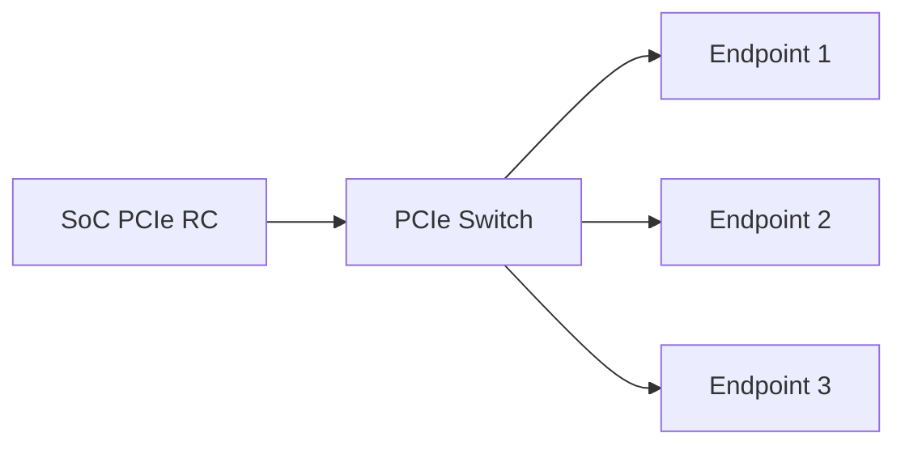

PCIe 驱动开发经常被误解成“写一个 `pci_driver`，然后访问 BAR”。实际项目中，驱动能否进入 `probe()`，取决于更底层的一整条链路：参考时钟、复位、PERST#、供电、参考地、lane 配置、LTSSM、配置空间和资源分配。

这一篇以嵌入式 SoC 连接 FPGA、网卡或自研加速器为场景，建立一套从原理图到 Linux 的 PCIe Endpoint bring-up 方法。示例命令适用于常见 Linux 系统，具体寄存器和设备树属性必须以目标 SoC 手册为准。

## 一、先分清 Root Complex 与 Endpoint

PCIe 链路至少包含两个角色：

- **Root Complex，RC**：通常位于 SoC 内，负责发起配置访问、分配总线号和 BAR 地址；
- **Endpoint，EP**：网卡、NVMe、FPGA 或加速器等设备，响应配置访问并提供功能；
- **Switch**：在一个 RC 下扩展多个下游端口。

嵌入式板卡中最常见的两种结构是：




如果 SoC 被配置成 Endpoint，它不会主动枚举其他设备，而是等待外部 RC 对它进行配置。RC/EP 角色必须先从硬件设计和控制器模式上确认，不能仅根据设备树节点名字猜测。

## 二、硬件设计中必须核对的信号

### 1. REFCLK

PCIe 设备通常需要 100 MHz 参考时钟。需要核对：

- 时钟由 RC、EP 还是独立时钟芯片提供；
- Common Clock 或 SRIS/SRNS 架构；
- 时钟是否在 PERST# 释放前稳定；
- 差分时钟走线、端接和 AC 耦合方案；
- Endpoint 是否有独立参考时钟输入。

参考时钟异常时，最常见表现是 LTSSM 长时间停在 Detect 或 Polling，系统看不到设备。

### 2. PERST#

`PERST#` 是低有效复位信号。RC 通常负责在参考时钟稳定、电源就绪后释放 Endpoint 复位。必须检查：

- 上电默认电平是否为低；
- 释放时序是否满足 Endpoint 数据手册；
- GPIO 复用是否正确；
- 是否被其他设备共享；
- 设备树中的 reset-gpios 极性是否与原理图一致。

PERST# 提前释放会导致 Endpoint 没有完成内部电源和 PLL 初始化；一直拉低则设备永远不会进入配置阶段。

### 3. CLKREQ# 与 WAKE#

低功耗系统可能使用 `CLKREQ#` 请求参考时钟，也可能使用 `WAKE#` 唤醒主机。初次 bring-up 建议先确认链路是否能在非低功耗路径下稳定建立，再逐步启用 ASPM 和 runtime PM。

### 4. TX/RX lane 方向

PCIe TX 必须连接对端 RX，RX 必须连接对端 TX。差分对的极性翻转在部分控制器中可配置，但不能假设所有芯片都能自动修正。x1、x2、x4 的 lane 数量和 lane 映射也必须与控制器支持范围一致。

## 三、链路训练与 LTSSM

PCIe 链路启动会经历 LTSSM，即 Link Training and Status State Machine。初学阶段重点关注这些状态：

- `Detect`：检测对端接收器；
- `Polling`：交换训练序列并建立同步；
- `Configuration`：交换链路宽度和编号等配置；
- `L0`：正常工作状态；
- `Recovery`：重新训练或降速降宽；
- `Disabled` / `Hot Reset`：链路被禁用或复位。

链路最终必须进入 `L0`，但“进入 L0”还不代表设备功能一定可用，因为后面仍有枚举、BAR 和中断配置。

## 四、Endpoint 内部先建立配置空间与 BAR 通路

Endpoint Controller 至少包含配置空间响应、BAR decode、inbound/outbound address translation、MSI/MSI-X 和可选 DMA engine。Host 能读 VID/DID 只证明 Configuration TLP 可达；BAR Memory TLP 还要经过 Endpoint inbound translation 才能落到内部 AXI/AHB/BRAM。

建议第一个 BAR 只实现最小寄存器：VERSION、SCRATCH、LTSSM_STATUS 和 IRQ_TRIGGER。Host 为 BAR 分配地址后，Linux 驱动 `pci_request_region()` + `pci_iomap()`，先读版本，再写读 scratch。若配置空间正常但 MMIO 全 1/abort，检查 bridge window、RC outbound ATU、Endpoint BAR decode 和 inbound address translation，不要直接进入 DMA。


Host BAR address、TLP offset 和 Endpoint 内部 target 是三个地址域。日志和文档必须分别命名，避免把 Host resource start 直接写进 Endpoint 内部总线。

最小 MMIO 通过后再触发 MSI：Host 启用 vector，写 IRQ_TRIGGER，确认 `/proc/interrupts` 与 handler。最后才由 Host DMA API 提供地址，Endpoint outbound engine 发 Memory Read/Write。这个顺序把配置、BAR、中断和 DMA 四类错误逐一隔离。

### Endpoint Configuration Space 的最小实现与 Capability 递增

先实现合法 Type 0 Configuration Space：VID/DID、Class Code、Header Type、Command/Status和一个 BAR。Host能稳定读写 Command、完成 BAR sizing并保持配置后，再加入 MSI/MSI-X、PCIe Capability、AER等；不要一次声明未完成的 Capability链。

BAR mask、64位和 prefetchable属性必须与实际 aperture一致。Function Level Reset支持、Device Serial Number和Resizable BAR等能力只有硬件/firmware真正实现状态恢复时才公开。

Host `lspci -vvxxxx` 的每个字段都应能对应 Endpoint IP配置或用户逻辑寄存器。

## 五、设备树中的 RC 节点

一个抽象的 RC 节点可能包含以下资源：

```dts
pcie0: pcie@40000000 {
    compatible = "vendor,soc-pcie";
    reg = <0x0 0x40000000 0x0 0x100000>;
    reg-names = "dbi";

    interrupts = <GIC_SPI 100 IRQ_TYPE_LEVEL_HIGH>;
    clocks = <&cru PCLK_PCIE>, <&cru ACLK_PCIE>, <&cru CLK_PCIE_REF>;
    clock-names = "pclk", "aclk", "ref";
    resets = <&cru SRST_PCIE>;
    reset-names = "phy";

    phys = <&pcie_phy0>;
    phy-names = "pcie-phy";
    num-lanes = <1>;
    reset-gpios = <&gpio2 4 GPIO_ACTIVE_LOW>;
    status = "okay";
};
```

不同平台的字段差异很大，有的把 PERST# 放在 endpoint 节点，有的使用 `reset-gpios`，还有的平台使用专门的 PHY、pipe、rockchip、cadence 或 dwc glue 属性。修改前要对照：

- SoC 官方设备树；
- 当前内核对应的 binding 文档；
- 板卡原理图；
- bootloader 实际加载的 DTB。

### 运行时确认 DTB

```bash
find /proc/device-tree -iname '*pcie*' -o -iname '*pci*'
cat /proc/device-tree/soc/pcie@40000000/status
tr '\0' '\n' < /proc/device-tree/soc/pcie@40000000/compatible
```

节点路径只是示意，实际路径需要根据 `/proc/device-tree` 查找结果调整。

## 六、Linux 侧的第一轮检查

启动后先执行：

```bash
dmesg | grep -Ei 'pcie|pci|link|ltssm|phy|aer|reset'
lspci -nn
lspci -vv
```

可以按下面的结果分类：

### 情况 1：`lspci` 没有任何设备

优先查 RC 控制器是否 probe、链路是否进入 L0、Endpoint 是否释放 PERST#、参考时钟是否正常。此时还没有必要分析 BAR 或驱动匹配。

### 情况 2：能看到设备，但没有绑定驱动

这说明链路、配置访问和枚举基本成功。接下来检查：

```bash
lspci -k
modinfo your_driver
```

确认 `vendor:device` ID 是否在驱动的 `pci_device_id` 表中，以及模块是否已经加载。

### 情况 3：驱动进入 `probe()`，但资源初始化失败

查看 `lspci -vv` 中的 BAR、BusMaster、MSI/MSI-X 和链路状态，再检查驱动的错误回滚路径。

## 七、用 lspci 读懂一块真实设备

```bash
lspci -s 01:00.0 -nn
lspci -s 01:00.0 -vv
lspci -s 01:00.0 -xxxx
```

重点观察：

- `LnkCap`：设备支持的最大速率和宽度；
- `LnkSta`：当前协商出的速率和宽度；
- `Region 0` 等 BAR：基地址和大小；
- `BusMaster+`：是否允许设备发起 DMA；
- `MSI` / `MSI-X`：中断能力；
- `AER`：高级错误报告能力；
- `Kernel driver in use`：当前绑定驱动。

例如设备支持 Gen3 x4，但 `LnkSta` 只有 Gen1 x1，说明链路虽然工作，却存在速度或宽度降级，需要回到信号、lane、参考时钟和训练日志排查。

## 八、链路速度与宽度验证

可以使用：

```bash
lspci -s 01:00.0 -vv | grep -E 'LnkCap|LnkSta'
```

还可以查看内核 sysfs：

```bash
cat /sys/bus/pci/devices/0000:01:00.0/current_link_speed
cat /sys/bus/pci/devices/0000:01:00.0/current_link_width
cat /sys/bus/pci/devices/0000:01:00.0/max_link_speed
cat /sys/bus/pci/devices/0000:01:00.0/max_link_width
```

如果这些文件不存在，可能是内核版本、设备类型或 sysfs 支持不同，应以 `lspci -vv` 为准。

## 九、链路稳定性测试

初次 bring-up 不能只执行一次 `lspci`。建议组合测试：

```bash
for i in $(seq 1 20); do
    date
    lspci -s 01:00.0 -vv | grep -E 'LnkSta|DevSta|AER'
    sleep 1
done
```

有条件时再进行：

- 设备复位后重新枚举；
- 冷启动和热启动对比；
- 不同 PCIe 代际和宽度测试；
- 高负载 DMA 测试；
- runtime suspend/resume；
- 多次插拔或 hot reset。

稳定性测试的价值在于区分“一次能起来”和“产品可以长期工作”。

### Outbound DMA 从 Host 提供的 dma_addr_t 开始

Host驱动通过 DMA API分配/映射 buffer，把 `dma_addr_t`、length和request id写入 BAR/descriptor。Endpoint outbound DMA将该地址作为 PCIe Memory Request目标；它可能是 IOVA，绝不能按 Host物理地址猜测。

先做 one-shot：Host给 4 KiB，Endpoint写固定 pattern，MSI后Host校验；再做 Endpoint读 Host、scatter-gather和 ring。检查 address高低位、MPS/MRRS、Completion status、IOMMU fault和 Device内部 AXI错误。

Device写 payload/CQE必须先于 MSI可见；reset/PERST#/FLR后停止旧 outbound DMA。若 Host unmap后 Device迟到访问，IOMMU应直接暴露 fault。

## 十、常见故障定位

### 故障 1：链路停在 Detect

检查 Endpoint 供电、参考时钟、TX/RX 连接、PERST# 和接收器终端。示波器或高速协议分析仪比反复改软件更有效。

### 故障 2：链路停在 Polling 或 Recovery

重点查信号完整性、lane 极性、参考时钟架构、速率降级配置和 PHY 参数。可以先强制 Gen1/x1 验证基础链路，再逐步提升。

### 故障 3：设备偶尔枚举，冷启动失败

重点看电源时序、PERST# 释放时机、参考时钟稳定时间以及 Endpoint 内部固件启动时间。

### 故障 4：设备能枚举但 DMA 一启动就崩

这已经不是单纯的链路问题，应转向 BusMaster、DMA 地址宽度、IOMMU 映射、缓存一致性和设备侧 DMA 描述符检查。

### 故障 5：开启 ASPM 后链路异常

先关闭省电特性建立稳定基线，再逐项启用 L0s/L1、L1 Substates 和 runtime PM。不要把低功耗问题与初始链路问题混在一起。

## 十一、Linux PCI Endpoint Framework 的另一侧视角

当 SoC运行 Linux并充当 Endpoint，PCI Endpoint Framework用 `pci_epc` 表示 Endpoint Controller，EPC driver适配硬件，`pci_epf` Function driver配置 Configuration Space、BAR、MSI和数据协议。`pci_epf_test`/对应 Host test driver可用于最小验证。

Framework API负责 function bind/unbind和资源配置，但 PHY、LTSSM、ATU、DMA/cache仍由 EPC/平台实现。Host侧普通 `pci_driver` 与 Endpoint侧 EPF不是同一角色，调试日志要注明所在端。

这套框架适合验证 BAR read/write/copy/MSI，再扩展自定义 Function，顺序与 FPGA Endpoint最小闭环一致。

## 十二、验收清单

- [ ] 已确认 RC/EP 角色和 lane 配置；
- [ ] REFCLK、PERST#、电源和连接器信号经过原理图核对；
- [ ] 设备树运行时节点与预期一致；
- [ ] 链路进入 L0，且速度与宽度符合设计目标；
- [ ] `lspci -nn` 能看到正确 Vendor ID、Device ID 和 class；
- [ ] BAR 资源已分配，BusMaster 和 MSI/MSI-X 状态符合设计；
- [ ] 冷启动、热启动、复位和连续枚举测试通过；
- [ ] Gen1/x1 基线通过后，再验证目标速率和宽度；
- [ ] 高负载下没有 AER、Completion Timeout 或链路反复 Recovery。

## 十三、小结

PCIe Endpoint bring-up 的主线是：

**确认角色 → 核对时钟与复位 → 检查 PHY 和 lane → 让 LTSSM 进入 L0 → 完成枚举 → 验证 BAR/中断 → 进入 DMA。**

驱动只是在这条链路稳定后接管设备。遇到 `probe()` 不进，应先问设备是否已经出现在 `lspci`；遇到 DMA 数据错误，应先确认链路、BAR、BusMaster 和地址映射，再分析软件队列。

---
