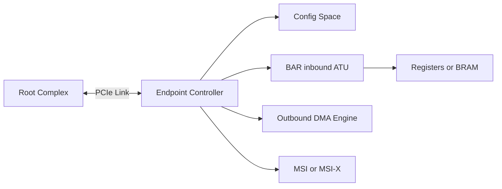

PCIe Endpoint bring-up 同时涉及板级链路、协议硬核、配置空间、BAR 地址转换和 Host Linux。最稳妥的方法不是一开始就上 DMA，而是先让 LTSSM 到 L0、配置空间可读，再用一个 BAR scratch register 建立最小 MMIO 闭环。

本篇适用于 FPGA PCIe hard/soft IP 和带 Endpoint Controller 的 SoC，具体寄存器名称由平台决定，但验证顺序通用。

## Endpoint 设计至少包含五个模块

1. PCIe PHY/Controller：lane、LTSSM、TLP、配置请求；
2. Configuration Space：VID/DID、Class、BAR、Capability；
3. BAR/inbound address translation：把 Host Memory TLP 路由到寄存器/BRAM；
4. MSI/MSI-X：向 Host 发送 interrupt message；
5. DMA/outbound engine：发起 Memory Read/Write 到 Host memory。



先验证 CFG 与 BAR，再验证 MSI，最后 DMA。这样每一步只新增一个数据方向和地址空间。

## 板级时序先让 LTSSM 进入 L0

Endpoint 需要稳定电源、REFCLK 和 PERST#。FPGA bitstream 若在 Host 枚举之后才加载，Host 可能已经错过设备，需要 rescan 或热复位；某些平台要求 FPGA 在启动固件阶段就 ready。

读取双方 LTSSM、link width/speed 和 error counters。卡 Detect 查 lane/termination，Polling/Configuration 查时钟/equalization，反复 Recovery 查信号和 capability。Host `lspci` 出现前不讨论 BAR 驱动。

## 配置空间要先提供最小合法身份

设置稳定 VID/DID、Class Code、Header Type 和一个 BAR。BAR size 必须是 2 的幂并正确编码 32/64 位、prefetchable 属性。暂不使用的 capability 不要声明半成品。

Host 侧：

```bash
lspci -Dnn
lspci -s BDF -vvxxxx
```

Vendor ID 正确但 BAR size 异常，检查 IP BAR mask/config；Class Code 会影响默认驱动匹配；Capability next pointer 错会让 lspci 解析混乱。

## BAR 与 address translation 建立最小寄存器通路

Host 为 BAR 分配地址后，发往 BAR address + offset 的 Memory TLP 进入 Endpoint。Inbound ATU 要匹配 BAR hit/PCIe address，并转换到内部 AXI/AHB/BRAM 地址。

先实现只读版本寄存器、可读写 scratch、状态计数：

```text
0x0000 VERSION = 0x00010000
0x0004 SCRATCH read/write
0x0008 LTSSM_STATUS read-only
0x000c IRQ_TRIGGER write-only
```

Linux 最小驱动 `pci_request_region()` + `pci_iomap()`，read VERSION、写读 SCRATCH。若配置空间正常但 BAR 访问全 1/abort，检查 Host bridge window、Endpoint BAR decode、inbound address translation 和 AXI response。

`address translation` 日志应同时记录 Host BAR address、TLP offset 和内部 target，避免三个地址混写。

## MSI/MSI-X 在 DMA 前验证完成通知

Host 启用 MSI 后把 message address/data 写入 capability；Endpoint IP 通常暴露已配置值和 trigger 接口。先由 Host 驱动写 IRQ_TRIGGER，让 Endpoint 发送一条 MSI，确认 `/proc/interrupts` 计数和 handler。

MSI-X 还需要实现 table/PBA，可能由硬核自动处理或由用户逻辑放在 BAR。Table BIR/offset 必须对应 BAR，function mask/per-vector mask 和 pending 语义正确。

中断通过后再连接 DMA completion，可将“数据没写”和“通知没到”分开。

## DMA 需要 outbound address translation 与 Host 提供地址

Host 使用 DMA API 分配 buffer/ring，把 `dma_addr_t` 写入 BAR register/descriptor。Endpoint outbound engine 以该地址发 Memory Read/Write TLP。若平台有 RC IOMMU，地址是 IOVA；Endpoint 不应假设它等于物理地址。

先做小块固定 pattern：Host 给 4 KiB buffer，Endpoint 写递增数据，Host 收中断后校验；再做读回、scatter/gather 和 ring。用 IOMMU fault、TLP analyzer 与 DMA counter核对地址/长度/Completion。

Endpoint 必须保证 data/completion write 在 MSI 前可见，并在 reset/FLR/PERST 后停止旧 DMA。

## Linux Endpoint Framework 与硬件 Endpoint 是两个使用方向

某些 SoC 在 Linux Device 侧运行 PCI Endpoint Framework，Endpoint Controller driver 提供 `pci_epc`，Function driver 如 `pci_epf_test` 配置 BAR/MSI/DMA。它适合开发板作为 EP 连接另一台 Host。

FPGA 自定义逻辑不一定运行 Linux EP framework，但概念相同：Controller 适配硬件，Function 定义配置/BAR/协议，Host driver 使用它。不要把 Host 侧 `pci_driver` 与 EP 侧 Function driver 混为一套 API。

## bring-up 记录必须跨 Host 与 Endpoint 对时

记录 PERST#/REFCLK、LTSSM、Host lspci、配置字节、BAR/ATU、MSI trigger、DMA descriptor 和 IOMMU/AER 时间线。每次只增加一个能力：

```text
Link -> Config -> BAR scratch -> MSI -> one-shot DMA -> ring -> recovery
```

直接跳到高吞吐 ring 会让地址转换、IRQ 和 queue 三类错误叠加。

## 小结

PCIe Endpoint bring-up 应从电源/时钟/PERST# 和 LTSSM 开始，依次验证配置空间、BAR/inbound address translation、MSI/MSI-X、outbound DMA 和 reset。最小 scratch register 是 Host 与 Endpoint 的第一条可靠通路。下一篇在这条通路上构建多队列 DMA ring、doorbell、completion 和 MSI-X。
