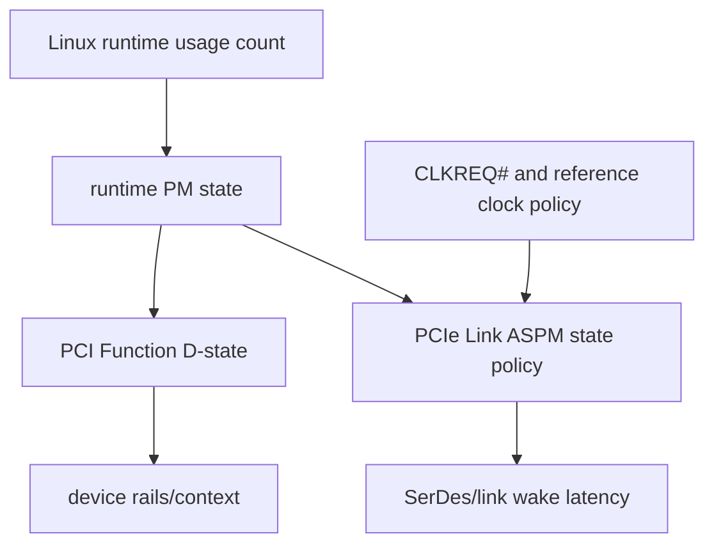
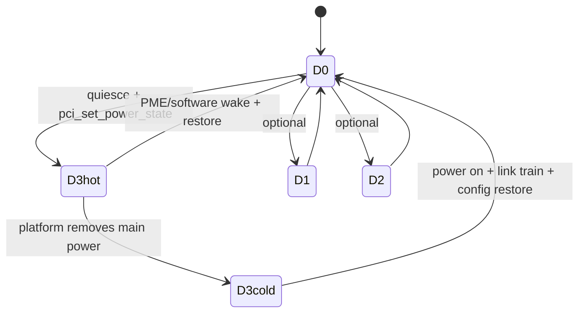
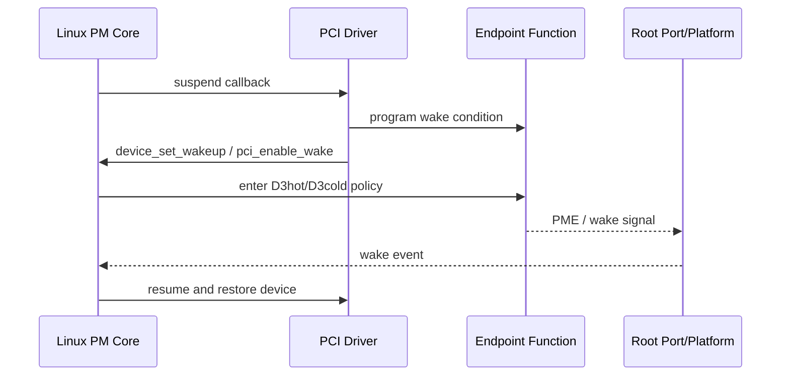
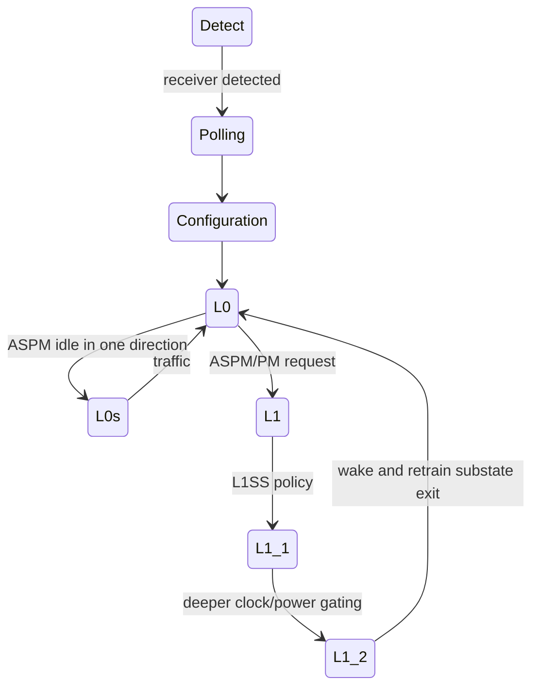
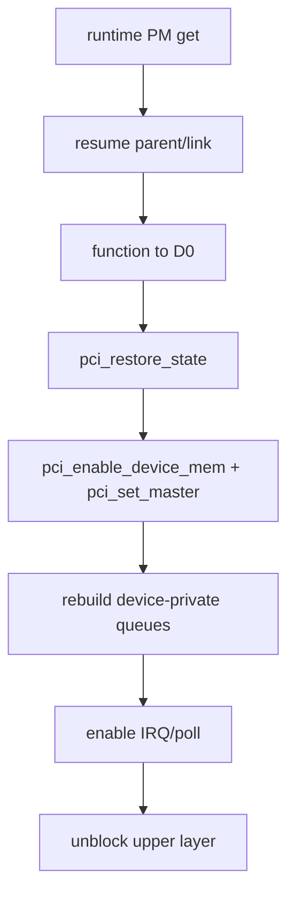

PCIe 功耗问题常被简化成“打开 ASPM”或“把设备设成 D3”。

实际上至少有三套相互关联但不同的状态机：

- Function Power State：D0、D1、D2、D3hot、D3cold。
- Link State：L0、L0s、L1、L1 Substates、L2/L3 Ready、Detect 等。
- Linux Device PM：runtime active/suspended 与 system sleep callback phase。

Function 可以处于 D0 而 Link 进入 L1。

Function 进入 D3hot 后配置空间仍可能部分可访问，但 BAR 通常不能使用。

D3cold 则意味着主电源移除，配置空间也不可访问。

本文固定以 Linux 6.12 为基线，建立这三套状态机的边界和驱动责任。

## 一、先区分 Function 与 Link

Function Power State 描述一个 PCI Function 的供电/功能可用程度。

Link State 描述两个相邻 Port 之间物理链路的活动与低功耗状态。

Linux Runtime PM 描述软件是否有活动使用者，以及何时调用驱动挂起/恢复。

驱动不能只看到 runtime suspend callback 被调用，就假设平台一定切断电源。

最终动作还受 Parent Bridge、ACPI/Device Tree、Power Domain、Wakeup 与平台 firmware 控制。

## 二、D0、D1、D2 与 D3hot

D0 是完全活动状态。

规范还区分 D0 Uninitialized 与 D0 Active 的上下文语义。

D1/D2 是可选中间状态，现代设备和平台未必实现。

D3hot 通过 PM Capability 的 PMCSR 进入。

设备主逻辑大多停止，但辅助电源/配置机制仍允许软件访问配置空间并设置 PME。

进入 D3hot 前驱动应：

1. 停止上层提交。
2. 停止 DMA Engine。
3. 同步 IRQ、NAPI、work 与 timer。
4. 保存需要的软件/硬件状态。
5. 关闭或保留 wakeup source。
6. 让 PCI Core 保存配置并迁移状态。

不能在 DMA 仍在进行时仅写 PMCSR。

## 三、D3cold 不是 PMCSR 中的一个可直接选择值

D3cold 表示 Function 主电源被移除。

设备配置空间不可访问，通常需要平台/Parent Bridge/Slot Power 恢复。

从 D3cold 回来常等价于重新上电：

- 配置寄存器丢失。
- BAR/Command/Capability 可写字段需恢复。
- Firmware 可能需重新加载。
- Device 私有 Queue/Context 需重建。

驱动要通过 `pci_dev_run_wake()`、平台能力和 `d3cold_allowed` 等政策判断是否允许 D3cold。

不要假设所有设备都能可靠经历 D3cold。

## 四、PM Capability 与 PMCSR

标准 PCI Power Management Capability 包含 Capability Header、PMC、PMCSR 等。

PMC 声明版本、支持的 D-state、PME 支持范围和辅助电源等能力。

PMCSR 包含当前 Power State、PME Enable、PME Status 等。

Linux PCI Core 缓存 PM Capability offset，并通过：

- `pci_set_power_state()`
- `pci_enable_wake()`
- `pci_wake_from_d3()`

等接口协调。

驱动不应自己硬编码 Capability offset 写 PMCSR。

通用 helper 还处理平台差异、延时与状态跟踪。

## 五、PME 是 Function 到系统的唤醒请求

Power Management Event（PME）允许设备在低功耗状态请求唤醒。

设备 Capability 必须声明对应 D-state 支持 PME。

软件还要设置 PME Enable，并清理旧 PME Status。

Root Port/Bridge、IRQ/Wakeup Routing 和系统电源管理必须允许事件传播。

“设备支持 PME”不等于整个平台支持从当前 system state 唤醒。

必须验证实际 suspend-to-idle、standby 或 suspend-to-RAM 路径。

## 六、ASPM 管理 Link 空闲功耗

Active State Power Management 允许 Link 在没有事务时进入低功耗状态，无需 Function 进入 D3。

主要状态：

- L0：Link 活动。
- L0s：单方向快速低功耗，恢复延迟较低。
- L1：双向更深低功耗，恢复延迟更高。
- L1.1/L1.2：L1 Substates，进一步关闭部分时钟/PLL/电源。

进入条件由两端 Capability、Link Control、平台政策和延迟约束共同决定。

ASPM 是每段 Link 的属性。

经过 Switch 的路径有多段 Link，每段能力与策略可能不同。

## 七、L0s、L1 与 L1SS 的延迟合同

Endpoint 报告可接受的 L0s/L1 Exit Latency。

上游组件报告实际 Exit Latency。

系统应在设备 Latency Tolerance 能接受时启用相应状态。

L1 Substates 还涉及 Common Mode Restore Time、T_POWER_ON 与 LTR 等信息。

某些硬件虽然宣称支持，板级 REFCLK/CLKREQ#/电源时序却不可靠。

表现可能是空闲一段时间后第一次 MMIO/DMA 超时，而持续压力反而正常。

## 八、CLKREQ# 与 Reference Clock Policy

CLKREQ# 常用于设备请求 Reference Clock，并协助 Clock Power Management/L1SS。

它是板级信号，不是纯软件 bit。

需要确认：

- Endpoint 与 Root Port 引脚连接。
- Pull-up/pull-down 与电压域正确。
- Clock Buffer 支持相应门控。
- Device Tree/ACPI/firmware 描述匹配。
- Link Capability 与控制位协商正确。

如果 CLKREQ# 未连接却强行启用需要它的深度状态，可能导致 Link 无法及时退出 L1.2。

示波器应同时观察 REFCLK、CLKREQ#、PERST# 与电源轨，而不是只看 `lspci -vv` 的 ASPM Enabled。

## 九、ASPM Policy 属于 PCI Core 与平台

Linux PCIe ASPM Core 根据 Capability、quirk、firmware 与全局 policy 管理 Link Control。

功能驱动通常不直接改上游 Port 的 ASPM Control。

原因是该 Link 可能影响多个 Function 或下游拓扑。

`pcie_aspm=` 内核参数和 sysfs policy 适合诊断，但不应成为产品长期掩盖信号/时钟问题的默认方案。

关闭 ASPM 后稳定，只能说明问题与空闲链路/时钟/恢复路径相关，不能单独证明 Linux ASPM Core 有 bug。

## 十、Runtime PM 使用计数与 autosuspend

Linux Runtime PM 通过 Device 使用计数和状态机决定何时调用 `runtime_suspend`/`runtime_resume`。

上层活跃时使用：

- `pm_runtime_get_sync()` 或更合适的 resume-and-get helper。
- `pm_runtime_put_autosuspend()`。
- `pm_runtime_mark_last_busy()`。

驱动 probe 后可设置 autosuspend delay 并允许 runtime PM。

所有用户接口、队列、IRQ work 与 management command 都要正确持有活动需求。

在请求仍可能访问 MMIO/DMA 时提前 put，会让 runtime suspend 与数据路径并发。

## 十一、runtime_suspend 的完整停止协议

一个 Queue Device 的 runtime_suspend：

1. 原子阻止新请求。
2. 等待/取消软件队列。
3. 停止 Device DMA。
4. 同步 MSI-X/IRQ/NAPI/work。
5. 保存 Device 私有状态。
6. 配置 wakeup。
7. `pci_save_state()`。
8. `pci_disable_device()` 或按驱动/Core 合同迁移。
9. 进入目标 D-state。

顺序根据设备和 PCI Core PM 包装调整，但停止 DMA 必须早于失去 BAR/电源。

若设备仍忙，可返回 `-EBUSY`，让 PM Core 延后，而不是强行断电。

## 十二、runtime_resume 要从底层向上恢复

恢复顺序通常：

1. Parent/Power Domain 与 Link 可访问。
2. Function 回到 D0。
3. `pci_restore_state()` 恢复配置。
4. `pci_enable_device_mem()` 与 bus mastering 恢复。
5. 重建 Device Queue、Doorbell 与 MSI-X 私有状态。
6. 清理 stale status。
7. 开启 IRQ/Poll。
8. 允许上层提交。

恢复失败必须保持上层阻塞并返回错误。

不能在 Queue 只恢复一半时宣布 runtime active。

## 十三、pci_save_state 与 pci_restore_state 保存什么

`pci_save_state()` 保存 PCI Core 管理的配置空间状态，如 Command、BAR、Capability 相关寄存器。

`pci_restore_state()` 恢复这些通用配置。

它们不会保存设备 BAR 内的私有 Queue、Firmware Context、统计或业务寄存器。

驱动必须单独保存/重建私有状态。

保存动作应在配置空间仍可访问时执行。

D3cold 后再尝试读取配置通常已经太晚。

重复 save/restore 与 AER/reset 可能交错，驱动需遵守 PCI Core callback 序列化。

## 十四、System Suspend 与 Runtime Suspend 不完全相同

System Suspend 需要冻结整个系统，并考虑 Wakeup Device。

Runtime Suspend 是单设备空闲优化。

可使用 `pm_runtime_force_suspend()`/`pm_runtime_force_resume()` 复用经过验证的 runtime callback，但前提是语义匹配。

System Suspend 还要处理：

- 用户进程冻结。
- 中断唤醒配置。
- Parent Bridge/Host Controller 顺序。
- 系统睡眠状态差异。
- noirq phase 中不能睡眠的限制。

不要简单让 system suspend callback 无条件调用 runtime_suspend 而忽略 Device 当前 runtime 状态。

## 十五、热插拔、AER 与 PM 的交叉

设备可能在 runtime suspended 或 system suspended 时被移除。

AER 错误也可能发生在恢复或低功耗退出阶段。

驱动状态需要区分：online、runtime suspended、system suspended、resetting、removing。

remove 路径不能依赖已掉电设备成功恢复才能清理软件对象。

AER recovery 也不能与 runtime resume 同时重建 Queue。

核心 callback 提供部分序列化，驱动自己的 work/timer/用户接口仍需停止协议。

## 十六、性能与功耗的测量方法

启用更深状态可降低空闲功耗，但增加首事务延迟。

应测量：

- 空闲平台功耗。
- L0s/L1/L1.1/L1.2 Residency。
- runtime suspend/resume 次数与耗时。
- 第一次 MMIO/Queue 请求延迟。
- P50/P99 业务延迟。
- Link Retrain/AER 错误计数。
- 不同 autosuspend delay 的唤醒抖动。

单次 `powertop` 或平均吞吐无法说明尾延迟和稳定性。

## 十七、常见故障推导

### 空闲后首包超时

检查 ASPM/L1SS、CLKREQ#、REFCLK 恢复、runtime resume 顺序和 Device 私有 Queue 恢复。

### suspend 后配置空间全 1

可能仍在 D3cold/Link Down/Parent 未恢复，不要继续写 BAR。

### 开 ASPM 出 AER Corrected Error

收集 Receiver Error/Replay/Bad DLLP、Link State 与板级信号；关闭 ASPM只是对照实验。

### 设备不能唤醒系统

逐层验证 Device wake condition、PME Enable、Root Port、IRQ Wake、平台电源状态和 CLKREQ#/辅助电源。

### Runtime PM 永不进入

检查 usage count 泄漏、活跃 child、持续 work、IRQ 与 autosuspend 配置。

## 十八、Linux 6.12 源码阅读入口

- `drivers/pci/pci.c`：Power State 与 save/restore。
- `drivers/pci/pcie/aspm.c`：ASPM Policy。
- `drivers/pci/pci-driver.c`：Driver PM 包装。
- `drivers/base/power/runtime.c`：Runtime PM Core。
- 具体 Host Bridge 与 Device Driver PM callback。

阅读时区分 PCI Core 通用动作、平台动作和 Device 私有动作。

## 十九、一手资料

- [Linux 6.12 PCI power management](https://www.kernel.org/doc/html/v6.12/power/pci.html)
- [Linux runtime PM framework](https://docs.kernel.org/power/runtime_pm.html)
- [Linux stable PCI ASPM source](https://git.kernel.org/pub/scm/linux/kernel/git/stable/linux.git/tree/drivers/pci/pcie/aspm.c?h=linux-6.12.y)
- [PCI-SIG specifications](https://pcisig.com/specifications)

## 二十、小结

PCIe 功耗管理必须分清 Function D-state、Link ASPM State 与 Linux PM State。

D3hot 仍保留有限配置访问，D3cold 主电源移除且上下文通常丢失。

PME 需要 Endpoint、Root Port、平台和系统唤醒策略完整贯通。

ASPM L0s/L1/L1SS 管理 Link 空闲功耗，退出延迟、LTR、CLKREQ# 和板级 Reference Clock 决定其可靠性。

runtime suspend 必须先阻止新请求、停止 DMA、同步 IRQ，再保存配置和降电。

runtime resume 从 Parent/Link/D0/配置恢复开始，最后才开放上层队列。

`pci_save_state()`/`pci_restore_state()` 不包含设备私有 Queue 与 Firmware Context。

功耗优化应同时测量 Residency、恢复延迟、P99 和错误计数，而不是只看平均功耗或能否枚举。
