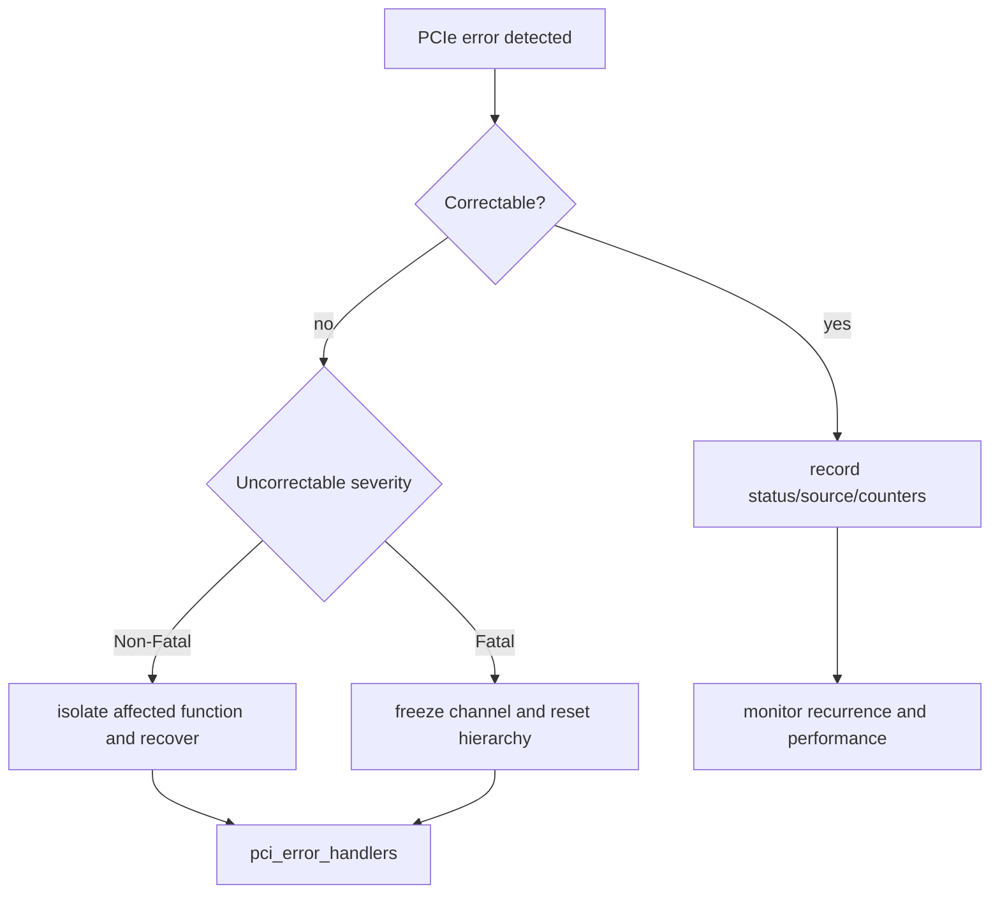
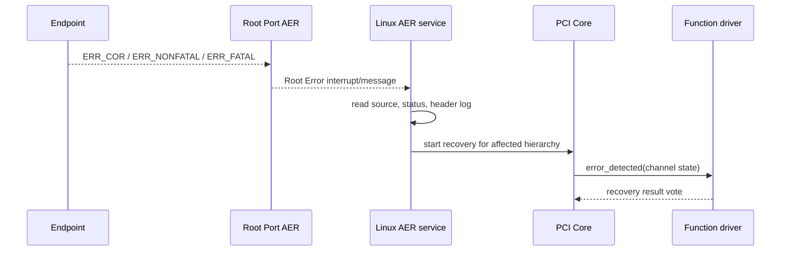
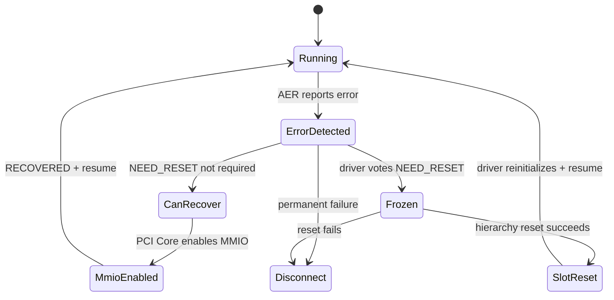
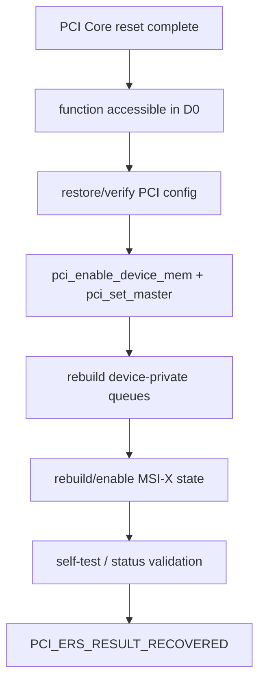
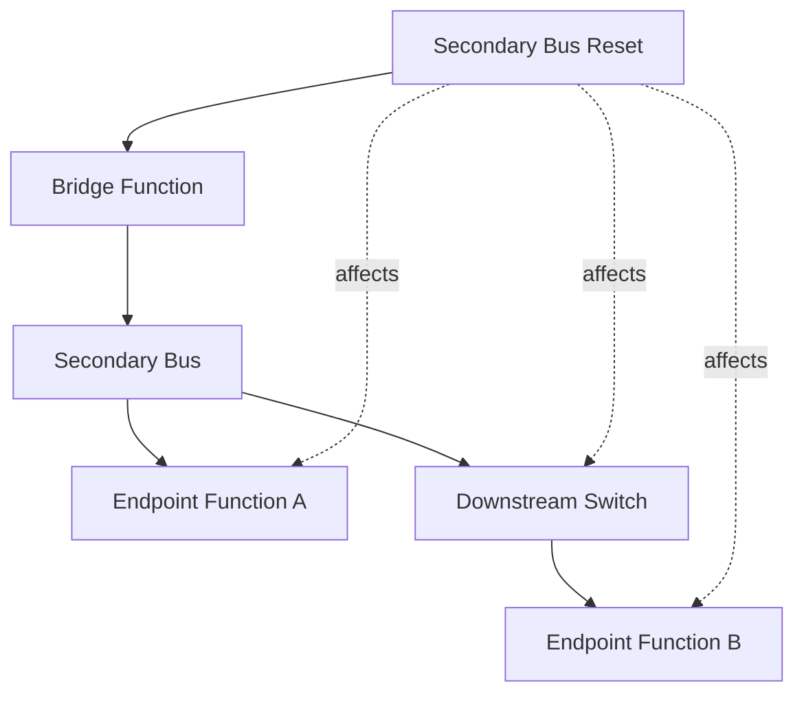

PCIe 错误恢复不是“打印 AER 后重新初始化一次”。

错误可能只需要记录，也可能让 Transaction Layer、Link 或整个下游层级失去可靠状态。

Reset 的影响范围也不同：

- Function Level Reset（FLR）只针对一个 Function。
- PM Reset 借助 Power State 迁移复位 Function。
- Secondary Bus Reset 影响 Bridge 下游全部 Function。
- Hot Reset 在链路层传播，影响同一路径上的设备。
- Slot Power Cycle 进一步重置供电与硬件。

本文固定以 Linux 6.12 为基线，围绕“先停止 DMA，再选择最小必要恢复范围”建立状态机。

## 一、错误首先按可恢复性分级

Advanced Error Reporting（AER）扩展 PCIe 基础错误能力。

常见分级：

- Correctable：硬件已纠正，事务可以继续。
- Uncorrectable Non-Fatal：当前事务/功能受影响，但系统可能继续。
- Uncorrectable Fatal：链路或设备状态不可信，常需 reset。



Severity 可以由 Capability/平台配置影响。

同一类 Error Bit 在不同设备/拓扑中后果可能不同。

## 二、Correctable 不等于可以忽略

常见 Correctable Error：

- Receiver Error。
- Bad TLP/Bad DLLP。
- Replay Number Rollover。
- Replay Timer Timeout。
- Advisory Non-Fatal。

硬件可通过重放恢复，业务请求可能成功。

但持续增长说明信号质量、ASPM/时钟、链路拥塞或设备实现存在问题。

应记录速率而不是只记录总数。

低频偶发与每秒数千次对性能/可靠性的意义完全不同。

Correctable Storm 还会消耗日志、中断和重放带宽。

## 三、Uncorrectable Error 的语义

常见项目：

- Data Link Protocol Error。
- Surprise Down Error。
- Poisoned TLP。
- Flow Control Protocol Error。
- Completion Timeout。
- Completer Abort。
- Unexpected Completion。
- Malformed TLP。
- Unsupported Request。
- ACS Violation。

Unsupported Request 不总是硬件坏。

软件访问未实现 BAR/Capability、错误地址或设备处于不允许状态也会触发。

Completion Timeout 可能来自设备 hang、链路问题、ATU/路由错误或错误 MRRS/Tag 流程。

错误 bit 是调查入口，不是单一根因结论。

## 四、AER Capability 中的关键寄存器组

Endpoint/Port AER Extended Capability 常包含：

- Uncorrectable Error Status/Mask/Severity。
- Correctable Error Status/Mask。
- Advanced Error Capabilities and Control。
- Header Log。
- Root Error Command/Status（Root Port）。
- Error Source Identification。

Header Log 保存触发错误的 TLP Header 片段，若硬件支持且日志有效，可帮助定位 Requester ID、地址和类型。

读取后要按规范清除 W1C Status。

不要用普通 read-modify-write 误清其他并发 bit。

## 五、错误消息如何到达 Root Port

Endpoint 检测错误后可发送 ERR_COR、ERR_NONFATAL 或 ERR_FATAL Message。

Root Port 汇总状态并向系统报告，Linux AER Service Driver 处理中断/消息，定位 Error Source 并协调恢复。



Firmware-first AER 平台可能由 Firmware 先收集/处理，再通过 APEI 等机制交给 OS。

Linux 是否拥有 AER Control 取决于 ACPI _OSC 等平台协商。

## 六、pci_channel_state 描述通道可信程度

`error_detected()` 接收 `pci_channel_state_t`：

- `pci_channel_io_normal`：通道仍可正常 I/O，但有错误需要通知。
- `pci_channel_io_frozen`：I/O 通道冻结，MMIO/DMA 不可信，需要 reset。
- `pci_channel_io_perm_failure`：永久失败，应断开。

驱动不能在 frozen 状态继续读写 BAR 来“看寄存器是否正常”。

此时 MMIO 可能返回全 1、触发新错误或访问错误目标。

可以操作纯软件状态、停止上层 Queue、标记 Request，但硬件访问要遵循 Core 恢复阶段。

## 七、pci_error_handlers 的五段恢复回调

典型：

```c
static const struct pci_error_handlers teach_err_handlers = {
	.error_detected = teach_error_detected,
	.mmio_enabled = teach_mmio_enabled,
	.slot_reset = teach_slot_reset,
	.resume = teach_error_resume,
};
```

某些驱动还实现 reset_prepare/reset_done 等与 reset API 相关回调。

状态机：



各 Function Driver 的返回值会被 PCI Core 汇总，选择恢复路径。

同一下游层级中一个驱动要求 disconnect，可能影响整体结果。

## 八、error_detected 的第一责任是隔离数据面

驱动应：

1. 原子阻止新上层请求。
2. 标记 Queue/error generation。
3. 停止软件 timer/work 产生新 Doorbell。
4. 若通道 normal 且允许，停止 Device Queue。
5. 若 frozen，不依赖 MMIO 成功，转入等待 Core reset。
6. 返回 CAN_RECOVER、NEED_RESET 或 DISCONNECT。

在该回调中同步等待仍需 MMIO 的 Request 可能永久卡住。

应把未完成 Request 保留到 reset/quiesce 明确后统一失败。

## 九、mmio_enabled 是有限硬件检查窗口

PCI Core 在恢复部分 MMIO 后调用 `mmio_enabled()`。

驱动可读取安全状态寄存器，判断设备是否能自行恢复，或仍需要 reset。

不能在这里无条件重新开放上层 Queue。

DMA Engine、MSI-X Table、Device Context 可能仍不可靠。

若读取结果表明 Queue/Firmware 丢失，应返回 NEED_RESET。

若设备状态完整，可返回 RECOVERED，随后 `resume()` 正式开放。

## 十、slot_reset 在通用 reset 后重建 Function

Core 执行适当 reset、恢复 D0、重新启用设备后调用 `slot_reset()`。

驱动通常：

- `pci_restore_state()` 由 Core/驱动合同完成或确认。
- 重新 `pci_enable_device_mem()`。
- `pci_set_master()`。
- 验证 BAR Mapping 仍有效或重新映射。
- 重建 Device Queue、Ring、Doorbell、Firmware Context。
- 清除 stale Interrupt/Error。
- 保持上层 Queue 关闭，直到全部成功。



返回 RECOVERED 后仍要等 `resume()` 再允许上层提交。

## 十一、resume 是恢复发布点

`resume()` 表示参与恢复的 Function 都达到可继续状态。

驱动可以：

- 增加 generation。
- 开启 IRQ/NAPI/Poll。
- 重新启动 watchdog。
- 唤醒被停止的网络/块/字符队列。
- 让新 Request 进入。

旧 Request 必须在此之前明确完成、重试或失败。

不能把 reset 前 DeviceOwned Descriptor 当作仍会完成。

## 十二、DMA quiesce 是所有 reset 的共同前提

Reset 可能停止 Device Logic，但软件不能在未确认前释放 DMA Buffer。

安全原则：

1. 阻止新 Descriptor。
2. 请求 Device 停止 DMA（若 MMIO 可用）。
3. 同步 IRQ/Poll。
4. 等待硬件定义的 idle/quiesce。
5. reset。
6. 只有在 reset 保证旧 DMA 不再发生后，unmap/free。

IOMMU 可以把 reset 后误 DMA 转成 fault，但不能让错误内存访问变得正确。

No-IOMMU 平台上误 DMA 可能静默破坏内存。

## 十三、Function Level Reset 的范围

FLR 由 PCIe Capability 或 SR-IOV Capability 声明。

它复位一个 Function，不应影响同一 Device 的其他 Function 或 Link。

软件触发后必须等待规范规定的完成时间，并确认设备可访问。

Linux 使用 `pci_reset_function()`/`pci_try_reset_function()` 等接口选择适用 reset 方法。

驱动不要直接写 Initiate FLR bit 后立即访问 BAR。

Core 需要序列化、保存/恢复配置并等待。

FLR 通常清除 Device 私有状态，但 BAR 配置等 PCI State 的恢复由 Core 协调。

## 十四、PM Reset 利用 D3hot 到 D0

某些 Function 没有 FLR，但从 D3hot 回到 D0 会执行功能复位。

PCI Core 可把它作为 reset method 之一。

是否有效取决于 PM Capability 和设备行为。

若 Device 声明 No_Soft_Reset 等语义，不能假设 PM Transition 会清状态。

D3cold 的影响更大，还依赖平台电源控制与 Link retrain。

## 十五、Secondary Bus Reset 的影响范围

对 Bridge Control 的 Secondary Bus Reset bit 操作，会复位桥下游 Bus 层级。

所有下游 Function 都受影响。



不能由单个叶子驱动在不知道兄弟设备状态时擅自触发。

PCI Core/Slot/管理层需要协调全部 Function Driver 停止和恢复。

## 十六、Hot Reset 与 Fundamental Reset

Hot Reset 通过 TS1/TS2 等链路训练序列传播，让 Link Partner 进入复位语义。

它通常影响该 Link 下游，不一定切断电源。

Fundamental Reset 与 PERST#、上电时序相关，影响更彻底。

Slot Power Cycle 则真正移除/恢复电源。

恢复范围从 FLR 到 Power Cycle 逐步扩大，副作用和耗时也增大。

策略应选择能恢复问题的最小范围，并在失败时升级。

## 十七、Reset Method 的选择与 reset_method sysfs

Linux PCI Core 探测设备支持的 reset method，并按优先级尝试。

用户空间可在支持的内核/设备上通过 `reset_method` 查看/配置方法，通过 `reset` 触发 Function Reset。

运行中设备由 Driver 拥有时，用户空间随意 reset 会破坏 Queue/DMA。

应通过驱动、VFIO 或设备管理框架协调。

`reset` 文件存在不代表任何时刻触发都安全。

## 十八、Surprise Removal 与 Error Recovery 的边界

Surprise Down 可能表示设备物理消失。

如果 Link Partner 不再存在，反复 reset 无法恢复。

驱动 remove/hotplug 路径必须能在 MMIO 不可访问的情况下清理软件对象。

不能要求读一个“停止完成寄存器”成功后才退出，否则拔卡会永久 hang。

对可热插拔 Slot，要区分 Presence Detect、Data Link Layer Link Active、AER Surprise Down 和用户发起移除。

## 十九、Virtual Function 与 PF 恢复

SR-IOV PF reset 可能影响所有 VF。

VF FLR 通常只复位一个 VF，但 PF/Firmware 仍参与资源重建。

PF Driver 需要协调：

- 停止 VF 资源分配。
- 通知/解绑 VF Driver 或虚拟机。
- 清理 mailbox 与 Queue。
- reset 后恢复 VF 配置。

不能只恢复 PF 自己的 netdev 就宣布设备恢复。

## 二十、错误恢复的 generation

每轮 reset 增加 Driver Generation。

Queue、Request、Firmware Command 和 Completion 都应能关联 generation 或不可复用 tag。

reset 前未完成 Request 统一失败或按上层合同重试。

延迟 MSI-X/Completion 若 generation 不匹配只能丢弃并计数。

generation 不替代 `synchronize_irq()` 与 DMA quiesce，但能防止语义上旧完成命中新请求。

## 二十一、验证恢复而不是只验证重新枚举

故障注入矩阵：

- Correctable Receiver Error 计数增长。
- Unsupported Request。
- Completion Timeout。
- Frozen Channel。
- FLR 期间满载 DMA。
- Secondary Bus Reset 下多个 Function。
- reset 与 remove 并发。
- reset 与 runtime suspend 并发。
- reset 后延迟旧 Completion。

验证：

- 所有旧 Request 有明确结果。
- 没有 reset 后旧 DMA。
- BAR、MSI-X、Queue 与 Firmware State 已重建。
- 上层 netdev/block/char 状态正确。
- 重复 reset 不泄漏资源。
- 恢复有界，失败能升级或断开。

## 二十二、Linux 6.12 源码入口

- `drivers/pci/pcie/aer.c`
- `drivers/pci/pcie/err.c`
- `drivers/pci/pci.c`
- `drivers/pci/quirks.c` 中 reset quirk
- 具体 Driver 的 `pci_error_handlers`

阅读时同时看 PCI Core 如何聚合回调返回值，以及设备驱动如何 quiesce 私有 DMA。

## 二十三、一手资料

- [Linux 6.12 PCI error recovery](https://www.kernel.org/doc/html/v6.12/PCI/pci-error-recovery.html)
- [Linux PCI AER HOWTO](https://docs.kernel.org/PCI/pcieaer-howto.html)
- [Linux stable AER source](https://git.kernel.org/pub/scm/linux/kernel/git/stable/linux.git/tree/drivers/pci/pcie/aer.c?h=linux-6.12.y)
- [PCI-SIG specifications](https://pcisig.com/specifications)

## 二十四、小结

AER 把错误分为 Correctable、Uncorrectable Non-Fatal 与 Fatal，并通过 Root Port/AER Service 协调恢复。

Correctable Error 已被硬件恢复，但持续增长仍是重要链路证据。

`pci_error_handlers` 通过 `error_detected`、`mmio_enabled`、`slot_reset`、`resume` 构成分段恢复状态机。

Frozen Channel 中不能继续依赖 MMIO。

所有 reset 前必须先阻止新请求并让 DMA 静止，reset 后重建 PCI 配置、BAR/Bus Master、MSI-X 与 Device 私有 Queue。

FLR、PM Reset、Secondary Bus Reset、Hot Reset 与 Power Cycle 的影响范围逐级扩大。

恢复策略选择最小必要范围，失败时有界升级。

generation、同步 IRQ 与 Request 统一失败共同防止旧完成污染新状态。

只有旧请求、DMA、配置、Queue 和上层发布状态全部闭合，错误恢复才真正完成。
