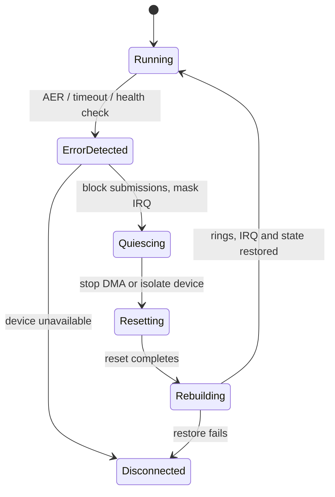
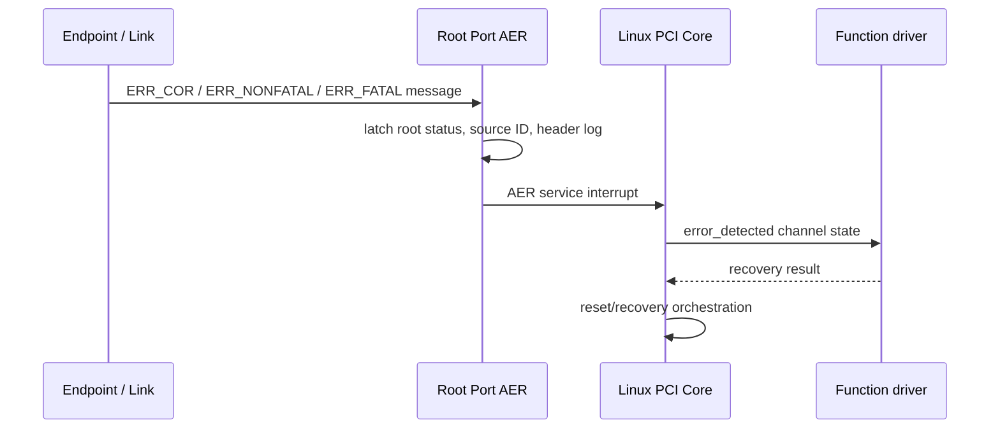
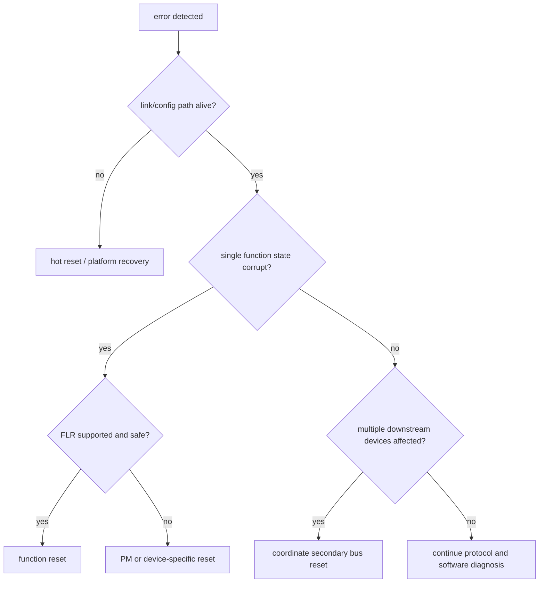

第 11 篇讨论了计划内 Suspend，但 PCIe 设备也会在运行中遇到 Completion Timeout、Malformed TLP、Unsupported Request、Surprise Down 或内部错误。真正困难的不是执行某个 Reset，而是在设备状态已经不可信时，安全停止旧 DMA、选择合适复位范围并让 Driver 重新建立运行合同。

Advanced Error Reporting（AER）提供标准错误状态、Mask、Severity 和 Header Log，Root Port/PCI Core 再调用功能驱动的 `pci_error_handlers`。它能告诉软件发生了哪类协议错误，却不能自动恢复设备私有 Ring、Firmware 和 Request Ownership。

本文以 Linux 6.12 为基线，从一次错误事件沿完整恢复链推导，再比较 FLR、PM Reset、Secondary Bus Reset、Hot Reset 和更大范围的复位。设备只作为错误源，不依赖某款芯片私有错误寄存器。

## 一、先看问题：发现错误后为什么不能立即 reset

假设设备 TX Request 超时，同时 Root Port 记录 Non-Fatal Completion Timeout。如果 Driver 立即执行 FLR，却没有先停止提交和 Mask IRQ，另一个 CPU 可能继续写 Doorbell；如果 Reset 后直接 Free 旧 Buffer，设备或 Fabric 中的旧 DMA 还可能晚到。

错误恢复因此至少包含五个阶段：检测错误、阻止新请求、收回或隔离旧 ownership、选择并执行 Reset、重建设备后重新开放业务。



因为旧请求与新请求可能使用相同 Ring Slot/Request ID，所以 Reset 边界还要增加 Generation。恢复成功只表示新一代可以运行，不应把 Reset 前迟到的 Completion 交给新请求。

## 二、AER 先按可恢复性分类

AER 将错误分为 Correctable 和 Uncorrectable，Uncorrectable 再按 Severity 区分 Non-Fatal 与 Fatal。分类决定是否需要中断数据路径和扩大恢复范围。

| 类别 | 代表性错误 | 常见处理思路 |
| --- | --- | --- |
| Correctable | Receiver Error、Bad DLLP、Replay Timer | 链路硬件已纠正，记录趋势与性能影响 |
| Uncorrectable Non-Fatal | Completion Timeout、Unsupported Request | Function/路径可能需要恢复，系统可继续 |
| Uncorrectable Fatal | Surprise Down、Poison/严重协议错误 | Link/下游可能不可靠，扩大隔离与 Reset |

Correctable 不等于可以无限忽略。Receiver Error 和 Replay 持续增长可能预示信号、时钟、ASPM 或连接器问题，并消耗带宽。Non-Fatal 也不等于 Driver 一定能恢复，设备内部状态可能已经损坏。

Severity Register 允许平台把某些 Uncorrectable Error 定义为 Fatal/Non-Fatal，Mask Register 决定是否上报。调试时必须同时读取 Status、Mask、Severity，否则只看错误名称无法解释系统为何采取某种恢复策略。

## 三、Root Port 负责收集和定位错误消息

Endpoint 或链路通过 Error Message 向上游报告，Root Port AER Capability 保存 Root Error Status、Source ID，并为部分错误记录 TLP Header Log。Linux PCIe AER Service Driver 处理 Root Port 服务并把错误关联到受影响的设备层级。



Header Log 可以保存出错 TLP 的 Header DW，帮助判断 Requester/Completer、地址、Length、Tag 和事务类型。但并非所有错误都有有效 Header，日志也可能只保留第一笔，所以它是定位证据而不是完整抓包。

有效记录应把 AER Source BDF、受影响 Endpoint、Header、Driver Queue/Request、IOMMU Fault 和时间关联起来。只截取一行 `AER: Corrected error received` 会丢掉定位所需上下文。

## 四、pci_error_handlers 把恢复阶段交给功能驱动

功能驱动通过 `struct pci_error_handlers` 提供回调：

```c
static const struct pci_error_handlers demo_err_handlers = {
    .error_detected = demo_error_detected,
    .mmio_enabled = demo_mmio_enabled,
    .slot_reset = demo_slot_reset,
    .resume = demo_error_resume,
};

static struct pci_driver demo_driver = {
    .name = "pcie_teaching",
    .id_table = demo_ids,
    .probe = demo_probe,
    .remove = demo_remove,
    .err_handler = &demo_err_handlers,
};
```

这些回调不是四个互不相关的通知，而是 PCI Core 驱动的 Recovery State Machine。Driver 返回值告诉 Core 自己能否继续、需要 Reset、已经恢复还是必须断开。

因为具体调用序列取决于 Channel State、平台和返回结果，所以 Driver 应把“停止数据路径”“恢复配置”“重建硬件”“开放请求”拆成明确 Helper，而不是假设每次都会调用所有回调。

## 五、error_detected() 的首要任务是隔离旧数据路径

`error_detected()` 接收 `pci_channel_state_t`，此时 MMIO 是否安全取决于 Channel State。Driver 应先把软件状态切到 Recovering，阻止新提交，并停止不依赖不可信 MMIO 的异步路径。

```c
static pci_ers_result_t
demo_error_detected(struct pci_dev *pdev,
                    pci_channel_state_t state)
{
    struct demo_dev *demo = pci_get_drvdata(pdev);

    demo_block_submissions(demo);
    demo_mark_recovering(demo);
    demo_mask_software_paths(demo);

    if (state == pci_channel_io_perm_failure)
        return PCI_ERS_RESULT_DISCONNECT;

    return PCI_ERS_RESULT_NEED_RESET;
}
```

若 Channel Frozen，Driver 不应继续大量 `readl()/writel()` 试探设备，因为 MMIO 可能返回全 1或触发更多错误。可以安全完成的软件动作包括阻止 Upper Layer、取消 Timer、标记 Request 和安排后续回收。

返回 `NEED_RESET` 表示 Driver 不能仅靠重新启用 MMIO 恢复；返回 `CAN_RECOVER` 表示愿意尝试不复位恢复；`DISCONNECT` 表示设备应停止使用。返回值必须符合 Driver 实际能力，不能为了“继续运行”总是返回 Recovered。

## 六、mmio_enabled、slot_reset 和 resume 各有边界

若 Core 重新允许 MMIO，可能调用 `mmio_enabled()` 让 Driver 检查设备状态或执行轻量恢复。如果寄存器仍不可信，Driver 可以继续请求 Reset，而不是强行启动 Queue。

`slot_reset()` 在 Reset 后调用，此时 PCI 配置和 BAR 访问应恢复，但设备私有状态通常回到复位值。Driver 需要重新 Enable、恢复 Bus Master、验证 Device ID/Version、重建 Ring Base、Producer/Consumer、Interrupt Route 和 Feature Register。

```c
static pci_ers_result_t demo_slot_reset(struct pci_dev *pdev)
{
    struct demo_dev *demo = pci_get_drvdata(pdev);
    int ret;

    ret = pci_enable_device_mem(pdev);
    if (ret)
        return PCI_ERS_RESULT_DISCONNECT;

    pci_restore_state(pdev);
    pci_set_master(pdev);

    ret = demo_rebuild_after_reset(demo);
    return ret ? PCI_ERS_RESULT_DISCONNECT
               : PCI_ERS_RESULT_RECOVERED;
}
```

`resume()` 才开放正常业务：清 Recovering，Unmask IRQ，Wake Queue，并让 Upper Layer 重新提交。因为开放入口是最后一步，所以任一恢复阶段失败都不会让外部看到半初始化设备。

## 七、恢复前必须明确 DMA ownership 怎样结束

AER 错误可能发生在 Device 正在读写 Host Memory 时。若 Function/Link 已被隔离，旧 DMA 也许停止；若只是软件 Timeout，设备可能仍运行。Driver 需要依据 Controller/Reset Contract 判断何时可以 Unmap 和 Free。

```text
block new submissions
  -> mask/disable notification paths when safe
  -> stop or isolate DMA engine
  -> synchronize IRQ, poll and workers
  -> classify in-flight requests as completed/canceled/lost
  -> only then unmap and free old buffers
```

Timeout 本身不是 ownership 返回。提前 Free 可能造成旧 DMA 写入新对象；保留所有 Buffer 又可能让恢复永远泄漏。因此可靠设备协议要提供 Queue Stop、Function Reset 或 Link Isolation 的硬件边界。

IOMMU 可以在旧 Mapping 被撤销后记录 Fault，帮助发现延迟 DMA，但不能让错误访问正确。恢复代码仍应先停止 Device，再 Unmap。

## 八、FLR 复位单个 Function

Function Level Reset（FLR）由 PCIe Capability 或 AF Capability 表示，目标是复位一个 Function 而不影响同设备其他 Function 和上游 Link。Linux 可通过 `pci_reset_function()` 或更合适的 Reset API/Method Selection 触发。

FLR 通常清除设备私有状态、停止内部操作并要求软件等待规定完成时间，但 BAR 配置、MSI 状态和 Driver 资源是否需要恢复仍由 PCI Core/Driver Contract 决定。FLR 也不能保证清除板卡上跨 Function 共享的 Firmware/Engine。

因为 FLR Scope 最小，它通常优先于 Bus/Link Reset；但只有 Device 宣告支持且 Driver 确认共享资源安全时才适用。把不支持 FLR 的 Function 强制写某个私有 Reset Bit，不属于通用 PCIe 方法。

## 九、PM Reset、Secondary Bus Reset 与 Hot Reset 影响范围不同

不同 Reset Method 解决不同层级故障：

| Reset | 典型范围 | 适用条件与风险 |
| --- | --- | --- |
| FLR | 单个 Function | Capability 支持，优先最小化影响 |
| PM Reset | Function D3hot -> D0 | Device/平台允许，依赖 PM Capability |
| Secondary Bus Reset | Bridge 下游全部设备 | 会影响同一 Secondary Bus 的所有 Function |
| Hot Reset | 一段 Link/下游路径 | 重新训练，影响该 Link 后设备 |
| Fundamental/平台复位 | 板卡/控制器更大范围 | 可能需要 PERST#、电源循环和重新枚举 |

Secondary Bus Reset 通过 Bridge Control 作用于下游 Bus，因此不能只看目标 Endpoint。若同一 Switch Port 后还有存储或管理 Function，复位会同时中断它们；Driver/用户态必须在执行前协调整个 Scope。

Hot Reset 通过 Link Training 语义让下游进入复位并重新训练，适合 Link/Protocol State 损坏，但也会丢失路径下所有 Device State。它与“热插拔移除”不是同一个操作。

## 十、选择 Reset 要从故障层和影响范围推导

如果仅某个 Function Queue Hang，而配置空间、Link 和其他 Function 正常，优先尝试 Function Scope；如果 Bridge 后多个设备同时 Completion Timeout、Link 状态异常，则 Function Reset 可能治标不治本，需要检查 Link/Bus Scope。



Reset 不是错误原因分析的替代品。若 Receiver Error 持续增长，反复 FLR 不会修复信号完整性；若 Driver 提前 Unmap，Bus Reset 只能暂时清空症状。每次恢复都应保留触发原因、Scope、耗时和结果。

## 十一、generation 隔离 Reset 前后的请求

Reset 后 Ring Index、Request ID 和 Completion Slot 可能从零开始，但旧 IRQ、Worker 或 DMA Completion 仍可能迟到。Driver 每次 Reset 增加 Generation，Request 和 Callback 都携带它；Generation 不匹配的完成不能作用于新请求。

```text
generation 7 request id 42 submitted
  -> error and reset
  -> generation becomes 8
  -> request id 42 reused in generation 8
  -> delayed generation 7 completion arrives
  -> reject because generation mismatch
```

Generation 只保护软件关联，不会阻止旧 DMA 写内存，所以仍要先完成硬件隔离。它解决的是“迟到通知/完成被误认”，而 Reset Contract 解决“旧设备访问停止”。

## 十二、Surprise Removal 不应进入无限恢复

Surprise Removal 时 Link/Configuration Space 可能已经不可访问，Vendor ID 读全 1，MMIO Read 返回全 1或触发异常。Driver 应阻止请求、停止软件路径并等待 PCI Core Removal，而不是在 `slot_reset()` 中无限重试。

清理路径不能依赖 Device ACK，因为硬件可能已经消失。需要用软件状态、IRQ Synchronization、IOMMU Isolation 和 Reference Count 保证 Host Object 安全释放。

若设备是关键存储或网络，Upper Layer 可能选择 Failover、重试其他路径或向用户报告永久错误。PCIe Driver 不应伪造成功来隐藏数据可能丢失的事实。

## 十三、怎样验证“恢复成功”而不只是“设备又出现”

恢复验收至少覆盖：配置空间可读、BAR Resource/Mapping 有效、Link Speed/Width 符合预期、AER Status 已按规则处理、DMA Ring 重建、IRQ 计数增长、旧 Request 已完成或明确失败、新业务通过、再次 Reset 不泄漏资源。

```bash
lspci -s BDF -vv
cat /sys/bus/pci/devices/BDF/aer_dev_correctable 2>/dev/null
cat /proc/interrupts
```

需要做连续恢复压力，而不是单次手工 Reset。记录每代 Generation、在途 Request 数、恢复耗时、P99、IOMMU Fault 和 AER 增量，才能发现只在第二次或并发 Reset 中出现的状态泄漏。

## 十四、本篇检查点

现在应当能够从 AER Message 讲到 Root Port 状态、Source ID、PCI Core 和 `pci_error_handlers`，并说明 `error_detected()` 先隔离，`slot_reset()` 重建，`resume()` 最后开放业务。

还应能按影响范围比较 FLR、PM Reset、Secondary Bus Reset 和 Hot Reset，解释 Timeout 为什么不自动归还 DMA ownership，以及 Generation 为什么只能隔离旧 Completion、不能替代硬件停止。

## 十五、小结：下一篇把性能问题拆成可计算因素

AER 提供标准错误证据，Recovery 则需要 Driver、PCI Core、Root Port 和平台共同完成。正确顺序是检测、阻止新请求、隔离旧数据路径、选择最小安全 Reset Scope、重建设备，再恢复业务。

下一篇回到正常运行，解释为什么 Link 已是目标 Speed/Width 仍达不到吞吐：我们会用 MPS、MRRS、Header、Tag、Credit、Outstanding 和 Queue Depth 对一笔 4096-byte 传输做计算，再把 Interrupt、DMA Mapping 和 P99 放入系统瓶颈模型。

**一手资料**

- [Linux 6.12 PCI Error Recovery](https://www.kernel.org/doc/html/v6.12/PCI/pci-error-recovery.html)
- [Linux 6.12 PCI driver API](https://www.kernel.org/doc/html/v6.12/driver-api/pci/pci.html)
- [Linux PCIe AER HOWTO](https://docs.kernel.org/PCI/pcieaer-howto.html)
