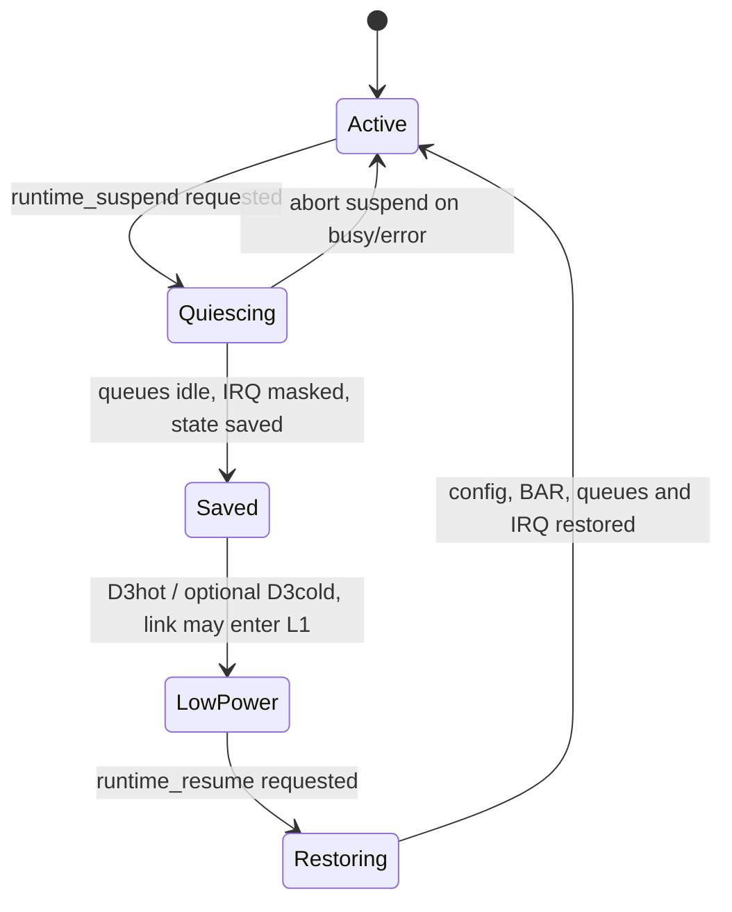
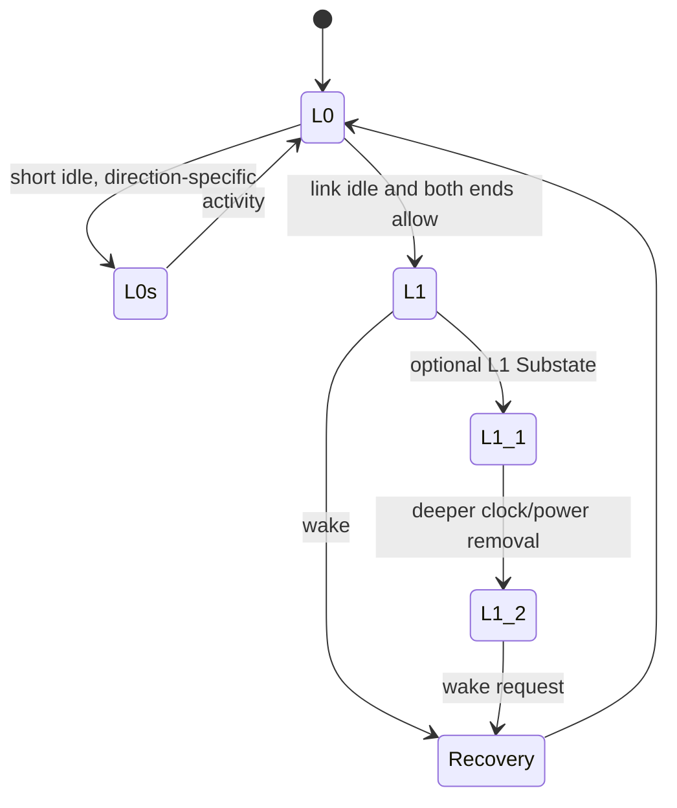
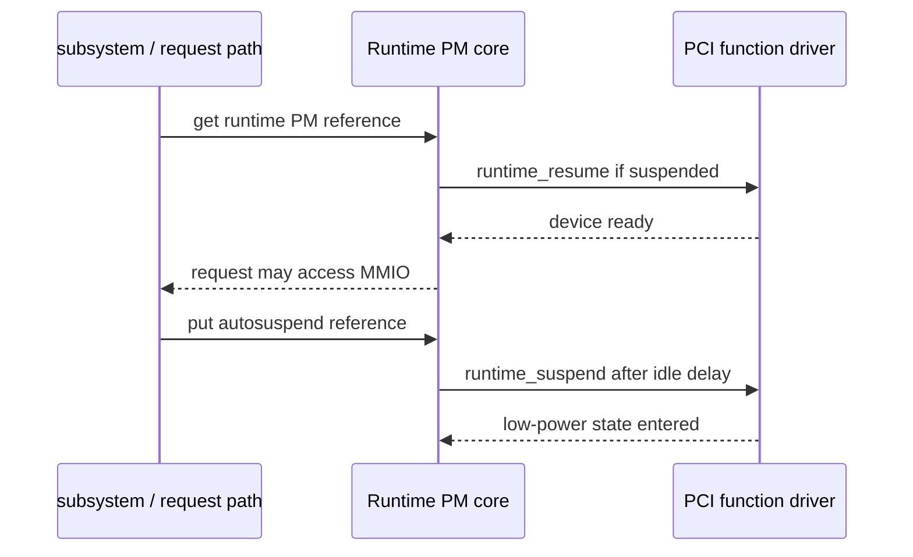

前几篇的数据路径默认设备始终处于可访问状态，但移动设备、嵌入式系统和服务器都不能让空闲 PCIe Function 永久保持全功耗。真正的问题是：设备没有请求时，Driver 怎样停止 Queue 和 DMA、降低 Function/Link 功耗，又怎样在下一个请求到来前完整恢复？

PCIe 电源管理难懂，常见原因是把两套状态混在一起。D0/D3hot/D3cold 描述 Function 电源与配置可访问性，L0s/L1/L1 Substates 描述 Link 空闲状态；Runtime PM 是 Linux 决定何时调用 Driver 的软件框架。三者协作，但不是同一个状态机。

本文固定 Linux 6.12，先沿一次 Runtime Suspend/Resume 建立主流程，再讲 PME、ASPM、L1SS 和 CLKREQ#。设备型号只作场景，不把某个平台的电源开关当成 PCIe 通用规则。

## 一、空闲设备为什么不能直接进入 D3

假设一个 PCIe 采集卡暂时没有用户请求。若 Driver 直接调用 `pci_set_power_state(pdev, PCI_D3hot)`，设备内部 DMA 可能仍在写 Host Memory，IRQ Handler 可能继续访问 BAR，Posted Stop Write 也可能还在 Root Complex 中排队。

因此低功耗不是单个 API，而是一条 Quiesce Contract：停止新提交、排空或取消在途请求、Mask IRQ、停止 DMA、Flush 必要 MMIO、保存设备私有状态，然后才改变 PCI 配置和平台电源。



因为任何新请求都可能打断 Suspend，所以 Runtime PM Usage Count、Driver Lock 和 Upper-Layer Queue State 必须先阻止并发进入。成功 Suspend 后，外部路径在 Resume 完成前也不能访问 MMIO。

## 二、D-State 描述 Function，不描述整条 Link

PCI Power Management Capability 为 Function 定义 D0、可选 D1/D2、D3hot，以及由平台实现的 D3cold 语义。它描述设备 Function 的功耗与配置可访问性，不等于 Root Port 和 Link 已进入某个 ASPM State。

| Function State | 典型含义 | 配置访问 | Driver 关注点 |
| --- | --- | --- | --- |
| D0 | Fully on | 可访问 | 正常 BAR、DMA、IRQ |
| D1/D2 | 可选中间状态 | 取决于能力 | 现代驱动较少直接使用 |
| D3hot | Auxiliary/低功耗，主电源仍在 | 标准配置通常可访问 | BAR/业务状态可能丢失 |
| D3cold | Function 主电源移除 | 通常不可访问 | 返回常需平台上电和重新枚举式恢复 |

PMCSR 位于 PM Capability，包含 Power State、PME Enable/Status 等标准字段。Driver 可以借助 `pci_set_power_state()`，但不能假设写 PMCSR 就完成所有板级时钟、Regulator 和 Reset 操作；平台 Firmware/ACPI/Device Tree/Controller 仍可能参与。

`pci_save_state()` 保存 PCI Core 关心的配置状态，`pci_restore_state()` 恢复这部分内容。它们不会保存设备私有 Ring、Firmware、Queue Producer 或加密上下文，因此 Driver 必须另外维护自己的 Suspend State。

## 三、D3cold 是电源移除，不只是更深的 PMCSR 值

D3cold 通常意味着 Function 的主电源被移除，配置空间也可能不可访问。它不是简单向 PMCSR 写入一个新的两位编码；进入和退出依赖平台电源资源、Parent Bridge、Hotplug/Presence 和辅助电源能力。

因为配置空间可能消失，所以 D3cold 期间读取 Vendor ID 可能得到全 1。Explorer、Error Path 和 Resume 不能把这个结果立即解释为永久拔卡，应结合 Runtime PM/ACPI/Platform Power State 判断。

退出 D3cold 后，Function 可能像经历一次复位：BAR/Command/MSI 状态和设备私有寄存器需要恢复，Link 也要重新训练。若驱动只调用 `pci_restore_state()` 而不重建 DMA Ring 和 IRQ Routing，业务仍会失败。

## 四、Link State 由 ASPM 管理

Active State Power Management（ASPM）在 Link 空闲时让 Port 进入 L0s、L1 或 L1 Substates。它与 Function D-State相互影响，但 Link 可以在 Function 仍为 D0 时进入低功耗，也可能因下游多个 Function 活跃而保持 L0。



L0s 唤醒较快、节能较浅；L1 更深，退出延迟更高。L1.1/L1.2 可以进一步关闭 Common Mode、PLL/Reference Clock 等资源，因此需要更严格的 Port Capability、T_POWER_ON、CLKREQ# 和平台支持。

ASPM Policy 通常由 PCI Core/平台统一管理。功能驱动不应为了修复一个 Timeout 就永久关闭全系统 ASPM；可以用 Policy 切换做 A/B 对比，但最终要证明是 Link Power、设备恢复延迟、Reference Clock 还是 Driver Timeout Contract 的问题。

## 五、CLKREQ# 协调 Reference Clock 与唤醒

CLKREQ# 是 Endpoint 与平台协调 Reference Clock/低功耗退出的信号之一。在支持 Common Clock 和 L1 Substates 的设计中，设备可以请求保留或恢复时钟，平台据此管理 Clock Buffer。

若 Device Tree Pinmux、Board Pull、Clock Controller 或 Endpoint Capability 配置错误，链路可能在启用 L1SS 后无法稳定唤醒。表现可能是低负载才出现 Completion Timeout、Receiver Error、链路重新训练或设备消失。

因为 CLKREQ# 涉及电气和平台控制，所以 `lspci` 显示 L1SS Capability 不能证明板级信号已正确连接。Bring-up 需要同时核对原理图、Pin State、Clock 波形、Root Port/Endpoint Capability 和 Linux Policy。

## 六、PME 让低功耗 Function 请求唤醒

Power Management Event（PME）允许 Function 在某些 D-State 中请求系统或 Parent 恢复。PM Capability 表示哪些 State 支持 PME，PMCSR 控制 Enable 和 Status，平台再把事件路由到 Root Port/ACPI/Interrupt Path。

PME 只表示“需要唤醒”，不自动恢复设备业务状态。Resume 仍要上电、等待 Link/Configuration 可访问、恢复配置和私有寄存器，再开放请求。

若 PME Status 是 W1C，Driver/PCI Core 必须按规范清除。错误 Read-Modify-Write 可能遗漏并发事件；若先清状态后打开唤醒路径，也可能丢失一次唤醒，因此 Enable、Arm 和 Clear 的顺序要依据内核 PM Helper 和设备协议。

## 七、Runtime PM 用 Usage Count 管理软件可访问性

Runtime PM 允许设备在系统仍运行时根据使用情况 Suspend。上层在需要访问设备前通过 PM Runtime API 增加 Usage Count并触发 Resume，完成后再释放引用；Count 归零且 Autosuspend Delay 满足时，Core 调用 Driver `runtime_suspend()`。



Usage Count 是软件访问合同，不是硬件 Queue Depth。一个异步 Request 在提交后即使系统调用返回，也仍需要 PM Reference 直到 Completion 或取消，否则 Autosuspend 可能在 Device 仍 DMA 时发生。

Autosuspend Delay 要覆盖业务 Burst 和 Resume Cost。太短会在连续请求之间频繁进出低功耗，增加延迟和能耗；太长则损失空闲节能。正确值来自 Trace 和业务负载，不是从另一设备复制。

## 八、runtime_suspend() 按数据路径逆序停止

Driver Suspend 可以按以下顺序组织：

```text
prevent new submissions
  -> wait/cancel in-flight requests
  -> stop queues and DMA engine
  -> mask device interrupts
  -> flush posted stop writes
  -> synchronize IRQ/workers
  -> save device-private registers
  -> pci_save_state
  -> select wake/ASPM policy
  -> enter D3hot or allow D3cold
```

```c
/* Suspend 先收回 DMA/IRQ 所有权，再保存状态和进入 D3hot。 */
static int demo_runtime_suspend(struct device *dev)
{
    struct pci_dev *pdev = to_pci_dev(dev);
    struct demo_dev *demo = pci_get_drvdata(pdev);
    int ret;

    ret = demo_quiesce(demo);
    if (ret)
        return ret;

    demo_save_private_state(demo);
    pci_save_state(pdev);
    pci_clear_master(pdev);
    return pci_set_power_state(pdev, PCI_D3hot);
}
```

`runtime_suspend()` 可以返回 `-EBUSY` 或其他错误，表示当前不能安全 Suspend。因为失败时设备必须保持可用，所以 `demo_quiesce()` 若已部分停止，需要恢复到 Active 或只在确定无在途请求后才进入不可逆阶段。

## 九、runtime_resume() 不是简单逆序调用

Resume 先保证平台电源、Reference Clock、Link 和配置空间可访问，再恢复 PCI 状态与设备私有状态。典型顺序如下：

```text
power resources / link available
  -> set D0
  -> restore PCI config state
  -> enable device and bus master
  -> restore BAR-dependent private registers
  -> rebuild/reprogram DMA rings
  -> clear stale status
  -> restore IRQ routing and unmask
  -> reopen submissions
```

```c
/* Resume 先恢复配置和私有状态，最后才重新开放业务请求。 */
static int demo_runtime_resume(struct device *dev)
{
    struct pci_dev *pdev = to_pci_dev(dev);
    struct demo_dev *demo = pci_get_drvdata(pdev);
    int ret;

    ret = pci_set_power_state(pdev, PCI_D0);
    if (ret)
        return ret;

    pci_restore_state(pdev);
    pci_set_master(pdev);

    ret = demo_restore_private_state(demo);
    if (ret)
        return ret;

    return demo_restart(demo);
}
```

如果 Resume 失败，不能提前让上层看到 Active。Driver 应保持请求入口关闭，并向 PM Core 返回错误；必要时进入 Reset/Recovery，而不是在部分恢复状态继续运行。

## 十、System Suspend 比 Runtime Suspend 多系统级约束

System Suspend 面对整机睡眠、冻结任务、Wake Source 和 Parent/Child Device Ordering。Runtime Suspend 的 Quiesce Helper 可以复用，但不能假设两个回调完全相同：系统睡眠可能要求配置 PME、保存更多状态，Resume 还要处理固件重新配置或 Link 重新训练。

已 Runtime Suspended 的设备在 System Suspend 时不应重复执行破坏性停止。Linux PM Framework 提供状态判断和 Helper，Driver 需要设计幂等边界，而不是靠布尔值随意跳过。

Parent Bridge/Root Port 与 Endpoint 的 Suspend 顺序也重要。Child 必须先停止访问，Parent 才能关闭 Link/Clock；Resume 时 Parent 先恢复路径，Child 才能访问 Configuration/BAR。因此设备模型的父子关系会直接影响 PM 顺序。

## 十一、AER、Reset 与热插拔会打断 PM 状态机

AER Recovery 可能在 Active、Suspending 或 Suspended 状态发生。Error Handler 需要与 PM Lock/State 协调，避免一个路径恢复 Queue，另一个路径又关闭它。常见策略是先获得 Runtime PM Reference 或统一进入 Driver Recovery State。

Reset 会让设备私有状态丢失，D3cold 退出也可能具有类似效果。两者都应复用“重建硬件、Ring 和 IRQ”的 Helper，但触发原因和 PCI Core 调用顺序不同，不能把 `pci_restore_state()` 当成所有恢复的总代码。

Surprise Removal 时 Resume 可能读到全 1。此时应停止继续访问并进入移除处理，而不是无限重试唤醒；因为硬件已经不存在，延长 Timeout 只会拖延资源清理。

## 十二、怎样测量功耗而不把延迟问题误判为故障

有效 PM 验证同时记录 Runtime Status、Usage Count、Autosuspend 次数、D-State、LnkSta/ASPM、Resume Latency、业务 P99、AER 和链路 Recovery。只看到功耗下降，不能证明唤醒可靠；只看到一次 Timeout，也不能立即断言 ASPM 有缺陷。

```bash
DEV=/sys/bus/pci/devices/0000:01:00.0
cat "$DEV/power/runtime_status"
cat "$DEV/power/runtime_usage"
cat "$DEV/power/control"
lspci -s 0000:01:00.0 -vv
```

可用“ASPM/Runtime PM 开启与关闭”的对比缩小范围，但最终修复要落到具体状态和时间：哪个 Queue 未停、哪个 Vector 未 Mask、Link 从哪个 State 唤醒失败、T_POWER_ON/Clock 是否满足、Driver Timeout 是否覆盖设计延迟。

## 十三、常见误解与审查重点

现在应当能够区分 Function D0/D3hot/D3cold、Link L0/L1/L1SS 和 Linux Runtime PM，并解释它们可以组合而不是一一对应。还应能说明 `pci_save_state()` 只保存 PCI 配置，不保存私有 Ring/Firmware。

面对一次 Suspend，应能按“停止新提交 -> 排空 DMA -> Mask/同步 IRQ -> 保存私有/PCI 状态 -> 进入低功耗”描述；Resume 则先恢复访问路径和状态，最后开放请求。因为所有权尚未收回时不能断电，所以 PM 首先是数据路径问题，其次才是功耗 API。

## 十四、小结

PCIe PM 由 Function D-State、Link ASPM State 和 Linux PM Framework 协同完成。D3cold 可能让配置空间消失，ASPM/L1SS 依赖两端 Capability 与 CLKREQ#/Reference Clock，PME 只发起唤醒，真正 Resume 仍要重建设备。

下一篇将处理非计划的状态丢失：AER 如何报告 Correctable/Non-Fatal/Fatal Error，Driver 如何 Quiesce，FLR/Secondary Bus Reset/Hot Reset 怎样选择，以及 Recovery 回调怎样避免旧 DMA 和旧 Completion 污染新一代状态。

**一手资料**

- [Linux 6.12 PCI Power Management](https://www.kernel.org/doc/html/v6.12/power/pci.html)
- [Linux Runtime PM](https://docs.kernel.org/power/runtime_pm.html)
- [Linux PCIe ASPM documentation](https://docs.kernel.org/power/pci.html#native-pcie-power-management)
