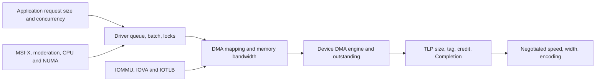
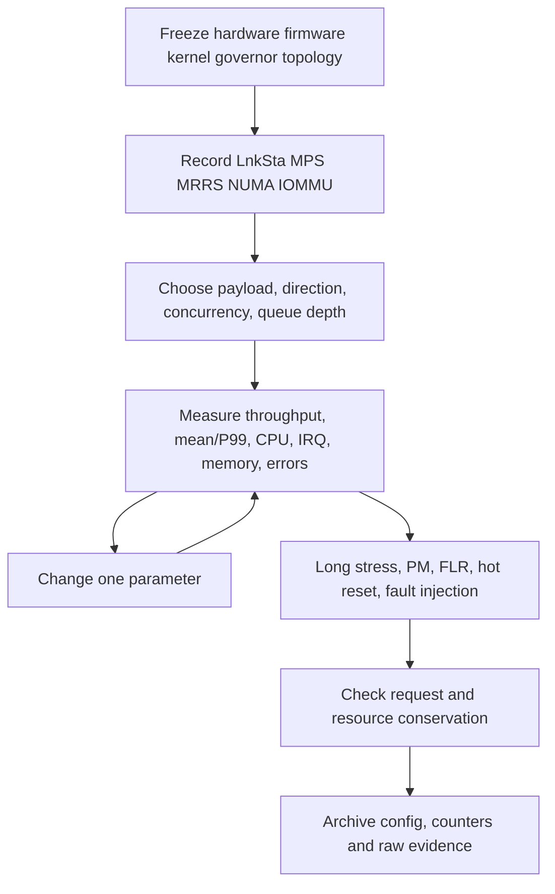
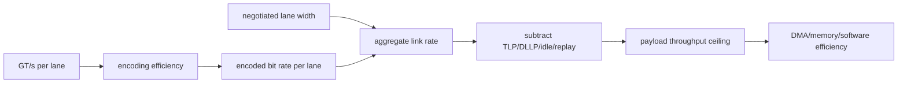
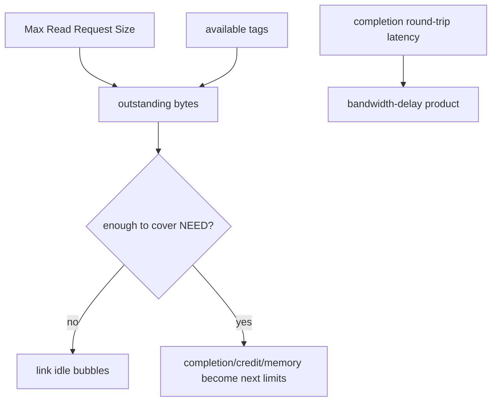
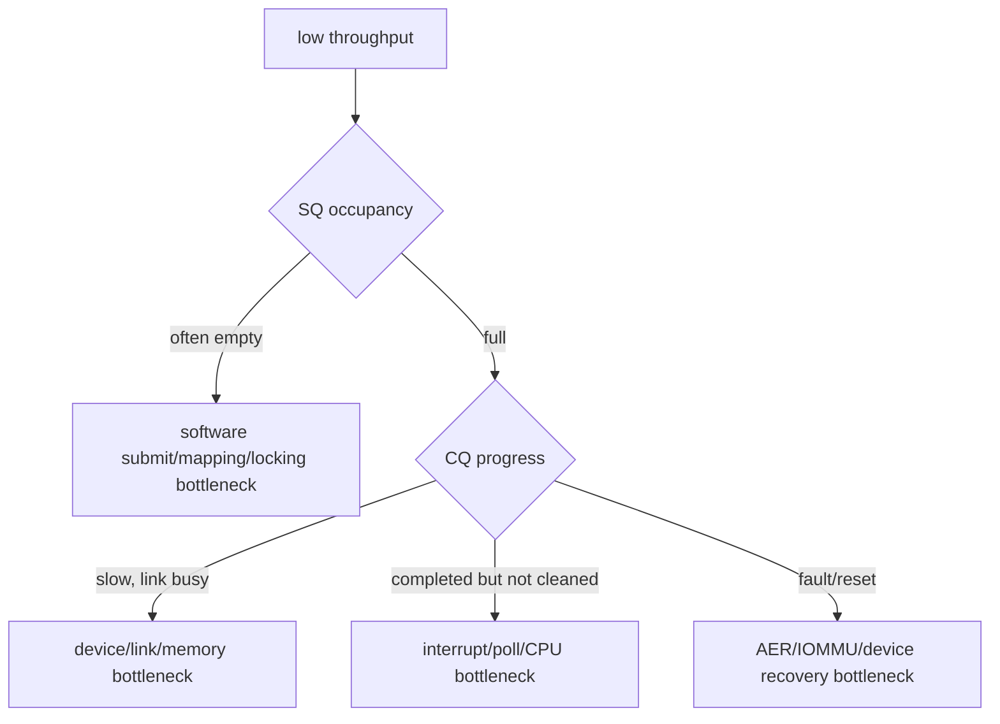

PCIe 性能不是“Gen × Lane”一个数字。链路只提供原始传输能力，业务数据还要经过 TLP、flow control、DMA、内存系统、队列、中断和 CPU。任一层出现空洞，实际吞吐都可能远低于标称值。

本文的 Linux 指标、PCIe Capability 和调优接口固定以 Linux 6.12 为基线。

稳定性也不是“压力跑一小时没崩”。驱动必须证明请求、DMA mapping、buffer、completion 和 reset 长期守恒，并同时观察 AER 与尾延迟。本篇不给特定硬件编造测试结果，而是建立可复用的测量方法。

## 一、先画出性能路径和每层可观察量



应用层观察 request size/concurrency/latency；驱动层观察 queue depth、batch、doorbell、inflight；DMA 层观察 mapping、内存带宽和 NUMA；事务层观察 MPS/MRRS/tag/credit；链路层观察 speed/width/AER；通知层观察 IRQ/completion、moderation 和 CPU。

只记录最终 MiB/s 无法定位。每次实验应保存这些中间指标，并一次只改变一个变量。

## 二、从 LnkSta 计算可达到的上限

先读取实际链路，而不是插槽丝印：

```bash
lspci -s BDF -vv | grep -E 'LnkCap|LnkSta'
```

`LnkCap` 是 Port 能力，`LnkSta` 是本次协商结果。目标 Gen4 x4 若实际 Gen3 x1，软件队列不可能补回物理能力。还要检查是否降宽/降速、Equalization 和 AER correctable error。

理论计算分三步：

1. `GT/s × encoding efficiency × lane count` 得到编码后 bit rate。
2. 扣除 TLP header、LCRC、DLLP、ACK/flow-control、SKP 等协议开销。
3. 再乘业务中有效 payload 比例，并考虑方向和读 Completion。

一个 256-byte Memory Write 的 header 比例低于 32-byte Write。Memory Read 还产生 Request 与一个或多个 Completion，吞吐受往返时延和 Completion 边界影响。报告应注明 payload size 和 read/write 方向。

### 用公式拆开编码与 TLP 效率

以 Gen3 为例，单 Lane 编码后 bit rate 是 `8 GT/s × 128/130`；x4 再乘 4。若只估算连续 Memory Write，单个 packet 的有效率可近似写成：

```text
payload_efficiency = payload_bytes /
    (payload_bytes + TLP_header + ECRC_optional + LCRC + framing_share)
```

3DW/4DW Header、地址宽度、tag/attribute、是否有 ECRC 会改变开销。ACK/DLLP/SKP 不是每个 TLP 固定附加，适合在较长时间窗摊销，而不是硬塞进单包常量。

Read 更复杂：Request 本身无大 payload，Completion 受 MPS/RCB/remaining byte count 拆分。若 Request 4096 bytes、MRRS 4096，但 Completion MPS 256，则仍需要多个 Completion TLP；增大 MRRS 只减少 Request 数，不会突破 Completion 端限制。

理论值用于建立上限，不用于替代测量。协议 analyzer/Device counter 可观察 TLP size、replay、credit stall；没有这些计数时，用 payload sweep（32B 到大块）和 read/write 对比反推固定开销与 RTT 限制。

## 三、MPS、MRRS、RCB、tag 和 credit 决定事务效率

Max_Payload_Size（MPS）限制单个带数据 TLP 的最大 payload。路径中所有 Port 都要支持当前值，系统通常选择兼容值。增大 MPS 可降低 header 比例，但增加接收 buffer 占用和 replay 成本，不保证所有 workload 更快。

Max_Read_Request（MRRS，对应 Linux 输出常见 `Max_Read_Request`）限制一个 Memory Read Request 的长度。大 Read 可能被多个 Completion 拆分；Root Completion Boundary（RCB）、MPS 和 remaining byte count 决定拆分。

Device 用 tag 区分多个 outstanding Read。若只允许一个 outstanding，请求必须等待 Completion RTT，链路会出现空闲；增加 tag 深度可隐藏延迟，直到 non-posted credit、Completion credit、内部 buffer 或内存带宽成为限制。

Flow-control credit 分 Posted/Non-Posted/Completion 的 Header/Data。某类 credit 耗尽时，该类事务停发。链路利用率低但 tag/credit 满，问题不在 Lane；需要设备或协议 analyzer counter。

不要在生产系统用 `setpci` 盲改 MPS/MRRS。修改前确认整条拓扑能力和设备限制，实验后记录原值并恢复。

### Outstanding 深度如何隐藏 Read RTT

粗略关系是 `required_outstanding_bytes >= target_bandwidth × round_trip_latency`。例如要维持给定带宽，RTT 越大，需要同时在途的 Read bytes 越多；它由 MRRS × outstanding request 数组成，再受 tag/NPH/Cpl credit 限制。

实际 Device 还可能按 queue、Function 或 traffic class 分配 tag。只增加软件 queue depth，不增加硬件 outstanding，无法隐藏 RTT；反过来硬件能发很多 request，但 Host completion buffer/内存系统不足，也会 credit stall。

测量应同时记录 outstanding high watermark、tag stall、NPH/Cpl credit stall、Completion latency 分布。没有这些硬件计数时，逐步增加 request concurrency，观察吞吐何时饱和、P99 何时恶化，并结合 CPU/内存指标排除软件瓶颈。

## 四、Queue depth、batch 和 doorbell 控制软件空洞

queue depth 太浅，设备在 CPU 调度间隔内耗尽 SQ；太深会增加排队和 reset 停止成本。初始值可由吞吐 × 最坏补充延迟估算，再根据 queue idle/high watermark 调整。

批量填多个 descriptor 后一次 `dma_wmb()` 和 doorbell，可减少 MMIO 与 barrier。completion 也可按 budget 批量回收。每请求一次 doorbell、每 completion 一次 IRQ，会让小事务开销占主导。

背压必须可见：SQ full 时阻塞/`-EAGAIN`，记录 full duration；不能无限堆积内核 request。队列更深可能提高 benchmark 吞吐，却把 P99 延迟藏进排队时间。

## 五、MSI-X、interrupt moderation、CPU 和 NUMA

多队列设备通常 queue-vector-CPU 对齐。IRQ、poll worker 和 buffer 在同一 NUMA node，可减少 cache line migration 和远端内存访问。

```bash
cat /proc/interrupts
cat /sys/bus/pci/devices/BDF/numa_node
numactl --hardware
```

interrupt moderation 按 completion count、timer 或二者触发。增大阈值降低 IRQ/CPU、提高 batch，但增加低负载和 P99/P999 延迟。每次调参同时记录 completions/IRQ、poll budget exhausted、平均/P99、CPU 和 queue backlog。

管理/实时 queue 可使用低延迟 vector，批量数据 queue 使用较强 moderation。自适应算法要防止负载边界震荡。

IRQ affinity 不是一次配置完成。irqbalance、CPU hotplug 和容器/cpuset 都可能改变有效 CPU。压测前保存 `/proc/interrupts`，压测中采样每 vector 增量和 poll CPU；若数据 queue 在 NUMA node 1 而 IRQ/worker/buffer 在 node 0，远端访问可能成为瓶颈。

## 六、DMA mapping、IOMMU、IOTLB 和内存系统

每个小 buffer 单独 map/unmap 会产生 IOMMU page-table/IOTLB invalidation 和锁开销。buffer pool、scatter-gather 合并、大页或长期 mapping 可以减少开销，但扩大 pinned memory 与访问窗口。

SWIOTLB bounce 会复制数据；远端 NUMA memory、内存控制器带宽、cache line false sharing 都可能先于 PCIe Link 饱和。使用 memory bandwidth/perf 与 IOMMU 日志区分。

零拷贝不等于零成本。用户页 pin、mmap queue、IOMMU mapping、权限校验和生命周期都会增加复杂度。优化必须同时报告 CPU、内存、P99 和故障恢复。

## 七、可复现实验和稳定性闭环



稳定性测试不只跑固定大包。交替 payload、并发、queue depth、runtime PM、FLR/hot reset、IOMMU fault、进程异常退出和 device remove。每轮结束检查：

- `submitted = completed + failed`；
- inflight、DMA mapping、buffer pool 回到基线；
- IRQ/work/timer 无残留；
- reset 后旧 generation completion 不进入新请求；
- AER Correctable/Non-Fatal/Fatal 计数与业务错误关联。

AER correctable 持续增长可能预示 signal margin/replay，即使业务尚未失败；Completion Timeout、Surprise Down、Malformed TLP 必须关联发生时 Link/queue/reset 状态。性能验收应包含错误率、恢复时间和连续运行时间。

### 一组可执行的测量记录

```bash
lspci -vv -s BDF > before-lspci.txt
cat /proc/interrupts > before-irqs.txt
numactl --hardware > numa.txt
perf stat -e cycles,instructions,cache-misses \
    -- ./pcie_workload --size 4096 --queues 4
dmesg | grep -Ei 'aer|pcie|iommu|timeout' > errors.txt
```

工作负载本身应输出 payload、方向、并发、queue depth、batch、moderation、submitted/completed/failed 和 latency histogram。只保存控制台“平均带宽”无法复现实验。

长压后再次保存 lspci/AER/IRQ/驱动 counters，计算差值。若吞吐稳定但 Correctable Error/Replay 增长，性能结果不能判为通过；若平均延迟正常但 P99 在 reset/PM 时失控，也要单独呈现。

**参考资料**

- [PCI Express Bus Performance HOWTO](https://docs.kernel.org/PCI/pciebus-howto.html)
- [How To Write Linux PCI Drivers](https://docs.kernel.org/PCI/pci.html)
- [PCI-SIG Specifications](https://pcisig.com/specifications)

## 八、从编码速率估算单向上限

先按代际编码效率计算每 Lane 有效 bit rate，再乘协商 Width。

Gen1/2 使用 8b/10b，Gen3+ 使用 128b/130b。

这仍只是 Data Link 可用 bit 上限，未扣除 TLP Header、LCRC、DLLP、SKP、Replay 与协议空洞。



必须使用 `LnkSta` 的 Current Speed/Width，不用设备/插槽标称最大值。

## 九、TLP Payload 越小，固定开销比例越高

Memory Write TLP 有 Header、可选 ECRC、LCRC 与链路 framing。

32-byte Payload 与 256-byte Payload 使用相近 Header，前者效率明显更低。

MPS 决定单 TLP 最大 Payload，但设备/Driver 是否真的形成大 TLP 还取决于 DMA Burst、Address Alignment、4 KiB Boundary 和 Request 合并。

设置更大 MPS 可能提高效率，也可能超过路径某组件能力或增加单包阻塞。

Linux PCI Core 根据路径能力配置，功能驱动不应擅自把一个 Endpoint 调到超过上游的值。

## 十、MRRS、Tag 与 Outstanding Read 形成带宽时延积

Non-Posted Read 必须等待 Completion。

要填满高带宽高 RTT Link，需要足够 Outstanding Bytes：

```text
outstanding_bytes >= target_bandwidth * round_trip_latency
```

MRRS 限制单个 Read Request Size。

Tag 数限制同时在途 Request 数。

Completion Credit 与 Completer 能力限制返回。



盲目增大 MRRS 不一定改善性能。

如果 Device 只能少量 Tag、Host Completion 分片或 Memory Latency 高，仍会有空洞。

## 十一、RCB 与 Completion 分片

Read Completion Boundary（RCB）影响 Completer 拆分 Completion 的边界。

Completion 还受 MPS、Byte Count、4 KiB Boundary 和内部缓冲限制。

Requester 必须能接受合法分片与乱序规则。

性能分析应统计平均 Completion Payload，而不是只看 Request Size。

## 十二、Queue Occupancy 能指出软件还是链路空洞

同时记录：

- SQ Occupancy。
- CQ Batch Size。
- Doorbell 次数。
- DMA Engine Busy。
- Link Utilization。
- Interrupt/NAPI Poll Rate。



只看 CPU Utilization 无法区分这些层。

## 十三、Doorbell Batch 与 Interrupt Moderation 的双向批处理

提交侧把多个 Descriptor 一次 Doorbell，减少 MMIO。

完成侧把多个 CQ Entry 一次 IRQ/Poll，减少中断。

两者都会增加等待凑批的延迟。

高吞吐离线任务可使用较大 batch。

交互/控制请求应保留低延迟通道或 flush 条件。

混合负载最好按 Queue/Traffic Class 区分，而不是全设备一个参数。

## 十四、NUMA、IOMMU 与内存带宽

PCIe Device 连接某个 NUMA Node。

Ring、Payload、IRQ CPU 和处理线程远离该 Node，会跨 Socket/Interconnect 搬运。

IOMMU Mapping/IOTLB 与 SWIOTLB Bounce 也会增加开销。

大块顺序 DMA 可能最终受 Memory Controller 带宽限制，而不是 PCIe Link。

记录 `numactl`/sysfs locality、Memory Bandwidth、IOMMU Fault/PMU 与 CPU Cache Miss。

## 十五、稳定性指标与 P99

除了平均吞吐，至少记录：

- P50/P95/P99/P99.9 latency。
- Timeout/Reset 次数。
- AER Correctable/Uncorrectable 增量。
- IOMMU Fault。
- Queue Full/Backpressure 时间。
- Link Retrain/Speed Downgrade。
- Interrupt Rate 与 CPU Softirq。
- 24h/72h 数据校验错误。

平均值可以掩盖每几分钟一次的恢复停顿。

产品验收要把错误率和尾延迟纳入性能目标。

## 十六、一手资料

- [Linux 6.12 PCI driver API](https://www.kernel.org/doc/html/v6.12/driver-api/pci/pci.html)
- [Linux PCIe AER](https://docs.kernel.org/PCI/pcieaer-howto.html)
- [Linux stable PCI source](https://git.kernel.org/pub/scm/linux/kernel/git/stable/linux.git/tree/drivers/pci?h=linux-6.12.y)
- [PCI-SIG specifications](https://pcisig.com/specifications)

## 十七、小结

PCIe 性能由实际 Link、TLP 开销、MPS/MRRS、tag/credit、outstanding、Ring、doorbell、MSI-X、CPU/NUMA、DMA/IOMMU 和内存系统共同决定。任何调优都必须有分层指标。

稳定性则要求 AER、timeout、reset 和资源守恒同时成立。下一篇将把这些指标变成从电气到 DMA 的故障决策树。
