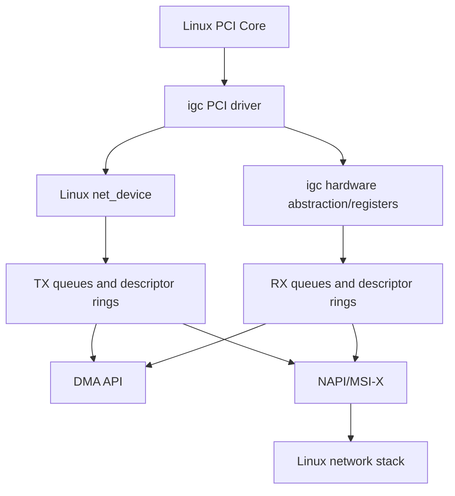
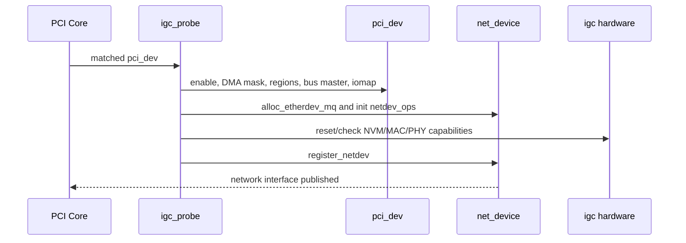
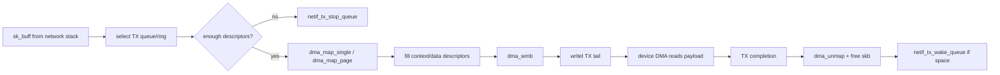
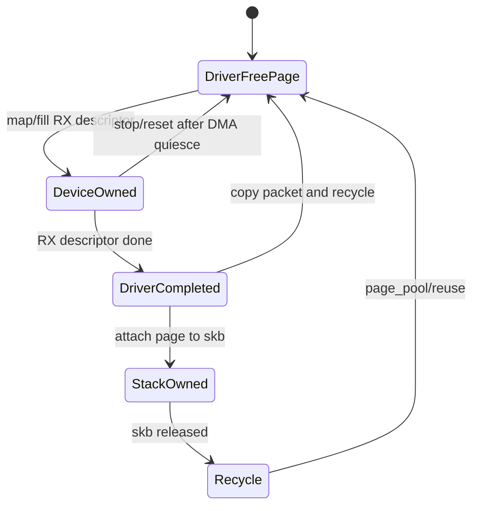
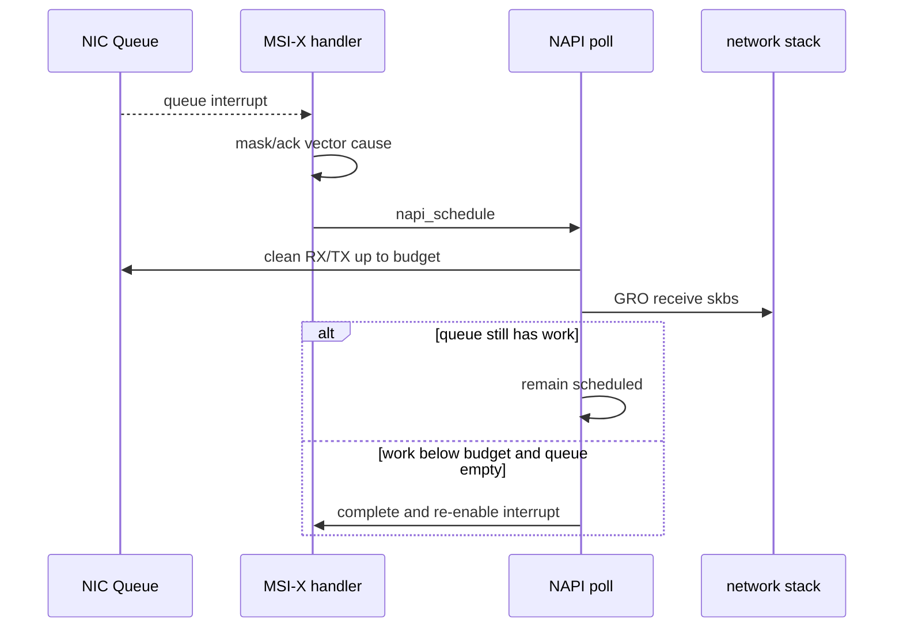

PCIe Driver 框架、DMA Ring 和 MSI-X 如果只停留在教学伪设备，很难看到它们如何与成熟内核子系统结合。

网络驱动是最完整的公开范例之一：

- PCI Function 负责 BAR、DMA Mask、IRQ 与 PM。
- `net_device` 负责用户可见网络接口和 Queue 状态。
- Descriptor Ring 负责 Device/CPU 所有权。
- `sk_buff` 与 page 负责网络数据内存。
- NAPI 在中断与轮询之间平衡吞吐。
- MSI-X 把 Queue 分散到 CPU。
- AER/reset/remove 必须关闭全部异步路径。

本文固定阅读 Linux `v6.12` tag 的 `drivers/net/ethernet/intel/igc/`。

它不是 igc 寄存器手册，也不复制整份源码；重点是提炼可迁移的对象、状态和调用链。

## 一、先区分通用机制与 igc 私有实现

通用 PCIe NIC 机制：

- `pci_driver` probe/remove。
- BAR MMIO。
- coherent Descriptor Ring 与 streaming Payload DMA。
- MSI-X Multi-queue。
- NAPI Poll。
- `net_device` 注册、Queue Stop/Wake。
- PM 与 AER 恢复。

igc 私有内容：

- 具体 Device ID。
- Register Offset 与 bit 定义。
- Descriptor Format。
- Hardware MAC/PHY/NVM 操作表。
- Queue 数上限与 Offload Capability。
- Reset/Link 配置细节。

阅读时不要把 `igc_*` 函数名当作所有网卡统一 API。

要看它在哪个通用 callback 中实现什么合同。

## 二、pci_device_id 是 Function 匹配入口

驱动提供 `struct pci_device_id igc_pci_tbl[]`，列出支持的 Intel Device ID。

`MODULE_DEVICE_TABLE(pci, ...)` 生成模块 alias。

PCI Core 匹配后调用 `igc_probe(struct pci_dev *pdev, const struct pci_device_id *ent)`。

匹配成功只证明 Device ID 受支持。

probe 仍要验证 DMA、BAR、MAC/NVM、Queue 与中断资源。

真实产品 Driver 还可能根据 `driver_data` 选择不同 Hardware Variant/Info Table。

## 三、igc_probe 建立 PCI 与 netdev 两棵对象关系

probe 大致完成：

1. 启用 PCI Memory Resource。
2. 设置 DMA Mask。
3. 请求 BAR Region。
4. 设置 Bus Master。
5. 分配 multi-queue `net_device`。
6. 建立 adapter 私有对象并关联 `pdev`/`netdev`。
7. 映射 BAR。
8. 初始化硬件操作、MAC/NVM/PHY。
9. 选择 Queue/Interrupt 方案。
10. 注册 netdev。

用户空间能看到网卡的发布点是 `register_netdev()`。

在它之前所有私有对象、锁、work、Queue Count 和基础 Hardware State 必须完整。

## 四、adapter 把 pci_dev、net_device 与硬件状态连接

Intel Driver 常使用 adapter 私有结构保存：

- `struct net_device *netdev`。
- `struct pci_dev *pdev`。
- Hardware abstraction object。
- TX/RX Ring 数组。
- Queue Vector/NAPI。
- Interrupt Capability。
- Watchdog/Reset Work。
- Link/Stats/Feature 状态。

`pci_set_drvdata(pdev, netdev)` 或等价关联让 PM/remove 从 `pdev` 找到网络对象。

`netdev_priv(netdev)` 找到 adapter。

对象关系是双向导航，但最终释放顺序必须单一。

通常 remove 通过 `pdev` 得到 netdev，注销后释放 netdev，adapter 随之释放。

## 五、BAR 映射只给出寄存器入口

Driver 使用 PCI Resource API 请求并映射 Memory BAR。

映射得到 `void __iomem *`，寄存器访问使用 `readl()`/`writel()` 等 MMIO accessor。

不能普通解引用。

posted write 可能需要后续 read flush，具体由硬件寄存器合同决定。

BAR 正确映射不代表 Device 已就绪。

还要完成 reset、NVM 校验、MAC Address、PHY、Queue 和 Interrupt 初始化。

## 六、net_device 把驱动接入网络栈

`net_device` 包含：

- `netdev_ops`：open/stop/start_xmit/set_features 等。
- `ethtool_ops`：Link/统计/Ring/Coalesce 等管理。
- Hardware Feature 与当前 Feature。
- TX Queue 与 Traffic Control 状态。
- MAC Address、MTU、Watchdog。

`ndo_open` 才真正分配/启动运行时 Ring、请求 IRQ 并打开 Device。

probe 不一定让数据面长期运行。

这一区分支持 Interface administratively down 时节省资源和功耗。

## 七、ndo_open 的发布顺序

典型 open：

1. 分配 TX/RX Ring Resource。
2. 配置 Queue DMA Base/Length/Head/Tail。
3. 分配 MSI-X/IRQ 与 Queue Vector。
4. 启用 NAPI。
5. 配置 MAC/PHY/Offload。
6. 启动 RX/TX Unit。
7. 开中断。
8. 启动 Network TX Queue。

任一步失败按逆序释放。

上层 Queue 必须最后开放，避免 `ndo_start_xmit` 进入半初始化 Ring。

## 八、TX 数据路径从 skb 到 Descriptor

网络栈调用 `ndo_start_xmit(struct sk_buff *skb, struct net_device *dev)`。

驱动选择 TX Ring，检查剩余 Descriptor，分析 Offload，上 DMA Mapping，填写 Descriptor，执行 Barrier，更新 Tail/Doorbell。

`skb` 可能有线性 head 和多个 fragment。

每个 DMA Mapping 都要记录，以便 completion 或错误回滚逐一 unmap。

## 九、TX Descriptor 与 skb 所有权

`ndo_start_xmit` 返回 `NETDEV_TX_OK` 后，驱动拥有 skb，最终必须释放。

如果 Ring 资源不足，正确做法通常是提前 stop Queue，仍按网络驱动合同处理返回。

不要接受 skb 后在 Mapping 失败时泄漏。

Driver 常在某个末尾 Descriptor 的 software buffer_info 保存 skb 指针和时间戳。

Device 更新完成状态后，Clean Path：

- `dma_unmap_*`。
- 累计 bytes/packets。
- `dev_kfree_skb_any()` 或合适释放。
- 清 software metadata。
- 推进 next_to_clean。

在 Device 完成前 CPU 不能释放/改写 Payload。

## 十、TX Queue Stop/Wake 是 Ring 背压

Ring 剩余 Descriptor 低于一个最大 skb 所需数量时，驱动停止该 `netdev_queue`。

停止后要重新检查空间，处理 stop 与 completion 并发，避免 Lost Wakeup。

Completion 清出足够空间后 wake Queue。

这把硬件 Ring Capacity 传播给网络栈。

只在完全 Ring Full 后才 stop 可能已经来不及容纳多 fragment skb。

阈值应考虑 Context Descriptor、TSO Fragment 和安全余量。

## 十一、RX Ring 先准备可 DMA 的 Buffer

RX 路径由 Driver 预先给 Descriptor 填 DMA Address。

设备收到 Frame 后 DMA 写入 Buffer，并更新 Descriptor Status/Length。

驱动在 NAPI Poll 中：

1. 检查 Descriptor 完成标志。
2. `dma_rmb()` 后读取长度/状态。
3. 同步或解除 DMA Mapping。
4. 构造/填充 skb。
5. 设置 protocol、checksum、VLAN、RSS hash 等 metadata。
6. 交给 GRO/Network Stack。
7. 补充新的 RX Buffer。

RX Ring 缺 Buffer 会导致丢包，即使链路与中断都正常。

## 十二、page 与 skb 的关系

现代 RX Driver 常使用 page-based buffer，而不是每包提前分配完整 skb。

一个 Page 可通过 page_pool/复用策略承载一个或多个接收片段。

收到数据后 Driver 可能：

- 构造小 skb 并复制小包。
- `build_skb()`/fragment 方式让 skb 引用 Page。
- 为大包、多 Buffer Frame 组装 frags。

Page 所有权在 Device DMA、Driver、skb/Network Stack 和回收池之间迁移。

具体 igc 版本的 RX Buffer 实现应以 `v6.12` 源码为准。

不要把其他 Driver 的 page_pool 细节硬套到 igc。

## 十三、NAPI 为什么替代每包中断

每个 Packet 一个硬中断会在高 Packet Rate 下耗尽 CPU。

NAPI 模式：

1. MSI-X Handler 确认 Queue Event，屏蔽/延迟该 Queue Interrupt。
2. `napi_schedule()`。
3. Poll 按 budget 清 RX/TX Completion。
4. 若工作未清完，继续 Poll，不立即开中断。
5. 若少于 budget 且队列清空，`napi_complete_done()` 并重开中断。

NAPI budget 通常限制 RX 工作，TX Clean 也要避免无限占用 Poll。

## 十四、MSI-X Queue Vector 的组织

MSI-X 允许多个向量。

Driver 可让 Queue Pair 绑定一个 Vector/NAPI，并另设 Misc/Link Vector。

Queue Vector 常保存：

- RX/TX Ring 指针。
- NAPI Object。
- IRQ Number。
- Interrupt Moderation 参数。
- CPU Affinity 信息。

RSS/Flow Steering 把流分散到多个 RX Queue。

XPS 影响 TX Queue 选择。

IRQ Affinity 与 NUMA 应让 Queue、CPU 和内存尽量接近。

## 十五、中断调节在吞吐与延迟间权衡

Interrupt Moderation/ITR 让设备累计一批 Completion 后再中断。

调节高：中断少、吞吐好、延迟增加。

调节低：延迟低、中断率和 CPU 开销高。

igc 包含自己的 ITR 策略与寄存器实现。

通用工程方法是测量 Packet Size、Queue Load、IRQ Rate、NAPI Budget、P50/P99 与 CPU 利用率。

不能复制另一个 NIC 的固定寄存器值。

## 十六、Watchdog 与 Hang Detection

Network Core 的 TX Watchdog 和 Driver 自己的统计/work 可检测 Queue 长期不前进。

Hang 可能来自：

- Doorbell/Descriptor 内存序。
- Link Down。
- Device DMA/Firmware 停止。
- MSI-X 丢失但 Descriptor 已完成。
- IOMMU Fault。
- Queue State/Head Tail 异常。

恢复前要停止 Queue 与 DMA，不能直接 free skb/Ring。

reset 后旧 skb 必须明确失败/释放，不能等不存在的 Completion。

## 十七、ndo_stop 的逆序拆卸

Interface down 时：

1. `netif_tx_stop_all_queues()`。
2. 停止 Device RX/TX/DMA。
3. 屏蔽中断。
4. `synchronize_irq()`。
5. 禁用 NAPI 并等待 Poll 结束。
6. 清理 TX 未完成 skb 与 DMA Mapping。
7. 回收 RX Buffer/Page。
8. 释放 IRQ、Ring 与 Queue Vector。

停止顺序确保没有 IRQ/NAPI 在 Ring 释放后继续访问。

## 十八、PM 要同时处理 netdev 与 PCI State

Suspend 前检查 netdev 是否 running。

若 running，执行类似 stop 的数据面 quiesce，配置 WoL/PME。

保存 PCI State、关闭 Device、进入目标 D-state。

Resume 后恢复 PCI Configuration/BAR/Bus Master，重置 Device 私有状态，若 netdev 原来 running 再重建 Ring/IRQ/NAPI。

只 `pci_restore_state()` 不会恢复 NIC Descriptor Base、RSS、MAC Filter 与 PHY State。

## 十九、AER 与 reset 如何进入网络驱动

igc/同类驱动可通过 `pci_error_handlers` 参与 AER 恢复。

`error_detected` 停止 netdev Queue 与数据面。

frozen 时避免依赖 MMIO。

`slot_reset` 恢复 PCI enable/bus master 与硬件。

`resume` 重新开放网络接口。

Reset Generation 用于隔离旧 Completion/Watchdog Work。

若恢复失败，应让 netdev 保持 detached/down，而不是继续接收 skb。

## 二十、remove 与 shutdown 的区别

remove 用于 Driver Unbind/Hotplug：

- `unregister_netdev()` 阻止新网络操作并触发 stop。
- 取消 reset/watchdog/service work。
- 释放硬件与 PCI 资源。
- unmap BAR、release regions、disable device。
- free netdev/adapter。

shutdown 用于重启/关机。

它要让 Device 停止 DMA，并根据 WoL/平台策略留下合适状态，但对象内存未必立即释放，因为内核进程即将结束。

Kexec 场景尤其要求旧 Device 不再 DMA 到新内核未拥有的内存。

## 二十一、源码阅读路线

固定 Linux `v6.12`：

1. `igc_main.c`：PCI probe/remove、netdev ops、Ring 与 NAPI 主路径。
2. `igc.h`：adapter/ring/q_vector 等对象。
3. `igc_hw.h` 与硬件文件：Variant 和寄存器操作。
4. `igc_ethtool.c`：管理面与 Ring/Coalesce 配置。
5. `igc_ptp.c`：时间戳作为扩展专题。

每读一个函数，回答：

- 当前对象由谁拥有。
- DMA Mapping 何时建立/解除。
- Queue Stop/Wake 条件是什么。
- 哪个 callback 是用户可见发布点。
- error/remove 如何取消异步路径。

## 二十二、一手资料

- [Linux v6.12 igc source](https://git.kernel.org/pub/scm/linux/kernel/git/torvalds/linux.git/tree/drivers/net/ethernet/intel/igc?h=v6.12)
- [Linux 6.12 NAPI documentation](https://www.kernel.org/doc/html/v6.12/networking/napi.html)
- [Linux network driver documentation](https://docs.kernel.org/networking/driver.html)
- [Linux 6.12 PCI driver API](https://www.kernel.org/doc/html/v6.12/driver-api/pci/pci.html)
- [PCI-SIG specifications](https://pcisig.com/specifications)

## 二十三、小结

Linux `v6.12` 的 igc 展示了 PCIe NIC 从 Function 到网络栈的完整数据路径。

probe 建立 PCI Resource、BAR、DMA Capability、adapter 与 `net_device`，`register_netdev()` 是用户可见发布点。

TX 路径把 skb 映射成 Descriptor，Doorbell 前需要正确内存序，Completion 负责 unmap 和释放 skb。

RX 路径预投 Page/Buffer，Device DMA 后由 NAPI 构造 skb 并交给 GRO/Network Stack。

Queue Stop/Wake 把 Ring 背压传给网络栈。

MSI-X、Queue Vector、NAPI 和 Interrupt Moderation共同决定多核吞吐与尾延迟。

PM、AER、ndo_stop、remove 和 shutdown 都必须先停止 DMA/IRQ/NAPI，再释放 Ring 与 skb/page。

可迁移的知识是对象所有权和 callback 合同；igc 的寄存器、Descriptor 与 Hardware Variant 只能用于理解 igc 本身。
