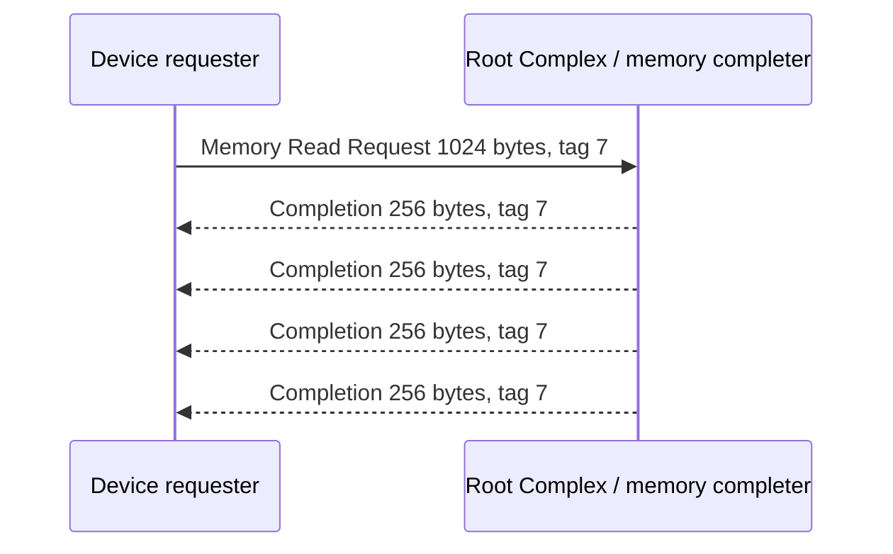
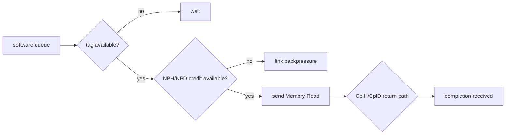
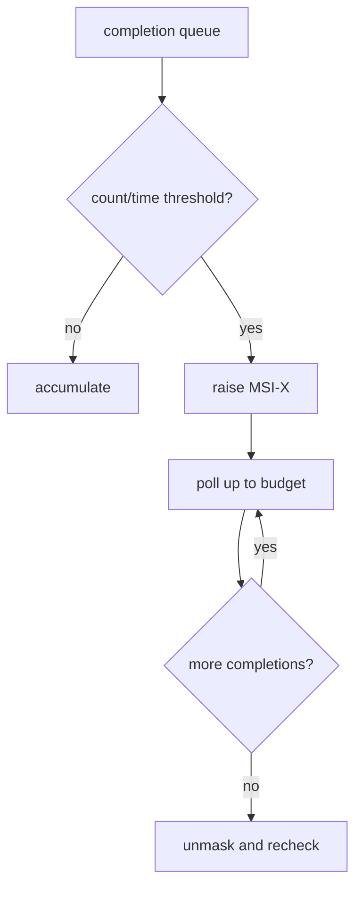
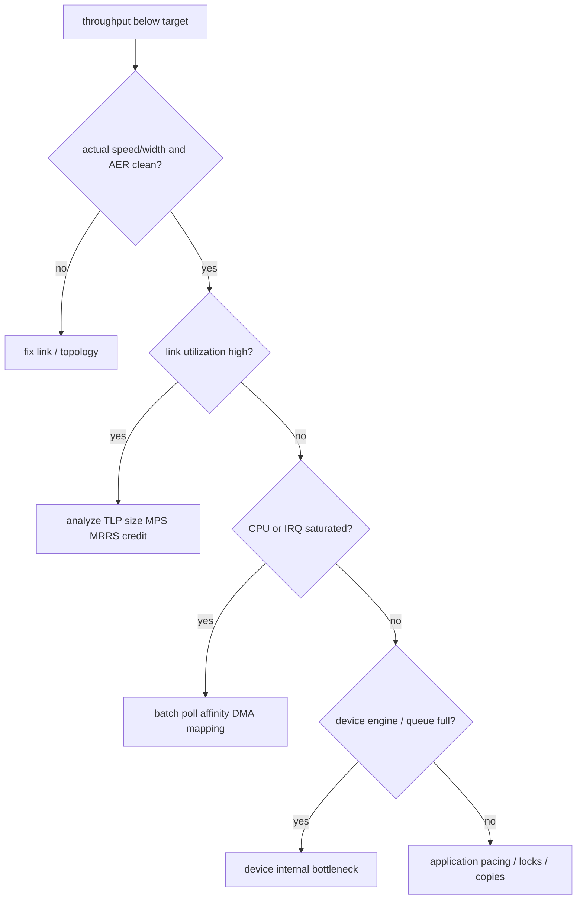

设备已经稳定枚举、DMA 与 IRQ 也正常，性能仍可能只有“Gen3 x4 理论带宽”的一半。问题通常不在一个神秘寄存器，而在多个限制串联：编码损耗、TLP Header、MPS/MRRS、Read Round Trip、Tag/Credit、Queue Depth、Doorbell、Interrupt、DMA Mapping 和上层处理。

性能文章若只列调优项，会让读者不断修改参数却不知道预期收益。本文从一笔 4096-byte 传输开始，用明确假设计算每一步的上限，再说明哪些因素决定吞吐、IOPS 和 P99。示例数字是理论演算，不是实测结果。

Linux 命令和概念以 Linux 6.12 为基线。真实设备是否允许修改 MPS/MRRS、Vector 或 Queue，需要以平台拓扑和 Driver 实现为准，不能用 `setpci` 在运行中盲目试值。

## 一、Gen3 x4 为什么不等于 3.94 GB/s 业务吞吐

Gen3 每 Lane 为 8.0 GT/s，使用 128b/130b 编码。忽略 SKP、DLLP 和重放时，x4 单方向编码后上限近似为：

```text
8.0e9 transfers/s * (128 / 130) * 4 lanes / 8 bits
= 3.938e9 bytes/s
= 3.938 GB/s
```

这个数字只到 Physical Encoding 边界。应用数据还要加 TLP Header、LCRC、Sequence/Framing，Memory Read 还需要 Request 与 Completion，Flow Control Update 和 ACK/Replay 也占链路。因为这些开销与 Payload Size 有关，所以小请求的效率远低于大块顺序传输。

此外链路上限只限制 PCIe 这一段。设备内部 SRAM/Flash、DMA Engine、Host Memory、IOMMU、CPU Completion 处理和应用复制中的任一环节更慢，端到端吞吐都会落在更低上限。

## 二、先确认实际 Link，而不是只看设备能力

性能分析第一步读取实际 Speed/Width：

```bash
lspci -s 0000:01:00.0 -vv
cat /sys/bus/pci/devices/0000:01:00.0/current_link_speed
cat /sys/bus/pci/devices/0000:01:00.0/current_link_width
```

`LnkCap` 表示 Port 最大能力，`LnkSta` 表示当前协商结果。Endpoint 支持 Gen4 x4，但 Root Port 只支持 Gen3 x2，端到端上限就是路径中最慢的一段；Switch 场景还要逐 Port 检查，因为任一中间 Link 降宽都会限制全部下游流量。

若链路频繁进入 Recovery、Receiver Error/Replay 增长，有效吞吐会下降且 P99 抖动。先修复链路质量，再调 Queue 和 Interrupt；否则软件调优只是在不稳定物理基础上移动瓶颈。

## 三、MPS 决定一次 TLP 最多携带多少 Payload

Maximum Payload Size（MPS）限制带数据 TLP 的最大 Payload。路径上每个 Device/Port 都有 Supported MPS，PCI Core 配置的实际 MPS 不能超过路径能力。

下面只计算 4096-byte Memory Write 的简化效率。假设使用 4DW Header 16 bytes，加 LCRC 4 bytes，即每个 TLP 计 20 bytes 固定开销；忽略 DLLP、Framing、SKP、Replay 和编码，以便只比较 MPS。这个模型不代表精确线上字节数。

```text
MPS = 256 bytes
TLP count = 4096 / 256 = 16
modeled bytes = 4096 + 16 * 20 = 4416
payload efficiency = 4096 / 4416 = 92.75%

MPS = 512 bytes
TLP count = 4096 / 512 = 8
modeled bytes = 4096 + 8 * 20 = 4256
payload efficiency = 4096 / 4256 = 96.24%
```

MPS 增大减少 Header 比例和 Packet Rate，因此通常有利于大块传输。但更大 TLP 占用更多接收 Buffer/Credit，错误重放粒度也更大，整个拓扑必须支持。功能驱动不能只修改 Endpoint 而忽略 Root Port/Switch 的路径配置。

## 四、MRRS 与 Completion 拆分决定 Read 效率

Maximum Read Request Size（MRRS）限制单个 Memory Read Request 的最大长度。它不是 Completion Payload 大小保证：Completer 还会受 MPS、Read Completion Boundary（RCB）、地址边界和内部资源影响，把一次 Request 拆成多个 Completion with Data。



增大 MRRS 可以减少 Request Header 和 Doorbell/Descriptor 数，但若 Completer 仍按 128/256 bytes 分片，返回 Packet 数不一定同比减少。还要检查设备能否同时缓存大 Request 的返回数据，以及 Credit/Tag 是否足够。

运行中盲目把 MRRS 调到最大可能导致某些 Bridge/设备稳定性问题。正确做法是读取路径能力、Driver 策略和性能 Counter，再做可回滚的受控实验。

## 五、Tag 和 Round-Trip 决定 Read 要多少 Outstanding

Memory Read 必须等待 Completion，因此单请求吞吐受 Round-Trip Time（RTT）限制。要填满链路，Requester 必须同时保留足够 Outstanding Read，Tag 用来关联返回。

理论示例：目标有效 Read Throughput 为 2 GB/s，测得平均 RTT 为 2 us，每个 Request 为 512 bytes。忽略开销时，在途数据至少需要：

```text
bandwidth-delay product = 2e9 bytes/s * 2e-6 s = 4000 bytes
minimum outstanding = ceil(4000 / 512) = 8 requests
```

若只有一个 Tag，吞吐上限约为 `512 bytes / 2 us = 256 MB/s`。因此 Read 性能通常需要多个 Tag、足够 Completion Buffer 和 Queue Depth；仅增加 MRRS 而不增加 Outstanding 可能没有效果。

Extended Tag 可以增加可用 Tag 数，但 Endpoint、Root Port、PCI Core 和 Driver 必须共同支持。Tag 只是协议关联资源，Driver Request Table 和 Hardware Queue 也要有相同或更大的在途容量。

## 六、Credit 是逐 Link 的缓冲上限

Flow Control 分别管理 Posted、Non-Posted 和 Completion 的 Header/Data Credit。发送方只有对应 Credit 足够时才能发 TLP，Credit 更新通过 DLLP 在相邻 Link 间传播。



Credit 是每段 Link 的接收 Buffer 合同，不等于设备 Queue Depth。Switch 每个 Port 都有自己的 Credit，某段返回路径 Completion Credit 紧张时，Endpoint 可能还有 Tag、软件也还有 Descriptor，但 Read 仍然被阻塞。

公开软件通常无法直接读取所有内部 Credit Counter，所以分析要结合协议分析仪、设备 Performance Counter、Outstanding 深度和 Link Utilization。看到链路空闲不一定表示软件没提交，也可能是某类 Credit 或 Tag 阻塞。

## 七、Queue Depth 连接软件并发与协议并发

软件 Queue Depth 决定最多允许多少 Request 在等待、提交或执行。它必须覆盖 Bandwidth-Delay Product，但超过设备、Tag、Credit 或 Completion 处理能力后，继续增加只会增长排队延迟和内存占用。

```text
application pending
  -> driver request table
  -> submission ring
  -> device execution slots
  -> PCIe outstanding tags/credits
  -> completion ring
  -> CPU completion processing
```

因为这是一串串联系统，端到端在途量由最小环节决定。Submission Ring 1024 深，但设备只支持 32 Outstanding，后面 992 个只是排队；它们可能提高吞吐稳定性，却会直接增加 P99。

正确调优同时记录 Ring Occupancy、Device Outstanding、Completion Batch 和应用延迟，而不是只把 Queue Depth 调到最大。

## 八、Doorbell Batch 在 MMIO 开销与提交延迟之间权衡

CPU 每准备一个 Descriptor 就写一次 Doorbell，会产生大量 Posted MMIO Write 和 Store Ordering 成本。一次准备多个 Descriptor 后只写新 Tail，可以把 Doorbell 开销分摊到 Batch。

若每次 Doorbell 固定消耗 `C`，Batch Size 为 `B`，平均每请求成本近似 `C/B`；但 Batch 第一个请求要等待其余 `B-1` 个准备完成，所以低负载延迟会增加。

Driver 常使用“达到 Batch 阈值或 Timer/队列从空变非空立即敲门”的组合策略。因为 Workload 的 Burst 和 Latency SLO 不同，所以没有适合所有设备的固定 Batch 数。

## 九、Interrupt Moderation 与 Poll Budget 决定 Completion 成本

每个 Completion 都触发 MSI-X，会导致高 IRQ Rate、上下文切换和 Cache 抖动。设备可以按完成数量或时间 Moderation，Driver 也可通过 NAPI/Poll 一次处理多个 CQE。



Moderation 增大会降低 CPU/IRQ，但第一个 Completion 等待更久，P99 可能恶化。Poll Budget 太小导致频繁重新调度，太大则一个 Queue 长时间占用 CPU。调优必须同时看 Throughput、IRQ/s、Batch Size、CPU 和 Tail Latency。

## 十、DMA Mapping、IOMMU 和 NUMA 可能成为非链路瓶颈

小包场景中 `dma_map_*()`、IOMMU Page Table、IOTLB Invalidation 和 SWIOTLB Copy 可能占据主要 CPU 时间。链路利用率低并不说明需要更大 MPS，也可能是 CPU 无法及时生产 Descriptor。

多 Socket 系统还要考虑 Device 所在 NUMA Node。IRQ 在 Node 0，Buffer 在 Node 1，应用在 Node 2，会产生远程 Memory 和 Cache Line 迁移；即使 PCIe Link 满足，端到端 P99 仍会抖动。

Page Pool、Long-Lived Mapping、Batch Map/Unmap 和 Queue/IRQ/Memory Affinity 可以降低开销，但它们增加生命周期复杂度。第 17 篇会把这些机制组合成多队列产品设计。

## 十一、先定位当前瓶颈层再调参数

一个实用判断流程如下：



链路接近满载且小 TLP 比例高，才重点看 MPS/MRRS/Batch；CPU Saturated 且 Link 空闲，更应看 Mapping、IRQ、Lock 和 Copy；Device Queue 长期满而 Link 空闲，可能是设备内部 NAND/Codec/Accelerator Engine。

调一个参数后只改变一个变量，保留 Before/After 和回滚。一次同时改 MPS、MRRS、Queue、IRQ 和 CPU Affinity，虽然可能变快，却无法知道收益来源，也无法在回归时定位。

## 十二、P99 比平均吞吐更容易暴露状态切换

平均吞吐可以掩盖偶发 Link Recovery、ASPM Exit、IOTLB Miss、IRQ Migration、Queue Full 和 Reset Retry。P99/P999 需要按 Request 记录 Submit、Doorbell、Device Start/Complete（若可用）、IRQ/Poll 和 Callback 时间。

```text
queueing latency
+ descriptor preparation / DMA mapping
+ doorbell wait
+ device execution
+ PCIe request/completion
+ interrupt moderation
+ poll/callback scheduling
= end-to-end request latency
```

因为每段都可能形成长尾，所以仅缩短设备执行时间不一定改善 P99。低负载 P99 受 ASPM/Autosuspend 影响，高负载 P99 受 Queue/Backpressure/CPU 饥饿影响，二者应分场景测量。

## 十三、可复现实验需要固定前提和证据

每次实验至少记录 Kernel/Driver/Firmware、BDF/Topology、LnkSta、MPS/MRRS、Queue/Vector、CPU/NUMA、IOMMU/ASPM、Payload/Read-Write Ratio、持续时间和温度。否则结果无法跨机器或跨时间比较。

同时保存 Throughput、IOPS、P50/P99/P999、CPU、IRQ/s、Ring Occupancy、AER、IOMMU Fault 和 Error Count。若设备提供 Performance Counter，还要保存 TLP/Byte/Retry/Queue Stall 等原始值，而不是只截图最终速度。

所谓“稳定”不只是跑满一分钟。应覆盖冷启动、热重启、长稳、低负载省电、高负载、Reset Recovery 和温度变化，因为 Link 与 PM 问题常在状态切换时出现。

## 十四、常见误解与审查重点

现在应当能够从 Gen3 x4 算出编码后上限，并用明确开销模型比较 MPS=256/512 的 Payload 效率。还应能用 Bandwidth-Delay Product 估算 Read 需要的 Outstanding/Tag 数，而不是把 MRRS 当成唯一性能开关。

还应能区分 Queue Depth、Tag 和 Credit：Queue 是软件/设备请求容量，Tag 关联 Non-Posted Request，Credit 是逐 Link Buffer 合同。面对低性能，先定位 Link、Protocol、CPU、Device Engine 或 Upper Layer，再选择参数。

## 十五、小结

PCIe 性能由物理编码、TLP 效率、MPS/MRRS、Tag/Credit、Queue、Doorbell、IRQ、DMA Mapping、IOMMU、NUMA 和设备内部能力串联决定。任何单项参数都只能改变其中一段，端到端上限仍由最慢环节决定。

下一篇将进入 Linux 6.12 `rtw88` PCI Glue，观察一个真实无线网卡驱动怎样把 ID Match、BAR、DMA Descriptor Ring、IRQ、Power 和 Remove 组合起来；设备私有寄存器只作为源码实现，不会被推广成 PCIe 通用规则。

**一手资料**

- [Linux 6.12 PCI driver API](https://www.kernel.org/doc/html/v6.12/driver-api/pci/pci.html)
- [Linux 6.12 MSI Guide](https://www.kernel.org/doc/html/v6.12/PCI/msi-howto.html)
- [PCI-SIG Specifications](https://pcisig.com/specifications)
