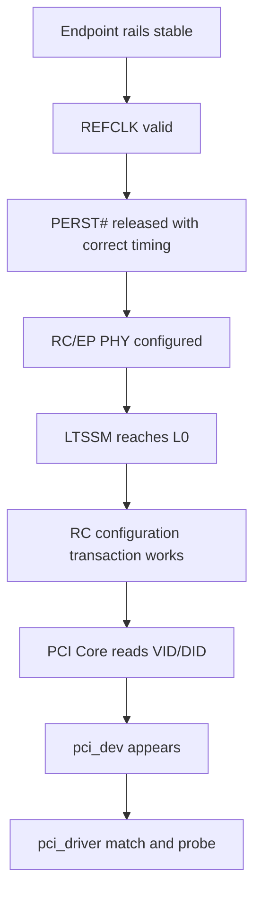
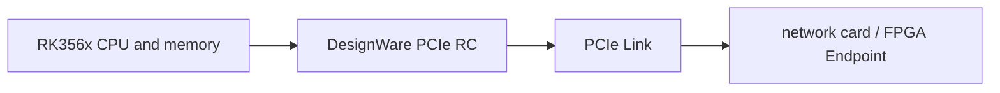
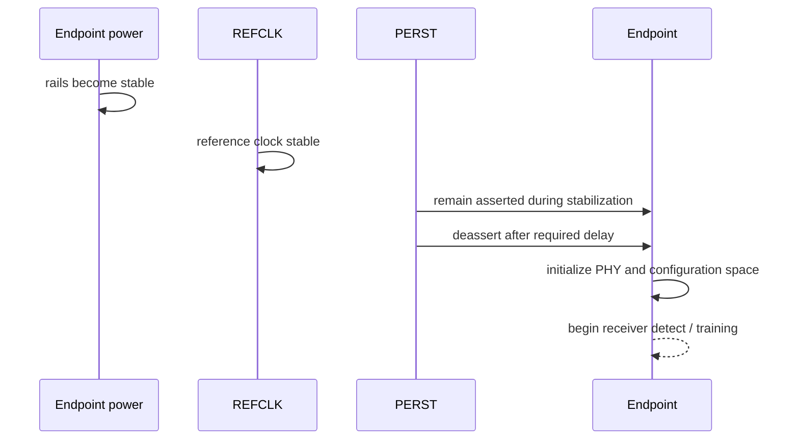
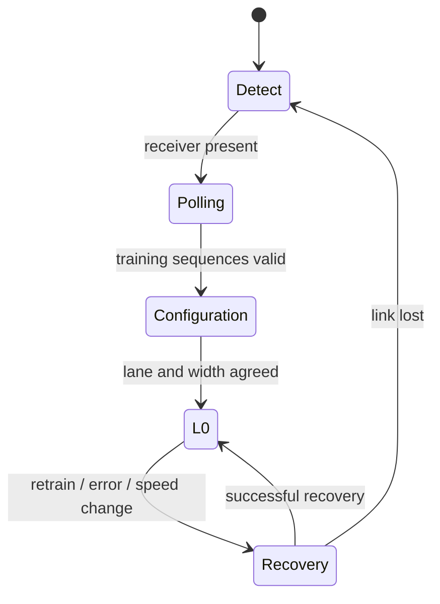
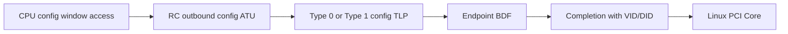

前十四篇都从 Linux 已经创建 `pci_dev` 的前提出发。但板级 Bring-up 最常见的现象是 `lspci` 完全没有目标设备，此时功能驱动连 `probe()` 都不会调用。问题必须向下移动：电源和时钟是否存在，PERST# 是否释放，PHY 与 LTSSM 是否进入 L0，配置请求是否通过 RC Window 到达 Endpoint？

本文以 RK356x 一类 Rockchip DesignWare PCIe Root Complex 连接网卡、FPGA 或其他 Endpoint 为局部平台案例，讲解通用排查顺序。具体 Clock 名称、Reset ID、PHY Lane 和 Register Offset 随 SoC/板卡变化，必须以目标 Device Tree Binding、TRM 和原理图为准。

Linux 6.12 是本文的软件基线。文章不会用一份固定 DTS 冒充所有 RK356x 板卡，而是说明每一层需要什么输入、产生什么可观察结果，以及没有结果时为什么不能继续调上层 Driver。

## 一、先看问题：lspci 为空意味着流程停在哪里

`lspci` 依赖 PCI Core 已经完成配置扫描。目标 Endpoint 完全不出现，说明失败发生在 `pci_dev` 创建之前，范围包括板级供电、Reference Clock、Reset、PHY、Link Training、RC 配置访问和 BDF 路由。



这条链只能从下向上验证。因为 `pci_device_id` 只参与最后的 Driver Match，所以设备尚未出现在 `lspci` 时，修改 ID Table、DMA Ring 或 IRQ Handler没有作用。

因此，Bring-up 的目标不是一次“碰巧能枚举”。应在冷启动、热重启、压力、ASPM 和温度变化下保持目标 Speed/Width，并且 AER/Receiver Error 不持续增长。

## 二、先确认 RC 与 EP 角色没有配置反

Root Complex（RC）发起配置扫描、分配 Bus Number 和 BAR；Endpoint（EP）响应配置请求并暴露 Function。一个支持 Dual-Mode 的控制器必须在硬件 Strap、Firmware、Clock/Reset 和 Linux Driver 中选择一致角色。



若 SoC 配置成 EP，它会等待外部 RC 枚举，不会主动发现插槽设备；若两端都配置成 RC 或都配置成 EP，LTSSM 也无法建立期望链路。因此角色检查必须早于 Device Tree 属性微调。

Switch 场景仍只有一个 Root Complex，但每段 Port/Link 单独训练。Root Port 到 Switch Upstream 能进入 L0，不代表 Switch Downstream 到 Endpoint 也正常，调试要逐段读取 Port Link Status。

## 三、供电稳定是所有数字信号的前提

Endpoint 可能需要主电源、辅助电源、IO 电源和板上 Regulator Enable。电压数值正确但上电时序不满足，也可能让内部 PLL、Strap 或 Configuration Space 初始化失败。

检查供电时记录稳态电压、上升时间、纹波、Enable/PWRGD、插卡瞬态和 Reset 关系。只在无负载时用万用表看到额定电压，不足以证明链路训练期间电源稳定。

RC Controller/PHY 自身也依赖 SoC Power Domain。Runtime PM 或 Firmware 若在 Probe 前关闭 Domain，Register Read 可能全零/Abort；因此需要结合 Clock/Reset/Power Domain 状态和 Controller Driver 日志，而不是只测 Endpoint 插槽。

## 四、REFCLK 决定两端能否开始训练

PCIe 常见 Reference Clock 为 100 MHz 差分时钟，但系统可以使用 Common Clock、SRNS 或 SRIS 等架构。板级设计必须确认 Clock Source、方向、抖动、幅度、终端、AC Coupling 和两端模式一致。

REFCLK 应在协议要求的时序内稳定，并与 PERST# 释放协调。若 Clock 未到或质量不足，LTSSM 常停在 Detect/Polling，Receiver Error 和 Recovery 也可能增加。

示波器观察要使用合适差分探头和测量带宽，避免探头负载本身破坏链路。软件只能看到 Clock/PHY 结果，不能从一行日志证明抖动符合规范。

## 五、PERST# 必须按板级时序释放

`PERST#` 是低有效 Fundamental Reset。上电期间通常保持 Assert，待电源与 REFCLK 稳定、Endpoint 内部准备完成后再 Deassert。GPIO Polarity、Pinmux、Pull 和共享关系任何一个错误都会让设备永久保持 Reset 或提前启动。



初次 Bring-up 可以适当延长 Reset Delay用于验证时序假设，但最终值应回到规范和设备手册。无限增加 Delay 只能掩盖其他问题，不能修复错误 Pinmux 或不稳定 Clock。

热重启还要确认 Bootloader 与 Kernel 对 PERST# 的交接。如果 Bootloader 已释放并枚举，Kernel 又以错误极性抖动 Reset，冷启动和热启动可能表现不同。

## 六、Lane 连接和 PHY 配置必须与硬件一致

RC TX 连接 EP RX，RC RX 连接 EP TX。差分对极性翻转、Lane Reversal 和 Lane Bifurcation 是否支持由控制器/PHY 决定，不能假设所有错误都能自动纠正。

RK356x 平台还要确认 Controller Instance、PHY Instance、Lane 数量、模式和共享资源。SerDes 可能在 PCIe、SATA、USB3 等协议间复用，Firmware/Device Tree 选择错误会让 Controller Register 正常却没有真实 PCIe PHY。

PHY 初始化通常包括 Power On、Reset、Mode、Reference Clock 和校准。Driver 日志若显示 PHY Timeout，应先回到这些输入，不要继续调 ATU；因为 LTSSM 尚未产生可用 Link，配置 TLP 无处发送。

## 七、Clock、Reset 与 Controller 初始化有依赖顺序

SoC PCIe Host Driver 需要打开 APB/AXI/Core/PHY 等 Clock，解除 Controller/PHY Reset，配置 Mode 与 DesignWare Core，再 Enable LTSSM。具体名称依赖 Binding，但依赖关系相同。

```text
power domain on
  -> clocks enabled
  -> controller and PHY reset sequencing
  -> PHY mode/init/power_on
  -> DesignWare core/DBI configuration
  -> outbound/inbound windows
  -> enable LTSSM
```

Register Dump 只有在相应 Clock/Power Domain 已打开时才可信。对一个被 Reset 或断电的 Block 读取全零，不能说明配置字段本来就是零。

错误路径也要逆序关闭。若 Probe 失败却留下 Clock/PHY 半开，下一次 Rebind 可能得到与冷启动不同的状态，导致“第二次反而成功”的假象。

## 八、LTSSM State 把电气问题缩小到阶段

LTSSM 从 Detect、Polling、Configuration 进入 L0，必要时进入 Recovery。不同 State 指向不同前提：Detect 关注 Receiver/电源/连接，Polling 关注 Training Sequence/Clock/Signal，Configuration 关注 Lane/Width，Recovery 关注重训练、均衡和速率变化。



反复 Detect 通常不应先怀疑 Linux BAR；反复 Polling/Recovery 更接近 REFCLK、Signal Integrity、Equalization 或两端 Capability；进入 L0 后才能继续验证配置访问。

有些 Controller 只提供 Link Up Bit而不公开完整 LTSSM，仍可结合 PHY Status、Debug Register、Endpoint Side Status 和 Analyzer 缩小范围。记录每次启动 State 和耗时比只打印最终“link fail”更有价值。

## 九、Config ATU 让 Host 按 BDF 访问配置空间

Link 进入 L0 后，RC 还要把 CPU Configuration Window 转换成 PCIe Type 0/Type 1 Configuration Request。DesignWare Controller 常使用 Outbound iATU Region，Root Bus/Direct Child 与 Bridge 后设备使用的 Configuration Type 可能不同。



因为 Configuration Path 与 Memory BAR Path 可以使用不同 ATU Region，所以 Link Up 仍可能 `lspci` 为空；反过来配置空间可读也不证明 Memory Address Translation 已正确。

检查 Config ATU 时核对 CPU Base/Limit、PCI Target、Transaction Type、Bus Number 和 Region Enable。不要把针对某个 Kernel/SoC 的 Register Offset 复制到另一 Controller Revision。

## 十、Memory address translation 决定 BAR 访问路径

枚举发现设备后，Host Bridge `ranges` 提供 CPU Address 与 PCI Bus Address Window，PCI Core 在 Window 中分配 BAR，RC Outbound ATU 把 CPU MMIO 转换成 PCIe Memory Request。

```text
driver virtual address
  -> CPU physical PCI window
  -> RC outbound address translation
  -> PCI bus address
  -> Endpoint BAR match
  -> optional EP inbound translation
  -> device local register or memory
```

如果 `lspci` 能看到设备、BAR 有地址，但 `readl()` 全 1，应把调查移到 Command Memory Enable、Bridge Window、Host `ranges`、Memory ATU 和 EP BAR/Internal Decode。继续修改 Config ATU 不会解决 Memory Path。

DMA Direction 还会使用 Host `dma-ranges` 与 IOMMU，不能把 BAR MMIO Window 当成设备 DMA Address。第 03 和第 10 篇的地址模型在 Bring-up 中分别对应 Memory Outbound 与 DMA Translation。

## 十一、Linux Host Bridge 创建后才轮到 PCI Core

RK356x Host Driver完成硬件与 Window 后，向 PCI Core 注册 Host Bridge。PCI Core 创建 Root Bus、调用配置访问、递归扫描并建立 `pci_bus/pci_dev`。此时 `lspci` 才有数据，功能 Driver 才可能 Match。

```text
platform driver probe
  -> resources / clocks / resets / PHY
  -> link bring-up
  -> host bridge windows and pci_ops
  -> common PCI host probe
  -> pci_scan_child_bus
  -> pci_dev creation
  -> function driver probe
```

这条边界非常重要：Host Driver Log 表示控制器阶段，`lspci` 表示 PCI Core 阶段，Function Driver Log 表示设备业务阶段。按阶段保存日志，才能知道问题第一次出现在哪里。

## 十二、Bring-up 证据按层收集

| 层 | 要证明的事实 | 代表性证据 |
| --- | --- | --- |
| 供电 | RC/EP Rail 稳定 | 电压、纹波、PWRGD、时序 |
| Clock/Reset | REFCLK 与 PERST# 正确 | 示波器、GPIO/Pin State、时序 |
| PHY | Lane/Mode/校准完成 | PHY Status、Driver Log |
| Link | LTSSM 到 L0、Speed/Width 正确 | Controller/Port Link Status |
| Config | VID/DID Completion 返回 | Config ATU、`lspci` |
| Resource | BAR/Bridge Window 可分配 | `lspci -vv`、sysfs resource |
| Function | Driver Match/Probe 成功 | modalias、Driver Link、dmesg |

不要只收集成功证据。若 Config Request 没有 Completion，需要记录 Request 是否发出、Endpoint 是否收到、返回是否被 RC/桥丢弃；负面证据必须说明工具能观察到哪一段。

## 十三、本篇检查点

现在应当能够解释“`lspci` 看不到设备”为什么要从供电、REFCLK、PERST#、PHY、LTSSM 和 Config ATU 排查，而不是修改功能驱动。还应能区分 Configuration Path、Memory address translation 和 DMA Translation。

面对 Link Up 但无 BDF，应检查 Config Window/ATU/Bus Routing；面对 BDF 可见但 BAR 访问失败，应进入 Memory Window/ATU；面对 Driver 不绑定，再检查 modalias、ID Table 与 Probe。这就是分层 Bring-up 的核心。

## 十四、小结：下一篇让 Linux 设备扮演 Endpoint

Root Complex Bring-up 是一条严格依赖链：供电、REFCLK 和 PERST# 建立硬件前提，PHY 与 LTSSM 建立 Link，Config ATU 建立 BDF 访问，Host Window 与 Memory ATU 建立 BAR 路径，PCI Core 最后创建软件对象。

下一篇转换角色：让运行 Linux 的 SoC 自己成为 Endpoint。我们会解释 Endpoint Controller、Endpoint Function、ConfigFS 和 Host Test Driver 如何协作，并使用主线 `pci_epf_test` 展示 BAR、IRQ 和数据传输，而不是把 RK356x RC 配置硬套到 EP 模式。

**一手资料**

- [Linux PCI host bridge API](https://docs.kernel.org/driver-api/pci/index.html)
- [Linux DesignWare PCIe controller source](https://git.kernel.org/pub/scm/linux/kernel/git/stable/linux.git/tree/drivers/pci/controller/dwc?h=linux-6.12.y)
- [Linux Rockchip PCIe PHY bindings](https://git.kernel.org/pub/scm/linux/kernel/git/stable/linux.git/tree/Documentation/devicetree/bindings/phy/rockchip?h=linux-6.12.y)
