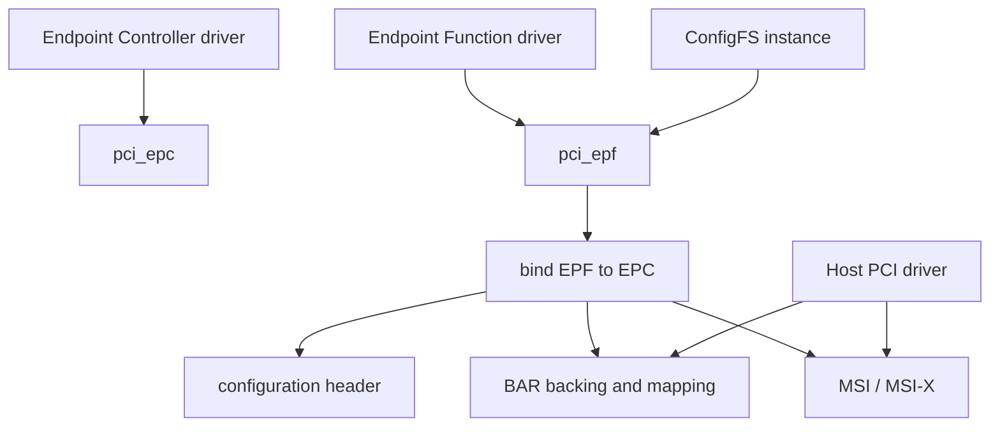
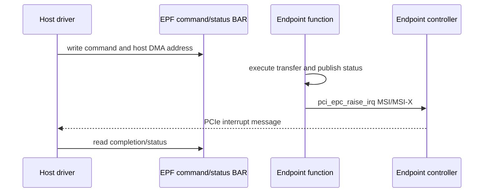

第 15 篇让 Linux SoC 充当 Root Complex，主动枚举外部设备。某些产品恰好相反：一个运行 Linux 的 SoC、FPGA SoC 或加速卡需要插入外部主机，向 Host 暴露 Configuration Space、BAR、IRQ 和数据通道。问题变成：Linux 怎样让自己扮演 PCIe Endpoint？

Endpoint 模式同时包含控制器硬件和要暴露的 Function 业务。若每个产品都在 Controller Driver 中硬编码 VID/DID、BAR 和测试协议，代码无法复用。Linux PCI Endpoint Framework 因此把硬件能力抽象为 EPC，把业务 Function 抽象为 EPF，再用 ConfigFS 在运行时组合。

本文以 Linux 6.12 为基线，使用主线 `pci_epf_test`/Host `pci_endpoint_test` 解释协作。仓库中的 `pci_epf_teaching.c` 是原创教学协议，只有目标 SoC Controller 真正支持 EP Mode 时才能运行。

## 一、谁负责配置空间，谁负责业务

一个 Endpoint 要完成四件事：让 Host 枚举出 Function，为 BAR 提供可访问 Backing Memory，把 Host/EP 地址相互转换，并向 Host 发出 Legacy/MSI/MSI-X 通知。控制器 IP 知道怎样编程这些硬件，却不知道产品要暴露什么业务。



EPC Driver 负责硬件能力和操作，例如写 Configuration Header、设置/清除 BAR、配置 Address Translation、启动/停止 Link、Raise IRQ。EPF Driver 负责 Function 语义，例如 Vendor/Device/Class、BAR 中的 Register Protocol、Command 和 Data Buffer。

因为两者职责不同，同一个 EPC 可以绑定测试 Function、NTB Function 或自定义加速器 Function；同一个 EPF 理论上也可以运行在不同支持能力的 Controller 上，但必须查询并适配 BAR Size、Alignment、MSI-X 和 Address Window 限制。

## 二、EPC 表示 Endpoint Controller 硬件

`struct pci_epc` 是 Endpoint Controller 的核心对象，Controller Driver 注册 `pci_epc_ops`，把通用 Framework Request 转换成具体 IP Register/ATU 操作。

常见 Operation 类别包括：

| Operation | 解决的问题 |
| --- | --- |
| `write_header` | 把 VID/DID/Class 等写入 Function Configuration Header |
| `set_bar` / `clear_bar` | 让 Host BAR Access 命中 EP Local Memory |
| `map_addr` / `unmap_addr` | 让 EP 主动访问 Host Address |
| `set_msi` / `get_msi` | 配置和查询 MSI 能力 |
| `set_msix` / `get_msix` | 配置 MSI-X Table Size/能力 |
| `raise_irq` | 产生 Legacy/MSI/MSI-X 通知 |
| `start` / `stop` | 控制 Link/Controller 运行 |

通用 EPF 不应直接写 DesignWare、Rockchip 或其他 Controller Register，因为这样会绕过 Capability/Window 管理。它通过 `pci_epc_*()` API 请求硬件动作，EPC Driver 再决定是否支持与如何实现。

## 三、EPF 表示一个可以暴露给 Host 的 Function

`struct pci_epf` 保存 Function Instance、Header、BAR、EPC Binding 和 EPF Driver Data。EPF Driver 的 `probe()` 创建 Function 私有对象，`bind()` 在绑定到 EPC 时配置硬件，`unbind()` 负责停止并解除所有关系。

```text
EPF driver probe
  -> allocate software instance
  -> wait for ConfigFS binding

EPF bind to EPC
  -> query EPC features
  -> write configuration header
  -> allocate BAR backing
  -> pci_epc_set_bar
  -> configure IRQ and protocol state
  -> wait for link / host commands
```

EPF `probe()` 与 `bind()` 不能混为一谈。Probe 只表示 EPF Driver 与一个软件 Function Instance 匹配，EPC 可能尚未选择；Bind 后才有具体 Controller、Function Number 和硬件资源，因此 BAR/IRQ 通常在 Bind 阶段建立。

## 四、ConfigFS 把“创建 Function”和“绑定控制器”分开

Endpoint ConfigFS 通常暴露 Function Driver、Controller 和 Link：用户先创建一个 Function Instance，再把它 Link 到某个 EPC，配置允许的属性后启动 Controller。

代表性流程如下，路径名称以实际 Kernel Config 和 Driver 为准：

```bash
mount -t configfs none /sys/kernel/config
cd /sys/kernel/config/pci_ep

mkdir functions/pci_epf_test/func1
ln -s functions/pci_epf_test/func1 controllers/<epc-name>/
echo 1 > controllers/<epc-name>/start
```

因为 ConfigFS Link 表示 Binding，删除 Symbolic Link 会触发 `unbind()`。用户不能在 Host 仍运行测试或 DMA 时直接解绑；EPF 必须先拒绝新命令、停止 DMA/IRQ，再 Clear BAR 和 Free Memory。

ConfigFS 是组装和生命周期接口，不是数据平面。高频业务命令应通过 BAR Queue、Shared Memory 或 DMA Protocol 完成，不能把每个请求都变成 ConfigFS File Operation。

## 五、Configuration Header 让 Host 识别 Function

EPF 定义 Vendor ID、Device ID、Revision、Class Code、Subsystem ID 和 Interrupt Pin 等 Header Field，Bind 时由 `pci_epc_write_header()` 写入 Controller 能响应的 Configuration Space。

Host 枚举时先读取这些标准字段，再执行 BAR sizing 和 Capability 解析。因此 Header 必须在 Link/Enumeration 前准备好；若 Host 已经枚举后再修改 ID，可能需要受控 Rescan/Reset，不能期待 Driver Model 自动把已有 Function 当成新设备。

多 Function Endpoint 还要管理 Function Number、BAR/IRQ Resource 与 Controller Capability。不同 Function 的 Header 和 BAR 独立，但 Controller 的 Address Window、MSI-X Table 和 DMA Engine 可能共享。

## 六、BAR 同时包含 Host 窗口、EP Backing 和地址转换

EP 模式下，一个 BAR 至少有三层含义：Host 为 Function 分配 PCI Address；EPC 让该 BAR Match 指向某个 EP Local Address；EPF 分配/定义 Backing Memory 中的 Register/Data Protocol。


EPF 可以使用 `pci_epf_alloc_space()` 分配满足 EPC Alignment/Size 的 BAR Space，再填写 `struct pci_epf_bar`，调用 `pci_epc_set_bar()` 建立硬件映射。失败时必须 Free Space，不能保留一个 Host 能枚举但没有合法 Backing 的 BAR。

BAR Size 常要求 2 的幂和特定 Alignment，Controller 还可能限制 64-bit/Prefetchable/Fixed Size。EPF 应查询 `pci_epc_features`，而不是假设任何 BAR 都能配置任意大小。

## 七、EP 主动访问 Host 需要 Outbound Mapping

Host 访问 EP BAR 使用 Inbound Path；EP DMA Engine 主动访问 Host Memory 时，需要 Host 提供 DMA/PCI Address，并由 EPC 建立 EP Local Address 到 Host PCI Address 的 Outbound Mapping。

```text
EP local DMA address
  -> EPC outbound address window
  -> PCIe Memory Request to Host address
  -> Host IOMMU / memory system
```

EPF 不能把 Host Virtual Pointer 当成 PCI Address。Host Driver 必须通过自己的 DMA API 准备 Host Buffer，并按测试协议把 DMA Address 告诉 EP；平台是否经过 IOMMU、地址宽度和一致性都属于 Host DMA Contract。

Mapping Window 数量有限，因此每次传输动态 Map/Unmap 可能成为瓶颈。产品协议可以固定 Shared Window、Batch Transfer 或 Controller DMA Engine，但必须在 Reset/Unbind 时先停止访问再撤销 Mapping。

## 八、MSI/MSI-X 是 EP 向 Host 发布完成的方式

EPF 可以通过 `pci_epc_raise_irq()` 请求 EPC 产生 Legacy、MSI 或 MSI-X。Host 必须已经在 Configuration Space 中 Enable 对应 Capability，EPF 也要查询实际 Vector 数量。



中断前必须先发布 Completion/Data，再 Raise IRQ；Host Handler 收到通知后仍要读取 Status 或 Completion Queue。因为 MSI/MSI-X 只是通知，丢失/合并/Mask 情况下协议还需要 Poll 或 Sequence Number 保证可恢复。

MSI-X Table/PBA 的物理实现受 EPC 控制器能力影响。EPF 请求 `MSI-X` 不等于所有 Controller 都能支持足够 Vector；无法满足时应明确失败或降级，而不是伪造成功。

## 九、pci_epf_test 把控制面与数据面放在 BAR 中

主线 `pci_epf_test` 定义一组测试 Register/Command，让 Host `pci_endpoint_test` Driver 可以请求 BAR Read/Write/Copy、IRQ 和其他验证。它的价值是提供一条双方都公开的测试协议，而不是用未知设备私有寄存器猜测。

```text
Host pci_endpoint_test
  -> writes test command, size, source/destination/checksum
  -> Endpoint pci_epf_test observes command
  -> performs memory operation / DMA when supported
  -> writes status/checksum
  -> raises selected IRQ type
  -> Host validates data and status
```

这是一套 Framework 验证工具，不等于产品协议。产品通常还要定义 Version、Feature Negotiation、Queue、Timeout、Reset Generation、Security 和 Backpressure；但它非常适合证明 BAR、Address Translation、DMA 和 Interrupt 的底层路径。

## 十、Linkup、Core Init 与 Host 枚举需要时序协调

有些 EPC 能在 Link Up 后通知 EPF，有些 Function 需要在 Core Init/Bind 时先准备 Header/BAR。EPF Driver 要遵守 Controller Feature 中的 Linkup Notifier/CORE_INIT_NOTIFIER 能力，不能假设所有平台回调顺序相同。

Host 可能在 Link Up 后很快发 Configuration Read，因此 Header/BAR Capability 必须在允许 LTSSM/Start 之前就绪。反方向，Host Driver 写 BAR 命令前又必须等待枚举、Resource 分配和 Driver Probe 完成。

Reset/PERST# 会让 Configuration/Link State变化，EPF 要停止正在进行的事务并重建必要硬件。只在首次 Bind 初始化一次，无法应对 Host Reboot 或 Hot Reset。

## 十一、Host Driver 是协议的另一半

Host 端仍是普通 `pci_driver`：匹配 EPF 暴露的 VID/DID，Enable、Request/Iomap BAR，申请 IRQ，使用 DMA API准备 Host Buffer，再按 BAR Protocol 与 EP 协作。


因为 EP 与 Host 是两个独立 Kernel/Address Space，日志必须统一 Request ID 和时间。只看 EP `command received`，不能证明 Host Completion Handler 正常；只看 Host IRQ 增长，也不能证明 EP DMA Data 正确。

## 十二、unbind 必须先停止 Host 可见行为

解绑顺序从 Host 仍可能做什么来推导：先让协议拒绝新命令，停止 EP DMA/Worker，Mask/取消 IRQ，等待在途请求结束或标记失败，再撤销 Outbound Mapping、Clear BAR、Free BAR Space 和私有对象。

```text
mark function stopping
  -> reject new BAR commands
  -> stop DMA and workers
  -> synchronize completion / IRQ generation
  -> unmap outbound host address windows
  -> pci_epc_clear_bar
  -> pci_epf_free_space
  -> detach from EPC
```

若先 Clear BAR，Host 仍在 Poll/写命令会收到 Unsupported/Abort；若先 Free Backing，Inbound Window 可能继续指向已复用内存。因此 `unbind()` 必须覆盖 Host 可见性和 EP 本地异步上下文。

## 十三、调试要同时看 Host、Link 与 EP

Endpoint Framework 故障可以分成：Host 看不到 Function、能枚举但 BAR 失败、BAR 命令可写但 EP 不处理、DMA Fault/数据错误、IRQ 不到、Reset/Unbind Hang。每层需要不同证据。

| 现象 | 先检查 |
| --- | --- |
| Host 无 BDF | EP Power/Clock/PERST#/LTSSM/Header |
| BAR unassigned | EPF BAR Size/Feature、Host Window |
| BAR 读写异常 | EPC Inbound Translation、Backing/Cache Attribute |
| EP DMA Fault | Outbound Mapping、Host DMA Address/IOMMU |
| IRQ 不到 | Host Enable、EPC Raise、Vector/Mask、Status 发布 |
| unbind Hang | 在途 DMA、Worker、Host 仍提交、Mapping 引用 |

因此日志至少包含 EPC、EPF Instance、Function、BAR、Request ID、Host DMA Address、IRQ Type/Vector、Generation 和时间戳。单边日志无法证明跨机器协议完成。

## 十四、常见误解与审查重点

现在应当能够区分 EPC、EPF、EPF Driver、ConfigFS 和 Host Driver，并按 Bind 顺序讲出 Header、BAR Backing、`pci_epc_set_bar()`、Address Translation 和 IRQ 如何建立。

还应能解释 Host BAR Access 与 EP Outbound DMA 是两个方向，MSI/MSI-X 只通知完成，`pci_epf_test` 是公开测试协议而非产品模板，以及为什么 `unbind` 必须先停止 Host 可见行为。

## 十五、小结

Linux Endpoint Framework 用 EPC 隔离控制器硬件，用 EPF 表达 Function 业务，用 ConfigFS 组装实例，再由 Host Driver 完成协议另一半。BAR、Address Translation、DMA 和 IRQ 都在双方明确 ownership 后才能安全工作。

下一篇回到 Host 数据路径，比较网卡和 NVMe 如何把单 Ring 扩展成 Multi-Queue：Queue、MSI-X Vector、CPU Affinity、Doorbell Batch、Backpressure、NUMA 和 Reset Scope 怎样共同决定吞吐与 P99。

**一手资料**

- [Linux 6.12 PCI Endpoint Framework](https://www.kernel.org/doc/html/v6.12/PCI/endpoint/pci-endpoint.html)
- [Linux 6.12 PCI Endpoint Test](https://www.kernel.org/doc/html/v6.12/PCI/endpoint/pci-test-howto.html)
- [Linux 6.12 Endpoint Function source](https://git.kernel.org/pub/scm/linux/kernel/git/stable/linux.git/tree/drivers/pci/endpoint/functions?h=linux-6.12.y)
